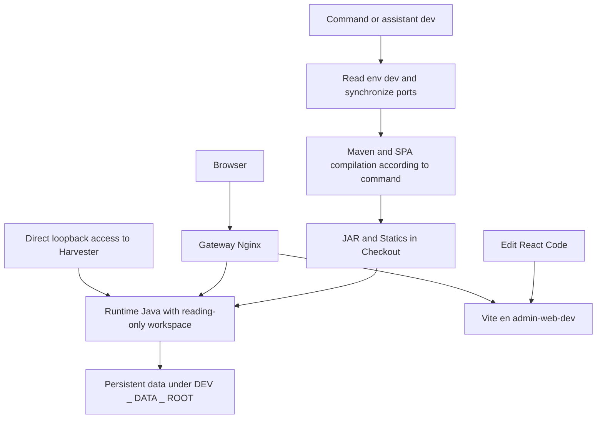

# Full analysis of the development Docker script
> Translation note: This machine-assisted English version preserves the source document's structure and technical examples. Commands, paths, identifiers, and hashes are retained literally; consult the Spanish source where translated wording is ambiguous.

This document explains how `Docker/docker-dev.sh` works: its commands and wizard, how the Compose files are combined, how Java and frontend code are built, how applications start, and where data persists. It is intended for developers, operators, and reviewers who need to understand what each operation changes, where files are stored, and what limitations the implementation has.

The dev environment uses the checked-out source as both build input and a runtime-mounted resource. It builds with Maven containers, runs host-built JARs in a shared Java image, and adds a Vite server and an Nginx gateway. Its initial configuration separates some data and ports, while code, `target/`, static assets, overrides, and some image tags remain shared with other workspace runs. Its `normal` mode can reuse the standard environment’s project and data; the consequences are explained in this document.

The analysis distinguishes observed code behavior, isolated test results, and pending checks. It records cases where findings contradict comments or the script’s own help text. It describes the analyzed snapshot; it does not modify the script or certify every operation.

## 1 Scope and version analysed

Date: **October 3, 2026**, with Europe / Madrid calendar reference. Parent repository: `lareferencia-platform`; observed commit: `f5985297fc92d1b3d2e829e9526cda0fdbd8a9b3`. There are local changes prior to this analysis; hashes identify the effective content, not just the parent repository's commit.

|File|SHA256 identity of the snapshot|
| --- | --- |
| `Docker/docker-dev.sh` | `524b152ecf8aa5ecafaf90f322173708e511275cbb9fb8a044b8cee9b56319fd` |
| `docker-compose.dev.yml` | `87fde5ded801732605bcb7bdfdb548f7b1e3d2ac977e7076dce447f8c37d6d4d` |
| `Docker/apps/entrypoint-dev.sh` | `19ebc6ba4d0d3de306fdb51473b84f69f386dea0ae4038736c8f0da439cdd18f` |
| `Docker/apps/entrypoint-admin-web-dev.sh` | `3f9704282b8c893c6f2ca51d5fd8dd36fa33435f8a40781e7f3df54ab78e355c` |
| `Docker/nginx/dev-dashboard-gateway.conf` | `32bfa49ca7c5abbdb94bd2dce7834c8fc288a4b22294365e2bbade66a9f063f3` |
| `docker-compose.yml` base| `ef0846e50fa2d22dbcc853dae7a03811b06de889d94278a2de21d52eda9ed534` |

The script has 647 lines. Also read the Base Compose, the inherited Solr / VuFind images and entrypoints, the POM and application configuration, Vite, the Angular front, the overrides and existing documentation. The complementary analysis of the standard script is in[ANALISIS_OPERATIVO_DOCKER_SH.en.md](ANALISIS_OPERATIVO_DOCKER_SH.en.md).

The examples imply invocation from the root of the repository. The implementation resolves its own path, so it can be invoked from another folder. A direct Compose command must use the correct files and values.

No complete build, migration, cleaning, account creation and mode changes were performed in the actual installation during this analysis. The tests of these branches used temporary copies and substitutions of Docker or erasing. The Compose model was consulted and Nginx syntax was tested in the existing container without relaunching it.

## 2 Reading index

- [General model](#3-general-model-and-differences-with-the-standard-environment).
- [Files and dependencies](#4-participating-files).
- [Commands](#5-invocation-and-parser-of-commands).
- [Settings](#6-configuration-and-precedence).
- [Rules of procedure](#7-isolated-and-normal-modes).
- [Effective Compose](#8-compose-file-composition-and-inheritance).
- [Modules and profiles](#9-service-modules-and-profiles).
- [Network and ports](#10-network-ports-and-names).
- [build and reconstruction](#12-java-compilation).
- [Runtime Java](#16-development-java-entrypoint).
- [Persistence](#17-complete-storage-map).
- [Admin Vite and Dashboard](#18-admin-web-and-vite).
- [Gateway](#20-nginx-gateway-and-host-based-separation).
- [Watch](#23-code-watch-and-automatic-rebuild).
- [Cleaning](#25-scope-and-limits-of-clean).
- [Findings](#29-findings-and-limitations).
- [Evidence and functions](#32-validation-completed-and-pending).

## 3 General model and differences with the standard environment

### 3.1 Operational layers

|Layer|Entry|Outcome|Persistence|
| --- | --- | --- | --- |
|Selection and configuration| `.env.dev`, `.env` optional and command|Project, path, profiles and service list| `.env.dev` rewritten|
|Maven Compilation|Checkout sources and POM|JAR in `target/`, devices installed in `.m2` |Host and Maven volume of the project|
|SPA Compilation|POM front and npm|Admin / Dashboard compiled in Harvester directories|Host|
|Image Java| `Dockerfile.dev` and enter|Runtime Java 17 without sources or JAR|Daemon Docker; tag shared by profile|
|Runtime Java|JAR and config mounted from the host|Java process initiated with temporary config|JAR external, config runtime ephemeral and data mounted|
|Live Admin|React Code, volume npm and Vite|HMR interface|Host code and unit volume|
|Gateway|Nginx file and network aliases|paths separated by Host|Config host; container process|
|Basis and indices|Config Compose inherited|PostgreSQL, MariaDB, Solr and Elastic|Paths under DEV _ DATA _ ROOT|



Modifying Java does not change the running process until remodel and restart. Modifying React can be reflected by Vite without Java rematch. Dashboard is served compiled: it does not have a `ng serve` own on the overlay. Statics are external files mounted, not just contents packed within the JAR.

### 3.2 Comparison with normal docker.sh

|Appearance|Normal|Dev|
| --- | --- | --- |
|No arguments|Help|Assistant|
|Compose|Only base|Base more overlay dev|
|Wrapper environment| `.env` | `.env` optional and `.env.dev` |
|Java in runtime|JAR / resource copies inside image|JAR of the mounted host|
|Image Java|One image per application|Common image `app-runtime-dev:<perfil>` |
|Compilation|Global Reactor `clean package` |Selection `-pl -am install`, uncleaned|
|Java repositories|You can call githelper init / pull|Do not automatically prepare Java repositories|
|Maven cache|Global `lr-maven-cache` |Project volume `lr-maven-cache-dev` |
|JAR identity|Manifesto and DARK check|Do not generate or verify these manifests|
|Java user|gosu to user|Initial image user; root by default|
|Rebuild Java|New image and recreation|JAR new and reset existing container|
|Admin|Image Compilation|Direct compiler and also Vite en gateway|
|Dashboard|Compilated|Compilation; explicit reconstruction|
|Initial data|Constant normal path|Dev root isolated by default|
|Init manual|You can remove infrastructure and import rules|One-off db-init without dependencies or script import|
|Watch|No watch CLI|Local polling by timstamps|
|Clean / reset|Large normal reset|Clean dev with partial checks|

The dev script does not matter or run the standard script. **Yes inherits your Compose and overrides files**. The independence of the parser does not amount to the independence of configuration, mount or Solr / VuFind images.

## 4 Participating files

### 4.1 Control and configuration

|File|Use|
| --- | --- |
| [`Docker/docker-dev.sh`](docker-dev.sh) |CLI and assistant dev|
| [`docker-compose.yml`](../docker-compose.yml) |Basic definitions and service inheritance|
| [`docker-compose.dev.yml`](../docker-compose.dev.yml) |New services, runtime, ports and mount|
| `Docker/.env.dev` |Local config created by dev; mode, project, root, profile and ports|
| `Docker/.env` |Optional base config for interpolation; in addition, copable values In the standard environment mode|
| `.git/info/exclude` |Local exclusion from `.env.dev` Yeah. `.git` is directory and excluding scribable|
| [`pom.xml`](../pom.xml) |Maven Reactor, modules and units|
| `<módulo>/pom.xml` |Compilation and packaging of each module|
| [`workspace.ini`](../workspace.ini),[`githelper`](../githelper) |Reference to prepare workspace manually; dev does not invoke them|
| [`Docker/config-overrides`](config-overrides) |Common config mounted in Java as `/docker-overrides:ro` |
| [`.dockerignore`](../.dockerignore) |Context exclusions for images; does not control bind mounts|
| [`.gitignore`](../.gitignore) |Versioned ignored; does not include a general rule dev env in the snapshot|

### 4.2 Runtime and web access

|File|Use|
| --- | --- |
| [`Docker/apps/Dockerfile.dev`](apps/Dockerfile.dev) |Java 17 and a copy of the entry; do not copy apps|
| [`Docker/apps/entrypoint-dev.sh`](apps/entrypoint-dev.sh) |Config runtime, Shell history, JAR selection and execution|
| [`Docker/apps/entrypoint-admin-web-dev.sh`](apps/entrypoint-admin-web-dev.sh) |npm ci conditioned and Vite|
| [`Docker/nginx/dev-dashboard-gateway.conf`](nginx/dev-dashboard-gateway.conf) |Hosts, paths, methods and upgrades|
| [`lareferencia-lrharvester-admin-web/vite.config.ts`](../lareferencia-lrharvester-admin-web/vite.config.ts) |Base / admin, Vite port and proxy API|
| [`lareferencia-lrharvester-admin-web/package.json`](../lareferencia-lrharvester-admin-web/package.json) |React command / build / test|
| [`lareferencia-lrharvester-admin-web/pom.xml`](../lareferencia-lrharvester-admin-web/pom.xml) |Packed Compilation of Admin|
| [`lareferencia-repository-dashboard/pom.xml`](../lareferencia-repository-dashboard/pom.xml) |Build Angular and publish to Harvester|
| [`lareferencia-repository-dashboard/angular/package.json`](../lareferencia-repository-dashboard/angular/package.json) |ng build and other Angular tools|
| [`Docker/solr/Dockerfile`](solr/Dockerfile),[`entrypoint.sh`](solr/entrypoint.sh) |Image and initialization Solr inherited|
| [`Docker/vufind/Dockerfile`](vufind/Dockerfile),[`entrypoint.sh`](vufind/entrypoint.sh) |PHP / Apache, Composer and inherited VuFind installation|

The application path belongs to nested repositories. The references will only be present in an initialized workspace with these modules.

### 4.3 Generated and temporary files

|Artefacto|Location|Operation that creates it|
| --- | --- | --- |
|Env dev initial| `Docker/.env.dev` |Any invocation if missing|
|Env edition| `Docker/.env.dev.tmp` |env _ set when replacing keys|
|gum| `Docker/.bin/gum` |Wizard if you don't find a binary|
|Download gum| `${TMPDIR:-/tmp}/lr-dev-gum.XXXXXX` |ensure _ gum; eliminates the time on planned roads|
|Temporary Clone VuFind| `${TMPDIR:-/tmp}/lr-dev-vufind.XXXXXX/checkout` |Preparation of missing checkout|
|VuFind Code| `vufind/` |Copies of the temporary clone by keeping existing files|
|JAR Java| `<módulo>/target/` |Maven install|
|Admin compiled| `lareferencia-lrharvester-app/admin-static/` |Frontend package|
|Dashboard compiled| `lareferencia-lrharvester-app/dashboard-static/` |Dashboard package|
|Runtime config| `/tmp/lr-config/<módulo>` inside the container|Entry Java in each execution|
|Shell History| `/dev-data/shell/spring-shell.log` |Spring Shell; path forced by entrypoint|
|Wizard action log| `/tmp/lareferencia-docker-dev.log` in host|execution _ with _ progress|
|Watch mark| `/tmp/lr-dev-watch.XXXXXX` in host|watch _ service|

Let a file be low `/tmp` does not mean that all processes use a unique name: the assistant log has a fixed path shared between executions.

## 5 Invocation and parser of commands

### 5.1 Initial preparation

The script uses `#!/usr/bin/env bash` and `set -euo pipefail`. Solve script path, root, base / overlay, base / dev env and log. Prep for modules and ANSI colors. If there is an executable gum in `Docker/.bin`, put that directory before PATH.

Before the parser runs `ensure_dev_env`. So, **help, an invalid command and even a query can create `.env.dev`** and change local Git exclusion. An invocation without arguments assigns `wizard`; `shift || true` to tolerate that there were no arguments.

There is no central Docker installation check or a minimum version before all branches. The wizard shows checks, but does not prevent choosing shares if Docker / Compose / daemon fail.

### 5.2 Commands admitted

|Command|Effective operation|
| --- | --- |
| `wizard` |Assistant; default if no arguments|
| `instance [modo]` |Change env dev to isolated or normal; no value requests choice|
| `up` |Calculates selection, prepares VuFind, compiles selected Java and Shell db-init, up with build|
| `up <servicio…>` |Prepare VuFind for explicit services, compile explicit Java and up with build|
| `down [opciones…]` |Compose down with arguments received|
| `clean [--yes]` |Isolated instance cleaning; confirmation or bypass|
| `ps` |Compose ps; synchronizes ports before|
| `logs [argumentos…]` |Always logos `-f --tail=100`then add arguments received|
| `shell [servicio]` |Exec bash; if it fails, exec sh; default Harvester|
| `lrshell [comando…]` |One-off Shell with TTY and SHELL _ IDLE = false; does not compile|
| `init-db` | `run --rm --no-deps db-init database_migrate`; does not start or compile bases|
| `rebuild-platform` |Collect all apps and SPAs and make the selection up|
| `build <opción>` |Compiles a service, all, front or dashboard without starting or restarting; admin-web is alias front|
| `restart <servicio>` |Restart if there is container; up no-deps if there is no container|
| `rebuild <servicio>` |Compile / reconstruct and restart or recesses according to service|
| `frontend-dev` |Up Harvester, gateway and Admin Vite; does not compile or guarantee a restart|
| `watch <servicio>` |Java source polling, with special management of Harvester fronts|
| `reload solr` |Restart Solr by restart _ service|
| `help`, `-h`, `--help` |Partial aid with some vague texts|

No own commands `stop`, `start`, `pull`, `res`, `health`, `modules`, `reset-data`, `dc`, `init` or standard script up options like `--module` or `--pull-modules`.

### 5.3 Validation of arguments and aliases

`build`, `restart`, `rebuild` and `watch` they demand exactly an argument. `reload` it finds that the first is solr, but does not expressly reject subsequent arguments. `instance`, `shell`, `ps`, `init-db` and other branches do not have a uniform validation of the amount of arguments.

`up` it does not analyze its own options. Each argument is inspected as possible Java name and then sent to Compose after `up -d --build`. A Compose flag can be accepted when you get there, but it should not be inferred that it alters the preparation of sources or compilation of the wrapper. There is no selection dev interface using modules in this branch.

`build all` can also be achieved by the special case of compile _ service; it does not amount to `rebuild-platform` Because it doesn't make the final up. The aliases `frontend` and `admin-web` are interpreted for build / rebuild, not as Compose service names. The living server service is `admin-web-dev`.

The help says to restart the service; the code restarts an existing container. It also describes rebuild as general recreation, although Java uses restart. The document follows the implementation.

## 6 Configuration and precedence

### 6.1 Initial Env

If it's missing `.env.dev`, writes exactly these base keys:

```properties
DEV_INSTANCE_MODE=isolated
SERVICE_PREFIX=lareferencia-dev
COMPOSE_PROJECT_NAME=lareferencia-dev
SERVICES_PORT_OFFSET=100
DEV_DATA_ROOT=./Docker/volume/dev/lareferencia-dev
LR_BUILD_PROFILE=lareferencia
DEV_WATCH_INTERVAL=2
DEV_COMPOSE_PROFILES=
```

No copy `.env.example` nor initializes the states `DEV_MODULE_*`: uses defaults in the functions. Nor do you copy all the resources, credentials, preferences or ref VuFind from `.env` to the dev file.

Git exclusion is only attempted at the time of creation, when `.git` is directory and `.git/info/exclude` It's scribable. In a worktree with `.git` as file is not added. Yeah. `.env.dev` it already existed, does not repair an absence. The `.gitignore` of snapshot ignores Docker / .bin, but does not guarantee by itself that `.env.dev` never show up as untracked.

### 6.2 Custom parsers

`env_get` and `base_env_get` use `awk -F=` and strict comparison `$1 == key`; keep the last `$2` Found. They do not cut spaces or quotes and use default if the value is empty.

Consequences:

- `LR_BUILD_PROFILE="ibict"` returns a value with quotes for Maven, while Compose can interpret it as ibect.
- `LR_BUILD_PROFILE =ibict` does not match the desired key.
- A value with `=` internal can be moved to the first field of value.
- Inline comments, substitutions and quoting dotenv do not have a complete interpretation in these functions.
- An empty value does not always mean deliberate deactivation: it can activate the fallback.

`env_set` use key grep at first, sed with a fixed time and mv, or add line. It does not block, name validation or general escape of values for sed. Several processes can be overwritten or compete for it `.tmp`.

### 6.3 The `dc` function

In each call:

1. Guarantee `.env.dev`.
2. Run sync _ ports and rewrite ten `LR_PORT_*`.
3. Form `docker compose -f <base> -f <overlay>`.
4. Add `--env-file Docker/.env` if that file exists.
5. Always add `--env-file Docker/.env.dev` later.
6. Lee. `DEV_COMPOSE_PROFILES`, divides it by commas and adds `--profile` for not empty tokens.
7. Run Compose with the operation's arguments.

Do not use fallback a `docker-compose` v1. The overlay uses `!override`, so it requires a Compose implementation that supports it; the existing guide sets 2.24.0 or later, and the environment analyzed uses v5.5.1. The syntax is not checked preventively in the wrapper.

The expansion `"${profile_list[@]-}"` It tolerates empty list under Bash macOS with nounset. The snapshot incorporates the correction of the initial failure by empty array.

### 6.4 Effective Precedence

For Compose interpolation, the dev file is provided after the base and replaces its matching keys. Exported process variables may have priority over both. The defaults `${VAR:-default}` YAML is applied when the value is empty or not defined.

For your own functions, env _ get **only consult `.env.dev`** and base _ env _ get **alone `.env`** They are not a reading of the actual values already resolved by Compose.

Maven Java reads its profile with env _ get; this avoids The standard environment defect of completely ignoring the value of the file. But an exported variable `LR_BUILD_PROFILE=ibict` you can take Compose to an image / tag ibect while env _ get returns the difference. The config test reproduced that reverse divergence. File consistency and environment must be maintained.

`.env` can provide resource limits, theme / debug VuFind, COMPOSE _ PROFILES and other values that dev does not overwrite. Activating inheritance profiles does not amount to selecting services in the wrapper functions. The network, project and actual mount must be verified with the Compose model.

### 6.5 Operational variables

|Variable|Use and nuance|
| --- | --- |
|DEV _ INSTANCE _ MODE|Define how sync _ ports gets values and enable / block clean|
|COMPASE _ PROJECT _ NAME|Name Configured Compose; the wrapper dev does not always derive it from the prefix|
|SERVICE _ PREFIX|Text saved / displayed; container _ name uses project, not this value directly|
|SERVICES _ PORT _ OFSET|Calculation of isolated ports; In the standard environment individual base keys are consulted|
|DEV _ DATA _ ROOT|Bind mount data path; shared with / dev-data from some Java|
|LR _ BUILD _ PROFILE|Java profile from env _ get and image tag by interpolation|
|DEV _ WATCH _ INTERVAL|Watcher sleep value; default 2 seconds, no validation|
|DEV _ COMPOSE _ PROFILES|List persisted by selected _ services and used by dc|
|DEV _ MODULE _ *|Selection in env dev, no fallback to base states|
|COMPOSE _ PROFILES|It can come from `.env` or environment and activate additional profiles|
|LR _ PORT _ *|Rewritten by sync _ ports; affect port publication|
|LR _ MEM _ * and LR _ CPU _ *|The limits inherited from the base Compose; they can come from the base env / dev|
|APP _ MODULE, APP _ CONFIG _ DIR, EXTERNAL _ CONFIG _ DIR|The inherited / configured environment of each Java service|
|APP _ JAR _ PATH|Optional explicit selection of JAR if passed to the container|
|APP _ RUN _ CONFIG _ DIR|Runtime config temporal, default per module|
|JAVA _ OPTS|JVM container options; Harvester fixes two cookies properties|
|SHELL _ IDLE|Env inherited; Shell idle por default base|
|VUFIND _ REPO _ URL and VUFIND _ REF|Checkout dev consults process environment or base env; no env _ get dev|
|VITE _ HARVESTER _ ORIGIN|Proxy Vite configured to the internal alias Harvester|

A key written only in `.env.dev` does not automatically reach the Java process: Compose must refer it or declare it for the service. The interpolation env file is not a runtime env _ file for all services.

## 7 Isolated and normal modes

### 7.1 Isolated selection

`instance isolated` rewrite mode, prefix, project, offset and root with the defaults of the initial file and synchronize ports. It does not keep a custom name / project or path isolated in those five keys. Nor does it stop, dismount or move the previous installation.

```text
Proyecto: lareferencia-dev
Raíz: ./Docker/volume/dev/lareferencia-dev
Offset: 100
```

The data are separated from normal data by the mount root, not by the isolated text itself. It is possible to edit a different project or root, but the script does not have a multi-instance manager or a CLI argument to choose multiple dev files.

### 7.2 Normal selection

`instance normal` copy of `.env` SERVICE _ PREFIX, COMPOSE _ PROJECT _ NAME and SERVICES _ PORT _ OFSET using awk without defaults. If you lack a base or keys, save empty values. Set DEV _ DATA _ ROOT a `./Docker/volume` and synchronizes ports.

The goal is to use normal data and names from runtime dev. The overlay is still active: Java will continue to read the workspace JAR, Vite / gateway appears and the ports that the overlay changes remain loopback. It doesn't turn to The standard environment Dockerfile.

If the project matches The standard environment, the up dev can recreate normal containers under the same names with another image / mount. The `/config` shared can be sown from dev sources and suffer legacy file cleaning. Change later to isolated does not reverse these changes.

If the `.env` base, the script does not create it or derive a coherent normal project. Container _ name defaults can be used `lr`while Compose calculates its project name by another mechanism. The behavior should be read from `config`not the selector's intention.

### 7.3 Change mode without teardown

The selector does not go down before or validates port conflicts. When changing the file, it leaves the containers and data intact as above. The following commands point to the new project and can ignore the old ones.

No. `.env.dev` or `.env` they are an inventory of all the projects that existed. There is no volume rename or data migration. To know what is still active you need to inspect Composer / Docker in addition to the file.

Clean only compares the chain in a way with isolated, but that condition alone does not demonstrate that the project and effective path are isolated. The specific analysis of cleaning explains its limits.

## 8 Compose file composition and inheritance

### 8.1 File Order

The overlay is loaded after the base. First YAML solves the anchor `x-java-dev` inside the dev file; then Compose combines both files. These are two different operations.

Environment and build maps can keep unredefined base keys. The volumes are combined by target, so that redefine `/data` changes your source but does not necessarily eliminate `/docker-overrides`. The marked ports `!override` are replaced in block to avoid adding standard and dev publication.

The model was tested with `docker compose ... config --format json`. The review detected **14 services** when enabling tools, oai, watch, elastic and developer-builder: the 11 base more gateway, Admin Vite and Maven builder.

### 8.2 Java anchor

The anchor states:

```yaml
build:
  context: .
  dockerfile: Docker/apps/Dockerfile.dev
image: lareferencia/app-runtime-dev:${LR_BUILD_PROFILE:-lareferencia}
environment:
  DEV_MODE: "true"
volumes:
  - .:/workspace:ro
  - ${DEV_DATA_ROOT}:/dev-data
```

It applies to Harvester, Entity REST, OAI, Shell and db-init. But Harvester / Entity / OAI declare lists of their own volumes within the overlay. By YAML resolution, those lists replace the anchor before the Merge Compose. Result found:

- All five Java have `/workspace:ro`.
- Harvester, Shell and db-init have `/dev-data`.
- Entity REST and OAI do not have `/dev-data` in this snapshot.
- Applications with / config / data / log receive their path dev.
- All keep `/docker-overrides:ro` From the base.

### 8.3 Inheritance that remains active

The image / Dockerfile Java changes, but APP _ MODULE, SQL / Solr connections, APP _ CONFIG _ DIR, EXTERNAL _ CONFIG _ DIR where there were, profiles, depends _ on, restart, limits and base aliases are retained.

The model retains args of built APP _ MODULE and LR _ BUILD _ PROFILE inherited, although Dockerfile.dev does not declare or use them. The module is chosen by service env, not by a JAR included in that image.

For PostgreSQL, MariaDB, Solr, VuFind and Elastic above all changes the location of bind mounts and port publication. Its versions, entrypoints and initialization conditions remain normal.

There is no global transformation of SOLR _ EXTERNAL _ URL. Dev retains internal URLs and Solr dependencies from the base. Nor does it apply resource presets by own commands: it inherits the variables that Compose resolves.

### 8.4 New services

|Service|Image|Function|Highlights|
| --- | --- | --- | --- |
|maven-builder|maven: 3.9.11-eclipse-temurin-17|Maven when running run with developed profile-builder|Workspace RW and volume .m2|
|admin-web-dev|node: 22-bookworm-slim|Live Vite|React RW module and volume npm|
|web-gateway-dev|nginx: stable-alpine|Rising for Host|Nginx file mounted RO and loopback port|

These services are not independent modules of the menu. Harvester also collects Admin / gateway; the builder is used explicitly for compilation commands and not as a permanent application.

## 9 Service modules and profiles

### 9.1 Logical selection

`ALL_MODULES` establishes the order `core solr harvester entity-rest shell vufind elastic watch oai`. A module is not necessarily a Compose service or a Maven module.

|Assistant module|Initial status if no key|Services requested|Additional profile|
| --- | --- | --- | --- |
|core|Always on|postgres|None|
|solr|on|solr|None|
|harvester|on|harvester, admin-web-dev, web-gateway-dev|None|
|entity-rest|off|entity-rest|None|
|shell|off|shell|tools|
|vufind|on|vufind-db, vufind-web|None|
|elastic|off|elasticsearch|elastic|
|watch|off|vufind-scss-watch|watch|
|oai|on|oai-pmh|oai|

Each optional has a key `DEV_MODULE_*`: `SOLR`, `HARVESTER`, `ENTITY_REST`, `SHELL`, `VUFIND`, `ELASTIC`, `WATCH`, `OAI`. Although `module_key core` return `DEV_MODULE_CORE`, `module_state core` returns on directly and `set_module_state core` He doesn't write. You cannot deactivate PostgreSQL from this selection.

`module_state` use `is_truthy`: accepts `1`, `true`, `on`, `yes`without distinguishing capital letters. Any other non-empty value is off. An empty key takes the default, so `DEV_MODULE_OAI=` do not disable OAI: should be `off` or `false`.

`selected_services` build global arrays `DEV_SELECTED_SERVICES` and `DEV_SELECTED_PROFILES`, avoids duplicates and writes the list of profiles separated by comas in `.env.dev`. Add Solr if Harvester, Shell or VuFind was chosen even if the Solr flag says off. Entity REST and OAI can bring Solr by `depends_on`but that dependence does not necessarily appear in the array of the wrapper.

With defaults requests eight services: `postgres solr harvester admin-web-dev web-gateway-dev vufind-db vufind-web oai-pmh`. Compose also incorporates db-init for Harvester's dependence. it does not ask for permanent Shell; he still compiles his JAR to run db-init.

### 9.2 What `on` and `off` mean

On means "include in the next selection." Off does not run stop, down or out. A already running container can remain active after unmarking its module and reboot the selected ones. The assistant combines desired state and running information, which are different concepts.

`manage_modules` offers eight optional `gum choose --no-limit`; reinitiates all its hors on off and activates the chosen. Force the Solr Flag on whether Harvester or VuFind were left on. No profiles persist at that time: that writing occurs when it is called after `selected_services`.

No public CLI command `modules`. It is modified from the assistant or editing `.env.dev`. The explicit commands `up servicio`, `build`, `restart`, `init-db` and `frontend-dev` do not rebuild this selection and can operate outside it.

### 9.3 Profiles do not imply compilation or availability

`tools`, `elastic`, `watch` and `oai` they enable optional services from the base. `developer-builder` Enable the Maven container and expressly add the compilation functions. An explicit call to a service with a profile can activate it by the Compose rules, but its dependencies must remain valid in the resulting model.

The wrapper conserves `DEV_COMPOSE_PROFILES` between calls. Activate OAI in a call `up oai-pmh` does not by itself update the list of modules; a later `ps` without your profile can offer a different vision. Consult all profiles with Compose is useful when reviewing optional containers. There is no automatic synchronization between existing modules, saved profiles and containers.

## 10 Network ports and names

### 10.1 Table of publications

All ports published by the dev model are linked to `127.0.0.1`. The overlay replaces the port lists of the base by `!override`; PostgreSQL retains its publication loopback base.

|Service|Key|arithmetic basis|Isolated with offset 100|Port in container|
| --- | --- | ---: | ---: | ---: |
|vufind-web|LR _ PORT _ VUFIND _ WEB|8080|8180|80|
|vufind-db|LR _ PORT _ VUFIND _ DB|3307|3407|3306|
|solr|LR _ PORT _ SOLR|8983|9083|8983|
|postgres|LR _ PORT _ POSTGRES|5432|5532|5432|
|harvester|LR _ PORT _ HARVESTER|8090|8190|8090|
|entity-rest|LR _ PORT _ ENTITY _ REST|8094|8194|8094|
|elasticsearch HTTP|LR _ PORT _ ELASTIC _ 9200|9200|9300|9200|
|elasticsearch transport|LR _ PORT _ ELASTIC _ 9300|9300|9400|9300|
|oai-pmh|LR _ PORT _ OAI|8096|8196|8092|
|web-gateway-dev|LR _ PORT _ GATEWAY|8088|8188|8080|
|admin-web-dev|No publication|-|-|Vite 5173|
|shell, db-init, maz-builder|No publication|-|-|No published API|

`sync_ports` Write the ten keys before **every** operation `dc`even a state consultation. In isolated it ignores LR _ PORT values manually placed in `.env.dev` and replaces them with a more offset base. In the standard environment read each LR _ PORT key from `.env` base and, if it does not exist, use the port of the third column. He doesn't calculate The standard environment offset on those defaults.

A complete non-numerical offset becomes zero. There is no TCP range, port availability, foreign project that already occupies it or overflow. Bash interprets numbers with initial zero as octal in arithmetic expressions; it is appropriate to use decimal integers without initial zeros.

### 10.2 URLs and access from the browser

For the isolated defaults:

- Admin vivo: `http://admin.localhost:8188/admin/`.
- Dashboard compiled: `http://dashboard.localhost:8188/dashboard/es/`.
- Direct Harvester: `http://localhost:8190/`.
- VuFind: `http://localhost:8180/`.
- Solr: `http://localhost:9083/solr/`.
- OAI: connection to port 8196, with the endpoint path that sets its application / configuration.

`http://localhost:8188/` receives 404 for the virtual host default. The Host must be `admin.localhost` or `dashboard.localhost`. If the system does not solve those names to loopback, the local resolution must be corrected; the script does not change `/etc/hosts` No DNS from the host.

The direct port of the Harvester allows you to reach the backend without crossing the rules of the gateway. The self-approval of the backend remains necessary. The binding loopback is designed for local development; this analysis does not establish an external publication procedure.

### 10.3 Internal network and project names

The default network inherits the name `${COMPOSE_PROJECT_NAME:-lr}-network`. The internal aliases are stable, like `postgres`, `solr`, `harvester`, `vufind-db`. Changing the offset does not change internal ports or JDBC / HTTP URLs between containers. The gateway uses those aliases, not the host ports.

The services inherited have `container_name` explicit with the project: for example `lareferencia-dev-harvester`. The new three don't have `container_name`Compose derives their names. Java dev tags depend on the Maven profile, not the project. The tags of Solr and VuFind are also shared with normal when the profiles match.

`SERVICE_PREFIX` is saved and displayed, but these Compose names depend on `COMPOSE_PROJECT_NAME`Not the prefix. Change only SERVICE _ PREFIX does not renomber the network or the containers of this model.

The IU calculates the port with `get_service_port`, which always adds up offset digits and does not read the LR _ PORT keys. That's why you can show wrong ports In the standard environment. Isolated test: base offset 400 without LR _ PORT _ SOLR → Compose uses 8983, IU shows 9383. An explicit Harvester key 8490 can happen to match 8090 + 400.

## 11 Workspace preparation and requirements

Bash, Docker CLI with Compose compatible with `!override`, accessible daemon, father checkout and modules that the Maven reactor reference. The Bash of the host does not need Java or Maven to compile: the builder provides them. If you need wrapper tools like awk, sed, grep, find, mktemp, tar and, where appropriate, Git / curl.

The script does not call `Docker/githelper.sh init`, does not initialize missing Java modules and does not pull each repository. the parent repository does not guarantee that his nested directories contain POM and sources. Even a selected build needs the reactor to read its statements and solve local dependencies. The versions already present in `.m2` can hide that a module was not rebuilt.

The assistant uses gum. If available in PATH reuse; if there is `Docker/.bin/gum` executable, the boot preplaces that folder. If it's missing, `ensure_gum` download v0.15.0 for Darwin or Linux, x86 _ 64 or arm64 / aarch64, using curl with connect-timeout 15 and max-time 120. Extract a tar, find the binary, mark it executable and move it to `.bin/gum`.

No download checksum, automatic binary update installed or lock between two simultaneous downloads. The low temp `${TMPDIR:-/tmp}/lr-dev-gum.XXXXXX` is successfully deleted and in the treated failures, but has no loop for interruptions or all intermediate failures. Normal CLI commands do not require gum; clean confirmation can use text when missing.

`get_check_status` Docker's office, `docker compose version` and `docker info`; shows indicators, does not constitute an exhaustive validation or avoid selecting actions when daemon is not available. No disk, RAM, DNS, complete checkout, mount permissions, free ports or success of a future compilation.

## 12 Java compilation

### 12.1 Compose service and Maven module

|Service point|APP _ MODULE / Maven selector|
| --- | --- |
|harvester|the|
|entity-rest|the|
|shell|the|
|db-init|the|
|oai-pmh|the|

`build` you expect those names of **service**, in addition to `all`, `frontend`/`admin-web` and `dashboard`. `build lareferencia-shell` is invalid. db-init and Shell share module and artifact; compiling one does not make a migration.

### 12.2 Command and consequences

For a selected Java runs:

```sh
docker compose [archivos y env del wrapper] --profile developer-builder \
  run --rm --no-deps maven-builder \
  -pl lareferencia-lrharvester-app -am install \
  -DskipTests -Dmaven.javadoc.skip=true \
  -Dspring-boot.repackage.executable=false -Plareferencia
```

`-pl` select the module; `-am` adds necessary reactor projects. `install` compile, pack and install artifacts in the local Maven repository of the builder. `--no-deps` does not start PostgreSQL / Solr only to compile. `--rm` removes that container when it is finished, but it retains the volume `.m2` and all the changes in the workspace.

The profile reads it `env_get LR_BUILD_PROFILE lareferencia` from `.env.dev`; does not automatically use an exported shell variable. Compose can use that variable for tags and args. It is possible to compile with one profile and label the runtime with another if the exported environment contradicts `.env.dev`.

No. `clean`, so artifacts from previous versions may remain in `target/`. The entry will choose the JAR by mtime. Java tests are not run, Javadocs are not generated and a Maven Mirror is not configured from the wrapper. The executable repackage property fails to apply for the JAR format with pre-set launch script, compatible with execution `java -jar`.

The builder mounts the entire RW repository in `/workspace` and a persistent volume in `/root/.m2`. Write `target/`, classes, resources, devices installed and cache of dependencies. The Maven image does not set a host user here; the process runs with your image user. In Linux hosts files can be left with root ownership. Dev does not apply the permit repair that has The standard environment flow.

### 12.3 Harvester includes both frontends

`compile_service harvester` run first `compile_frontend`, after `compile_dashboard` And finally Java Harvester. Each operation creates a Maven one-off container. There is no simultaneous compilation between these three steps.

Therefore, `build harvester`, `rebuild harvester` and `up harvester` You can also install Node / npm tools, run npm ci and regenerate all static. An Angular failure can prevent Java from moving forward in an invocation where errexit remains effective; the assistant / conditional contexts have the problem of spreading errors explained below.

### 12.4 Build all

The explicit list of Java is:

```text
lareferencia-oclc-harvester
lareferencia-core-lib
lareferencia-entity-lib
lareferencia-indexing-filters-lib
lareferencia-shell-entity-plugin
lareferencia-shell
lareferencia-dark-lib
lareferencia-lrharvester-app
lareferencia-entity-rest
lareferencia-oai-pmh
```

It's like a `-pl` separated by commas and `-am`. After that Maven Java, React and Angular are compiled. The order differs from `compile_service harvester`, which builds the fronts before the Java.

`compile_all` do not go through the selection of modules: it compiles that list even if Entity REST / Shell / OAI are disabled. It does not build Solr / VuFind images or run migrations. Front directories are part of the host state and may affect another instance that mount the same checkout.

### 12.5 Selected build and `db-init`

`compile_selected_java` tour the chosen services. Collect every Java and mark if Shell was already compiled. If there is Harvester or Entity REST and Shell was not compiled, it compiles Shell at the end for db-init. OAI does not require db-init according to the Base Compose and does not activate this extra compilation on its own.

This mechanism is used in `start_selected` -`up` without services and action Start from the assistant -. **Not used in `up harvester` or `up entity-rest`** - The explicit branch only compiles the Java arguments received. Compose will incorporate db-init into the boot, but your JAR may lack or correspond to a previous compilation. This difference was replicated with functions and Docker simulated.

Several selected Java services can rebuild common units in different Maven calls. The wrapper does not consolidate all those selected in a single invocation, nor does it apply parallelism. `-T`He doesn't use his own incremental graph.

## 13 Image construction

### 13.1 Shared dev runtime

[`Docker/apps/Dockerfile.dev`](apps/Dockerfile.dev)part of `eclipse-temurin:17-jre`, `/workspace`, copy `entrypoint-dev.sh`, makes it executable and sets it as ENTRYPOINT. Do not pack the module JAR, do not install Maven / Node and do not copy the config / host data directories.

The five Java services share `lareferencia/app-runtime-dev:${LR_BUILD_PROFILE:-lareferencia}`. The profile distinguishes the tag, but the Dockerfile dev does not declare or consume the profile to build content. Nor does it use the inherited APP _ MODULE build args. The application is determined when starting by its environment and by the mounted workspace.

`up --build` you can rebuild the image if Docker detects changes in its inputs; the cached layers remain usable. No way. `--no-cache` nor is a pull of the base forced. The fact that a build message appears does not imply Java remodel: this task corresponds to previous Maven functions.

An entry change requires build / adopting the new image. `restart harvester` maintains the image associated with the container; JAR remodel is reflected after that restart because the JAR is external. It's two different ways of updating.

### 13.2 Inherited and downloaded images

|Component|Snapshot reference|Construction / procurement|
| --- | --- | --- |
|Java dev|eclipse-temurin: 17-jre|Dockerfile.dev|
|Maven|maven: 3.9.11-eclipse-temurin-17|Image of builder|
|Solr|solr: 9.8.0 as base|Docker / solr / Dockerfile and local assets|
|VuFind web|php: 8.3-apache-bookworm and Composer 2.8.5|Docker / vufind / Dockerfile|
|MariaDB|mariadb: 11.4.5|Image of the base|
|PostgreSQL|postgres: 14.15-alpine|Image of the base|
|Elastic|docker.elastic.co / elasticsearch / elasticsearch: 7.12.0|Image of the base|
|Watch SCSS VuFind|node: 20.18.3-alpine|Image of the base|
|Live Admin|node: 22-bookworm-slim|Image of the overlay|
|Gateway|nginx: stable-alpine|Image of the overlay|

No digests are fixed; wide tags such as nginx stable or Node 22 can solve to different content when you download them another day. The table describes the analyzed files, does not recommend versions or verify future availability.

Dev shares Solr / VuFind tags with normal. `rebuild solr` or `rebuild vufind-web` can move a tag that then uses another instance, even if its existing containers maintain the previous ID image. BuildKit, base images, layers and other tags do not belong to DEV _ DATA _ ROOT.

## 14 Startup, recreation, and restart

### 14.1 Operational matrix

|Operation|Compile|Build image|Start / restart|Observation|
| --- | --- | --- | --- | --- |
|up without arguments / Start|Java selected; front if Harvester; extra Shell for db-init|up --build|selected up-d and dependencies|Do not stop off modules|
|up with services|Java of arguments; fronts if Harvester|up --build|up -d arguments and dependencies|No extra Shell compilation|
|build service|Java and dependencies; fronts if Harvester|No runtime|None|JAR in host|
|build front / dashboard|SPA selected|No runtime|None|Publishes static in host|
|build all|Global Java List, React, Angular|No runtime|None|Ignore selection|
|rebuild|Build all|up --build|selected up-d|You can compile applications that don't start|
|rebuild Java|Java; fronts if Harvester|No runtime|restart _ service|Use existing image|
|rebuild front / dashboard|SPA selected|No runtime|Reboot Harvester|Admin gateway continues to use Vite|
|rebuild solr / vufind-web|No Java|d service|up -d --no -deps service|Adopts image if changed|
|restart service|No.|No.|restart if it exists; up --no-deps if not|Do not replay new settings when restart|
|front|No.|Without -- build|up by Harvester, gateway and Vite|You may not restart an identical container|
|rewind solr|No.|No.|restart _ service solr|It does not synchronize already initialized cores|

`up` does not use `--force-recreate`, `--remove-orphans`, `--wait` or readiness timing of applications. Compose decides whether to recreate for configuration changes / image ID and run declared dependencies. If the definition did not change, you can leave the existing container without restart.

`rebuild-platform` download / prepare VuFind if the selection needs it, compile everything and request up of selected. It does not clean cache, target or data; it does not guarantee rebuild from zero or reboot of all containers. The term Full Platform refers to the compilation list and the selected boot, not to a reconstruction of all infrastructure without cache.

### 14.2 Exact semantics of restart

`restart_service` prepare VuFind when applying and consulting `dc ps -a --services`. If the service appears, use `dc restart servicio`. Reboot an existing container conserves ID image, environment, port publication and mount configuration it had when created. The external files and the new JAR do read them again in the entry.

If he doesn't show up, he does. `dc up -d --no-deps servicio`: does not start PostgreSQL, Solr, db-init or MariaDB to complete its dependence. You can start an application that fails for absent services. The result of ps also depends on active profiles. There is no additional service name validation in this function; Compose will reject an unknown one.

The help says "Recreate one service"; the usual branch uses restart, not recreation. To adopt environment / mounts / new ports you need up with changed definition or explicit recreation by correctly configured Compose.

### 14.3 Readiness and partial failures

PostgreSQL / Solr / MariaDB / Elastic conserved healthchecks. Harvester and Entity REST expect postgres and Solr healthy and db-init completed successfully. OAI is waiting for Solr healthy. VuFind is waiting for MariaDB and Solr healthy. Admin / gateway depend on Harvester with starting condition, without checking API list or login success.

One `up -d` correct does not guarantee that a few seconds later there is no crash / restart loop. Java has no healthcheck in these definitions. It is necessary to review `ps`, logos and the endpoint of interest.

Each operation can leave partial changes: new SPA with old JAR, installed JAR without restart, new image without recreation, applied migration and failed app. There is no rollback, previous backup, or transaction covering Maven, filesystem, Docker and bases.

## 15 SQL and Spring Shell initialization

### 15.1 db-init

`db-init` use the same JAR Shell and command `database_migrate`, with URL JDBC / Flyway towards postgres: 5432 / lrharvester. No restart. Its objective in this model is to migrate scheme before Harvester / Entity REST; it is not an HTTP application or a container to continue running.

CLI `init-db` and the assistant option run:

```sh
./Docker/docker-dev.sh init-db
# Internamente: dc run --rm --no-deps db-init database_migrate
```

They do not compile Shell, do not start dependencies, do not explicitly expect PostgreSQL / Solr, do not clean data and do not call from the wrapper to import of validators or transformers. It is appropriate to have previously artefact and services available. The action modifies the basis chosen by the effective configuration; In the standard environment it is the shared.

That the job db-init has ended with 0 is a valid state. His absence as running is not in itself a failure. A failed job can block Harvester / Entity REST by `service_completed_successfully`.

### 15.2 Shell idle and interactive

Service `shell` normally inherited `SHELL_IDLE=true` and, without arguments, the entry ends in `tail -f /dev/null`. Do not start Spring or check the SQL connection on that branch. Folders / settings are prepared before entering the single.

`lrshell` first runs up -d postgres solr and then creates an one-off Shell with profile tools, `--rm --no-deps`, environment `SHELL_IDLE=false` and arguments received. Maintains TTY mode of service; does not use `-T`. It does not compile your JAR or run a previous init-db. The availability of services should be confirmed if they are still starting.

`lrshell comando ...` He passes those arguments to JAR, not Bash. `shell [servicio]` is another operation: it opens bash or sh per docker exec in the existing container. The entry dev does not have a dispatcher to run system commands instead of Java.

### 15.3 History and local accounts

For APP _ MODULE lareferencia-shell, including db-init, the entry adds at the end `-Dspring.shell.history.name=/dev-data/shell/spring-shell.log`. It persists in `${DEV_DATA_ROOT}/shell/spring-shell.log`, avoids trying to write history in `/workspace:ro` and shares location between project Shell sessions. It can contain introduced commands; its conservation policy is not managed by the wrapper.

The runtime removes authentication devices by known external configs files. Local v5 identities are based on PostgreSQL; they are not administered by users.properties. The dev script does not offer a command `users` nor create an administrator automatically. The guide[DOCKER _ DEC.md](../docs/DOCKER_DEV.md)explains the bootstrap with Spring Shell, which needs console / TTY for password reading. A scheme migration does not amount to creating that account.

## 16 Development Java entrypoint

### 16.1 Variables and preparation order

[`entrypoint-dev.sh`](apps/entrypoint-dev.sh)requires APP _ MODULE. Set APP _ DIR to `/workspace/<módulo>` And it does cd there. APP _ CONFIG _ DIR default es `<APP_DIR>/config`; APP _ RUN _ CONFIG _ DIR default `/tmp/lr-config/<módulo>`; DOCKER _ OVERRIDES _ DIR default `/docker-overrides`.

Real sequence:

1. Capture all arguments in APP _ ARGS and change to the module directory.
2. Create runtime config, DATA _ DIR default / data and LOG _ DIR default / var / log / harvester.
3. If EXTERNAL _ CONFIG _ DIR exists as a non-empty variable, create your folder and copy source settings with `cp -ru`, ignoring errors from that copy.
4. Delete the four legacy artifacts below and use that folder as APP _ CONFIG _ DIR.
5. Delete the full runtime directory and copy effective configuration to it with `cp -a`.
6. Overwrite runtime with the overlay `/docker-overrides/<módulo>`if it exists.
7. Add profile / stock properties system and translate the 99-docker.root properties.
8. Prepare Shell history, solve it and, if appropriate, solve JAR and run Java.

If the module is not mounted / does not exist, the cd fails before looking for JAR. The skates `/tmp/lr-config` are inside the container and ephemeral when removed. A restart retains a writing layer but the function erases / recends its config runtime as well.

### 16.2 External configuration and persistent effects

`cp -ru` does not guarantee that the destination matches the repository: it keeps additional files and copy according to timstamps. A more recent local edition in / config can survive; a more recent source file can overwrite it. No diff, backup, or confirmation.

When there is EXTERNAL _ CONFIG _ DIR they are expressly deleted:

```text
users.properties
users.properties.default
add-user.py
application.properties.d/04-security.properties
```

It is a modification of the persistent config, not just the runtime copy. In the standard environment mode it acts on the shared configuration. It does not remove any obsolete file or implement a universal configuration migration.

The overlay Docker is copied **only to the runtime**, after the external config. It is not written as such in / config through that phase. Inspecting / config does not necessarily show the values with which Java is running; it should also be looked at `/tmp/lr-config/<módulo>`, overrides and arguments of the process.

### 16.3 Conversion for 99-docker.properties

The SPRING _ PROFILES _ ACTIVE and ACTIONS _ BEANS _ FILENAME variables are converted to `-Dspring.profiles.active=...` and `-Dactions.beans.filename=...`. Then process `<runtime>/99-docker.properties` line by line:

- Cut whitespace at the beginning and end of the full line.
- Ignore empty, comments that start with # and lines without =.
- Divide in the first = and add `-D<key>=<value>` as an element of the array.
- It does not apply shell interpolation, does not understand Java properties continuations or normalizes key / value internal spaces.
- Delete that root file from the runtime after translating it.

It doesn't move him to `application.properties.d/99-docker.properties`, behavior that does exist in The standard environment runtime. A file with that name already present within application.properties.d could still be a different input. Duplicate properties and Spring's own load must be valued by the effective order of arguments / configuration; there is no validation of conflicts here.

Java receives JAVA _ OPTS by unquote expansion - divided by whitespace -, then property array, then `-Dapp.config.dir=<runtime>` and `-jar`. The Shell record is added after the overrides and forces your dev path. The quotes written within the JAVA _ OPTS string do not in themselves constitute a complete shell of complex arguments.

### 16.4 JAR selection

If APP _ JAR _ PATH is defined, use it. If it is empty, look for regular files directly at `target/` whose name begins `<APP_MODULE>-` and finish `.jar`excluding `*-sources.jar` and `*-javadoc.jar`. Order them with `ls -1t` And take the first. The APP _ JAR variable inherited from the base does not decide this selection.

The criterion is the date of modification of the filesystem, not semantic version, commit Git, Maven profile or manifest. Two co-existing versions, a manual touch or an old copied JAR may later alter what it runs. It doesn't check that it's a correct JAR Spring Boot before Java.

If it's missing, it comes out with 1 and proposes `docker-dev.sh build ${APP_MODULE}`. This example uses the name Maven and not the service expected by the parser: for Shell it must be `build shell`for Harvester `build harvester`.

The workspace runtime RO avoids Java scriptures there, but the builder and host can replace the JAR while Java is running. There is no atomic publication, device lock or synchronization between builders. The process does not automatically recharge classes; restart is required. Replacing open files is also not a reliable live update mechanism.

### 16.5 User, logs, and limits

Dockerfile.dev does not declare USER or gosu. The Java process runs as a default root of the image. It does not automatically configure UID / GID or repair host data ownership. Shell history's exception solves a concrete path, not all attempts at writing under workspace.

Do not add Spring Boot DevTools, JDWP debugging port, adaptive heap or profiler. DEV _ MODE = true is a variable of the Compose, not a guarantee that Java activates a special recharge mode. The limits of memory / cpus and Solr / Elastic heaps are inherited; a small external preset may be incompatible with fixed heaps.

## 17 Complete storage map

### 17.1 Three distinct domains

Sea **R = DEV _ DATA _ ROOT**. With initial isolated, R is `Docker/volume/dev/lareferencia-dev` under the root of the repository. In the standard environment is `Docker/volume`. The relative path of the bind mounts are resolved by Compose with respect to the project base, not with respect to the directory from which the operator invokes the script.

The data are not all under R: sources, targets, SPAs published, VuFind code and overrides are in the checkout; Maven and npm live are in Docker volumes; images / layers are in the daemon. Remove R does not remove those other domains.

### 17.2 Complete table of effective mounts

The table represents the base Compose + dev checked with all profiles. RW is the default when it is not marked ro.

|Service|Host origin or volume|Destination container|Mode and purpose|
| --- | --- | --- | --- |
|Five Java: harvester, entity-rest, oai-pmh, shell, db-init|Root of the repo `.` |/ workspace|RO: code, JAR, config source and static|
|Five Java|Docker / config-overrides|/ docker-overrides|RO: basic inheritance|
|harvester, shell, db-init|R|/ dev-data|RW: accessible dev root, including Shell history|
|harvester|R / Lareference / lrharvester-app / config|/ config|RW: persistent external config|
|harvester|R / Lareference / lrharvester-app / data|/ data|RW: store and app data|
|harvester|R / Lareference / lrharvester-app / log|/ var / log / harvester|RW: logs|
|entity-rest|R / lareference / entity-rest / config|/ config|RW: external config|
|entity-rest|R / Lareference / Entity-rest / data|/ data|RW: data|
|entity-rest|R / lareference / entity-rest / log|/ var / log / entity-rest|RW: logs|
|oai-pmh|R / Lareference / oai-pmh / config|/ config|RW: external config|
|oai-pmh|R / Lareference / oai-pmh / data|/ data|RW: data|
|oai-pmh|R / Lareference / oai-pmh / log|/ var / log / oai-pmh|RW: logs|
|postgres|R / Lareference / Postgres / Data|/ var / lib / postgresql / data|RW: PGDATA root|
|solr|Docker / solr / cores|/ opt / lr-solr-cores|RO: cor templates|
|solr|R / solr / data|/ var / solr / data|RW: active cores and indexes|
|solr|R / solr / log|/ var / solr / logs|RW: logs|
|solr|R / solr / cache|/ var / solr / cache|RW: cache|
|vufind-web|vufind|/ usr / local / vufind|RW: code and local state out of submounts|
|vufind-web|R / vufind / config|/ usr / local / vufind / local / docker / config|RW: config|
|vufind-web|R / vufind / cache|/ usr / local / vufind / local / docker / cache|RW: cache|
|vufind-web|R / vufind / log|/ usr / local / vufind / local / docker / logs|RW: logs|
|vufind-web|R / vufind / data / harvest|/ usr / local / vufind / local / docker / harvest|RW: Harvest inputs|
|vufind-web|R / vufind / data / import|/ usr / local / vufind / local / docker / import|RW: import|
|vufind-web|R / vufind / data / sell|/ usr / local / vufind / sell|RW: Composer dependencies|
|vufind-db|R / vufind / data / db|/ var / lib / myshl|RW: MariaDB|
|vufind-scss-watch|vufind|/ usr / local / vufind|RW: code and CSS generated|
|vufind-scss-watch|R / vufind / data / node _ modules|/ usr / local / vufind / node _ modules|RW: npm VuFind root|
|vufind-scss-watch|R / vufind / data / themes-node _ modules|/ usr / local / vufind / themes / bootstrap5 / node _ modules|RW: npm theme|
|elasticsearch|R / elasticsearch / data|/ usr / share / elasticsearch / data|RW: indices|
|elasticsearch|R / elasticsearch / log|/ usr / share / elasticsearch / logs|RW: logs|
|maven-builder|Root of the repo `.` |/ workspace|RW: results of all builds|
|maven-builder|Volume of the project|/ root / .m2|RW: units, settings and devices installed|
|admin-web-dev|the|/ workspace / lareferencia-lrharvester-admin-web|RW: React / Vite sources|
|admin-web-dev|Volume of the project|/ workspace / llrharvester-admin-web / node _ modules|RW: living Vite dependencies|
|admin-web-dev|Docker / apps / entrypoint-admin-web-dev.sh|/ usr / local / bin / admin-web-dev|RO: live start script|
|web-gateway-dev|Docker / nginx / dev-dashboard-gateway.conf|/ etc / nginx / conf.d / default.conf|RO: routing|

Entity REST and OAI do not have R mounted as / dev- dates from their explicit list of volumes; the YAML anchor should not be extrapolated without assessing the merge. Shell and db-init have no / data or persistent log of their own in the model: the entry mkdir can create those directories in the internal layer, but their elimination with the one-off / contender loses that content.

### 17.3 Harvester store

With `store.basepath=/data`, the store of Harvester isolated is stored in:

```text
Docker/volume/dev/lareferencia-dev/lareferencia/lrharvester-app/data/
```

The store backend filesystem organizes compressed metadata under `<NETWORK>/metadata/<A>/<B>/<C>/<hash>.xml.gz`. PathUtils normalizes the network name to capital letters, replaces characters not allowed by low script and uses UNKNOWN when missing. Snapshots use `<NETWORK>/snapshots/snapshot_<id>/catalog/catalog.db` and `<NETWORK>/snapshots/snapshot_<id>/validation/validation.db`with SQLite auxiliaries when applying WAL. The fixed override `downloaded.files.path=/data/tmp` for temporary downloaded files.

This structure should not be confused with PostgreSQL, Solr or VuFind's harvest input directory. `metadata.store.fs.basepath=/data/metadata-store` may appear in configuration, but the tested FS implementation injects `store.basepath` to build its base; to seek only that property name induces an incorrect location. The effective configuration could change store.basepath by overrides; the path of this example presupposes the current snapshot.

In the standard environment the host equivalence is `Docker/volume/lareferencia/lrharvester-app/data`. A consistent copy of the platform should also consider SQL, indices, config and versions; copying only metadata does not preserve the entire processing state. Copying SQLite / PGDATA / indexes during scriptures does not guarantee a consistent backup.

### 17.4 Shell does not automatically share that store

The Snapshot Shell override fixes store low `/workspace/Docker/data/shared/store`. As workspace is RO in dev, that path corresponds to the host `Docker/data/shared/store` from Shell. It does not point to R / lareference / lrharvester-app / data.

The history correction to / dev-data does not correct store.basepath. Shell commanders who need to write in that store can fail. If you want to share the store Harvester you have to deliberately define its effective path, for example a low equivalent `/dev-data/lareferencia/lrharvester-app/data`, and check concurrence / SQLite. **This reconfiguration is not implemented by the analyzed script.**

### 17.5 Named volumes and nested mounts

With the project the two volumes used by the services are:

```text
lareferencia-dev_lr-maven-cache-dev
lareferencia-dev_lr-admin-web-node-modules-dev
```

Its physical location is administered by daemon (`docker volume inspect`), not a predictable folder of this repo. Docker Desktop usually contains it in your VM. The Maven volume can include settings.xml and installed repositories, not just downloadable files.

The base declaration maz-repo does not represent the cache used by maz-builder dev. The solved model examined only uses the two above named volumes. It should not be assumed that an unused statement implies a really created volume.

The submounts hide the contents of the parent repository mount: sell dev hidden `vufind/vendor` of the checkout; Node _ modules named of the live Admin hides its Node _ modules host; / data and / config are not the application source folders even if workspace contains others with that name. Maven does see the node _ modules host because it rides the repo without the live submount npm.

### 17.6 Files that persist outside `R`

- `*/target/`: JAR, classes and resources of Maven.
- `lareferencia-lrharvester-admin-web/node/`, node _ modules and dist of build Maven / npm; caches that your tools believe in the workspace.
- `lareferencia-repository-dashboard/angular/node/`, `angular/node_modules` and `angular/dist`.
- `lareferencia-lrharvester-app/admin-static` and dashboard-static published by the SPA.
- `vufind/.git`, code, themes and `vufind/local/docker/.installed`.
- `Docker/.bin/gum`, `.env.dev`, overrides and assets Solr.
- `/tmp/lareferencia-docker-dev.log` in host; stamps watch and download times.
- Images, layers and cache

`down` normal retains binds and designated volumes, except additional lags. `clean` try to delete R, project volumes and Java dev image; do not delete this external list. The word "all artifacts" of the aid does not describe a complete elimination of everything generated.

## 18 Admin Web and Vite

### 18.1 Two ways to serve Admin

The Admin React may appear on two operation paths:

|Form|Origin of files|usual URL|Update|
| --- | --- | --- | --- |
|Compilation served by Harvester|admin-static of the Harvester module|Direct port Harvester / admin /|build front / harvester and publication|
|Live Vite served by gateway|src and other files from the React module|admin.localhost: 8188 / admin /|HMR / Vite Reload|

The gateway Admin always proxy-passes / admin / a Vite, not admin-static. `rebuild frontend` It compiles the static Admin and restarts Harvester, but does not change that choice of the gateway or necessarily reboot the Vite server. Having a correct static build does not prove that Vite has valid dependencies, and vice versa.

### 18.2 Maven frontend build

`compile_frontend` use the builder with `-f lareferencia-lrharvester-admin-web/pom.xml package`. it does not run the installation of that POM or pass the Maven Java profile. Its independent POM packaging pom fixed Node v22.14.0, npm 10.9.2 and front-maven-plugin 1.15.1.

The initialize phase eliminates node _ modules **from host**, the local plugin instala Node / npm where appropriate, runs `npm ci --no-audit --no-fund`, then npm run build in preparation -package and publish dist during package. The build React script runs `tsc -b` and `vite build`. The wrapper does not run the Vitest tests.

The publication eliminates the previous content of `lareferencia-lrharvester-app/admin-static` And copy it there. No target is served or published through an atomic rename. While deleting / copying there may be a missing file window, even if Harvester continues running. If you fail to copy, you do not restore the previous version.

### 18.3 Starting the Vite dev server

`admin-web-dev` mount the React RW module and node _ modules in named volume.[`entrypoint-admin-web-dev.sh`](apps/entrypoint-admin-web-dev.sh)cd to the module and check if `node_modules/.bin/vite` It's executable. If not run npm ci; then `exec npm run dev -- --host 0.0.0.0`.

It does not compare package-lock.json with what is installed. If they change dependencies and the executable vite still exists, a restart can reuse old dependencies. It is necessary to update the npm volume or run npm ci within the service as the case may be. The Maven builds do not repair that volume: they work with the node _ modules host hidden in Vite by the submount.

The image Node viva uses tag Node 22 without patch, while the POM sets v22.14.0. The wrapper does not prove equivalence between the two versions. It does not publish 5173 to the host; access goes through Nginx. Vite base configuration `/admin/`, port 5173 and strictPort true, so it does not quietly drift to another port if the expected one is occupied.

### 18.4 Proxy and HMR

[`vite.config.ts`](../lareferencia-lrharvester-admin-web/vite.config.ts)Configure `/api/v5` to VITE _ HARVESTER _ ORIGIN or localhost: 8090 as fallback. Compose dev sets it to `http://harvester:8090`, which is solved from the container. `changeOrigin: true` adjust the proxy and remove Origin to not classify a local POST proxy as cross-origin request.

In the gateway, / api / v5 / of the virtual host Admin goes directly to Harvester. The interface requests per / admin / go to Vite, with Upgrade / Connection and HTTP 1.1 headers for HMR. The proxy Vite is relevant in other forms of access to your server; it should not be confused with the API Nginx path.

Edit React src can be updated via HMR without watcher Bash. Changing Java backend requires your rebuild / restart. Change entry Vite mounted RO requires rerun the process to reload it; change Nginx requires reload or restart of the gateway. `frontend-dev` use up without --force--recreate, so it does not promise to restart existing processes without any change in definition.

## 19 Angular Dashboard

`compile_dashboard` use `-f lareferencia-repository-dashboard/pom.xml package`, with Node v18.20.8 and npm 10.8.2. The plugin works in the angular subdirectory, runs npm ci and npm run build. The Angular build fixed base-href `/dashboard/` and generates `angular/dist/frontend`including the structure of premises that produces its configuration.

The empty POM and copy those files to `lareferencia-lrharvester-app/dashboard-static`.[`WebMvcConfiguration.java`](../lareferencia-lrharvester-app/src/main/java/org/lareferencia/backend/app/WebMvcConfiguration.java)Configure Harvester's external resources for Admin and Dashboard. Its work directory is the Harvester module by the entry cd; the static paths derived from that module point to the mounted checkout.

There is no Angular dev service or `ng serve` on the overlay. Dashboard by the gateway remains the published version; editing src does not modify it until it is compiled. `rebuild dashboard` reward and restart Harvester. The watcher Harvester recognizes Angular files from your filter, but has the omissions explained in section 23.

The initial path of the gateway is `/dashboard/es/`. This does not make all URLs / local within Angular, does not create new translations and does not verify that the build has generated that folder. If static is missing or your path base does not match, 404 HTML / assets may appear even if Java is running.

The Admin / Dashboard directories are shared by all instances of the same checkout. Islar R and the Compose project does not isolate these compilations. An isolated build can change the interface served by a normal dev instance that mounts the same repository.

## 20 Nginx gateway and host-based separation

### 20.1 Configuration and request routing

[`dev-dashboard-gateway.conf`](nginx/dev-dashboard-gateway.conf)defines three servers in the internal port 8080: default, admin.localhost and dashboard.localhost. The default responds 404. There are no TLS and no certificate configured.

The two hosts use `resolver 127.0.0.11 ipv6=off valid=30s`DNS internal Docker, and upstream variables `http://harvester:8090` and, in Admin, `http://admin-web-dev:5173`. With variable proxy _ pass Nginx avoids permanently fixing a determined IP when starting and can solve the service after recreations. The gateway depends on Harvester, not Admin alive; it can start before Vite accepts connections and returns a transient upstream error.

The file is mounted RO on default.conf. Nginx reads it when you start / relax, not for every request. Edit it in the host does not automatically recharge the process. The script does not have a specific command to validate / relay Nginx; `restart web-gateway-dev` run your generic restart _ service.

### 20.2 Admin routes

|path|Treatment|
| --- | --- |
|/ exact|302 a / admin /|
|/ exact admin|301 a / admin /|
|/ admin / and descendants|Vite; HTTP 1.1 and Upgrade for HMR|
|/ api / v5 / and descendants|Harvester; GET, POST, PUT, PATCH, DELITE, OPTIONS|
|Any other|404|

GET allowed by limit _ except includes the HEAD treatment of Nginx; the table should not be interpreted as a guaranteed HEAD rejection when GET is allowed. For other methods rejected by `deny all` the response is access control, other than paths explicitly 404.

Admin resends Host, X-Real-IP, X-Forwarded-For and X-Forwarded-Proto in its main proxys. In API clean Origin. The path / api / v5 without final slash do not match the prefix / api / v5 / and fall into the remaining location unless another exact rule.

### 20.3 Dashboard routes

|path|Methods / routing|
| --- | --- |
|/ exact|302 a / dashboard / en /|
|/ dashboard exact|302 a / dashboard / en /|
|/ dashboard / and descendants|GET / HEAD to Harvester|
|/ api / v5 / auth / csrf exact|GET to Harvester|
|/ api / v5 / auth / login exact|POST to Harvester|
|/ api / v5 / auth / logout exact|POST to Harvester|
|/ api / v5 / me exact|GET to Harvester|
|/ api / v5 / dashboard / and descendants|GET to Harvester|
|Other / api / v5 /|404|
|Any other|404|

The exact API locations send host, empty origin and X-Forwarded-Proto, but not all repeat X-Real-IP / X-Forwarded-For main blocks. The actual configuration should be read by location; there is no uniform policy of declared headers at the server level.

### 20.4 Security scope and cookies

The Dashboard Allowlist limits paths / methods through that host. It does not replace the v5 authorisation checks within Java or limit the direct port of the Harvester. Admin lets the wide v5 API pass for his work, subject to backend auth.

The Java Harvester Overlay adds `-Dsecurity.api-v5.cookies-secure=false` and `-Dserver.servlet.session.cookie.secure=false` for local HTTP. It does not deactivate for that reason CSRF, login or authorization. The withdrawal of Origin in proxies is a decision of local integration with the cores backend policy.

Cookies and sessions also depend on backend settings and the hostname used by the browser. Admin.localhost and dashboard.localhost are different hosts; you should not assume that authenticating in one creates session usable in another without checking cookies scope / configuration. The wrapper does not diagnose these flows or provide a test login.

It was verified `nginx -t` of the existing container with result 0. This confirms accepted syntax, not the availability of Vite / Java, real user permissions or comprehensive HMR / login operation.

## 21 VuFind download and inherited initialization

### 21.1 Where the download is initiated

`ensure_vufind_for_services` is called from start-ups and reconstructions / restarts that pass relevant services. It only activates the preparation if it receives **vufind-web or vufind-scss-watch**. `up vufind-db` Just don't download sources. No public command `clone-vufind`.

If it already exists `vufind/composer.json`, returns without checking version or integrity. If that file is missing but there is vufind / .git, it aborts for incomplete checkout; it does not check / reset / pull or automatically repair the repository.

The origin / ref is chosen in this order: exported variable VUFIND _ REPO _ URL / VUFIND _ REF, read value of the `.env` base, defaults `https://github.com/vufind-org/vufind` and `v11.0.1`. **Do not read these two keys of `.env.dev`** with env _ get. Writing them only there does not change this cloning.

### 21.2 How the directory is populated

Create a temp `${TMPDIR:-/tmp}/lr-dev-vufind.XXXXXX`, does `git clone --depth 1 --branch <ref> --single-branch` in checkout and copy with `cp -an checkout/.` to the folder `vufind/` from the repo. This allows you to keep folders that Docker has created before - local, sell - and not overwrite its files.

Preservation also affects any pre-existing source file: it can be a tree with local content different from cloned commit. Copy .git does not guarantee that all work files are identical to it. The --branch selection expects a branch / tag available, does not constitute a general mechanism of arbitrary pin by SHA.

Delete the temp after successful and managed Git failure. There is no general trap for interruptions, copy errors or concurrent processes. Nor does it synchronize assets Solr from VuFind; that function exists in the standard script. No automatic update when composer.json is done.

### 21.3 Standard entrypoint that remains active in dev

VuFind conserves[`Docker/vufind/entrypoint.sh`](vufind/entrypoint.sh). Its flow creates local folders, sets PHP debug, runs Composer install if you miss sell / autoload.php, runs install.php if you miss the mark `.installed`, ensures config.ini / NoILS.ini, rewrites parameters, waits MariaDB, creates VuFind base if missing, waits Solr and runs the image command - Apache.

The internal waits of DB / Solr repeat every two seconds without their own limit; a persistent error can keep the entry waiting. That the container is running does not prove that Apache is already serving.

Dev does not force VUFIND _ ENV = development: the base declares default production, debug false and display errors 0. The name dev of the wrapper does not change these variables automatically. Changing env requires recreation to adopt it, not just restart.

Config.ini is adjusted when starting for site URL, theme, NoALS, Solr and DSN. Values manually edited in the same keys can be replaced. Credentials of the base model are static, including root / root MariaDB and vufind / vufind; ports are isolated but credentials are not regenerated.

### 21.4 Installation marker outside the data root

VUFIND _ LOCAL _ DIR is `/usr/local/vufind/local/docker`. The subdirectories config / cache / logs / harvest / import are mounted from R, but `.installed` left on the code mount `vufind/local/docker/.installed` **out of R**.

Therefore normal and isolated share that brand by using the same checkout. A clean dev erases R and conserves .installed; the installer can be reboot even if some resources generated before have disappeared. The entrypoint expressly replenishes config.ini and NoILS.ini, but does not guarantee to regenerate all the import content or other installer files. It is an inferred consequence of the flow and the mounts, not a destructive test performed.

Composer sell is isolated under R / vufind / data / sell. The PHP / code / themes and the installed brand are shared; the CSS that generates the watcher in code also. Isolated data do not amount to a different VuFind checkout.

## 22 Solr PostgreSQL Elastic and resources

### 22.1 Solr retains marker-based initialization

The Solr dev Hereda Dockerfile and enter normal. Mounts RO core templates in / opt / lr-solr-cores and active data under R / solr / data. When missing `/var/solr/data/.lr_initialized`, copy templates with cp -ru and create the brand. In later starts **does not recopy cores** as long as there is that mark.

Always try to synchronize JAR from the image to data and import templates to / import internal; prepare module links, permissions and run Solr using gosu solr. The JAR / Sell left inside the image need rebuild / image adoption if they change corresponding entries.

`reload solr` is limited to restart _ service. It does not run CoreAdmin RELOAD, does not synchronize active core config, does not remove the brand or resexa. The "apply local core changes" message is insufficient as a guarantee: editing Docker / solr / cores and reboot does not automatically replicate that edition to an already initialized core.

Dockerfile Solr download JAR from VuFind from master without checksum and copy ICU / context seller. The dev does not prepare / sync these assets, so in a new workspace you can fail a construction by missing inputs or use files already prepared by another normal execution. The existence of VuFind sources does not imply that Docker / solr / sell is complete.

### 22.2 PostgreSQL and MariaDB

PGDATA Pistemas `R/lareferencia/postgres/data/pgdata`, because the mount is the parent directory and PGDATA adds / pgdata. User / password / database by default model are lrharvester. Dev does not provide a different password or a module base: Harvester / Entity / Shell share that service / project base.

PostgreSQL / MariaDB initialization variables apply to new datadir according to the image entry; changing a password in Compose does not automatically transform users of an existing datadir. The wrapper does not implement that reconciliation.

MariaDB stores in R / vufind / data / db. The basic logic creation / user VuFind occurs on the web entry when you do not find the schema. Dev does not run SQL backups, restorations, or engine upgrades.

### 22.3 Optional Elastic

Elastic is after elastic profile and data under R / elasticsearch. Store single-node, xpack.security.enabled = false and ES _ JAVA _ OPTS -Xms1g -Xmx1g. Entity REST inherits ELASTIC _ HOST = elasticsearch, but selecting it does not automatically activate the Elastic module; some functionalities may require it even if the application is able to boot without it.

The index architecture is not redefined or distributed cluster implemented. Isolated mode separates datadir / network, but changes in source / override settings remain shared.

### 22.4 Inherited limits

The base defaults include Solr 2G / 1 CPU, Harvester 2G / 1 CPU, Entity 1G / 0.5 CPU, OAI 1G / 0.5 CPU, PostgreSQL 512M / 0.5 CPU, VuFind web 512M / 0.5 CPU, MariaDB 1G and Elastic 2G / 1 CPU. Variables LR _ MEM _ * and LR _ CPU _ * can change the limits that Compose.

The builder, Vite and gateway do not receive specific limits in this overlay. There is also no dev command of resource presets. The heap Solr Xms1g / Xmx2g and Elastic 1g are not automatically adjusted when you lower your external limit. The actual behaviour of daemon and host availability should be checked in the specific environment; this analysis only certifies the model statements.

## 23 Code watch and automatic rebuild

### 23.1 What each iteration does

`watch servicio` accepts the five Java names, including db-init. Solve module, read DEV _ WATCH _ INTERVAL default 2, create a stamp `/tmp/lr-dev-watch.XXXXXX`, makes touch and goes into loop. Install stamp rm trap for EXIT, INT and TERM.

Each iteration runs find by files with mtime after stamp, order `-print -quit` and take **only the first**. If it is React it compiles _ front + restart Harvester; if it is Angular compile _ dashboard + restart Harvester; if it is Java it uses rebuild _ service. If that branch ends successfully it touches the stamp at the moment of completion. Then sleep at the indicated interval.

There is no watcher in container or additional Compose service for this logic. The Bash process is still stuck in the host terminal. Initiating two watchers can create concurrent build and restarts; they have no locks.

### 23.2 Filters and omissions

For Harvester, go through React, Dashboard and Java module. Panda directories node _ modules, node, dist and target. Accept files whose path contains `/src/`, or are called pom.xml, package.json or package-lock.json.

For other Java only travel your module and accept `/src/` or pom.xml, without the same explicit pruning. No core / entity / DARK units outside the module are observed. A change in shared library may require manual build / rebuild though `-am` I would rebuild it when another observed change was fired.

It does not detect by itself:

- Disposal of a file, because find no longer finds it.
- Changes prior to the start of the watcher, because the stamp is created with the initial time.
- Editions that keep / restore previous mtime.
- Config root of the module out of src, Docker / config-overrides, Compose, entrypoints or Nginx.
- Vite config, tsconfig, angular.json and public files out of src, unless they accidentally match another accepted name / path.
- Changes in another dependency repository not included in watch _ root.

The name `watch harvester` does not involve recharge of any configuration related to Harvester. DEV _ WATCH _ INTERVAL is not valid: an invalid value can fail sleep; small values raise the cost of going through files and rewrite.

### 23.3 Loss of concurrent changes

Suppose React / a.ts and Angular / b.ts modified before an iteration. Find returns the first one on the tour, React. React is built and Harvester is reinitiated. At the end, touch moves stamp to the present. Angular / b.ts conserves a mtime before that new stamp, and is no longer detected in the next iteration.

Changes made during the compilation may also be lost if they are left before the final touch and do not belong to what that branch built. There is no tail or snapshot of all the files pending. A finite execution of two iterations with temporary files was performed: it recorded build React and restart, without any Angular build, even though both files were new to the initial stamp.

The correction requires changing the logic of the watcher - grouping changes or managing start / end marks carefully -; this document does not modify that implementation.

### 23.4 Failures and signals

In a missing branch, stamp does not advance and can retry each interval. The message "keeping the current container" does not mean that all files / targets / static remained intact: the build may have been partially published or the previous process may have been reinitiated before a later error.

Call rebuild _ service in a `elif ...; then` affects the errexit behavior of Bash functions. An internal failure can be hidden by a successful later command, as in other wrappers. There is no explicit test of success of each substep within all functions.

The INT / TERM trap erases stamp, but does not contain exit. It is not an explicit guarantee to leave the loop clean under any form of signal; removing the stamp while still comparing can generate errors. The "Ctrl-C to stop" instruction should be checked in the real TTY; no interactive signal certification was performed here.

## 24 Interactive wizard and operations log

### 24.1 Screen and menu

Without arguments the script enters wizard, ensures gum / env and draws Docker / Compose / daemon status, Git review, mode, prefix, offset, profile and modules. The review is obtained with git describes --tags --always --dirty and does not individually summarize versions / dirty of all nested repositories.

The Project header uses `${COMPOSE_PROJECT_NAME:-lareferencia-dev}` of the process environment, **no env _ get**. You can show the -dev, even if the .env.dev has another project. Their blocks use `dc ps --status running`which also synchronizes / writes ports.

Group core and Harvester in the same block, whose module icon takes the core state - always on -. That icon doesn't prove that Harvester is enabled. The service rows indicate running per name, without distinguishing health, restart loop, JAR version or readiness of API.

The actions are Start, Rebuild Full Platform, Build all, Manage Modules, Rebuild Harvester / Admin / Dashboard / Entity / OAI, restart VuFind, relay Solr, logs, shell Harvester system, Spring Shell, init-db, clean, choose instance and exit. It does not include down / stop, backup, restoration, users, resources or a form of all variables.

"Enter Container Shell" tries bash and then sh *** from the Harvester**. CLI shell allows another service. The menu does not offer the Solr / VuFind image rebuild as own actions, even if CLI rebuild accepts them. Changing instance does not stop or migrate the previous one.

### 24.2 Log of progress and scope

`execute_with_progress` erra `/tmp/lareferencia-docker-dev.log`, runs the function / order with stdout + stderr a tee and leaves all lines visible. It does not implement the animation / progress in the background of the standard script.

During the operation it does `set +e`; upon completion of capture `PIPESTATUS[0]`, reactivate set -e, print Completed or Failed and, in failure, show the last 20 lines. It does not evaluate PIPESTUS of the tee: a log writing failure does not necessarily convert a correct build into operation failure.

The fixed path is shared among all host instances / terminals. A new operation erases it; concurrent executions compete. There is no historical log by date / project or rotation. Build by direct CLI does not automatically use that wrapper, so an updated file should not always be expected there.

The log of the Docker dev command is not the same as the log app under R or that doker log. You have to choose the channel according to the failure: Maven / Compose → terminal / log progress; Java boot → docker log and log app; gateway → docker log Nginx; front live → logs admin-web-dev.

### 24.3 Errors hidden in compound functions

With errexit off, a Compose function can follow after a failure and return the status of its last successful command. In addition, the actions of the assistant call for execution _ with _ progress with `|| true`, which introduces conditional context over functions.

Isolated test of compile _ all: the first call Maven Java returned error; the two subsequent SPA builds returned 0. The wrapper recorded Completed and exit 0. This result reproduces a real possibility of flow; it is not attributed to a real build of the project that occurred in this review.

The menu keeps the session after many failures by `|| true`. That makes it easier to reselect an action, but it does not make the transactional steps or guarantee that the success message represents all its substeps. For diagnosis the first complete output failure should be sought and the final artefact / process verified.

## 25 Scope and limits of `clean`

### 25.1 Checks and confirmation

`clean_developer_instance` requires DEV _ INSTANCE _ MODE = isolated. Read DEV _ DATA _ ROOT and accept only strings that start with `./Docker/volume/dev/` or `<ROOT_DIR>/Docker/volume/dev/`. If not confirmed = true request confirmation with gum or write DELITE. CLI `clean --yes` omit that interaction.

The parser allows a maximum argument, but does not reject any single argument other than --yes: it treats it as an execution that requires confirmation. The warning that you only accept -- yes is stricter than effective verification.

### 25.2 Exact sequence

1. Resolver project with env _ get COMPASE _ PROJECT _ NAME, deault laeferencia-dev.
2. Resolver tag `lareferencia/app-runtime-dev:<perfil leído de .env.dev>`.
3. Run `dc down --volumes --remove-orphans`, ignoring failure.
4. Try `docker volume rm <project>_lr-maven-cache-dev`, ignoring failure / output.
5. Try `docker image rm <tag>`, ignoring failure / output.
6. If the data path exists as a directory, run `rm -rf -- <ruta>`.
7. Show completed cleanup.

Down --volumes is what requests to remove the project's Compose volumes, including live npm. The explicit rm only mentions Maven. If down fails, there is no additional explicit rm of volume npm. Images in use can prevent rm; it is ignored and still announced completion.

No target is deleted, no / npm host, published static, VuFind sources, .installed, gum, .env.dev, assets Solr or cache BuildKit. The Solr / VuFind / base images are also not deleted in that sequence. The Java dev image is shared by profile, so its elimination affects the future reuse of other projects and can be prevented by other containers.

### 25.3 Insufficient path validation

The check is textual prefix. Do not use realpath / canonicalization, do not reject `..` and does not validate intermediate symlinks. The path:

```text
./Docker/volume/dev/../lareferencia/postgres/data
```

passes the accepted case, but resolves to normal data under Docker / volume / lareference / postgres / data. It was found with a temporary tree and a rm replacement that captured the destination; **no real data was deleted**.

An intermediate symlink under dev can also redirect to another location. It is not enough to explain that rm does not follow a final symlink: solving intermediate components of the path is another issue. Until the implementation is corrected, only the expected literal root, without segments.. or intermediate links, offers the expected operational intention of this guard.

### 25.4 Project and mode do not provide complete isolation

DEV _ INSTANCE _ isolated mode does not show that COMPOSE _ PROJECT _ NAME is different from normal. It can be edited to a shared project while R continues dev. In addition, the exported environment may alter the project that Compose uses for which env _ get appoints for volume / image rm.

Clean could then make down containers from another context before deleting a different root. It does not contract owner's label, normal project, existing binds or volume IDs. It is a finding of logic, not a destructive action executed or an instruction to use that configuration.

## 26 `down`, state, logs, and container access

`down` It has all the additional arguments. By default it removes containers / network from the project, retains binds and does not request designated volumes. If the operator adds --volumes modifies that scope; the script does not block destructive hors of Compose or limit down In the standard environment mode.

`ps` no additional arguments received. `logs` use dc logs -f --tail = 100 and transmit the remaining arguments. It is an attached tracking; it can include several services and does not automatically save DEV _ LOG _ FILE. A stop app can still have consulting logs until you remove your container.

`shell [servicio]` does exec with bash and then sh if the first command fails. The fallback also happens if bash started and ended with error; it doesn't just mean "bash doesn't exist." Exec requires a running container and does not avoid entry because it does not create another container. In a finished db-init it will not be possible to open shell by exec.

The dev root services, their mounts and permissions determine what can be edited from that shell. In Harvester the repo is RO; / config and / data RW. In Vite / VuFind the corresponding code is RW. An edition within a mount modifies the host; an edition in the inner layer is not persistent after recreation.

## 27 Reproducibility and mode changes

The script does not coordinate two invocation. `.env.dev.tmp` has a fixed name; concurrent env _ set can be stepped on. The builds share workspace / target / static and, if they use the same project, cache Maven. The log of progress also has a fixed name. There is no lock per instance, module or compilation.

Isolated allows to live with normal by different ports, project / network and R, but does not isolate code or targets or tags completely. Changing LR _ BUILD _ PROFILE does not create a different device directory or force clean; the last build in each target can influence another process that starts from there.

`instance isolated` reestablish standard values, including offset 100 and root dev. You can overwrite personalizations like that. `instance normal` takes base keys and uses normal data; does not export or convert the `.env` in shell script. None stops the previous instance, copies data, migrates indexes or transfers volume npm / Maven.

The same project In the standard environment mode can use containers with existing names created by the standard script. Compose can recreate them with new image / entry dev and mounts when running up. Once dev runs its external preparation, you can remove legacy files from that shared configuration. Back to The standard environment wrapper does not automatically restore deleted files or previous states.

For reproducibility, we need to register nested repos, ref VuFind, profile, effective variables, image versions / digests and artifacts status. Dev does not automatically generate that inventory / manifest. This document identifies the snapshot of scripts and describes the mechanism, not pinnea the entire installation.

## 28 Existing documentation versus actual behavior

The guide[docs / DOCKER _ DEC.md](../docs/DOCKER_DEV.md)is useful as a start, but the following interpretations require the accuracy of this analysis:

|Simplified description|Behavior to be verified|
| --- | --- |
|Restart recrea|Normally restart the container with the same image / env / mounts|
|Full rebuild restarts everything|Compile global list; up of selected; can store container without change|
|Clean eliminates all artifacts|Do not delete outputs / code from the host, other images or BuildKit|
|Watch detects changes|Filter files / timprints, omit deleted and may lose simultaneous changes|
|Reload Solr applies local cores|Only restart; initialization mark prevents regular collection|
|Isolated mode isolates everything|Seal certain data / ports, share workspace and tags|
|Fronten-dev reinitiates Vite|Up can leave an equal container in operation|
|Uniform env profile|Wrapper env _ get and Compose can solve different sources|
|Shell uses Harvester store|Override Shell points to different workspace RO|

The CLI aid also does not exactly value all the arguments announced. The document distinguishes intention and result executed; if the code is corrected, hashes, tables and corresponding findings should be updated.

## 29 Findings and limitations

The priority expresses operational impact to review the code; it does not mean that all failures have occurred in this installation. **Reproduction** identifies a controlled test, **model** a Compose check and **reading** a static consequence of the code. The proposed corrections are recommendations for further work, not changes included in this document.

|ID|Priority|Finding / evidence|Suggested effect and action|
| --- | --- | --- | --- |
|DEV-01|High|Clean accepts.. after prefix dev; reproduced with deleted replaced|You can solve normal data; canonicalize root / destination, reject escapes / symbols and check membership before down / deleted|
|DEV-02|High|execution _ with _ progress can return success after Java failure followed by correct SPA; reproduced|Verify explicitly return of each subpass and abort before restart / up|
|DEV-03|High|up harvester explicit does not compile Shell for db-init; reproduced|Unify Java preparation of both up branches and secure required Shell|
|DEV-04|High|Clean trusts in isolated mode without protecting project identity; reading|You can do shared project down; check effective project / ownership and mounts before acting|
|DEV-05|High|Watch plays final stamp after only first file; played with two SPA|Lose outstanding changes; group exchange classes and maintain secure temporary border|
|DEV-06|Average|Exported environment and env _ get divergen in profile / project; model / reading|Builds, tag, clean and header can refer to different contexts; solve a common effective configuration|
|DEV-07|Average|Shell store under workspace RO, not under store Harvester; reading / mounts|Scriptures may fail; define persistent path deliberately shared or independent|
|DEV-08|Average|VuFind .installed shared outside R; reading / mounts|Clean eliminates config / import but retains brand; locate installation status with data or verify integrity before jumping installer|
|DEV-09|Average|Reload Solr only restarts; cores were not collected after brand; reading|Template changes may not apply; explicit synchronization / relay procedure and index protection|
|DEV-10|Average|Restart Java conserves image / env / mounts; reading|New entry or new variables are not adopted; distinguish restart from aid / CLI|
|DEV-11|Average|Unserved restart uses no-deps; reading|App can start without infrastructure; offer / validate required units|
|DEV-12|Average|Unclean build and JAR selection by mtime; reading|You can boot wrong artifact; identify version / profile / artifact and handle obsolete outputs|
|DEV-13|Average|Java / Maven run root without permission repair; reading|Ownership not portable in Linux; configure UID / GID or explicit policy|
|DEV-14|Average|Isolated shares targets, SPAs, overrides and checkout; mounts|Builds affect other workspace instances; document exclusivity or separate workspaces / outputs|
|DEV-15|Average|Vite only npm ci if no executable; reading|Modified Lock can use old deps; check lock signature or provide explicit refresh|
|DEV-16|Average|Build Maven npm and npm live are different caches; mounts / POM|Compillar does not update Vite volume; show both mechanisms to the operator|
|DEV-17|Average|SPA publication borra / copia without atomic exchange; POM|404 window or partial publication; prepare new directory and replace it with safe mechanism|
|DEV-18|Average|No lock of .env.dev / tmp / build / log; reading|Concurrent invocation compete; unique locks and times per operation|
|DEV-19|Average|Watch omite deleted and config / external deps; reading|Changes do not trigger build; expand detector / inventory and document scope|
|DEV-20|Average|Init-db does not compile or start dependencies; reading|New installation failure or use old JAR; artifact / readiness preflight|
|DEV-21|Average|Switching to normal can recreate shared containers and remove auth legacy; reading|Impact on standard environment; explain transition and preserve / configure backups|
|DEV-22|Average|VuFind helper does not prepare assets Solr; reading|Build Solr may need missing previous files; share asset preparation with normal|
|DEV-23|Average|VuFind cp-an preserves any previous source and uses composer.json as a guard|Checkout can mix versions; validate Git / ref status without stepping on local changes|
|DEV-24|Average|Tags runtime and Solr / VuFind shared between projects; model|Rebuild / clean moves or tries to eliminate common resource; separate tags or register consumer|
|DEV-25|Average|Clean ignores down / volume / image errors and announces completion; reading|Partial cleaning difficult to appreciate; report each result and remains|
|DEV-26|Average|No readiness Java, gateway depends only on start; model|Successful up with fallen API or Vite not ready; check relevant endpoints / health|
|DEV-27|Low|Normal IU ports differ from effective; reproduced|Disgusting diagnosis; reading resolved / published ports of Compose|
|DEV-28|Low|Project UI ignores env _ get; reading|Head can identify another project; show effective configuration|
|DEV-29|Low|Core block / Harvester takes icon always on core; reading|Indicator does not express Harvester flag; differentiate desired state from each module|
|DEV-30|Low|Off modules do not stop services; reading|Running services remain; communicate or add explicit reconciliation operation|
|DEV-31|Low|Profiles are updated when selecting services, not when managing modules; reading|State / profiles saved may be disaligned; immediate synchronization or full consultation|
|DEV-32|Low|Help even invalid command creates env / exclusion; reading|Consultations are not purely read- only; document / postpone creation when it is not necessary|
|DEV-33|Low|Git Exclude is not added for worktree .git file; reading|Local Env can be untracked; locate git-path info / exclude portably|
|DEV-34|Low|Parser dotenv own trunca = and conserves quotes / spaces; reading|Values may differ from Compose; to be consistent or explicit restrictions|
|DEV-35|Low|Port / interval without range / full format validation; reading|Arithmetic / sleep / late bind failure; validate input before mutating env|
|DEV-36|Low|Download gum without checksum / complete trap; reading|Less verifiable and temporary orphans; guaranteed checksum and cleanup|
|DEV-37|Low|JAR error proposes module name that build does not accept; reading|Non-executable instruction; mapping at correct service|
|DEV-38|Low|Log fixed is erased in each action and tee is not evaluated; reading|Loss of history / registration failure; unique path and explicit tee result|
|DEV-39|Low|front-dev does not guarantee restart or compete; reading|Name / help induces greater expectation; clarify and distinguish up from restart|
|DEV-40|Low|Trap watcher borra stamp but does not come out expressly; reading|Termination not guaranteed by this function; handling signals and output deliberately|
|DEV-41|Average|Heaps inherited do not follow reduced limits; model|OOM or failed start with small presets; validate memory / heap coherence|
|DEV-42|Low|Images without digests and JAR Solr remote from master; Dockerfiles|Non-fully reproducible build result; pin / version / checksum input|

Useful review order: protect clean and project context, correct error spread, match explicit up preparation, repair watcher, solve store / VuFind state paths, and then adjust ergonomics / help and reproducibility. It is not appropriate to interpret the list as an authorization to perform cleaning or modify migration.

## 30 Detailed operating procedures

Examples are procedures for an operator. They were not executed on the actual installation when writing this document. Check mode / project / paths before actions that alter data, and have complete checkout before compiling.

### 30.1 First isolated startup

```sh
./Docker/docker-dev.sh instance isolated
./Docker/docker-dev.sh up
./Docker/docker-dev.sh ps
./Docker/docker-dev.sh logs harvester
```

Instance writes the defaults dev and ports. Up without services prepares VuFind sources when appropriate, compiles selected Java / fronts / Shell, builds necessary images and asks for Compose up. db-init can execute migrations per dependence. Posters / Solr must be left healthy and db-init finish correctly before Harvester.

The equivalent assistant is `./Docker/docker-dev.sh`, choose instance if applicable and Start Developer Platform. It does not replace prior initialization of Java repositories. After starting, check Vite / gateway and open the right hosts, not only localhost: 8188.

### 30.2 Start only Harvester with explicit preparation

By the omission documented in explicit up, prepare Shell before:

```sh
./Docker/docker-dev.sh build shell
./Docker/docker-dev.sh up harvester
./Docker/docker-dev.sh frontend-dev
```

The second command also compiles React / Angular and brings Harvester dependencies. The third one requests the set of gateway / Vite / Harvester, without reconstitution. This sequence does not offer rollback; if a build fails, check output before continuing manually.

If you use up without arguments but you want another selection, configure modules from wizard or keys `.env.dev`; remember that core remains on and off does not turn off previous containers.

### 30.3 Java change

```sh
./Docker/docker-dev.sh rebuild harvester
# O separar las dos operaciones:
./Docker/docker-dev.sh build harvester
./Docker/docker-dev.sh restart harvester
```

Rebuild Harvester includes both SPA. For Entity REST or OAI use their service names. If you change only a shared library, the service watcher may not be fired: deliberately rebuild the consumer application so that -am includes its reactor units, and check JAR / date.

If you change Dockerfile.dev / enter copied into image, use up with --build through the wrapper, or Compose build / up correct, and check approved ID image. A restart just doesn't update that image.

### 30.4 Change React or Angular

```sh
./Docker/docker-dev.sh frontend-dev
# Editar React y observar HMR en admin.localhost
./Docker/docker-dev.sh logs admin-web-dev

# Publicar versión estática:
./Docker/docker-dev.sh rebuild frontend

# Dashboard compilado:
./Docker/docker-dev.sh rebuild dashboard
```

If a npm dependence changed, check which environment is being used. For Vite vivo you can run npm ci inside your container by an equivalent Compose, or renew only its volume with a controlled procedure; it is not necessary to delete the entire base dev. An automatic rm volume command is not included here because the actual project and the container that uses it must be identified.

### 30.5 Configuration

Edit `Docker/config-overrides/<módulo>` affects the next runtime preparation of that Java and is shared among instances. `restart servicio` recopy those files and solve properties. Edit / config persistent is subject to cp -ru source and to overrides runtime to replace.

If the modification is environment Compose, port or mount, the container requires new definition with up / recreation. If it is Nginx, validate your config and restart gateway. If the Solr core template is already initialized, restart is not enough: compare active config and prepare explicit change compatible with indexes before reload CoreAdmin or corresponding procedure. Do not delete the mark / data as shortcut without analyzing consequences.

### 30.6 Migration and Shell session

```sh
./Docker/docker-dev.sh build shell
# Con infraestructura ya running/lista:
./Docker/docker-dev.sh init-db
./Docker/docker-dev.sh lrshell
```

Init-db alters SQL scheme. Spring Shell uses the same profile / config Docker and retains R / shell history. For commands that read / write store review first override Shell and RO workspace. For administrator bootstrap use the v5 guide command with TTY; the wrapper does not order password or automatically configure identities.

### 30.7 Subsequent stop and restart

```sh
./Docker/docker-dev.sh down
# Más tarde:
./Docker/docker-dev.sh up
```

Down without lags retains data / caches. Up is recompiled according to selection, even if there was already JAR; it is not a simple start of detained containers. Host outputs continue to exist and are reused by Maven without clean.

Clean is a different and destructive operation. Before using it, review the limitations of section 25 and that the root is exactly the one expected without.. or symbols, the project is real dev and there are no contradictory exports. Your confirmation does not replace that verification.

### 30.8 Reproducible Compose inspection

From the root, with `.env.dev` existing and without contradictory exports:

```sh
# Si Docker/.env no existe:
docker compose -f docker-compose.yml -f docker-compose.dev.yml \
  --env-file Docker/.env.dev \
  --profile tools --profile elastic --profile watch \
  --profile oai --profile developer-builder config
```

If the env base exists, add `--env-file Docker/.env` before the dev. This command does not call sync _ ports or modify files; it shows what Compose would solve with those values. Your output may contain passwords / DSN, so it should not be published indiscriminately.

To identify effective mounts, use config --format json and / or docker inspect from the actual container. The first describes desired definition; inspect describes the already created container. For the named volumes, docker volume inspection returns its Mountpoint of daemon. Do not invent a physical path of macOS from the name of the volume.

## 31 Diagnosis of problems

|Symptoms|Cause for consideration|Check and next step|
| --- | --- | --- |
|The wizard says gum required or download fails|Absence binary / network / platform|Review PATH / .bin, curl and release; CLI remains available when wizard is not required|
|Developer JAR not found|Target absent / name / RO checkout incomplete|Review APP _ MODULE and target; build with valid service name|
|Harvester waits db-init|Shell not compiled or migration fails|Build shell; review logs / job exit and PostgreSQL before retrying|
|Java Compied failed but Wizard shows Completed|Intermediate hidden status|Read first complete error, check JAR and not just trust the last line|
|Admin gateway 502|Vite or Harvester not ready / DNS / port|Logs admin-web-dev / harvester / gateway and aliases; check 5173 internal|
|Gateway localhost 404|Unconfigured host|Use admin.localhost or dashboard.localhost|
|Dashboard 404 and Admin API works|Allowlist by Host|Check path / method; administrative endpoints are not in host Dashboard|
|Login / CSRF fails|Host / cookie / origin / backend auth|Check headers, API v5 and scope cookies, not assume that secure = false disable security|
|Angular does not reflect changes|Dashboard static not rebuilt|Rebuild dashboard and check published locale folder|
|Angle Change is lost after React|Watch only processed first branch|Build manual both and review DEV-05 defect|
|Change chore- lib does not shoot watch|Out of watch _ root|Rebuild consumer with -am or expand watcher in later work|
|Shell Permission denied in store|Override under workspace RO|Verify store.basepath effective and mount; history fix does not solve that store|
|VuFind composer.json absent with .git|Incomplete protected checkout|Restore source consciously; helper does not reset or overwrite|
|VuFind missing import after clean|.installed survived outside R|Inspect resources / brand and regenerate the installer in a controlled way|
|Solr schema does not change with relaad|Mark avoids copying Template|Compare active core vs Docker / solr / cores; prepare explicit synchronization|
|Tag Java changed but restart runs old entry|Container conserves image ID|Build / up to adopt new image and check inspect|
|UI ports do not match published|Calculation of IU other than normal|Consult Compose config and inspect / ps real|
|Normal Instance Samples Weird Project|.env absent / empty keys / exports|Examine effective values, not just wizard header|
|Clean says completed but cache follows|Unknown errors or resources in use|List remaining volumes / images / projects and review each operation|
|Target root-owned files|build root in Linux|Review ownership and user policy before editing / deleting|
|Rebuild Solr fails by selling ICU|Assets not prepared by dev|Verify Docker / Solr context and normal inherited preparation|

Always distinguish from build, container creation, entry and application failure. A log from Maven does not contain the complete diagnosis of the Java that it started after, and running does not amount to healthy. Avoid using clean as the first diagnosis of a compilation or endpoint: it destroys data and does not necessarily correct the host outputs that caused the problem.

## 32 Validation completed and pending

### 32.1 Reading and model

The entire script, each function and CLI branch, both composed, images / entrypoints dev and inherited, gateway, POM front, packages / Vite, overrides and relevant storage / WebMVC classes were reviewed. A Compose JSON model was generated with all the profiles tools / elastic / watch / oai / developed-builder: **14 services and 46 effective mounts**, grouped in section 17 table. All its mount destinations were contrasted with the document.

The config command was directly invoked to prevent dc writing sync _ ports in the installation. The observed local snapshot env was isolated, the project is the -dev, offset 100, R. / Docker / volume / dev / lareferencia-dev, the profile is the difference, interval 2 and the profile is still oai. There was no Docker / .env on that inspection. No private configuration secrets were copied from the document.

Syntax checks: `/bin/bash -n` for docker-dev.sh, entrypoint-dev.sh and entrypoint-admin-web-dev.sh, all with exit 0. Bash host observed 3.2.57; Compose v5.5.1. `nginx -t` in already existing gateway returned 0. The SHA256 identities of section 1 allow to revalidate the snapshot.

### 32.2 Isolated flow control tests

The tests were done in temporary directories, extracting the definitions of the script before the parser, reassigning ROOT _ DIR / path and replacing dc, Docker and erasing when they could alter resources. They did not download VuFind, they did not compile real Maven, they did not execute migration and they did not eliminate real data. The test wrapper log was directed to a temporary trial file.

|Test|Preparation|Result observed|What it proves|
| --- | --- | --- | --- |
|Selected default up|Temporary env; d records arguments and returns 0|React, Angular, Harvester, OAI and Shell; up with eight selected|Shell is prepared although interactive module off|
|explicit Harvester up|Real and simulated functions; explicit branch|React, Angular, Harvester; up harvester; no Shell compilation|Difference over selected up|
|Java failure in progress|First call builder fails; two later SPA return 0|Three calls; Completed; return 0|The initial failure can be hidden|
|Clean with path..|Temporary isolated mode, normal fictitious folder and replaced rm / Docker|Guard passes; capture destination dev /.. / lareference / postgres / data|Text-based validation permits traversal without data erasing|
|Normal port|Env temporary offset base 400 and Harvester 8490|Solr real 8983 / UI9383; Harvester8490 / UI8490|IU does not read individual normal port|
|Two SPA changes|React src / a.ts and Angular src / b.ts newer; watch limited to two iterations|Only build React + restart; not Angular|Advance final stamp discards second branch|
|Export profile|Env dev lareference, export LR _ BUILD _ PROFILE = ibect only for Compose config|Tag / args effective ibect; env _ get dev continues to change|Two configuration sources can differ|

These tests validate wrapper decisions / arguments and Bash / Compose behaviors. There are no tests that Maven produces a correct JAR, that Flyway migrates properly, or that a real account can be authenticated.

### 32.3 Minimum steps to repeat tests without infrastructure

A reviewer can play the methodology by copying the definitions to a temporary script, **without directly sourcing the full file**, because your parser runs actions. Separate before final lines `ensure_dev_env` and `command=...`, replace paths to the temporary tree and create there `.env.dev`.

For the progress failure test, replace dc with a function that increases counter, return 23 in the first call and 0 in the following. Run execution _ with _ progress with compile _ all and record the return. Subsequent calls and Completed should be observed. The replacement avoids real Maven.

For clear path, create only a Docker / volume / lareference / postgres / data folder within the temp, put DEV _ DATA _ ROOT =. / Docker / volume / dev /.. / lareference / postgres / data and replace rm with a function that prints arguments, Docker for return 0 and dc for return 0. Call clean _ developed _ instance true. Never repeat that case about real ROOT _ DIR or with real rm.

For watch, replace the infinite condition with two finite iteration and sleep with a step that creates both files with mtime after stamp before detection. Replace compile _ front / compile _ dashboard / restart _ service by call registration. The finding is that only the first class of build is recorded even if the two modifications exist. The test does not certify signals / TTY.

The production code was not altered for these tests. They then contrasted hashes and Git changes to ensure that the review had not modified scripts / Snapshot Compose.

### 32.4 Checks that remain outstanding for real runtime

- Installation from fully empty workspace with initialization of all repositories and Solr assets.
- Maven real for each supported profile and all selectable modules, with relevant test results out of -DskipTests.
- Real SQL migration, account bootstrap and authentication / CSRF / roles in both hosts.
- HMR for WebSocket and changes in live npm volume dependencies.
- Backup / consistent restoration of SQL, SQLite, metadata and low-load indices.
- Real clean in a disposable environment with simulated daemon errors and no shared paths.
- Ctrl-C / TERM signals and watchers / builders.
- Linux host permissions with different UID / GID, and specific compatibility of the minimum Compose version declared by the guide.
- Normal transition ↔ isolated with pre-existing containers and config legacy, in disposable copy.

They are not pending tasks to create this document; they are limits to what their evidence allows to affirm. Running them on the actual installation would change status and go beyond this documentary review.

## 33 Function index and maintenance references

### 33.1 All functions of the wrapper

The lines correspond to section 1 hash; they change if the file is modified. The source is[docker-dev.sh](docker-dev.sh). **43 functions** were identified.

|Function|Initial line|Liability and effects|
| --- | ---: | --- |
|die|27|Stderr and Exit 1 message of the process|
|is _ java _ service|28|Recognize five Java names|
|is _ truthy|31|Normaliza boolean del wrapper|
|ensure _ gum|33|Download / install local gum if missing|
|ensure _ dev _ env|67|Create initial env and exclusion conditional local Git|
|module _ key|89|Mapping module to DEV _ MODULE _ * key|
|module _ default|99|Initial status of each module|
|module _ state|103|Actual statement; core always on|
|set _ module _ state|109|Write flags except core|
|module _ services|114|Translate module to Compose list|
|module _ profile|123|Optional module profile|
|contains|127|Ownership to arrays / list of arguments|
|selected _ services|129|Global arrays, duplication, dependencies and persistent profiles|
|manage _ modules|144|Gum / text selector, Lamps writing|
|env _ get|164|Strict reading of the dev file with fallback|
|env _ set|171|Dotenv modification with fixed time|
|base _ env _ get|181|Strict reading of the base file|
|sync _ ports|187|Rewrite ten ports according to mode|
|select _ instance|205|Write identity, root and port mode|
|D|241|Compose base + dev, envs and profiles; synchronizes ports|
|module _ for|253|Java service → Maven / runtime module|
|compile _ service|263|Build Java selected and previous SPA for Harvester|
|compile _ front|277|Maven package React and publication|
|compile _ dashboard|282|Maven package Angular and publication|
|compile _ all|287|Global Java List, React and Angular|
|compile _ selected _ java|296|Java selected and Shell required by db-init|
|rebuild _ platform|313|Selection, VuFind, build all, up --build|
|restart _ service|323|Existing restart or up without dependencies|
|run _ spring _ shell|335|Up PostgreSQL / Solr, one-off Shell TTY|
|rebuild _ service|342|Build / restart Java / SPA or build / up Solr / VuFind image|
|watch _ service|365|Polling of mtime, first match and build / restart|
|Reload _ solr|397|Message and restart of Solr|
|clean _ developed _ instance|402|Partial Guard, confirmation and erasure|
|start _ selected|431|Selection, preparation, build and up|
|ensure _ vufind _ for _ services|441|Temporary clone and non-destructive copy to vufind|
|clear _ screen|465|ANSI terminal reset sequence|
|get _ check _ status|467|Checks Docker / Compose / daemon for IU|
|get _ service _ port|475|Port shown from offset|
|print _ module _ status _ columns|487|Status of selection and running with gum blocks|
|wait _ for _ key|513|Interactive period gum / read|
|execution _ with _ progress|517|tee / log fixed and final status report|
|wizard|537|UI loop and action dispatch|
|usage|585|CLI aid|

The executable parser starts after the functions, around line 609: ensure _ dev _ env, command selection and case. Your reading is necessary in addition to the index because there you can distinguish up explicit from selected, you can check the arity and decide which functions are called.

### 33.2 Sources of detail outside the wrapper

- [Base Compose](../docker-compose.yml)and[overlay dev](../docker-compose.dev.yml): defaults, mounts, profiles, dependencies, resources and aliases.
- [Dockerfile dev](apps/Dockerfile.dev)and[entrypoint Java dev](apps/entrypoint-dev.sh): common image, runtime configuration, JAR and history.
- [Entrypoint Admin alive](apps/entrypoint-admin-web-dev.sh),[POM React](../lareferencia-lrharvester-admin-web/pom.xml)and[Vite](../lareferencia-lrharvester-admin-web/vite.config.ts): dependencies, compilation, proxy and MRH.
- [POM Dashboard](../lareferencia-repository-dashboard/pom.xml)and[pack Angular](../lareferencia-repository-dashboard/angular/package.json): static publication.
- [WebMvcSetting](../lareferencia-lrharvester-app/src/main/java/org/lareferencia/backend/app/WebMvcConfiguration.java): external directories served.
- [Gateway](nginx/dev-dashboard-gateway.conf): hosts, paths, methods and headers.
- [Solr Dockerfile](solr/Dockerfile)and[enter](solr/entrypoint.sh): assets, initialization and brand.
- [VuFind Dockerfile](vufind/Dockerfile)and[enter](vufind/entrypoint.sh): Composer, installation, configuration and SQL base.
- [Override Harvester](config-overrides/lareferencia-lrharvester-app/99-docker.properties)and[override Shell](config-overrides/lareferencia-shell/99-docker.properties): store paths and Docker connections.
- [MetadatStoreFSImpl](../lareferencia-core-lib/src/main/java/org/lareferencia/core/metadata/MetadataStoreFSImpl.java)and[PathUtils](../lareferencia-core-lib/src/main/java/org/lareferencia/core/util/PathUtils.java): paths methadata and snapshots.
- [CatalogDatabaseManager](../lareferencia-core-lib/src/main/java/org/lareferencia/core/repository/catalog/CatalogDatabaseManager.java)and[ValidationDatabaseManager](../lareferencia-core-lib/src/main/java/org/lareferencia/core/repository/validation/ValidationDatabaseManager.java): SQLite files by snapshot.
- [Local](../lareferencia-shell/src/main/java/org/lareferencia/shell/commands/security/LocalIdentityCommands.java): SQL identity bootstrap using console.
- [Dev guide](../docs/DOCKER_DEV.md),[README Docker](README.md)and[normal analysis](ANALISIS_OPERATIVO_DOCKER_SH.en.md): complementary context.

### 33.3 How to maintain this analysis

When changing the wrapper, check first parser and all the functions called by the modified action. When changing Compose, regenerate the combined model and compare ports, mounts, profiles, depend _ on and image / build effective: the isolated YAML is not enough.

If you change storage / config, follow the path from effective property and consumer class to mount host, including runtime copy and overrides. If you change build SPA, review POM, package scripts, publishing folder and which server delivers that interface.

Update date / hashes, index lines, examples, tests and resolved findings; do not keep a DEV-ID as a valid failure after a verified correction. Maintain the distinction between static observation, isolated reproduction and actual validation of runtime so that future operators know what evidence each conclusion supports.
