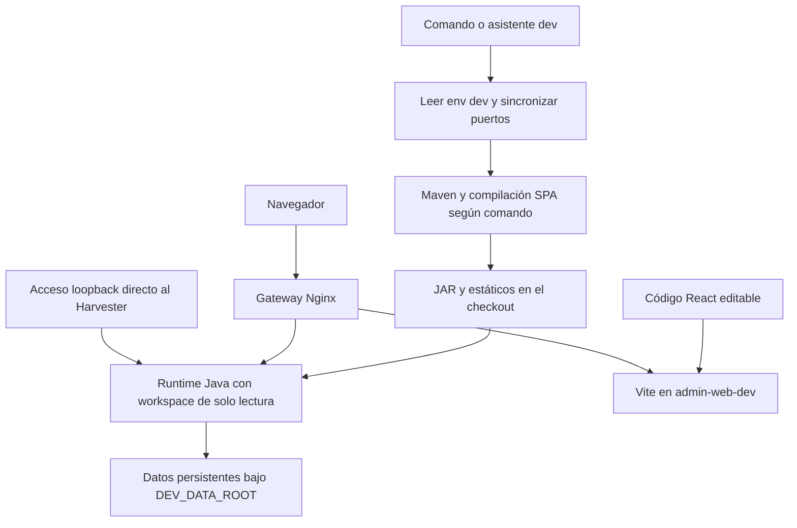

# Análisis completo del script Docker de desarrollo

Este documento explica el funcionamiento real de `Docker/docker-dev.sh`, sus comandos, el asistente, la composición de archivos YAML, la compilación Java y de frontends, el lanzamiento de aplicaciones y la persistencia. Está destinado a quienes desarrollan, operan o revisan este entorno y necesitan saber qué cambia en cada operación, dónde queda cada archivo y qué limitaciones tiene la implementación.

El entorno dev utiliza el código del checkout como entrada y como recurso montado en runtime. Compila mediante contenedores Maven, ejecuta JAR del host desde una imagen Java compartida y añade un servidor Vite y un gateway Nginx. Aísla datos y puertos mediante su configuración inicial, pero comparte código, `target/`, estáticos, overrides y algunos tags de imagen con otras ejecuciones del mismo workspace. Su modo `normal` permite reutilizar el proyecto y los datos del entorno normal, con consecuencias que se explican expresamente.

La documentación diferencia hechos del código, resultados de pruebas aisladas y comprobaciones pendientes. Incluye hallazgos que contradicen comentarios o ayudas del propio script. Es una descripción y análisis del snapshot, no una modificación de la lógica ni una certificación de todas las operaciones.

## 1 Alcance y versión analizada

Fecha: **3 de octubre de 2026**, con referencia de calendario Europe/Madrid. Repositorio padre: `lareferencia-platform`; commit observado: `f5985297fc92d1b3d2e829e9526cda0fdbd8a9b3`. Hay cambios locales anteriores a este análisis; los hashes identifican el contenido efectivo, no solamente el commit del padre.

| Archivo | Identidad SHA256 del snapshot |
| --- | --- |
| `Docker/docker-dev.sh` | `524b152ecf8aa5ecafaf90f322173708e511275cbb9fb8a044b8cee9b56319fd` |
| `docker-compose.dev.yml` | `87fde5ded801732605bcb7bdfdb548f7b1e3d2ac977e7076dce447f8c37d6d4d` |
| `Docker/apps/entrypoint-dev.sh` | `19ebc6ba4d0d3de306fdb51473b84f69f386dea0ae4038736c8f0da439cdd18f` |
| `Docker/apps/entrypoint-admin-web-dev.sh` | `3f9704282b8c893c6f2ca51d5fd8dd36fa33435f8a40781e7f3df54ab78e355c` |
| `Docker/nginx/dev-dashboard-gateway.conf` | `32bfa49ca7c5abbdb94bd2dce7834c8fc288a4b22294365e2bbade66a9f063f3` |
| `docker-compose.yml` base | `ef0846e50fa2d22dbcc853dae7a03811b06de889d94278a2de21d52eda9ed534` |

El script tiene 647 líneas. Se leyeron también el Compose base, las imágenes y entrypoints Solr/VuFind que hereda, los POM y configuración de aplicaciones, Vite, el frontend Angular, los overrides y la documentación existente. El análisis complementario del script normal está en [ANALISIS_OPERATIVO_DOCKER_SH.md](ANALISIS_OPERATIVO_DOCKER_SH.md).

Los ejemplos suponen invocación desde la raíz del repositorio. La implementación resuelve sus propios paths, por lo que puede invocarse desde otra carpeta. Un comando directo de Compose necesita reproducir los archivos y valores correctos.

No se ejecutaron builds completos, migraciones, limpiezas, creación de cuentas ni cambios de modo en la instalación real durante este análisis. Las pruebas de esas ramas usaron copias temporales y sustituciones de Docker o de borrado. Se consultó el modelo Compose y se comprobó sintaxis Nginx en el contenedor existente sin reiniciarlo.

## 2 Índice de lectura

- [Modelo general](#3-modelo-general-y-diferencias-con-el-entorno-normal).
- [Archivos y dependencias](#4-archivos-que-participan).
- [Comandos](#5-invocación-y-parser-de-comandos).
- [Configuración](#6-configuración-y-precedencia).
- [Modos de instancia](#7-modos-isolated-y-normal).
- [Composición efectiva](#8-composición-y-herencia-del-modelo-compose).
- [Módulos y perfiles](#9-módulos-servicios-y-perfiles).
- [Red y puertos](#10-red-puertos-y-nombres).
- [Build y reconstrucción](#12-compilación-java).
- [Runtime Java](#16-entrypoint-java-de-desarrollo).
- [Persistencia](#17-mapa-completo-de-almacenamiento).
- [Admin Vite y Dashboard](#18-admin-web-y-vite).
- [Gateway](#20-gateway-nginx-y-separación-por-host).
- [Watch](#23-watch-de-código-y-recompilación-automática).
- [Limpieza](#25-alcance-y-límites-de-clean).
- [Hallazgos](#29-hallazgos-y-limitaciones).
- [Pruebas y funciones](#32-validación-realizada-y-pendiente).

## 3 Modelo general y diferencias con el entorno normal

### 3.1 Capas de operación

| Capa | Entrada | Resultado | Persistencia |
| --- | --- | --- | --- |
| Selección y configuración | `.env.dev`, `.env` opcional y comando | Proyecto, paths, perfiles y lista de servicios | `.env.dev` reescrito |
| Compilación Maven | Fuentes y POM del checkout | JAR en `target/`, artefactos instalados en `.m2` | Host y volumen Maven del proyecto |
| Compilación SPA | POM frontend y npm | Admin/Dashboard compilados en directorios del Harvester | Host |
| Imagen Java | `Dockerfile.dev` y entrypoint | Runtime Java 17 sin fuentes ni JAR | Daemon Docker; tag compartido por perfil |
| Runtime Java | JAR y config montados del host | Proceso Java iniciado con config temporal | JAR externo, config runtime efímero y datos montados |
| Admin vivo | Código React, volumen npm y Vite | Interfaz con HMR | Código host y volumen de dependencias |
| Gateway | Archivo Nginx y aliases de red | Rutas separadas por Host | Config host; proceso en contenedor |
| Bases e índices | Config Compose heredada | PostgreSQL, MariaDB, Solr y Elastic | Paths bajo DEV_DATA_ROOT |



Modificar Java no cambia el proceso running hasta recompilar y reiniciar. Modificar React puede reflejarse mediante Vite sin recompilar Java. Dashboard se sirve compilado: no tiene un `ng serve` propio en el overlay. Los estáticos son archivos externos montados, no solo contenido empaquetado dentro del JAR.

### 3.2 Comparación con docker.sh normal

| Aspecto | Normal | Dev |
| --- | --- | --- |
| Sin argumentos | Ayuda | Asistente |
| Compose | Solo base | Base más overlay dev |
| Entorno del wrapper | `.env` | `.env` opcional y `.env.dev` |
| Java en runtime | JAR/copias de recursos dentro de imagen | JAR del host montado |
| Imagen Java | Una imagen por aplicación | Imagen común `app-runtime-dev:<perfil>` |
| Compilación | Reactor global `clean package` | Selección `-pl -am install`, sin clean |
| Repositorios Java | Puede llamar githelper init/pull | No prepara automáticamente los repositorios Java |
| Maven cache | Global `lr-maven-cache` | Volumen del proyecto `lr-maven-cache-dev` |
| JAR identity | Manifiestos y comprobación DARK | No genera ni verifica esos manifiestos |
| Usuario de Java | gosu a usuario lareferencia | Usuario inicial de la imagen; root por defecto |
| Rebuild Java | Imagen nueva y recreación | JAR nuevo y reinicio del contenedor existente |
| Admin | Compilado en imagen | Compilado directo y además Vite en gateway |
| Dashboard | Compilado | Compilado; reconstrucción explícita |
| Datos iniciales | Paths normales constantes | Raíz dev aislada por default |
| Init manual | Puede eliminar infraestructura e importar reglas | One-off db-init sin dependencias ni importación script |
| Watch | No tiene CLI de watch | Polling local por timestamps |
| Clean/reset | Reset amplio del normal | Clean dev con comprobaciones parciales |

El script dev no importa ni ejecuta el script normal. **Sí hereda sus archivos Compose y overrides**. Independencia del parser no equivale a independencia de configuración, montajes o imágenes Solr/VuFind.

## 4 Archivos que participan

### 4.1 Control y configuración

| Archivo | Uso |
| --- | --- |
| [`Docker/docker-dev.sh`](docker-dev.sh) | CLI y asistente dev |
| [`docker-compose.yml`](../docker-compose.yml) | Definiciones base y herencia de servicios |
| [`docker-compose.dev.yml`](../docker-compose.dev.yml) | Nuevos servicios, runtime, puertos y montajes dev |
| `Docker/.env.dev` | Config local creada por dev; modo, proyecto, raíz, perfil y puertos |
| `Docker/.env` | Config base opcional para interpolación; además valores copiables en modo normal |
| `.git/info/exclude` | Exclusión local de `.env.dev` si `.git` es directorio y exclude escribible |
| [`pom.xml`](../pom.xml) | Reactor Maven, módulos y dependencias |
| `<módulo>/pom.xml` | Compilación y empaquetado de cada módulo |
| [`workspace.ini`](../workspace.ini), [`githelper`](../githelper) | Referencia para preparar workspace manualmente; dev no los invoca |
| [`Docker/config-overrides`](config-overrides) | Config común montada en Java como `/docker-overrides:ro` |
| [`.dockerignore`](../.dockerignore) | Exclusiones de contexto para imágenes; no controla bind mounts |
| [`.gitignore`](../.gitignore) | Ignorados versionados; no incluye una regla general dev env en el snapshot |

### 4.2 Runtime y acceso web

| Archivo | Uso |
| --- | --- |
| [`Docker/apps/Dockerfile.dev`](apps/Dockerfile.dev) | Java 17 y copia del entrypoint; no copia apps |
| [`Docker/apps/entrypoint-dev.sh`](apps/entrypoint-dev.sh) | Config runtime, historial Shell, selección de JAR y ejecución |
| [`Docker/apps/entrypoint-admin-web-dev.sh`](apps/entrypoint-admin-web-dev.sh) | npm ci condicionado y Vite |
| [`Docker/nginx/dev-dashboard-gateway.conf`](nginx/dev-dashboard-gateway.conf) | Hosts, rutas, métodos y upstreams |
| [`lareferencia-lrharvester-admin-web/vite.config.ts`](../lareferencia-lrharvester-admin-web/vite.config.ts) | Base /admin, puerto Vite y proxy API |
| [`lareferencia-lrharvester-admin-web/package.json`](../lareferencia-lrharvester-admin-web/package.json) | Comandos dev/build/test de React |
| [`lareferencia-lrharvester-admin-web/pom.xml`](../lareferencia-lrharvester-admin-web/pom.xml) | Compilación empaquetada del Admin |
| [`lareferencia-repository-dashboard/pom.xml`](../lareferencia-repository-dashboard/pom.xml) | Build Angular y publicación al Harvester |
| [`lareferencia-repository-dashboard/angular/package.json`](../lareferencia-repository-dashboard/angular/package.json) | ng build y otras herramientas Angular |
| [`Docker/solr/Dockerfile`](solr/Dockerfile), [`entrypoint.sh`](solr/entrypoint.sh) | Imagen e inicialización Solr heredadas |
| [`Docker/vufind/Dockerfile`](vufind/Dockerfile), [`entrypoint.sh`](vufind/entrypoint.sh) | PHP/Apache, Composer e instalación VuFind heredadas |

Los paths de aplicaciones pertenecen a repositorios anidados. Las referencias solo estarán presentes en un workspace inicializado con esos módulos.

### 4.3 Archivos generados y temporales

| Artefacto | Ubicación | Operación que lo crea |
| --- | --- | --- |
| Env dev inicial | `Docker/.env.dev` | Cualquier invocación si falta |
| Edición de env | `Docker/.env.dev.tmp` | env_set al sustituir claves |
| gum | `Docker/.bin/gum` | Wizard si no encuentra binario |
| Descargar gum | `${TMPDIR:-/tmp}/lr-dev-gum.XXXXXX` | ensure_gum; elimina el temporal en caminos previstos |
| Clon temporal VuFind | `${TMPDIR:-/tmp}/lr-dev-vufind.XXXXXX/checkout` | Preparación de checkout faltante |
| Código VuFind | `vufind/` | Copia del clon temporal conservando archivos existentes |
| JAR Java | `<módulo>/target/` | Maven install |
| Admin compilado | `lareferencia-lrharvester-app/admin-static/` | Frontend package |
| Dashboard compilado | `lareferencia-lrharvester-app/dashboard-static/` | Dashboard package |
| Runtime config | `/tmp/lr-config/<módulo>` dentro del contenedor | Entrypoint Java en cada ejecución |
| Historial Shell | `/dev-data/shell/spring-shell.log` | Spring Shell; ruta forzada por entrypoint |
| Log de acción wizard | `/tmp/lareferencia-docker-dev.log` en host | execute_with_progress |
| Marca de watch | `/tmp/lr-dev-watch.XXXXXX` en host | watch_service |

Que un archivo esté bajo `/tmp` no significa que todos los procesos utilicen un nombre único: el log del asistente tiene un path fijo compartido entre ejecuciones.

## 5 Invocación y parser de comandos

### 5.1 Preparación inicial

El script usa `#!/usr/bin/env bash` y `set -euo pipefail`. Resuelve paths de script, raíz, Compose base/overlay, env base/dev y log. Prepara arrays de módulos y colores ANSI. Si hay gum ejecutable en `Docker/.bin`, antepone ese directorio a PATH.

Antes del parser ejecuta `ensure_dev_env`. Por tanto, **help, un comando inválido e incluso una consulta pueden crear `.env.dev`** y modificar la exclusión Git local. Una invocación sin argumentos asigna `wizard`; hace `shift || true` para tolerar que no hubiera argumentos.

No hay una comprobación central de instalación de Docker o de una versión mínima antes de todas las ramas. El wizard muestra checks, pero no impide elegir acciones si Docker/Compose/daemon fallan.

### 5.2 Comandos admitidos

| Comando | Operación efectiva |
| --- | --- |
| `wizard` | Asistente; default si no hay argumentos |
| `instance [modo]` | Cambia env dev a isolated o normal; sin valor solicita elección |
| `up` | Calcula selección, prepara VuFind, compila Java seleccionados y Shell de db-init, up con build |
| `up <servicio…>` | Prepara VuFind para servicios explícitos, compila Java explícitos y up con build |
| `down [opciones…]` | Compose down con argumentos recibidos |
| `clean [--yes]` | Limpieza de instancia declarada isolated; confirmación o bypass |
| `ps` | Compose ps; sincroniza puertos antes |
| `logs [argumentos…]` | Siempre logs `-f --tail=100`, después añade argumentos recibidos |
| `shell [servicio]` | Exec bash; si falla, exec sh; default Harvester |
| `lrshell [comando…]` | One-off Shell con TTY y SHELL_IDLE=false; no compila |
| `init-db` | `run --rm --no-deps db-init database_migrate`; no arranca bases ni compila |
| `rebuild-platform` | Compila todas las apps y SPAs y hace up de la selección |
| `build <opción>` | Compila un servicio, all, frontend o dashboard sin arrancar ni reiniciar; admin-web es alias frontend |
| `restart <servicio>` | Restart si hay contenedor; up no-deps si no lo hay |
| `rebuild <servicio>` | Compila/reconstruye y reinicia o recrea según el servicio |
| `frontend-dev` | Up Harvester, gateway y Admin Vite; no compila ni garantiza un restart |
| `watch <servicio>` | Polling de fuentes Java, con manejo especial de frontends Harvester |
| `reload solr` | Restart Solr mediante restart_service |
| `help`, `-h`, `--help` | Ayuda parcial con algunos textos imprecisos |

No admite comandos propios `stop`, `start`, `pull`, `res`, `health`, `modules`, `reset-data`, `dc`, `init` ni opciones de up del script normal como `--module` o `--pull-modules`.

### 5.3 Validación de argumentos y aliases

`build`, `restart`, `rebuild` y `watch` exigen exactamente un argumento. `reload` comprueba que el primero sea solr, pero no rechaza expresamente argumentos posteriores. `instance`, `shell`, `ps`, `init-db` y otras ramas no tienen una validación uniforme de cantidad de argumentos.

`up` no analiza opciones propias. Cada argumento es inspeccionado como posible nombre Java y luego se reenvía a Compose después de `up -d --build`. Un flag Compose puede ser aceptado al llegar allí, pero no se debe deducir que altera la preparación de fuentes o de compilación del wrapper. No hay interfaz dev de selección mediante módulos en esta rama.

`build all` también puede alcanzarse mediante el caso especial de compile_service; no equivale a `rebuild-platform` porque no hace el up final. Los aliases `frontend` y `admin-web` se interpretan para build/rebuild, no como nombres de servicio Compose. El servicio del servidor vivo es `admin-web-dev`.

La ayuda dice que restart recrea el servicio; el código reinicia un contenedor existente. También describe rebuild como recreación general, aunque Java utiliza restart. El documento sigue la implementación.

## 6 Configuración y precedencia

### 6.1 Env inicial

Si falta `.env.dev`, escribe exactamente estas claves base:

```properties
DEV_INSTANCE_MODE=isolated
SERVICE_PREFIX=lareferencia-dev
COMPOSE_PROJECT_NAME=lareferencia-dev
SERVICES_PORT_OFFSET=100
DEV_DATA_ROOT=./Docker/volume/dev/lareferencia-dev
LR_BUILD_PROFILE=lareferencia
DEV_WATCH_INTERVAL=2
DEV_COMPOSE_PROFILES=
```

No copia `.env.example` ni inicializa los estados `DEV_MODULE_*`: usa defaults en las funciones. Tampoco copia todos los recursos, credenciales, preferencias o ref VuFind de `.env` al archivo dev.

La exclusión Git solo se intenta en el momento de creación, cuando `.git` es directorio y `.git/info/exclude` es escribible. En un worktree con `.git` como archivo no se añade. Si `.env.dev` ya existía, no repara una exclusión ausente. El `.gitignore` del snapshot ignora Docker/.bin, pero no garantiza por sí solo que `.env.dev` nunca aparezca como untracked.

### 6.2 Parsers propios

`env_get` y `base_env_get` usan `awk -F=` y comparación estricta `$1 == key`; guardan el último `$2` encontrado. No recortan espacios ni comillas y usan default si el valor está vacío.

Consecuencias:

- `LR_BUILD_PROFILE="ibict"` devuelve un valor con comillas para Maven, mientras Compose puede interpretarlo como ibict.
- `LR_BUILD_PROFILE =ibict` no coincide con la clave buscada.
- Un valor con `=` interno puede truncarse al primer campo de valor.
- Comentarios inline, sustituciones y quoting dotenv no tienen una interpretación completa en estas funciones.
- Un valor vacío no siempre significa desactivación deliberada: puede activar el fallback.

`env_set` usa grep de clave al inicio, sed con un temporal fijo y mv, o añade línea. No hace bloqueo, validación de nombre o escapado general de valores para sed. Varios procesos pueden sobrescribirse o competir por el mismo `.tmp`.

### 6.3 La función dc

En cada llamada:

1. Garantiza `.env.dev`.
2. Ejecuta sync_ports y reescribe diez `LR_PORT_*`.
3. Forma `docker compose -f <base> -f <overlay>`.
4. Añade `--env-file Docker/.env` si ese archivo existe.
5. Añade siempre `--env-file Docker/.env.dev` después.
6. Lee `DEV_COMPOSE_PROFILES`, lo divide por comas y añade `--profile` para tokens no vacíos.
7. Ejecuta Compose con argumentos de la operación.

No usa fallback a `docker-compose` v1. El overlay usa `!override`, por lo que requiere una implementación Compose que lo soporte; la guía existente establece 2.24.0 o posterior, y el entorno analizado usa v5.5.1. La sintaxis no se comprueba preventivamente en el wrapper.

La expansión `"${profile_list[@]-}"` tolera lista vacía bajo Bash macOS con nounset. En el snapshot incorpora la corrección del fallo inicial por array vacío.

### 6.4 Precedencia efectiva

Para interpolación Compose, el archivo dev se proporciona después del base y reemplaza sus claves coincidentes. Variables exportadas del proceso pueden tener prioridad sobre ambos. Los defaults `${VAR:-default}` del YAML se aplican cuando el valor es vacío o no está definido.

Para las funciones propias, env_get **solo consulta `.env.dev`** y base_env_get **solo `.env`**. No son una lectura de los valores efectivos ya resueltos por Compose.

Maven Java lee su perfil con env_get; esto evita el defecto normal de ignorar por completo el valor del archivo. Pero una variable exportada `LR_BUILD_PROFILE=ibict` puede llevar Compose a una imagen/tag ibict mientras env_get devuelve lareferencia. La prueba de config reprodujo esa divergencia inversa. Se debe mantener la consistencia de archivo y entorno exportado.

`.env` puede aportar límites de recursos, tema/debug VuFind, COMPOSE_PROFILES y otros valores que dev no sobrescribe. Activar perfiles por herencia no equivale a seleccionar servicios en las funciones del wrapper. La red, proyecto y montajes efectivos deben verificarse con el modelo compuesto.

### 6.5 Variables operativas

| Variable | Uso y matiz |
| --- | --- |
| DEV_INSTANCE_MODE | Define cómo sync_ports obtiene valores y habilita/bloquea clean |
| COMPOSE_PROJECT_NAME | Nombre Compose configurado; el wrapper dev no lo deriva siempre del prefijo |
| SERVICE_PREFIX | Texto guardado/mostrado; container_name usa proyecto, no este valor directamente |
| SERVICES_PORT_OFFSET | Cálculo de puertos en isolated; en normal se consultan claves individuales del base |
| DEV_DATA_ROOT | Paths de bind mounts de datos; compartido con /dev-data de algunos Java |
| LR_BUILD_PROFILE | Perfil Java desde env_get y tag de imagen por interpolación Compose |
| DEV_WATCH_INTERVAL | Valor para sleep del watcher; default 2 segundos, sin validación |
| DEV_COMPOSE_PROFILES | Lista persistida por selected_services y usada por dc |
| DEV_MODULE_* | Selección en env dev, sin fallback a estados base |
| COMPOSE_PROFILES | Puede llegar de `.env` o entorno y activar perfiles adicionales |
| LR_PORT_* | Reescritos por sync_ports; afectan publicación de puertos |
| LR_MEM_* y LR_CPU_* | Límites heredados del Compose base; pueden llegar del env base/dev |
| APP_MODULE, APP_CONFIG_DIR, EXTERNAL_CONFIG_DIR | Entorno heredado/configurado de cada servicio Java |
| APP_JAR_PATH | Selección explícita opcional de JAR si se pasa al contenedor |
| APP_RUN_CONFIG_DIR | Runtime config temporal, default por módulo |
| JAVA_OPTS | Opciones JVM del contenedor; Harvester fija dos propiedades de cookies |
| SHELL_IDLE | Env heredado; Shell idle por default base |
| VUFIND_REPO_URL y VUFIND_REF | Checkout dev consulta entorno del proceso o env base; no env_get dev |
| VITE_HARVESTER_ORIGIN | Proxy Vite configurado al alias Harvester interno |

Una clave escrita solamente en `.env.dev` no llega automáticamente al proceso Java: Compose debe referenciarla o declararla para el servicio. El archivo env de interpolación no es un env_file de runtime de todos los servicios.

## 7 Modos isolated y normal

### 7.1 Selección isolated

`instance isolated` reescribe modo, prefijo, proyecto, offset y raíz con los defaults del archivo inicial y sincroniza puertos. No conserva un nombre/proyecto o path isolated personalizado en esas cinco claves. Tampoco detiene, desmonta o mueve la instalación anterior.

```text
Proyecto: lareferencia-dev
Raíz: ./Docker/volume/dev/lareferencia-dev
Offset: 100
```

Los datos se separan de los normales por la raíz de montajes, no por el texto isolated por sí solo. Es posible editar un proyecto o raíz diferente, pero el script no tiene un gestor de varias instancias ni un argumento CLI para elegir múltiples archivos dev.

### 7.2 Selección normal

`instance normal` copia de `.env` SERVICE_PREFIX, COMPOSE_PROJECT_NAME y SERVICES_PORT_OFFSET usando awk sin defaults. Si falta base o las claves, guarda valores vacíos. Fija DEV_DATA_ROOT a `./Docker/volume` y sincroniza puertos.

El objetivo es usar datos y nombres normales desde runtime dev. El overlay sigue activo: Java continuará leyendo el JAR del workspace, aparecen Vite/gateway y los puertos que el overlay cambia continúan siendo loopback. No se vuelve al Dockerfile normal.

Si el proyecto coincide con el normal, el up dev puede recrear contenedores normales bajo los mismos nombres con otra imagen/montajes. El `/config` compartido puede ser sembrado desde fuentes dev y sufrir limpieza de archivos legacy. Cambiar posteriormente a isolated no revierte esas modificaciones.

Si falta el `.env` base, el script no lo crea ni deriva un proyecto normal coherente. Los defaults de container_name pueden usar `lr`, mientras Compose calcula su nombre de proyecto por otro mecanismo. El comportamiento debe leerse de `config`, no de la intención del selector.

### 7.3 Cambio de modo sin teardown

El selector no hace down antes ni valida conflictos de puertos. Al cambiar el archivo deja intactos los contenedores y datos del modo anterior. Los comandos siguientes apuntan al proyecto nuevo y pueden ignorar los antiguos.

Ni `.env.dev` ni `.env` constituyen un inventario de todos los proyectos que existieron. No hay rename de volúmenes ni migración de datos. Para saber qué sigue activo hay que inspeccionar Compose/Docker además del archivo.

Clean solo compara la cadena de modo con isolated, pero esa condición no demuestra por sí sola que el proyecto y path efectivos sean aislados. El análisis específico de limpieza explica sus límites.

## 8 Composición y herencia del modelo Compose

### 8.1 Orden de archivos

El overlay se carga después del base. Primero YAML resuelve el anchor `x-java-dev` dentro del archivo dev; después Compose combina ambos archivos. Estas son dos operaciones distintas.

Los mapas de entorno y build pueden conservar claves base no redefinidas. Los volúmenes se combinan por target, de modo que redefinir `/data` cambia su source pero no elimina necesariamente `/docker-overrides`. Los puertos marcados `!override` se sustituyen en bloque para evitar sumar publicación normal y dev.

Se comprobó el modelo con `docker compose ... config --format json`. La revisión detectó **14 servicios** al habilitar tools, oai, watch, elastic y developer-builder: los 11 de base más gateway, Admin Vite y builder Maven.

### 8.2 Anchor Java

El anchor establece:

```yaml
build:
  context: .
  dockerfile: Docker/apps/Dockerfile.dev
image: lareferencia/app-runtime-dev:${LR_BUILD_PROFILE:-lareferencia}
environment:
  DEV_MODE: "true"
volumes:
  - .:/workspace:ro
  - ${DEV_DATA_ROOT}:/dev-data
```

Se aplica a Harvester, Entity REST, OAI, Shell y db-init. Pero Harvester/Entity/OAI declaran listas de volúmenes propias dentro del overlay. Por resolución YAML esas listas reemplazan la del anchor antes del merge Compose. Resultado comprobado:

- Todos los cinco Java tienen `/workspace:ro`.
- Harvester, Shell y db-init tienen `/dev-data`.
- Entity REST y OAI no tienen `/dev-data` en este snapshot.
- Las aplicaciones con /config/data/log reciben sus paths dev.
- Todos conservan `/docker-overrides:ro` del base.

### 8.3 Herencias que continúan activas

La imagen/Dockerfile Java cambia, pero se conservan APP_MODULE, conexiones SQL/Solr, APP_CONFIG_DIR, EXTERNAL_CONFIG_DIR donde había, profiles, depends_on, restart, límites y aliases del base.

El modelo conserva args de build APP_MODULE y LR_BUILD_PROFILE heredados, aunque Dockerfile.dev no los declare ni los use. El módulo se elige por env del servicio, no por un JAR incluido en esa imagen.

Para PostgreSQL, MariaDB, Solr, VuFind y Elastic cambia sobre todo la ubicación de bind mounts y publicación de puertos. Sus versiones, entrypoints y condiciones de inicialización siguen siendo las normales.

No existe una transformación global de SOLR_EXTERNAL_URL. Dev conserva las URLs internas y dependencies Solr del base. Tampoco aplica presets de recursos mediante comandos propios: hereda las variables que Compose resuelva.

### 8.4 Servicios nuevos

| Servicio | Imagen | Función | Datos destacados |
| --- | --- | --- | --- |
| maven-builder | maven:3.9.11-eclipse-temurin-17 | Maven al ejecutar run con perfil developer-builder | Workspace RW y volumen .m2 |
| admin-web-dev | node:22-bookworm-slim | Vite vivo | Módulo React RW y volumen npm |
| web-gateway-dev | nginx:stable-alpine | Routing por Host | Archivo Nginx montado RO y puerto loopback |

Estos servicios no son módulos independientes del menú. Harvester recoge también Admin/gateway; el builder se utiliza explícitamente para comandos de compilación y no como aplicación permanente.

## 9 Módulos servicios y perfiles

### 9.1 Selección lógica

`ALL_MODULES` establece el orden `core solr harvester entity-rest shell vufind elastic watch oai`. Un módulo no es necesariamente un servicio Compose ni un módulo Maven.

| Módulo del asistente | Estado inicial si no hay clave | Servicios solicitados | Perfil adicional |
| --- | --- | --- | --- |
| core | Siempre on | postgres | Ninguno |
| solr | on | solr | Ninguno |
| harvester | on | harvester, admin-web-dev, web-gateway-dev | Ninguno |
| entity-rest | off | entity-rest | Ninguno |
| shell | off | shell | tools |
| vufind | on | vufind-db, vufind-web | Ninguno |
| elastic | off | elasticsearch | elastic |
| watch | off | vufind-scss-watch | watch |
| oai | on | oai-pmh | oai |

Cada opcional tiene una clave `DEV_MODULE_*`: `SOLR`, `HARVESTER`, `ENTITY_REST`, `SHELL`, `VUFIND`, `ELASTIC`, `WATCH`, `OAI`. Aunque `module_key core` devuelve `DEV_MODULE_CORE`, `module_state core` devuelve on directamente y `set_module_state core` no escribe. No se puede desactivar PostgreSQL desde esta selección.

`module_state` utiliza `is_truthy`: acepta `1`, `true`, `on`, `yes`, sin distinguir mayúsculas. Cualquier otro valor no vacío es off. Una clave vacía toma el default, por lo que `DEV_MODULE_OAI=` no desactiva OAI: debe ponerse `off` o `false`.

`selected_services` construye arrays globales `DEV_SELECTED_SERVICES` y `DEV_SELECTED_PROFILES`, evita duplicados y escribe la lista de perfiles separada por comas en `.env.dev`. Añade Solr si se eligió Harvester, Shell o VuFind aunque el flag Solr diga off. Entity REST y OAI pueden traer Solr mediante `depends_on`, pero esa dependencia no aparece necesariamente en el array del wrapper.

Con defaults pide ocho servicios: `postgres solr harvester admin-web-dev web-gateway-dev vufind-db vufind-web oai-pmh`. Compose también incorpora db-init por dependencia de Harvester. No pide Shell permanente; aun así compila su JAR para ejecutar db-init.

### 9.2 Qué significa on y off

On significa «incluir en la próxima selección». Off no ejecuta stop, down ni eliminación. Un contenedor ya running puede seguir activo después de desmarcar su módulo y volver a arrancar los seleccionados. El asistente combina estado deseado e información running, que son conceptos diferentes.

`manage_modules` ofrece ocho opcionales con `gum choose --no-limit`; reinicia todos sus flags a off y activa los elegidos. Fuerza el flag Solr a on si Harvester o VuFind quedaron on. No persiste perfiles en ese momento: esa escritura ocurre cuando se llama después a `selected_services`.

No hay comando CLI público `modules`. Se modifica desde el asistente o editando `.env.dev`. Los comandos explícitos `up servicio`, `build`, `restart`, `init-db` y `frontend-dev` no reconstruyen esta selección y pueden operar fuera de ella.

### 9.3 Perfiles no equivalen a compilación ni disponibilidad

`tools`, `elastic`, `watch` y `oai` habilitan servicios opcionales del base. `developer-builder` habilita el contenedor Maven y lo añaden expresamente las funciones de compilación. Una llamada explícita a un servicio con perfil puede activarlo por las reglas de Compose, pero sus dependencias deben seguir siendo válidas en el modelo resultante.

El wrapper conserva `DEV_COMPOSE_PROFILES` entre llamadas. Activar OAI en una llamada `up oai-pmh` no actualiza por sí solo la lista de módulos; un posterior `ps` sin su perfil puede ofrecer una visión diferente. Consultar todos los perfiles con Compose resulta útil al revisar contenedores opcionales. No hay sincronización automática entre módulos, perfiles guardados y contenedores existentes.

## 10 Red puertos y nombres

### 10.1 Tabla de publicaciones

Todos los puertos publicados por el modelo dev quedan vinculados a `127.0.0.1`. El overlay reemplaza las listas de puertos del base mediante `!override`; PostgreSQL conserva su publicación loopback base.

| Servicio | Clave | Base aritmética | Isolated con offset 100 | Puerto en contenedor |
| --- | --- | ---: | ---: | ---: |
| vufind-web | LR_PORT_VUFIND_WEB | 8080 | 8180 | 80 |
| vufind-db | LR_PORT_VUFIND_DB | 3307 | 3407 | 3306 |
| solr | LR_PORT_SOLR | 8983 | 9083 | 8983 |
| postgres | LR_PORT_POSTGRES | 5432 | 5532 | 5432 |
| harvester | LR_PORT_HARVESTER | 8090 | 8190 | 8090 |
| entity-rest | LR_PORT_ENTITY_REST | 8094 | 8194 | 8094 |
| elasticsearch HTTP | LR_PORT_ELASTIC_9200 | 9200 | 9300 | 9200 |
| elasticsearch transporte | LR_PORT_ELASTIC_9300 | 9300 | 9400 | 9300 |
| oai-pmh | LR_PORT_OAI | 8096 | 8196 | 8092 |
| web-gateway-dev | LR_PORT_GATEWAY | 8088 | 8188 | 8080 |
| admin-web-dev | Sin publicación | — | — | Vite 5173 |
| shell, db-init, maven-builder | Sin publicación | — | — | Sin API publicada |

`sync_ports` escribe las diez claves antes de **cada** operación `dc`, incluso una consulta de estado. En isolated ignora valores LR_PORT puestos manualmente en `.env.dev` y los sustituye por base más offset. En normal lee cada clave LR_PORT del `.env` base y, si no existe, usa el puerto de la tercera columna. No calcula el offset normal sobre esos defaults.

Un offset no numérico completo se convierte en cero. No se comprueba rango TCP, disponibilidad del puerto, proyecto ajeno que ya lo ocupa ni desbordamiento. Bash interpreta números con cero inicial como octales en expresiones aritméticas; conviene usar enteros decimales sin ceros iniciales.

### 10.2 URLs y acceso desde el navegador

Para los defaults isolated:

- Admin vivo: `http://admin.localhost:8188/admin/`.
- Dashboard compilado: `http://dashboard.localhost:8188/dashboard/es/`.
- Harvester directo: `http://localhost:8190/`.
- VuFind: `http://localhost:8180/`.
- Solr: `http://localhost:9083/solr/`.
- OAI: conexión al puerto 8196, con la ruta de endpoint que establezca su aplicación/configuración.

`http://localhost:8188/` recibe 404 por el virtual host default. El Host debe ser `admin.localhost` o `dashboard.localhost`. Si el sistema no resuelve esos nombres a loopback, hay que corregir la resolución local; el script no modifica `/etc/hosts` ni configura DNS del host.

El puerto directo del Harvester permite llegar al backend sin atravesar las reglas del gateway. La autorización propia del backend continúa siendo necesaria. El binding loopback está pensado para desarrollo local; este análisis no establece un procedimiento de publicación externa.

### 10.3 Red interna y nombres de proyecto

La red default hereda el nombre `${COMPOSE_PROJECT_NAME:-lr}-network`. Los aliases internos son estables, como `postgres`, `solr`, `harvester`, `vufind-db`. Cambiar el offset no cambia puertos internos ni URLs JDBC/HTTP entre contenedores. El gateway usa esos aliases, no los puertos del host.

Los servicios heredados tienen `container_name` explícito con el proyecto: por ejemplo `lareferencia-dev-harvester`. Los tres nuevos no tienen `container_name`; Compose deriva sus nombres. Los tags Java dev dependen del perfil Maven, no del proyecto. Los tags de Solr y VuFind también son compartidos con normal cuando coinciden los perfiles.

`SERVICE_PREFIX` se guarda y muestra, pero estos nombres Compose dependen de `COMPOSE_PROJECT_NAME`, no del prefix. Cambiar solamente SERVICE_PREFIX no renombra la red ni los contenedores de este modelo.

La UI calcula el puerto con `get_service_port`, que siempre suma dígitos del offset y no lee las claves LR_PORT. Por eso puede mostrar puertos incorrectos en normal. Prueba aislada: offset base 400 sin LR_PORT_SOLR → Compose usa 8983, la UI muestra 9383. Una clave Harvester explícita 8490 puede coincidir por casualidad con 8090 + 400.

## 11 Preparación del workspace y requisitos

Se necesitan Bash, Docker CLI con Compose compatible con `!override`, daemon accesible, checkout padre y módulos que el reactor Maven referencia. El Bash del host no necesita Java ni Maven para compilar: el builder los proporciona. Sí necesita herramientas del wrapper como awk, sed, grep, find, mktemp, tar y, cuando corresponda, Git/curl.

El script no llama a `Docker/githelper.sh init`, no inicializa los módulos Java que falten y no hace pull de cada repositorio. Que el padre exista no garantiza que sus directorios anidados contengan POM y fuentes. Incluso un build seleccionado necesita que el reactor pueda leer sus declaraciones y resolver dependencias locales. Las versiones ya presentes en `.m2` pueden ocultar que un módulo no se reconstruyó.

El asistente usa gum. Si está disponible en PATH lo reutiliza; si hay `Docker/.bin/gum` ejecutable, el arranque antepone esa carpeta. Si falta, `ensure_gum` descarga v0.15.0 para Darwin o Linux, x86_64 o arm64/aarch64, mediante curl con connect-timeout 15 y max-time 120. Extrae un tar, encuentra el binario, lo marca ejecutable y lo mueve a `.bin/gum`.

No hay checksum de la descarga, actualización automática del binario instalado ni bloqueo entre dos descargas simultáneas. El temp bajo `${TMPDIR:-/tmp}/lr-dev-gum.XXXXXX` se borra en éxito y en los fallos tratados, pero no tiene trap para interrupciones o todos los fallos intermedios. Los comandos CLI normales no requieren gum; la confirmación de clean puede usar texto cuando falta.

`get_check_status` consulta Docker, `docker compose version` y `docker info`; muestra indicadores, no constituye una validación exhaustiva ni evita seleccionar acciones cuando el daemon no está disponible. No valida disco, RAM, DNS, checkout completo, permisos de mounts, puertos libres ni éxito de una futura compilación.

## 12 Compilación Java

### 12.1 Servicio Compose y módulo Maven

| Argumento de servicio | APP_MODULE / selector Maven |
| --- | --- |
| harvester | lareferencia-lrharvester-app |
| entity-rest | lareferencia-entity-rest |
| shell | lareferencia-shell |
| db-init | lareferencia-shell |
| oai-pmh | lareferencia-oai-pmh |

`build` espera esos nombres de **servicio**, además de `all`, `frontend`/`admin-web` y `dashboard`. `build lareferencia-shell` es inválido. db-init y Shell comparten módulo y artefacto; compilar uno no hace una migración.

### 12.2 Comando y consecuencias

Para un Java seleccionado ejecuta:

```sh
docker compose [archivos y env del wrapper] --profile developer-builder \
  run --rm --no-deps maven-builder \
  -pl lareferencia-lrharvester-app -am install \
  -DskipTests -Dmaven.javadoc.skip=true \
  -Dspring-boot.repackage.executable=false -Plareferencia
```

`-pl` selecciona el módulo; `-am` añade proyectos del reactor necesarios. `install` compila, empaqueta e instala artefactos en el repositorio local Maven del builder. `--no-deps` evita arrancar PostgreSQL/Solr solo para compilar. `--rm` elimina ese contenedor cuando termina, pero conserva el volumen `.m2` y todos los cambios en el workspace.

El perfil lo lee `env_get LR_BUILD_PROFILE lareferencia` desde `.env.dev`; no usa automáticamente una variable exportada del shell. Compose sí puede usar esa variable para tags y args. Es posible compilar con un perfil y etiquetar el runtime con otro si el entorno exportado contradice `.env.dev`.

No hay `clean`, por lo que pueden quedar artefactos de versiones anteriores en `target/`. El entrypoint elegirá el JAR por mtime. No se ejecutan tests Java, no se generan Javadocs y no se configura un mirror Maven desde el wrapper. La propiedad repackage executable false evita solicitar el formato de JAR con script de lanzamiento antepuesto, compatible con ejecución `java -jar`.

El builder monta todo el repositorio RW en `/workspace` y un volumen persistente en `/root/.m2`. Escribe `target/`, clases, recursos, artefactos instalados y caché de dependencias. La imagen Maven no establece aquí un usuario host; el proceso corre con su usuario de imagen. En hosts Linux los archivos pueden quedar con ownership de root. Dev no aplica la reparación de permisos que tiene el flujo normal.

### 12.3 Harvester incorpora ambos frontends

`compile_service harvester` ejecuta primero `compile_frontend`, después `compile_dashboard` y por último Java Harvester. Cada operación crea un contenedor Maven one-off. No hay una compilación simultánea entre esos tres pasos.

Por tanto, `build harvester`, `rebuild harvester` y `up harvester` también pueden instalar herramientas Node/npm, ejecutar npm ci y regenerar todos los estáticos. Un fallo de Angular puede impedir avanzar a Java en una invocación donde errexit siga efectivo; los contextos de asistente/condicionales tienen el problema de propagación de fallos explicado más adelante.

### 12.4 Build all

La lista explícita de Java es:

```text
lareferencia-oclc-harvester
lareferencia-core-lib
lareferencia-entity-lib
lareferencia-indexing-filters-lib
lareferencia-shell-entity-plugin
lareferencia-shell
lareferencia-dark-lib
lareferencia-lrharvester-app
lareferencia-entity-rest
lareferencia-oai-pmh
```

Se pasa como un `-pl` separado por comas y `-am`. Después de ese Maven Java se compilan React y Angular. El orden difiere de `compile_service harvester`, que construye los frontends antes del Java.

`compile_all` no recorre la selección de módulos: compila esa lista aunque Entity REST/Shell/OAI estén desactivados. No construye imágenes Solr/VuFind ni corre migraciones. Los directorios de frontends son parte del estado del host y pueden afectar a otra instancia que monte el mismo checkout.

### 12.5 Build de selección y db-init

`compile_selected_java` recorre los servicios elegidos. Compila cada Java y marca si Shell ya fue compilado. Si hay Harvester o Entity REST y Shell no se compiló, compila Shell al final para db-init. OAI no requiere db-init según el Compose base y no activa esta compilación extra por sí solo.

Este mecanismo se usa en `start_selected` —`up` sin servicios y acción Start del asistente—. **No se usa en `up harvester` o `up entity-rest`**: la rama explícita solo compila los argumentos Java recibidos. Compose incorporará db-init al arranque, pero su JAR puede faltar o corresponder a una compilación anterior. Esa diferencia se reprodujo con funciones y Docker simulado.

Varios servicios Java seleccionados pueden reconstruir dependencias comunes en llamadas Maven distintas. El wrapper no consolida todos los seleccionados en una única invocación, ni aplica paralelismo `-T`, ni usa un grafo incremental propio.

## 13 Construcción de imágenes

### 13.1 Runtime dev compartido

[`Docker/apps/Dockerfile.dev`](apps/Dockerfile.dev) parte de `eclipse-temurin:17-jre`, establece `/workspace`, copia `entrypoint-dev.sh`, lo hace ejecutable y lo fija como ENTRYPOINT. No empaqueta el JAR del módulo, no instala Maven/Node y no copia los directorios config/data del host.

Los cinco servicios Java comparten `lareferencia/app-runtime-dev:${LR_BUILD_PROFILE:-lareferencia}`. El perfil distingue el tag, pero el Dockerfile dev no declara ni consume el perfil para construir contenido. Tampoco usa los APP_MODULE build args heredados. La aplicación se determina al arrancar por su environment y por el workspace montado.

`up --build` puede reconstruir la imagen si Docker detecta cambios en sus entradas; las capas cacheadas siguen siendo utilizables. No se pasa `--no-cache` ni se fuerza un pull de la base. Que aparezca un mensaje de build no implica recompilar Java: esa tarea corresponde a las funciones Maven previas.

Un cambio de entrypoint requiere construir/adoptar la imagen nueva. `restart harvester` mantiene la imagen asociada al contenedor; recompilar JAR sí se refleja tras ese restart porque el JAR es externo. Son dos vías de actualización diferentes.

### 13.2 Imágenes heredadas y descargadas

| Componente | Referencia del snapshot | Construcción/obtención |
| --- | --- | --- |
| Java dev | eclipse-temurin:17-jre | Dockerfile.dev |
| Maven | maven:3.9.11-eclipse-temurin-17 | Imagen de builder |
| Solr | solr:9.8.0 como base | Docker/solr/Dockerfile y assets locales |
| VuFind web | php:8.3-apache-bookworm y Composer 2.8.5 | Docker/vufind/Dockerfile |
| MariaDB | mariadb:11.4.5 | Imagen del base |
| PostgreSQL | postgres:14.15-alpine | Imagen del base |
| Elastic | docker.elastic.co/elasticsearch/elasticsearch:7.12.0 | Imagen del base |
| Watch SCSS VuFind | node:20.18.3-alpine | Imagen del base |
| Admin vivo | node:22-bookworm-slim | Imagen del overlay |
| Gateway | nginx:stable-alpine | Imagen del overlay |

No se fijan digests; tags amplios como nginx stable o Node 22 pueden resolver a contenido diferente al descargarlos otro día. La tabla describe los archivos analizados, no recomienda versiones ni verifica disponibilidad futura.

Dev comparte tags Solr/VuFind con normal. `rebuild solr` o `rebuild vufind-web` pueden mover un tag que luego use otra instancia, aunque sus contenedores existentes mantengan el image ID anterior. BuildKit, imágenes base, capas y otros tags no pertenecen a DEV_DATA_ROOT.

## 14 Arranque reconstrucción y reinicio

### 14.1 Matriz de operaciones

| Operación | Compila | Construye imagen | Arranque/reinicio | Observación |
| --- | --- | --- | --- | --- |
| up sin argumentos / Start | Java seleccionados; frontends si Harvester; Shell extra para db-init | up --build | up -d seleccionados y dependencias | No detiene módulos off |
| up con servicios | Java de argumentos; frontends si Harvester | up --build | up -d argumentos y dependencias | Sin compilación Shell extra |
| build servicio | Java y dependencias; frontends si Harvester | No runtime | Ninguno | JAR queda en host |
| build frontend/dashboard | SPA seleccionada | No runtime | Ninguno | Publica estáticos en host |
| build all | Lista Java global, React, Angular | No runtime | Ninguno | Ignora selección |
| rebuild-platform | Build all | up --build | up -d seleccionados | Puede compilar aplicaciones que no arranca |
| rebuild Java | Java; frontends si Harvester | No runtime | restart_service | Usa imagen existente |
| rebuild frontend/dashboard | SPA seleccionada | No runtime | Reinicia Harvester | Admin gateway sigue usando Vite |
| rebuild solr/vufind-web | No Java | dc build servicio | up -d --no-deps servicio | Adopta imagen si cambió |
| restart servicio | No | No | restart si existe; up --no-deps si no | No reproduce nueva configuración al reiniciar |
| frontend-dev | No | Sin --build | up de Harvester, gateway y Vite | Puede no reiniciar un contenedor idéntico |
| reload solr | No | No | restart_service solr | No sincroniza cores ya inicializados |

`up` no utiliza `--force-recreate`, `--remove-orphans`, `--wait` ni timeout de readiness de aplicaciones. Compose decide si recrear por cambios de configuración/image ID y ejecuta dependencies declaradas. Si la definición no cambió, puede dejar el contenedor existente sin restart.

`rebuild-platform` descarga/prepara VuFind si la selección lo necesita, compila todo y solicita up de seleccionados. No limpia cache, target ni datos; no garantiza recompilación desde cero ni reinicio de todos los contenedores. El término Full Platform se refiere a la lista de compilación y al arranque seleccionado, no a una reconstrucción de toda infraestructura sin caché.

### 14.2 Semántica exacta de restart

`restart_service` prepara VuFind cuando aplica y consulta `dc ps -a --services`. Si el servicio aparece, usa `dc restart servicio`. Reiniciar un contenedor existente conserva image ID, environment, publicación de puertos y configuración de mounts que tenía al crearse. Los archivos externos y el nuevo JAR sí los vuelve a leer el entrypoint.

Si no aparece, hace `dc up -d --no-deps servicio`: no arranca PostgreSQL, Solr, db-init o MariaDB para completar su dependencia. Puede iniciar una aplicación que falle por servicios ausentes. El resultado de ps depende también de los perfiles activos. No hay validación de nombre de servicio adicional en esta función; Compose rechazará uno desconocido.

La ayuda dice «Recreate one service»; la rama habitual usa restart, no recreación. Para adoptar environment/mounts/puertos nuevos se necesita up con definición cambiada o recreación explícita mediante Compose correctamente configurado.

### 14.3 Readiness y fallos parciales

PostgreSQL/Solr/MariaDB/Elastic conservan healthchecks. Harvester y Entity REST esperan postgres y Solr healthy y db-init completed successfully. OAI espera Solr healthy. VuFind espera MariaDB y Solr healthy. Admin/gateway dependen de Harvester con condición de inicio, sin verificar API lista ni éxito de login.

Un `up -d` correcto no garantiza que unos segundos después no haya un crash/restart loop. Java no tiene healthcheck en estas definiciones. Es necesario revisar `ps`, logs y el endpoint de interés.

Cada operación puede dejar cambios parciales: SPA nueva con JAR viejo, JAR instalado sin restart, imagen nueva sin recreación, migración aplicada y app fallida. No hay rollback, backup previo ni transacción que abarque Maven, filesystem, Docker y bases.

## 15 Inicialización SQL y Spring Shell

### 15.1 db-init

`db-init` usa el mismo JAR Shell y command `database_migrate`, con URL JDBC/Flyway hacia postgres:5432/lrharvester. Tiene restart no. Su objetivo en este modelo es migrar esquema antes de Harvester/Entity REST; no es una aplicación HTTP ni un contenedor que deba seguir running.

El CLI `init-db` y la opción del asistente ejecutan:

```sh
./Docker/docker-dev.sh init-db
# Internamente: dc run --rm --no-deps db-init database_migrate
```

No compilan Shell, no arrancan dependencias, no esperan explícitamente PostgreSQL/Solr, no limpian datos y no llaman desde el wrapper a importación de validadores o transformadores. Conviene tener previamente artefacto y servicios disponibles. La acción modifica la base elegida por la configuración efectiva; en normal es la compartida.

Que el job db-init haya terminado con 0 es un estado válido. Su ausencia como running no es por sí misma un fallo. Un job fallido puede bloquear Harvester/Entity REST mediante `service_completed_successfully`.

### 15.2 Shell idle e interactivo

El servicio `shell` normalmente hereda `SHELL_IDLE=true` y, sin argumentos, el entrypoint termina en `tail -f /dev/null`. No inicia Spring ni verifica la conexión SQL en esa rama. Se preparan carpetas/configuración antes de entrar en idle.

`lrshell` primero ejecuta up -d postgres solr y después crea un one-off Shell con perfil tools, `--rm --no-deps`, environment `SHELL_IDLE=false` y argumentos recibidos. Mantiene el modo TTY del servicio; no usa `-T`. No compila su JAR ni ejecuta un init-db previo. La disponibilidad de los servicios debe confirmarse si aún están arrancando.

`lrshell comando ...` pasa esos argumentos al JAR, no a Bash. `shell [servicio]` es otra operación: abre bash o sh por docker exec en el contenedor existente. El entrypoint dev no tiene un despachador para ejecutar comandos de sistema en lugar de Java.

### 15.3 Historial y cuentas locales

Para APP_MODULE lareferencia-shell, incluido db-init, el entrypoint añade al final `-Dspring.shell.history.name=/dev-data/shell/spring-shell.log`. Se persiste en `${DEV_DATA_ROOT}/shell/spring-shell.log`, evita intentar escribir historial en `/workspace:ro` y comparte ubicación entre sesiones Shell del proyecto. Puede contener comandos introducidos; su política de conservación no la gestiona el wrapper.

El runtime retira artefactos de autenticación por archivos de configs externas conocidas. Las identidades locales v5 se respaldan en PostgreSQL; no se administran mediante users.properties. El script dev no ofrece un comando `users` ni crea un administrador automáticamente. La guía [DOCKER_DEV.md](../docs/DOCKER_DEV.md) explica el bootstrap con Spring Shell, que necesita consola/TTY para lectura de contraseña. Una migración de esquema no equivale a crear esa cuenta.

## 16 Entrypoint Java de desarrollo

### 16.1 Variables y orden de preparación

[`entrypoint-dev.sh`](apps/entrypoint-dev.sh) exige APP_MODULE. Fija APP_DIR a `/workspace/<módulo>` y hace cd allí. APP_CONFIG_DIR default es `<APP_DIR>/config`; APP_RUN_CONFIG_DIR default `/tmp/lr-config/<módulo>`; DOCKER_OVERRIDES_DIR default `/docker-overrides`.

Secuencia real:

1. Capturar todos los argumentos en APP_ARGS y cambiar al directorio del módulo.
2. Crear runtime config, DATA_DIR default /data y LOG_DIR default /var/log/harvester.
3. Si EXTERNAL_CONFIG_DIR existe como variable no vacía, crear su carpeta y copiar configuración fuente con `cp -ru`, ignorando errores de esa copia.
4. Borrar allí los cuatro artefactos legacy indicados abajo y usar esa carpeta como APP_CONFIG_DIR.
5. Borrar por completo el directorio runtime y copiar configuración efectiva a él con `cp -a`.
6. Sobrescribir runtime con el overlay `/docker-overrides/<módulo>`, si existe.
7. Añadir system properties de perfiles/acciones y traducir el 99-docker.properties de raíz.
8. Preparar historial Shell, resolver idle y, si procede, resolver JAR y ejecutar Java.

Si el módulo no está montado/no existe, el cd falla antes de buscar JAR. Los paths `/tmp/lr-config` son internos al contenedor y efímeros al eliminarlo. Un restart conserva capa escribible pero la función borra/recrea su config runtime igualmente.

### 16.2 Config externa y efectos persistentes

`cp -ru` no garantiza que el destino coincida con el repositorio: mantiene archivos adicionales y copia según timestamps. Una edición local más reciente en /config puede sobrevivir; un archivo fuente más reciente puede sobrescribirla. No hay diff, backup ni confirmación.

Cuando hay EXTERNAL_CONFIG_DIR se eliminan expresamente:

```text
users.properties
users.properties.default
add-user.py
application.properties.d/04-security.properties
```

Es una modificación del config persistente, no solo de la copia runtime. En modo normal actúa sobre la configuración compartida. No elimina cualquier archivo obsoleto ni implementa una migración universal de configuración.

El overlay Docker se copia **solo al runtime**, después de la config externa. No queda escrito como tal en /config mediante esa fase. Inspeccionar /config no muestra necesariamente los valores con los que Java está ejecutándose; se debe mirar también `/tmp/lr-config/<módulo>`, overrides y argumentos del proceso.

### 16.3 Conversión de 99-docker.properties

Las variables SPRING_PROFILES_ACTIVE y ACTIONS_BEANS_FILENAME se convierten a `-Dspring.profiles.active=...` y `-Dactions.beans.filename=...`. Después procesa `<runtime>/99-docker.properties` línea por línea:

- Recorta whitespace al principio y al final de la línea completa.
- Ignora vacías, comentarios que empiezan con # y líneas sin =.
- Divide en el primer = y añade `-D<key>=<value>` como un elemento del array.
- No aplica interpolación shell, no entiende continuaciones Java properties ni normaliza espacios internos de key/value.
- Borra ese archivo raíz del runtime después de traducirlo.

No lo mueve a `application.properties.d/99-docker.properties`, comportamiento que sí existe en el runtime normal. Un archivo con ese nombre ya presente dentro de application.properties.d podría seguir siendo una entrada diferente. Duplicados de properties y la propia carga de Spring deben valorarse por el orden efectivo de argumentos/configuración; no existe una validación de conflictos aquí.

Java recibe JAVA_OPTS mediante expansión sin comillas —se divide por whitespace—, después el array de properties, después `-Dapp.config.dir=<runtime>` y `-jar`. El historial Shell se añade después de los overrides y fuerza su ruta dev. Las comillas escritas dentro del string JAVA_OPTS no constituyen por sí mismas un parser shell completo de argumentos complejos.

### 16.4 Selección de JAR

Si APP_JAR_PATH está definido lo utiliza. Si está vacío, busca archivos regulares directamente en `target/` cuyo nombre empiece `<APP_MODULE>-` y termine `.jar`, excluyendo `*-sources.jar` y `*-javadoc.jar`. Los ordena con `ls -1t` y toma el primero. La variable APP_JAR heredada del base no decide esta selección.

El criterio es fecha de modificación del filesystem, no versión semántica, commit Git, perfil Maven ni manifiesto. Dos versiones coexistentes, un touch manual o un JAR antiguo copiado más tarde pueden alterar qué ejecuta. No comprueba que sea un JAR Spring Boot correcto antes de Java.

Si falta, sale con 1 y propone `docker-dev.sh build ${APP_MODULE}`. Ese ejemplo usa el nombre Maven y no el servicio esperado por el parser: para Shell debe ser `build shell`, para Harvester `build harvester`.

El workspace runtime RO evita escrituras de Java ahí, pero el builder y el host pueden sustituir el JAR mientras Java está corriendo. No hay publicación atómica, lock de artefactos o sincronización entre builders. El proceso no recarga clases automáticamente; se requiere restart. Sustituir archivos abiertos tampoco constituye un mecanismo fiable de actualización en vivo.

### 16.5 Usuario logs y límites

Dockerfile.dev no declara USER ni gosu. El proceso Java corre como root por defecto de la imagen. No configura automáticamente UID/GID ni repara ownership de datos del host. La excepción de Shell history resuelve una ruta concreta, no todos los intentos de escritura bajo workspace.

No añade Spring Boot DevTools, puerto de depuración JDWP, heap adaptativo ni profiler. DEV_MODE=true es una variable del Compose, no una garantía de que Java active un modo especial de recarga. Los límites de memory/cpus y heaps Solr/Elastic se heredan; un preset externo pequeño puede ser incompatible con heaps fijos.

## 17 Mapa completo de almacenamiento

### 17.1 Tres dominios distintos

Sea **R = DEV_DATA_ROOT**. Con isolated inicial, R es `Docker/volume/dev/lareferencia-dev` bajo la raíz del repositorio. En normal es `Docker/volume`. Los paths relativos de los bind mounts se resuelven por Compose respecto a la base del proyecto, no respecto al directorio desde donde el operador invoca el script.

Los datos no están todos bajo R: fuentes, targets, SPAs publicadas, código VuFind y overrides están en el checkout; Maven y npm vivo están en volúmenes Docker; imágenes/capas están en el daemon. Eliminar R no elimina esos otros dominios.

### 17.2 Tabla exhaustiva de mounts efectivos

La tabla representa la composición base + dev comprobada con todos los perfiles. RW es el default cuando no se marca ro.

| Servicio | Origen host o volumen | Destino contenedor | Modo y finalidad |
| --- | --- | --- | --- |
| Cinco Java: harvester, entity-rest, oai-pmh, shell, db-init | Raíz del repo `.` | /workspace | RO: código, JAR, config fuente y estáticos |
| Cinco Java | Docker/config-overrides | /docker-overrides | RO: herencia base |
| harvester, shell, db-init | R | /dev-data | RW: raíz dev accesible, incluido historial Shell |
| harvester | R/lareferencia/lrharvester-app/config | /config | RW: config externa persistente |
| harvester | R/lareferencia/lrharvester-app/data | /data | RW: store y datos de app |
| harvester | R/lareferencia/lrharvester-app/log | /var/log/harvester | RW: logs |
| entity-rest | R/lareferencia/entity-rest/config | /config | RW: config externa |
| entity-rest | R/lareferencia/entity-rest/data | /data | RW: datos |
| entity-rest | R/lareferencia/entity-rest/log | /var/log/entity-rest | RW: logs |
| oai-pmh | R/lareferencia/oai-pmh/config | /config | RW: config externa |
| oai-pmh | R/lareferencia/oai-pmh/data | /data | RW: datos |
| oai-pmh | R/lareferencia/oai-pmh/log | /var/log/oai-pmh | RW: logs |
| postgres | R/lareferencia/postgres/data | /var/lib/postgresql/data | RW: raíz PGDATA |
| solr | Docker/solr/cores | /opt/lr-solr-cores | RO: plantillas cores |
| solr | R/solr/data | /var/solr/data | RW: cores activos e índices |
| solr | R/solr/log | /var/solr/logs | RW: logs |
| solr | R/solr/cache | /var/solr/cache | RW: caché |
| vufind-web | vufind | /usr/local/vufind | RW: código y estado local fuera de submounts |
| vufind-web | R/vufind/config | /usr/local/vufind/local/docker/config | RW: config |
| vufind-web | R/vufind/cache | /usr/local/vufind/local/docker/cache | RW: caché |
| vufind-web | R/vufind/log | /usr/local/vufind/local/docker/logs | RW: logs |
| vufind-web | R/vufind/data/harvest | /usr/local/vufind/local/docker/harvest | RW: entradas de harvest |
| vufind-web | R/vufind/data/import | /usr/local/vufind/local/docker/import | RW: importación |
| vufind-web | R/vufind/data/vendor | /usr/local/vufind/vendor | RW: dependencias Composer |
| vufind-db | R/vufind/data/db | /var/lib/mysql | RW: MariaDB |
| vufind-scss-watch | vufind | /usr/local/vufind | RW: código y CSS generado |
| vufind-scss-watch | R/vufind/data/node_modules | /usr/local/vufind/node_modules | RW: npm raíz VuFind |
| vufind-scss-watch | R/vufind/data/themes-node_modules | /usr/local/vufind/themes/bootstrap5/node_modules | RW: npm theme |
| elasticsearch | R/elasticsearch/data | /usr/share/elasticsearch/data | RW: índices |
| elasticsearch | R/elasticsearch/log | /usr/share/elasticsearch/logs | RW: logs |
| maven-builder | Raíz del repo `.` | /workspace | RW: resultados de todos los builds |
| maven-builder | Volumen lr-maven-cache-dev del proyecto | /root/.m2 | RW: dependencias, settings y artefactos instalados |
| admin-web-dev | lareferencia-lrharvester-admin-web | /workspace/lareferencia-lrharvester-admin-web | RW: fuentes React/Vite |
| admin-web-dev | Volumen lr-admin-web-node-modules-dev del proyecto | /workspace/lareferencia-lrharvester-admin-web/node_modules | RW: dependencias de Vite vivo |
| admin-web-dev | Docker/apps/entrypoint-admin-web-dev.sh | /usr/local/bin/admin-web-dev | RO: script de arranque vivo |
| web-gateway-dev | Docker/nginx/dev-dashboard-gateway.conf | /etc/nginx/conf.d/default.conf | RO: routing |

Entity REST y OAI no tienen R montado como /dev-data por su lista explícita de volumes; no se debe extrapolar el anchor YAML sin evaluar el merge. Shell y db-init no tienen /data ni log persistente propio en el modelo: el mkdir del entrypoint puede crear esos directorios en la capa interna, pero su eliminación con el one-off/contendor pierde ese contenido.

### 17.3 Store del Harvester

Con `store.basepath=/data`, el store de Harvester isolated se guarda en:

```text
Docker/volume/dev/lareferencia-dev/lareferencia/lrharvester-app/data/
```

El backend filesystem del store organiza metadatos comprimidos bajo `<NETWORK>/metadata/<A>/<B>/<C>/<hash>.xml.gz`. PathUtils normaliza el nombre de red a mayúsculas, sustituye caracteres no permitidos por guion bajo y utiliza UNKNOWN cuando falta. Los snapshots utilizan `<NETWORK>/snapshots/snapshot_<id>/catalog/catalog.db` y `<NETWORK>/snapshots/snapshot_<id>/validation/validation.db`, con auxiliares SQLite cuando aplica WAL. El override fija `downloaded.files.path=/data/tmp` para archivos descargados temporales.

No deben confundirse esa estructura con PostgreSQL, Solr o el directorio de entrada harvest de VuFind. `metadata.store.fs.basepath=/data/metadata-store` puede aparecer en configuración, pero la implementación FS examinada inyecta `store.basepath` para construir su base; buscar solamente aquel nombre de property induce una ubicación incorrecta. La configuración efectiva podría cambiar store.basepath mediante overrides; la ruta de este ejemplo presupone el snapshot actual.

En normal la equivalencia host es `Docker/volume/lareferencia/lrharvester-app/data`. Una copia coherente de la plataforma debe considerar también SQL, índices, config y versiones; copiar solo metadata no preserva todo el estado de procesamiento. Copiar SQLite/PGDATA/índices durante escrituras no garantiza un backup consistente.

### 17.4 Shell no comparte automáticamente ese store

El override Shell del snapshot fija store bajo `/workspace/Docker/data/shared/store`. Como workspace es RO en dev, ese path corresponde al host `Docker/data/shared/store` de solo lectura desde Shell. No apunta a R/lareferencia/lrharvester-app/data.

La corrección de history hacia /dev-data no corrige store.basepath. Comandos Shell que necesiten escribir en ese store pueden fallar. Si se quiere compartir el store Harvester hay que definir deliberadamente su ruta efectiva, por ejemplo una equivalente bajo `/dev-data/lareferencia/lrharvester-app/data`, y revisar concurrencia/SQLite. **Esa reconfiguración no la implementa el script analizado.**

### 17.5 Volúmenes nombrados y mounts anidados

Con proyecto lareferencia-dev los dos volúmenes utilizados por servicios dev son:

```text
lareferencia-dev_lr-maven-cache-dev
lareferencia-dev_lr-admin-web-node-modules-dev
```

Su ubicación física la administra el daemon (`docker volume inspect`), no una carpeta predecible de este repo. Docker Desktop normalmente la contiene en su VM. El volumen Maven puede incluir settings.xml y repositorios instalados, no solo archivos descargables.

La declaración base maven-repo no representa la caché utilizada por maven-builder dev. El modelo resuelto examinado solo utiliza los dos volúmenes nombrados anteriores. No debe asumirse que una declaración no usada implica un volumen realmente creado.

Los submounts ocultan contenido del mount padre: vendor dev oculta `vufind/vendor` del checkout; node_modules nombrado del Admin vivo oculta su node_modules host; /data y /config no son las carpetas fuente de app aunque workspace contenga otras con ese nombre. Maven sí ve el node_modules host porque monta el repo sin el submount npm vivo.

### 17.6 Archivos que sobreviven fuera de R

- `*/target/`: JAR, clases y recursos de Maven.
- `lareferencia-lrharvester-admin-web/node/`, node_modules y dist de build Maven/npm; cachés que sus herramientas creen en el workspace.
- `lareferencia-repository-dashboard/angular/node/`, `angular/node_modules` y `angular/dist`.
- `lareferencia-lrharvester-app/admin-static` y dashboard-static publicados por las SPA.
- `vufind/.git`, código, themes y `vufind/local/docker/.installed`.
- `Docker/.bin/gum`, `.env.dev`, overrides y assets Solr.
- `/tmp/lareferencia-docker-dev.log` en host; stamps watch y temporales de descargas.
- Imágenes, capas y caché BuildKit del daemon.

`down` normal conserva binds y volúmenes nombrados, salvo flags adicionales. `clean` intenta borrar R, volúmenes del proyecto e imagen Java dev; no borra esta lista externa. La palabra «all artifacts» de la ayuda no describe una eliminación completa de todo lo generado.

## 18 Admin Web y Vite

### 18.1 Dos formas de servir Admin

El Admin React puede aparecer por dos rutas de operación:

| Forma | Origen de archivos | URL habitual | Actualización |
| --- | --- | --- | --- |
| Compilado servido por Harvester | admin-static del módulo Harvester | Puerto directo Harvester /admin/ | build frontend/harvester y publicación |
| Vite vivo servido por gateway | src y otros archivos del módulo React | admin.localhost:8188/admin/ | HMR/reload de Vite |

El gateway Admin siempre proxy-pasa /admin/ a Vite, no a admin-static. `rebuild frontend` compila el Admin estático y reinicia Harvester, pero no cambia esa elección del gateway ni reinicia necesariamente el servidor Vite. Tener un build estático correcto no prueba que Vite tenga dependencias válidas, y viceversa.

### 18.2 Build Maven del frontend

`compile_frontend` usa el builder con `-f lareferencia-lrharvester-admin-web/pom.xml package`. No ejecuta install de ese POM ni le pasa el perfil Maven Java. Su POM independiente packaging pom fija Node v22.14.0, npm 10.9.2 y frontend-maven-plugin 1.15.1.

La fase initialize elimina node_modules **del host**, el plugin instala Node/npm locales cuando corresponda, ejecuta `npm ci --no-audit --no-fund`, después npm run build en prepare-package y publica dist durante package. El script build React ejecuta `tsc -b` y `vite build`. El wrapper no ejecuta los tests Vitest.

La publicación elimina el contenido anterior de `lareferencia-lrharvester-app/admin-static` y copia dist allí. No se sirve target ni se publica mediante un rename atómico. Mientras elimina/copia puede haber una ventana de archivos ausentes, incluso si Harvester sigue running. Si falla al copiar, no restaura la versión anterior.

### 18.3 Arranque de Vite vivo

`admin-web-dev` monta el módulo React RW y node_modules en volumen nombrado. [`entrypoint-admin-web-dev.sh`](apps/entrypoint-admin-web-dev.sh) hace cd al módulo y comprueba si `node_modules/.bin/vite` es ejecutable. Si no lo es ejecuta npm ci; después `exec npm run dev -- --host 0.0.0.0`.

No compara package-lock.json con lo instalado. Si cambian dependencias y el ejecutable vite sigue existiendo, un restart puede reutilizar dependencias antiguas. Es necesario actualizar el volumen npm o ejecutar npm ci dentro del servicio según el caso. Los builds Maven no reparan ese volumen: trabajan con el node_modules host ocultado en Vite por el submount.

La imagen Node viva usa tag Node 22 sin fijar patch, mientras el POM fija v22.14.0. El wrapper no prueba equivalencia entre ambas versiones. No publica 5173 al host; el acceso va por Nginx. Vite configura base `/admin/`, port 5173 y strictPort true, por lo que no deriva silenciosamente a otro puerto si el esperado está ocupado.

### 18.4 Proxy y HMR

[`vite.config.ts`](../lareferencia-lrharvester-admin-web/vite.config.ts) configura `/api/v5` hacia VITE_HARVESTER_ORIGIN o localhost:8090 como fallback. Compose dev lo fija a `http://harvester:8090`, que se resuelve desde el contenedor. `changeOrigin: true` ajusta el proxy y elimina Origin para no clasificar un POST local proxied como petición cross-origin.

En el gateway, /api/v5/ del virtual host Admin va directamente a Harvester. Las peticiones de interfaz por /admin/ van a Vite, con cabeceras Upgrade/Connection y HTTP 1.1 para HMR. El proxy Vite resulta relevante en otras formas de acceso a su servidor; no debe confundirse con la ruta API Nginx.

Editar React src puede actualizarse vía HMR sin watcher Bash. Cambiar Java backend requiere su recompilación/reinicio. Cambiar entrypoint Vite montado RO exige ejecutar de nuevo el proceso para leerlo; cambiar Nginx exige reload/restart del gateway. `frontend-dev` usa up sin --force-recreate, por lo que no promete reiniciar procesos existentes sin cambios de definición.

## 19 Repository Dashboard Angular

`compile_dashboard` usa `-f lareferencia-repository-dashboard/pom.xml package`, con Node v18.20.8 y npm 10.8.2. El plugin trabaja en el subdirectorio angular, ejecuta npm ci y npm run build. El build Angular fija base-href `/dashboard/` y genera `angular/dist/frontend`, incluida la estructura de locales que produzca su configuración.

El POM vacía y copia esos archivos a `lareferencia-lrharvester-app/dashboard-static`. [`WebMvcConfiguration.java`](../lareferencia-lrharvester-app/src/main/java/org/lareferencia/backend/app/WebMvcConfiguration.java) configura recursos externos del Harvester para Admin y Dashboard. Su directorio de trabajo es el módulo Harvester por el cd del entrypoint; las rutas de estáticos derivadas de ese módulo apuntan al checkout montado.

No hay servicio Angular dev ni `ng serve` en el overlay. Dashboard por el gateway continúa siendo la versión publicada; editar src no la modifica hasta compilar. `rebuild dashboard` recompila y reinicia Harvester. El watcher Harvester reconoce archivos Angular de su filtro, pero tiene las omisiones explicadas en sección 23.

La ruta inicial del gateway es `/dashboard/es/`. Eso no configura todas las URLs/locales dentro de Angular, no crea traducciones nuevas y no verifica que el build haya generado esa carpeta. Si estáticos faltan o su base path no coincide, pueden aparecer 404 de HTML/assets aunque Java esté running.

Los directorios Admin/Dashboard son compartidos por todas las instancias del mismo checkout. Aislar R y el proyecto Compose no aísla esas compilaciones. Un build en isolated puede cambiar la interfaz servida por una instancia normal dev que monte el mismo repositorio.

## 20 Gateway Nginx y separación por Host

### 20.1 Configuración y resolución

[`dev-dashboard-gateway.conf`](nginx/dev-dashboard-gateway.conf) define tres servidores en el puerto interno 8080: default, admin.localhost y dashboard.localhost. El default responde 404. No hay TLS ni certificado configurado.

Los dos hosts usan `resolver 127.0.0.11 ipv6=off valid=30s`, DNS interno Docker, y variables para upstreams `http://harvester:8090` y, en Admin, `http://admin-web-dev:5173`. Con proxy_pass variable Nginx evita fijar permanentemente una IP resuelta al arrancar y puede resolver el servicio tras recreaciones. El gateway depende de Harvester, no de Admin vivo; puede arrancar antes de que Vite acepte conexiones y devolver un error upstream transitorio.

El archivo se monta RO en default.conf. Nginx lo lee al arrancar/reload, no por cada request. Editarlo en el host no recarga automáticamente el proceso. El script no tiene un comando específico para validar/reload Nginx; `restart web-gateway-dev` ejecuta su restart_service genérico.

### 20.2 Rutas Admin

| Ruta | Tratamiento |
| --- | --- |
| / exacta | 302 a /admin/ |
| /admin exacta | 301 a /admin/ |
| /admin/ y descendientes | Vite; HTTP 1.1 y Upgrade para HMR |
| /api/v5/ y descendientes | Harvester; GET, POST, PUT, PATCH, DELETE, OPTIONS |
| Cualquier otra | 404 |

GET permitido por limit_except incluye el tratamiento HEAD de Nginx; no debe interpretarse la tabla como un rechazo garantizado de HEAD cuando GET está permitido. Para otros métodos rechazados por `deny all` la respuesta es de control de acceso, distinta de las rutas explícitamente 404.

Admin reenvía Host, X-Real-IP, X-Forwarded-For y X-Forwarded-Proto en sus proxys principales. En API limpia Origin. Los paths /api/v5 sin slash final no coinciden con el prefijo /api/v5/ y caen en la ubicación restante salvo otra regla exacta.

### 20.3 Rutas Dashboard

| Ruta | Métodos/routing |
| --- | --- |
| / exacta | 302 a /dashboard/es/ |
| /dashboard exacta | 302 a /dashboard/es/ |
| /dashboard/ y descendientes | GET/HEAD a Harvester |
| /api/v5/auth/csrf exacta | GET a Harvester |
| /api/v5/auth/login exacta | POST a Harvester |
| /api/v5/auth/logout exacta | POST a Harvester |
| /api/v5/me exacta | GET a Harvester |
| /api/v5/dashboard/ y descendientes | GET a Harvester |
| Otros /api/v5/ | 404 |
| Cualquier otra | 404 |

Las ubicaciones API exactas reenvían Host, Origin vacío y X-Forwarded-Proto, pero no todas repiten X-Real-IP/X-Forwarded-For de los bloques principales. La configuración efectiva debe leerse por location; no hay una política uniforme de cabeceras declarada a nivel server.

### 20.4 Alcance de seguridad y cookies

La allowlist Dashboard limita rutas/métodos a través de ese host. No sustituye las comprobaciones de autorización v5 dentro de Java ni limita el puerto directo del Harvester. Admin deja pasar la API v5 amplia para su trabajo, sujeto a backend auth.

El overlay Java Harvester añade `-Dsecurity.api-v5.cookies-secure=false` y `-Dserver.servlet.session.cookie.secure=false` para HTTP local. No desactiva por esa razón CSRF, login ni autorización. La retirada de Origin en proxies es una decisión de integración local con la política CORS backend.

Las cookies y sesiones dependen además de configuración backend y del hostname que use el navegador. Admin.localhost y dashboard.localhost son hosts diferentes; no se debe asumir que autenticar en uno crea sesión utilizable en otro sin comprobar scope de cookies/configuración. El wrapper no diagnostica estos flujos ni proporciona un login de prueba.

Se verificó `nginx -t` del contenedor existente con resultado 0. Eso confirma sintaxis aceptada, no la disponibilidad de Vite/Java, permisos reales de un usuario ni funcionamiento integral de HMR/login.

## 21 VuFind descarga e inicialización heredada

### 21.1 Dónde se ordena la descarga

`ensure_vufind_for_services` se llama desde arranques y reconstrucciones/restarts que pasan servicios pertinentes. Solo activa la preparación si recibe **vufind-web o vufind-scss-watch**. `up vufind-db` solo no descarga fuentes. No existe comando público dev `clone-vufind`.

Si ya existe `vufind/composer.json`, retorna sin comprobar versión ni integridad. Si ese archivo falta pero existe vufind/.git, aborta por checkout incompleto; no hace checkout/reset/pull ni repara automáticamente el repositorio.

El origen/ref se elige en este orden: variable exportada VUFIND_REPO_URL/VUFIND_REF, valor leído del `.env` base, defaults `https://github.com/vufind-org/vufind` y `v11.0.1`. **No lee estas dos claves de `.env.dev`** con env_get. Escribirlas solamente allí no cambia esta clonación.

### 21.2 Cómo se llena el directorio

Crea un temp `${TMPDIR:-/tmp}/lr-dev-vufind.XXXXXX`, hace `git clone --depth 1 --branch <ref> --single-branch` en checkout y copia con `cp -an checkout/.` hacia la carpeta `vufind/` del repo. Esto permite conservar carpetas que Docker haya creado antes —local, vendor— y no sobrescribir sus archivos.

La preservación también afecta a cualquier archivo fuente preexistente: puede resultar un árbol con contenido local diferente del commit clonado. Copiar .git no garantiza que todos los archivos de trabajo sean idénticos a él. La selección --branch espera una rama/tag disponible, no constituye un mecanismo general de pin arbitrario por SHA.

Borra el temp tras éxito y fallo Git manejado. No hay trap general para interrupciones, errores de copia o procesos concurrentes. Tampoco sincroniza assets Solr desde VuFind; esa función existe en el script normal. No hay actualización automática cuando composer.json ya está.

### 21.3 Entrypoint normal que sigue operando en dev

VuFind conserva [`Docker/vufind/entrypoint.sh`](vufind/entrypoint.sh). Su flujo crea carpetas locales, configura PHP debug, ejecuta Composer install si falta vendor/autoload.php, corre install.php si falta la marca `.installed`, asegura config.ini/NoILS.ini, reescribe parámetros, espera MariaDB, crea base VuFind si falta, espera Solr y ejecuta el command de imagen —Apache—.

Los waits internos de DB/Solr repiten cada dos segundos sin límite propio; un error persistente puede mantener el entrypoint esperando. Que el contenedor esté running no prueba que Apache ya esté sirviendo.

Dev no fuerza VUFIND_ENV=development: el base declara default production, debug false y display errors 0. El nombre dev del wrapper no cambia estas variables automáticamente. Cambiar env exige recreación para adoptarlo, no solamente restart.

Config.ini se ajusta al iniciar para URL del sitio, theme, NoILS, Solr y DSN. Valores editados manualmente en esas mismas claves pueden ser sustituidos. Credenciales del modelo base son estáticas, incluido root/root MariaDB y vufind/vufind; los puertos se aíslan pero las credenciales no se regeneran.

### 21.4 Marca instalada fuera de la raíz de datos

VUFIND_LOCAL_DIR es `/usr/local/vufind/local/docker`. Los subdirectorios config/cache/logs/harvest/import están montados desde R, pero `.installed` queda en el mount de código `vufind/local/docker/.installed` **fuera de R**.

Por ello normal e isolated comparten esa marca al usar el mismo checkout. Un clean dev borra R y conserva .installed; al arrancar de nuevo puede saltarse el instalador aunque algunos recursos generados antes hayan desaparecido. El entrypoint repone expresamente config.ini y NoILS.ini, pero no garantiza regenerar todo el contenido de import u otros archivos del instalador. Es una consecuencia inferida del flujo y los mounts, no una prueba destructiva realizada.

Composer vendor sí está aislado bajo R/vufind/data/vendor. El PHP/código/themes y la marca instalada están compartidos; el CSS que genere el watcher en código también. Datos aislados no equivalen a un checkout VuFind distinto.

## 22 Solr PostgreSQL Elastic y recursos

### 22.1 Solr conserva inicialización por marca

El Solr dev hereda Dockerfile y entrypoint normales. Monta las plantillas core RO en /opt/lr-solr-cores y datos activos bajo R/solr/data. Al faltar `/var/solr/data/.lr_initialized`, copia plantillas con cp -ru y crea la marca. En posteriores arranques **no vuelve a copiar cores** mientras exista esa marca.

Siempre intenta sincronizar JAR desde la imagen a datos y import templates al /import interno; prepara enlaces de módulos, permisos y ejecuta Solr mediante gosu solr. Los JAR/vendor que quedaron dentro de imagen necesitan rebuild/adopción de imagen si cambian entradas correspondientes.

`reload solr` se limita a restart_service. No ejecuta CoreAdmin RELOAD, no sincroniza core config activo, no borra la marca ni reindexa. El mensaje «apply local core changes» es insuficiente como garantía: editar Docker/solr/cores y reiniciar no replica automáticamente esa edición a un core ya inicializado.

Dockerfile Solr descarga JAR de VuFind desde master sin checksum y copia ICU/vendor del contexto. El dev no prepara/sincroniza esos assets, por lo que en un workspace nuevo puede fallar una construcción por entradas faltantes o usar archivos ya preparados por otra ejecución normal. La existencia de sources VuFind no implica que Docker/solr/vendor esté completo.

### 22.2 PostgreSQL y MariaDB

Postgres guarda PGDATA en `R/lareferencia/postgres/data/pgdata`, pues el mount es el directorio padre y PGDATA añade /pgdata. Usuario/password/database por defecto del modelo son lrharvester. Dev no provisiona una contraseña diferente ni una base por módulo: Harvester/Entity/Shell comparten ese servicio/base del proyecto.

Variables de inicialización de PostgreSQL/MariaDB aplican al datadir nuevo conforme al entrypoint de imagen; cambiar una contraseña en Compose no transforma automáticamente usuarios de un datadir existente. El wrapper no implementa esa reconciliación.

MariaDB almacena en R/vufind/data/db. La creación lógica de base/user VuFind ocurre en el entrypoint web cuando no encuentra el schema. Dev no ejecuta backups SQL, dumps, restauraciones ni upgrade de motores.

### 22.3 Elastic opcional

Elastic está tras perfil elastic y datos bajo R/elasticsearch. Conserva single-node, xpack.security.enabled=false y ES_JAVA_OPTS -Xms1g -Xmx1g. Entity REST hereda ELASTIC_HOST=elasticsearch, pero seleccionarlo no activa automáticamente el módulo Elastic; algunas funcionalidades pueden requerirlo aunque la aplicación logre arrancar sin él.

No se redefine la arquitectura de índices ni se implementa cluster distribuido. Modo isolated separa datadir/red, pero cambios en configuración fuente/overrides siguen compartidos.

### 22.4 Límites heredados

Los defaults del base incluyen Solr 2G/1 CPU, Harvester 2G/1 CPU, Entity 1G/0.5 CPU, OAI 1G/0.5 CPU, PostgreSQL 512M/0.5 CPU, VuFind web 512M/0.5 CPU, MariaDB 1G y Elastic 2G/1 CPU. Variables LR_MEM_* y LR_CPU_* pueden cambiar los límites que Compose resuelva.

El builder, Vite y gateway no reciben en este overlay límites específicos. Tampoco hay un comando dev de presets de recursos. El heap Solr Xms1g/Xmx2g y Elastic 1g no se ajusta automáticamente al bajar su límite externo. El comportamiento real del daemon y disponibilidad host deben comprobarse en el entorno concreto; este análisis solo certifica las declaraciones del modelo.

## 23 Watch de código y recompilación automática

### 23.1 Qué hace cada iteración

`watch servicio` acepta los cinco nombres Java, incluido db-init. Resuelve módulo, lee DEV_WATCH_INTERVAL default 2, crea un stamp `/tmp/lr-dev-watch.XXXXXX`, hace touch y entra en bucle. Instala trap de rm del stamp para EXIT, INT y TERM.

Cada iteración ejecuta find por ficheros con mtime posterior al stamp, pide `-print -quit` y toma **solo el primero**. Si es React hace compile_frontend + restart Harvester; si es Angular compile_dashboard + restart Harvester; si es Java usa rebuild_service. Si esa rama termina con éxito hace touch al stamp en el instante de finalización. Luego sleep al intervalo indicado.

No hay watcher en contenedor ni servicio Compose adicional para esta lógica. El proceso Bash sigue attached en la terminal del host. Iniciar dos watchers puede crear builds y restarts concurrentes; no tienen locks.

### 23.2 Filtros y omisiones

Para Harvester recorre React, Dashboard y módulo Java. Poda directorios node_modules, node, dist y target. Acepta archivos cuyo path contenga `/src/`, o se llamen pom.xml, package.json o package-lock.json.

Para otros Java solo recorre su módulo y acepta `/src/` o pom.xml, sin la misma poda explícita. No observa dependencias core/entity/DARK externas al módulo. Una modificación en shared library puede necesitar build/rebuild manual aunque `-am` la reconstruiría cuando se disparase otro cambio observado.

No detecta por sí mismo:

- Eliminación de un archivo, porque find ya no lo encuentra.
- Cambios previos al inicio del watcher, porque el stamp se crea con la hora inicial.
- Ediciones que conserven/restauren mtime anterior.
- Config raíz del módulo fuera de src, Docker/config-overrides, Compose, entrypoints o Nginx.
- Vite config, tsconfig, angular.json y archivos public fuera de src, salvo que coincidan accidentalmente con otro nombre/path admitido.
- Cambios en otro repositorio de dependencia no incluido en watch_root.

El nombre `watch harvester` no implica recarga de toda configuración relacionada con Harvester. DEV_WATCH_INTERVAL no se valida: un valor inválido puede hacer fallar sleep; valores pequeños elevan el coste de recorrer archivos y recompilar.

### 23.3 Pérdida de cambios simultáneos

Supóngase React/a.ts y Angular/b.ts modificados antes de una iteración. Find devuelve el primero en el recorrido, React. Se construye React y se reinicia Harvester. Al finalizar, touch mueve stamp al presente. Angular/b.ts conserva un mtime anterior a ese nuevo stamp, y ya no se detecta en la siguiente iteración.

También pueden perderse cambios realizados durante la compilación, si quedan anteriores al touch final y no pertenecen a lo que esa rama construyó. No hay una cola ni snapshot de todos los archivos pendientes. Se reprodujo una ejecución finita de dos iteraciones con archivos temporales: registró build React y restart, sin ningún build Angular, aun cuando ambos archivos eran nuevos respecto al stamp inicial.

La corrección requiere cambiar la lógica del watcher —agrupar cambios o gestionar marcas de inicio/fin cuidadosamente—; este documento no modifica esa implementación.

### 23.4 Fallos y señales

En una rama que falle, no avanza el stamp y puede reintentar cada intervalo. El mensaje «keeping the current container» no significa que todos los archivos/targets/estáticos quedaron intactos: el build puede haber publicado parcialmente o el proceso anterior puede haber sido reiniciado antes de un error posterior.

Llamar rebuild_service en un `elif ...; then` afecta al comportamiento errexit de funciones Bash. Un fallo interno puede quedar oculto por un comando posterior exitoso, como ocurre en otros wrappers. No existe una comprobación explícita de éxito de cada subpaso dentro de todas las funciones.

El trap INT/TERM borra stamp, pero no contiene exit. No constituye una garantía explícita de salir limpiamente del bucle bajo cualquier forma de señal; eliminar el stamp mientras find sigue comparando puede generar errores. La instrucción «Ctrl-C to stop» debe comprobarse en el TTY real; no se realizó aquí una certificación interactiva de señales.

## 24 Asistente interfaz y registro de operaciones

### 24.1 Pantalla y menú

Sin argumentos el script entra en wizard, asegura gum/env y dibuja estado Docker/Compose/daemon, revisión Git, modo, prefix, offset, perfil y módulos. La revisión se obtiene con git describe --tags --always --dirty y no resume individualmente versiones/dirty de todos los repositorios anidados.

La cabecera Project usa `${COMPOSE_PROJECT_NAME:-lareferencia-dev}` del entorno del proceso, **no env_get**. Puede mostrar lareferencia-dev aunque el .env.dev tenga otro proyecto. Sus bloques usan `dc ps --status running`, que además sincroniza/escribe puertos.

Agrupa core y Harvester en un mismo bloque, cuyo icono de módulo toma el estado core —siempre on—. Ese icono no prueba que Harvester esté habilitado. Las filas de servicios indican running por nombre, sin distinguir health, restart loop, versión JAR o readiness de API.

Las acciones son Start, Rebuild Full Platform, Build all, Manage Modules, rebuild Harvester/Admin/Dashboard/Entity/OAI, restart VuFind, reload Solr, logs, shell de sistema de Harvester, Spring Shell, init-db, clean, choose instance y exit. No incluye down/stop, backup, restauración, usuarios, recursos ni un formulario de todas las variables.

«Enter Container Shell» intenta bash y luego sh **del Harvester**. CLI shell permite otro servicio. El menú no ofrece el rebuild de imagen Solr/VuFind como acciones propias, aunque CLI rebuild las acepte. Cambiar instancia no detiene ni migra la anterior.

### 24.2 Log de progreso y alcance

`execute_with_progress` borra `/tmp/lareferencia-docker-dev.log`, ejecuta la función/orden con stdout+stderr a tee y deja visibles todas las líneas. No implementa la animación/progreso en background del script normal.

Durante la operación hace `set +e`; al terminar captura `PIPESTATUS[0]`, reactiva set -e, imprime Completed o Failed y, en fallo, muestra las últimas 20 líneas. No evalúa PIPESTATUS del tee: un fallo de escritura del log no necesariamente convierte un build correcto en fallo de operación.

El path fijo se comparte entre todas las instancias/terminales del host. Una operación nueva lo borra; ejecuciones concurrentes compiten. No hay log histórico por fecha/proyecto ni rotación. Build por CLI directo no usa automáticamente ese wrapper, por lo que no debe esperarse siempre un archivo actualizado allí.

Los logs del comando Docker dev no son los mismos que los logs app bajo R ni que docker logs. Hay que elegir el canal según el fallo: Maven/Compose → terminal/log de progreso; Java boot → docker logs y log app; gateway → docker logs Nginx; frontend vivo → logs admin-web-dev.

### 24.3 Errores ocultados en funciones compuestas

Con errexit desactivado, una función compuesta puede seguir tras un fallo y devolver el status de su último comando exitoso. Además, las acciones del asistente llaman a execute_with_progress con `|| true`, que introduce contexto condicional sobre funciones.

Prueba aislada de compile_all: la primera llamada Maven Java devolvió error; los dos builds SPA posteriores devolvieron 0. El wrapper registró Completed y exit 0. Ese resultado reproduce una posibilidad real del flujo; no se atribuye a un build real del proyecto ocurrido en esta revisión.

El menú conserva la sesión tras muchos fallos mediante `|| true`. Eso facilita volver a seleccionar una acción, pero no hace los pasos transaccionales ni garantiza que el mensaje de éxito represente todos sus subpasos. Para diagnóstico debe buscarse el primer fallo en el output completo y verificarse artefacto/proceso final.

## 25 Alcance y límites de clean

### 25.1 Comprobaciones y confirmación

`clean_developer_instance` exige DEV_INSTANCE_MODE=isolated. Lee DEV_DATA_ROOT y acepta únicamente strings que empiecen con `./Docker/volume/dev/` o con `<ROOT_DIR>/Docker/volume/dev/`. Si no se pasa confirmed=true pide confirmación con gum o escribir DELETE. CLI `clean --yes` omite esa interacción.

El parser permite como máximo un argumento, pero no rechaza cualquier único argumento distinto de --yes: lo trata como ejecución que requiere confirmar. La advertencia de que solo acepta --yes es más estricta que la comprobación efectiva.

### 25.2 Secuencia exacta

1. Resolver project con env_get COMPOSE_PROJECT_NAME, default lareferencia-dev.
2. Resolver tag `lareferencia/app-runtime-dev:<perfil leído de .env.dev>`.
3. Ejecutar `dc down --volumes --remove-orphans`, ignorando fallo.
4. Intentar `docker volume rm <project>_lr-maven-cache-dev`, ignorando fallo/output.
5. Intentar `docker image rm <tag>`, ignorando fallo/output.
6. Si la ruta de datos existe como directorio, ejecutar `rm -rf -- <ruta>`.
7. Mostrar cleanup completed.

Down --volumes es lo que solicita eliminar los volúmenes Compose del proyecto, incluido npm vivo. El rm explícito solo menciona Maven. Si down falla, no hay un rm explícito adicional del volumen npm. Imágenes en uso pueden impedir rm; se ignora y aun así se anuncia finalización.

No se borran target, node/npm host, estáticos publicados, fuentes VuFind, .installed, gum, .env.dev, assets Solr ni caché BuildKit. Las imágenes Solr/VuFind/base tampoco se eliminan en esa secuencia. La imagen Java dev es compartida por perfil, por lo que su eliminación afecta a reutilización futura de otros proyectos y puede ser impedida por contenedores ajenos.

### 25.3 Validación de ruta insuficiente

La comprobación es de prefijo textual. No utiliza realpath/canonicalización, no rechaza `..` y no valida symlinks intermedios. La ruta:

```text
./Docker/volume/dev/../lareferencia/postgres/data
```

pasa el case aceptado, pero resuelve a datos normales bajo Docker/volume/lareferencia/postgres/data. Se comprobó con un árbol temporal y una sustitución de rm que capturó el destino; **no se borró ningún dato real**.

Un symlink intermedio bajo dev también puede redirigir a otra ubicación. No basta con explicar que rm no sigue un symlink final: resolver componentes intermedios del path es otra cuestión. Hasta corregir la implementación, solo la raíz literal prevista, sin segmentos .. ni enlaces intermedios, ofrece la intención operativa esperada de este guard.

### 25.4 Proyecto y modo no forman una frontera completa

DEV_INSTANCE_MODE aislado no demuestra que COMPOSE_PROJECT_NAME sea distinto del normal. Puede editarse a un proyecto compartido mientras R sigue dev. Además, el entorno exportado puede alterar el proyecto que usa Compose respecto al que env_get nombra para volumen/image rm.

Clean podría entonces hacer down de contenedores de otro contexto antes de borrar una raíz distinta. No contrasta etiqueta de propietario, proyecto normal, binds existentes ni IDs de volúmenes. Es un hallazgo de la lógica, no una acción destructiva ejecutada ni una instrucción para usar esa configuración.

## 26 Down estado logs y acceso a contenedores

`down` delega en dc down con todos los argumentos adicionales. Por default elimina contenedores/red del proyecto, conserva binds y no solicita volúmenes nombrados. Si el operador añade --volumes modifica ese alcance; el script no bloquea flags destructivos de Compose ni limita down en modo normal.

`ps` usa dc ps sin argumentos recibidos adicionales. `logs` usa dc logs -f --tail=100 y transmite los argumentos restantes. Es un seguimiento attached; puede incluir varios servicios y no guarda automáticamente a DEV_LOG_FILE. Una app parada todavía puede tener logs consultables hasta eliminar su contenedor.

`shell [servicio]` hace exec con bash y luego sh si el primer comando falla. El fallback también ocurre si bash arrancó y terminó con error; no significa solamente «bash no existe». Exec exige un contenedor running y no evita el entrypoint porque no crea otro contenedor. En un db-init terminado no será posible abrir shell por exec.

Los servicios root de dev, sus mounts y permisos determinan qué puede editarse desde ese shell. En Harvester el repo es RO; /config y /data RW. En Vite/VuFind el código correspondiente es RW. Una edición dentro de un mount modifica el host; una edición en la capa interna no es persistente tras recreación.

## 27 Concurrencia reproducibilidad y cambios de modo

El script no coordina dos invocaciones. `.env.dev.tmp` tiene nombre fijo; env_set concurrentes pueden pisarse. Los builds comparten workspace/target/estáticos y, si usan el mismo proyecto, caché Maven. El log de progreso también tiene nombre fijo. No existe lock por instancia, módulo o compilación.

Isolated permite convivir con normal por puertos, proyecto/red y R distintos, pero no aísla código ni targets ni tags por completo. Cambiar LR_BUILD_PROFILE no crea un directorio de artefactos distinto ni obliga clean; el último build en cada target puede influir en otro proceso que arranque desde allí.

`instance isolated` reestablece valores estándar, incluido offset 100 y raíz dev. Puede sobreescribir personalizaciones de ese modo. `instance normal` toma claves base y usa datos normales; no exporta ni convierte el `.env` en shell script. Ninguno detiene la instancia anterior, copia datos, migra índices ni transfiere volumen npm/Maven.

El mismo proyecto en modo normal puede usar contenedores con nombres ya existentes creados por el script normal. Compose puede recrearlos con imagen/entrypoint dev y mounts nuevos al ejecutar up. Una vez que dev ejecuta su preparación externa, puede retirar archivos legacy de esa configuración compartida. Volver al wrapper normal no restaura automáticamente archivos borrados ni estados anteriores.

Para reproducibilidad deben registrarse commits de repos anidados, ref VuFind, perfil, variables efectivas, versiones/digests de imágenes y estado de artefactos. Dev no genera ese inventario/manifiesto automáticamente. Este documento identifica el snapshot de scripts y describe el mecanismo, no pinnea toda la instalación.

## 28 Correspondencia entre documentación existente y comportamiento

La guía [docs/DOCKER_DEV.md](../docs/DOCKER_DEV.md) es útil como inicio, pero las siguientes interpretaciones requieren la precisión de este análisis:

| Descripción simplificada | Comportamiento que debe verificarse |
| --- | --- |
| Restart recrea | Normalmente reinicia el contenedor con misma imagen/env/mounts |
| Full rebuild reinicia todo | Compila lista global; up de seleccionados; puede conservar contenedores sin cambios |
| Clean elimina todos los artefactos | No borra outputs/code del host, otras imágenes ni BuildKit |
| Watch detecta cambios | Filtro de archivos/timestamps, omite borrados y puede perder cambios simultáneos |
| Reload Solr aplica cores locales | Solo restart; marca de inicialización impide recopia habitual |
| Modo isolated aísla todo | Aísla ciertos datos/puertos, comparte workspace y tags |
| Frontend-dev reinicia Vite | Up puede dejar un contenedor igual en funcionamiento |
| Perfil env uniforme | Wrapper env_get y Compose pueden resolver fuentes distintas |
| Shell usa store de Harvester | Override Shell apunta a workspace RO diferente |

La ayuda CLI tampoco valida exactamente todos los argumentos anunciados. El documento distingue intención y resultado ejecutado; si se corrige el código, deben actualizarse hashes, tablas y hallazgos correspondientes.

## 29 Hallazgos y limitaciones

La prioridad expresa impacto operativo para revisar el código; no significa que todos los fallos hayan ocurrido en esta instalación. **Reproducido** identifica una prueba controlada, **modelo** una comprobación de Compose y **lectura** una consecuencia estática del código. Las correcciones propuestas son recomendaciones para trabajo posterior, no cambios incluidos en este documento.

| ID | Prioridad | Hallazgo / evidencia | Efecto y acción sugerida |
| --- | --- | --- | --- |
| DEV-01 | Alta | Clean acepta .. tras prefijo dev; reproducido con borrado sustituido | Puede resolver datos normales; canonicalizar raíz/destino, rechazar escapes/symlinks y comprobar pertenencia antes de down/borrado |
| DEV-02 | Alta | execute_with_progress puede devolver éxito tras fallo Java seguido de SPA correctas; reproducido | Verificar explícitamente retorno de cada subpaso y abortar antes de restart/up |
| DEV-03 | Alta | up harvester explícito no compila Shell para db-init; reproducido | Unificar preparación Java de ambas ramas de up y asegurar Shell requerido |
| DEV-04 | Alta | Clean confía en modo isolated sin proteger identidad de proyecto; lectura | Puede hacer down de proyecto compartido; verificar proyecto efectivo/ownership y mounts antes de actuar |
| DEV-05 | Alta | Watch toca stamp final tras atender solo primer fichero; reproducido con dos SPA | Pierde cambios pendientes; agrupar clases de cambios y mantener frontera temporal segura |
| DEV-06 | Media | Entorno exportado y env_get divergen en perfil/proyecto; modelo/lectura | Builds, tag, clean y cabecera pueden referirse a contextos diferentes; resolver una configuración efectiva común |
| DEV-07 | Media | Shell store bajo workspace RO, no bajo store Harvester; lectura/mounts | Escrituras pueden fallar; definir ruta persistente compartida o independiente deliberadamente |
| DEV-08 | Media | VuFind .installed compartido fuera de R; lectura/mounts | Clean elimina config/import pero conserva marca; ubicar estado de instalación con datos o verificar integridad antes de saltar instalador |
| DEV-09 | Media | Reload Solr solo reinicia; cores no se recopían tras marca; lectura | Cambios de templates pueden no aplicarse; procedimiento explícito de sincronización/reload y protección de índices |
| DEV-10 | Media | Restart Java conserva imagen/env/mounts; lectura | Entrypoint nuevo o variables nuevas no se adoptan; distinguir restart de recreación en ayuda/CLI |
| DEV-11 | Media | Restart de servicio ausente usa no-deps; lectura | App puede arrancar sin infraestructura; ofrecer/validar dependencias necesarias |
| DEV-12 | Media | Build sin clean y selección de JAR por mtime; lectura | Puede arrancar artefacto equivocado; identificar versión/perfil/artefacto y manejar outputs obsoletos |
| DEV-13 | Media | Java/Maven corren root sin reparación de permisos; lectura | Ownership no portable en Linux; configurar UID/GID o política explícita |
| DEV-14 | Media | Isolated comparte targets, SPAs, overrides y checkout; mounts | Builds afectan otras instancias del workspace; documentar exclusividad o separar workspaces/outputs |
| DEV-15 | Media | Vite solo npm ci si falta ejecutable; lectura | Lock modificado puede usar deps viejas; comprobar firma de lock o proporcionar refresh explícito |
| DEV-16 | Media | Build Maven npm y npm vivo son caches distintas; mounts/POM | Compilar no actualiza volumen Vite; mostrar ambos mecanismos al operador |
| DEV-17 | Media | Publicación SPA borra/copía sin intercambio atómico; POM | Ventana de 404 o publicación parcial; preparar directorio nuevo y sustituirlo con mecanismo seguro |
| DEV-18 | Media | No lock de .env.dev/tmp/build/log; lectura | Invocaciones concurrentes compiten; locks y temporales únicos por operación |
| DEV-19 | Media | Watch omite borrados y config/deps externas; lectura | Cambios no disparan build; ampliar detector/inventario y documentar alcance |
| DEV-20 | Media | Init-db no compila ni arranca dependencies; lectura | Falla en instalación nueva o usa JAR antiguo; preflight de artefacto/readiness |
| DEV-21 | Media | Cambiar a normal puede recrear contenedores compartidos y retirar auth legacy; lectura | Impacto sobre entorno normal; explicar transición y preservar/configurar backups |
| DEV-22 | Media | VuFind helper no prepara assets Solr; lectura | Build Solr puede necesitar archivos anteriores ausentes; compartir preparación de assets con normal |
| DEV-23 | Media | VuFind cp -an conserva cualquier fuente previa y usa composer.json como guard | Checkout puede mezclar versiones; validar estado Git/ref sin pisar cambios locales |
| DEV-24 | Media | Tags runtime y Solr/VuFind compartidos entre proyectos; modelo | Rebuild/clean mueve o intenta eliminar recurso común; separar tags o registrar consumidor |
| DEV-25 | Media | Clean ignora errores de down/volume/image y anuncia completion; lectura | Limpieza parcial difícil de apreciar; reportar cada resultado y restos |
| DEV-26 | Media | No readiness Java, gateway depende solo de inicio; modelo | Up exitoso con API caída o Vite no listo; comprobar endpoints/health relevantes |
| DEV-27 | Baja | Puertos UI normal difieren de efectivos; reproducido | Diagnóstico engañoso; leer puertos resueltos/published de Compose |
| DEV-28 | Baja | Project UI ignora env_get; lectura | Cabecera puede identificar otro proyecto; mostrar configuración efectiva |
| DEV-29 | Baja | Bloque core/Harvester toma icono siempre on de core; lectura | Indicador no expresa flag Harvester; diferenciar estado deseado de cada módulo |
| DEV-30 | Baja | Módulos off no detienen servicios; lectura | Quedan servicios running; comunicar o añadir operación explícita de reconciliación |
| DEV-31 | Baja | Perfiles se actualizan al seleccionar servicios, no al gestionar módulos; lectura | Estado/perfiles guardados pueden quedar desalineados; sincronización inmediata o consulta completa |
| DEV-32 | Baja | Help incluso comando inválido crea env/exclusión; lectura | Consultas no son puramente read-only; documentar/posponer creación cuando no haga falta |
| DEV-33 | Baja | Git exclude no se añade para worktree .git archivo; lectura | Env local puede quedar untracked; localizar git-path info/exclude de forma portable |
| DEV-34 | Baja | Parser dotenv propio trunca = y conserva quotes/spaces; lectura | Valores pueden diferir de Compose; parser coherente o restricciones explícitas |
| DEV-35 | Baja | Puerto/intervalo sin validación de rango/formato completa; lectura | Arithmetic/sleep/fallo de bind tardíos; validar entrada antes de mutar env |
| DEV-36 | Baja | Descarga gum sin checksum/trap completo; lectura | Menor verificabilidad y temporales huérfanos; checksum y cleanup garantizado |
| DEV-37 | Baja | Error de JAR propone nombre módulo que build no acepta; lectura | Instrucción no ejecutable; mapear a servicio correcto |
| DEV-38 | Baja | Log fijo se borra en cada acción y tee no se evalúa; lectura | Pérdida de historial/fallo de registro; paths únicos y resultado tee explícito |
| DEV-39 | Baja | frontend-dev no garantiza restart ni compile; lectura | Nombre/ayuda induce expectativa mayor; aclarar y distinguir up de restart |
| DEV-40 | Baja | Trap watcher borra stamp pero no sale expresamente; lectura | Terminación no garantizada por esa función; manejar señales y salida deliberadamente |
| DEV-41 | Media | Heaps heredados no siguen límites reducidos; modelo | OOM o arranque fallido con presets pequeños; validar coherencia memory/heap |
| DEV-42 | Baja | Imágenes sin digests y JAR Solr remotos desde master; Dockerfiles | Resultado de build no totalmente reproducible; pin/version/checksum de entradas |

Orden útil de revisión: proteger clean y contexto de proyecto, corregir propagación de errores, igualar preparación de up explícito, reparar watcher, resolver rutas store/estado VuFind, y después ajustar ergonomía/ayuda y reproducibilidad. No conviene interpretar el listado como autorización para ejecutar limpiezas o modificar migraciones.

## 30 Procedimientos operativos detallados

Los ejemplos son procedimientos para un operador. No se ejecutaron sobre la instalación real al escribir este documento. Comprobar modo/proyecto/rutas antes de acciones que alteran datos, y tener checkout completo antes de compilar.

### 30.1 Primera puesta en marcha isolated

```sh
./Docker/docker-dev.sh instance isolated
./Docker/docker-dev.sh up
./Docker/docker-dev.sh ps
./Docker/docker-dev.sh logs harvester
```

Instance escribe los defaults dev y puertos. Up sin servicios prepara fuentes VuFind cuando corresponde, compila Java seleccionados/frontends/Shell, construye imágenes necesarias y pide Compose up. db-init puede ejecutar migraciones por dependencia. Postgres/Solr deben quedar healthy y db-init terminar correctamente antes de Harvester.

El asistente equivalente es `./Docker/docker-dev.sh`, elegir instancia si procede y Start Developer Platform. No sustituye inicialización previa de repositorios Java. Tras start, revisar Vite/gateway y abrir los hosts correctos, no solamente localhost:8188.

### 30.2 Arrancar solo Harvester con preparación explícita

Por la omisión documentada en up explícito, preparar Shell antes:

```sh
./Docker/docker-dev.sh build shell
./Docker/docker-dev.sh up harvester
./Docker/docker-dev.sh frontend-dev
```

El segundo comando compila también React/Angular y trae dependencies de Harvester. El tercero solicita el conjunto de gateway/Vite/Harvester, sin recompilar. Esta secuencia no ofrece rollback; si un build falla, revisar output antes de continuar manualmente.

Si se usa up sin argumentos pero se desea otra selección, configurar módulos desde wizard o claves `.env.dev`; recordar que core permanece on y off no apaga contenedores anteriores.

### 30.3 Cambio Java

```sh
./Docker/docker-dev.sh rebuild harvester
# O separar las dos operaciones:
./Docker/docker-dev.sh build harvester
./Docker/docker-dev.sh restart harvester
```

Rebuild Harvester incluye ambas SPA. Para Entity REST u OAI usar sus nombres de servicio. Si cambia solo una biblioteca compartida, el watcher del servicio puede no dispararse: reconstruir deliberadamente la aplicación consumidora para que -am incluya sus dependencias reactor, y verificar JAR/fecha.

Si cambia Dockerfile.dev/entrypoint copiado dentro de imagen, usar up con --build a través del wrapper, o Compose build/up correcto, y comprobar image ID adoptado. Un restart solo no actualiza esa imagen.

### 30.4 Cambio React o Angular

```sh
./Docker/docker-dev.sh frontend-dev
# Editar React y observar HMR en admin.localhost
./Docker/docker-dev.sh logs admin-web-dev

# Publicar versión estática:
./Docker/docker-dev.sh rebuild frontend

# Dashboard compilado:
./Docker/docker-dev.sh rebuild dashboard
```

Si una dependencia npm cambió, revisar cuál entorno se está usando. Para Vite vivo puede ejecutarse npm ci dentro de su contenedor por un Compose equivalente, o renovar solo su volumen con procedimiento controlado; no es necesario borrar toda la base dev. No se incluye aquí un comando automático de volumen rm porque debe identificarse el proyecto efectivo y el contenedor que lo usa.

### 30.5 Configuración

Editar `Docker/config-overrides/<módulo>` afecta la próxima preparación de runtime de ese Java y se comparte entre instancias. `restart servicio` vuelve a copiar esos archivos y resolver properties. Editar /config persistente está sujeto a cp -ru de fuente y a que overrides runtime lo sustituyan.

Si la modificación es environment Compose, puerto o mount, el contenedor requiere adoptar definición nueva con up/recreación. Si es Nginx, validar su config y reiniciar gateway. Si es template core Solr ya inicializado, restart no basta: comparar config activo y preparar cambio explícito compatible con índices antes de reload CoreAdmin o procedimiento correspondiente. No borrar la marca/data como atajo sin analizar consecuencias.

### 30.6 Migración y sesión Shell

```sh
./Docker/docker-dev.sh build shell
# Con infraestructura ya running/lista:
./Docker/docker-dev.sh init-db
./Docker/docker-dev.sh lrshell
```

Init-db altera esquema SQL. Spring Shell usa el mismo perfil/config Docker y conserva historial en R/shell. Para comandos que lean/escriban store revisar primero override Shell y RO de workspace. Para bootstrap de administrador usar el comando de la guía v5 con TTY; el wrapper no pide contraseña ni configura identidades de forma automática.

### 30.7 Parada y reinicio posterior

```sh
./Docker/docker-dev.sh down
# Más tarde:
./Docker/docker-dev.sh up
```

Down sin flags conserva datos/caches. Up vuelve a compilar según selección, incluso si ya había JAR; no es un simple start de contenedores detenidos. Los outputs del host siguen existiendo y se reutilizan por Maven sin clean.

Clean es una operación diferente y destructiva. Antes de usarlo, revisar las limitaciones de sección 25 y que la raíz sea exactamente la esperada sin .. ni symlinks, el proyecto sea dev real y no haya exportaciones contradictorias. Su confirmación no sustituye esa comprobación.

### 30.8 Inspección Compose reproducible

Desde la raíz, con `.env.dev` existente y sin exportaciones contradictorias:

```sh
# Si Docker/.env no existe:
docker compose -f docker-compose.yml -f docker-compose.dev.yml \
  --env-file Docker/.env.dev \
  --profile tools --profile elastic --profile watch \
  --profile oai --profile developer-builder config
```

Si el base env existe, añadir `--env-file Docker/.env` antes del dev. Este comando no llama sync_ports ni modifica archivos; muestra lo que Compose resolvería con esos valores. Su salida puede contener passwords/DSN, por lo que no debe publicarse indiscriminadamente.

Para identificar mounts efectivos, usar config --format json y/o docker inspect del contenedor real. El primero describe definición deseada; inspect describe el contenedor ya creado. Para los volúmenes nombrados, docker volume inspect devuelve su Mountpoint del daemon. No inventar un path físico de macOS a partir del nombre del volumen.

## 31 Diagnóstico de problemas

| Síntoma | Causa a examinar | Comprobación y siguiente paso |
| --- | --- | --- |
| El wizard dice gum required o descarga falla | Binario ausente/red/plataforma | Revisar PATH/.bin, curl y release; CLI sigue disponible cuando no se requiere wizard |
| Developer JAR not found | Target ausente/nombre/RO checkout incompleto | Revisar APP_MODULE y target; build con nombre de servicio válido |
| Harvester espera db-init | Shell no compilado o migración falla | Build shell; revisar logs/job exit y PostgreSQL antes de reintentar |
| Java Compiled falló pero wizard muestra Completed | Status intermedio oculto | Leer primer error completo, comprobar JAR y no confiar solo en última línea |
| Admin gateway 502 | Vite o Harvester no listo/DNS/puerto | Logs admin-web-dev/harvester/gateway y aliases; comprobar 5173 interno |
| Gateway localhost 404 | Host no configurado | Usar admin.localhost o dashboard.localhost |
| API Dashboard 404 y Admin funciona | Allowlist por Host | Comprobar path/método; endpoints administrativos no están en host Dashboard |
| Login/CSRF falla | Host/cookie/origin/backend auth | Revisar headers, API v5 y scope cookies, no asumir que secure=false desactiva seguridad |
| Angular no refleja cambios | Dashboard estático no reconstruido | Rebuild dashboard y comprobar carpeta locale publicada |
| Cambio Angular se pierde tras React | Watch solo procesó primera rama | Build manual de ambos y revisar defecto DEV-05 |
| Cambiar core-lib no dispara watch | Fuera de watch_root | Rebuild consumidor con -am o ampliar watcher en trabajo posterior |
| Shell Permission denied en store | Override bajo workspace RO | Verificar store.basepath efectivo y mount; history fix no resuelve ese store |
| VuFind composer.json ausente con .git | Checkout incompleto protegido | Restaurar fuente conscientemente; helper no hace reset ni sobreescribe |
| VuFind falta import tras clean | .installed sobrevivió fuera de R | Inspeccionar recursos/marca y regeneración del instalador de forma controlada |
| Solr schema no cambia con reload | Marca evita copiar template | Comparar core activo vs Docker/solr/cores; preparar sincronización explícita |
| Tag Java cambió pero restart ejecuta viejo entrypoint | Contenedor conserva image ID | Build/up que adopte nueva imagen y comprobar inspect |
| Puertos UI no coinciden con published | Cálculo UI distinto del normal | Consultar Compose config y inspect/ps real |
| Instance normal muestra proyecto raro | .env ausente/claves vacías/exportaciones | Examinar valores efectivos, no solo cabecera del wizard |
| Clean dice completed pero cache sigue | Errores ignorados o recursos en uso | Listar volúmenes/imágenes/proyectos restantes y revisar cada operación |
| Archivos target root-owned | Builder root en Linux | Revisar ownership y política de usuario antes de editar/borrar |
| Rebuild Solr falla por vendor ICU | Assets no preparados por dev | Verificar contexto Docker/solr y preparación heredada normal |

Siempre distinguir fallo de build, de creación de contenedor, de entrypoint y de aplicación. Un log de Maven no contiene el diagnóstico completo del Java que arrancó después, y running no equivale a healthy. Evitar usar clean como primer diagnóstico de una compilación o un endpoint: destruye datos y no corrige necesariamente los outputs host que causaron el problema.

## 32 Validación realizada y pendiente

### 32.1 Lecturas y modelo

Se revisó el script entero, cada función y rama CLI, ambos Compose, imágenes/entrypoints dev y heredados, gateway, POM frontend, packages/Vite, overrides y clases de almacenamiento/WebMVC relevantes. Se generó un modelo Compose JSON con todos los perfiles tools/elastic/watch/oai/developer-builder: **14 servicios y 46 mounts efectivos**, agrupados en la tabla de sección 17. Se contrastaron todos sus destinos de montaje con el documento.

El comando de config se invocó directamente para evitar que dc escribiese sync_ports en la instalación. El snapshot env local observado era isolated, proyecto lareferencia-dev, offset 100, R ./Docker/volume/dev/lareferencia-dev, perfil lareferencia, intervalo 2 y perfil persistido oai. No había Docker/.env en esa inspección. No se copiaron secretos de configuración privada al documento.

Comprobaciones de sintaxis: `/bin/bash -n` para docker-dev.sh, entrypoint-dev.sh y entrypoint-admin-web-dev.sh, todas con exit 0. Bash host observado 3.2.57; Compose v5.5.1. `nginx -t` en gateway ya existente devolvió 0. Las identidades SHA256 de sección 1 permiten revalidar el snapshot.

### 32.2 Pruebas aisladas de control de flujo

Las pruebas se hicieron en directorios temporales, extrayendo las definiciones del script antes del parser, reasignando ROOT_DIR/paths y sustituyendo dc, Docker y el borrado cuando podían alterar recursos. No descargaron VuFind, no compilaron Maven real, no ejecutaron migraciones ni eliminaron datos reales. El log del wrapper de prueba se dirigió a un archivo temporal del ensayo.

| Ensayo | Preparación | Resultado observado | Lo que demuestra |
| --- | --- | --- | --- |
| Up seleccionado default | Env temporal; dc registra argumentos y retorna 0 | React, Angular, Harvester, OAI y Shell; up con ocho seleccionados | Shell se prepara aunque módulo interactivo off |
| Up explícito Harvester | Funciones reales y dc simulado; rama explícita | React, Angular, Harvester; up harvester; ninguna compilación Shell | Diferencia respecto de up seleccionado |
| Fallo Java en progreso | Primera llamada builder falla; dos SPA posteriores retornan 0 | Tres llamadas; Completed; retorno 0 | El fallo inicial puede ocultarse |
| Clean con ruta .. | Modo isolated temporal, carpeta normal ficticia y rm/Docker sustituidos | Pasa guard; captura destino dev/../lareferencia/postgres/data | Validación textual permite traversal sin borrar datos |
| Puerto normal | Env base temporal offset 400 y Harvester 8490 | Solr real 8983/UI9383; Harvester8490/UI8490 | UI no lee puerto normal individual |
| Dos cambios SPA | React src/a.ts y Angular src/b.ts newer; watch limitado a dos iteraciones | Solo build React + restart; no Angular | Avanzar stamp final descarta segunda rama |
| Perfil exportado | Env dev lareferencia, export LR_BUILD_PROFILE=ibict solo para Compose config | Tag/args efectivos ibict; env_get dev sigue lareferencia | Dos fuentes de configuración pueden divergir |

Estas pruebas validan decisiones/argumentos del wrapper y comportamientos de Bash/Compose. No son tests de que Maven produzca un JAR correcto, de que Flyway migre correctamente o de que una cuenta real pueda autenticarse.

### 32.3 Recetas mínimas para repetir los ensayos sin infraestructura

Un revisor puede reproducir la metodología copiando las definiciones a un script temporal, **sin sourcear directamente el archivo completo**, porque su parser ejecuta acciones. Separar antes de las líneas finales `ensure_dev_env` y `command=...`, reemplazar rutas al árbol temporal y crear allí `.env.dev`.

Para la prueba de fallo de progreso, sustituir dc por una función que incremente contador, devuelva 23 en la primera llamada y 0 en las siguientes. Ejecutar execute_with_progress con compile_all y registrar el retorno. Deben observarse llamadas posteriores y Completed. La sustitución evita Maven real.

Para ruta clean, crear solo dentro del temp una carpeta Docker/volume/lareferencia/postgres/data, poner DEV_DATA_ROOT=./Docker/volume/dev/../lareferencia/postgres/data y sustituir rm por una función que imprima argumentos, Docker por retorno 0 y dc por retorno 0. Llamar clean_developer_instance true. Nunca repetir ese caso sobre ROOT_DIR real ni con rm real.

Para watch, sustituir la condición infinita por dos iteraciones finitas y sleep por un paso que cree ambos archivos con mtime posterior al stamp antes de la detección. Sustituir compile_frontend/compile_dashboard/restart_service por registro de llamadas. El hallazgo consiste en que solo se registra la primera clase de build aunque existan las dos modificaciones. El ensayo no certifica señales/TTY.

El código productivo no se alteró para estas pruebas. Se contrastaron después hashes y cambios Git para garantizar que la revisión no había modificado scripts/Compose del snapshot.

### 32.4 Comprobaciones que quedan pendientes de runtime real

- Instalación desde workspace totalmente vacío con inicialización de todos los repositorios y assets Solr.
- Maven real para cada perfil soportado y todos los módulos seleccionables, con resultados de tests relevantes fuera de -DskipTests.
- Migración SQL real, bootstrap de cuenta y autenticación/CSRF/roles en ambos hosts.
- HMR por WebSocket y cambios de dependencias en volumen npm vivo.
- Backup/restauración coherente de SQL, SQLite, metadatos e índices bajo carga.
- Clean real en un entorno desechable con errores simulados del daemon y sin rutas compartidas.
- Señales Ctrl-C/TERM y concurrencia de watchers/builders.
- Permisos en host Linux con UID/GID distintos, y compatibilidad específica de la versión mínima Compose declarada por la guía.
- Transición normal↔isolated con contenedores preexistentes y config legacy, en copia desechable.

No son tareas pendientes para crear este documento; son límites de lo que sus evidencias permiten afirmar. Ejecutarlas sobre la instalación real cambiaría estado y excede esta revisión documental.

## 33 Índice de funciones y referencias de mantenimiento

### 33.1 Todas las funciones del wrapper

Las líneas corresponden al hash de sección 1; cambian si se modifica el archivo. La fuente es [docker-dev.sh](docker-dev.sh). Se identificaron **43 funciones**.

| Función | Línea inicial | Responsabilidad y efectos |
| --- | ---: | --- |
| die | 27 | Mensaje stderr y exit 1 del proceso |
| is_java_service | 28 | Reconoce cinco nombres Java |
| is_truthy | 31 | Normaliza booleanos del wrapper |
| ensure_gum | 33 | Descarga/instala gum local si falta |
| ensure_dev_env | 67 | Crea env inicial y exclusión Git local condicional |
| module_key | 89 | Mapea módulo a clave DEV_MODULE_* |
| module_default | 99 | Estado inicial de cada módulo |
| module_state | 103 | Estado efectivo; core siempre on |
| set_module_state | 109 | Escribe flags excepto core |
| module_services | 114 | Traduce módulo a lista Compose |
| module_profile | 123 | Perfil opcional del módulo |
| contains | 127 | Pertenencia a arrays/lista de argumentos |
| selected_services | 129 | Arrays globales, deduplicación, dependencies y perfiles persistidos |
| manage_modules | 144 | Selector gum/texto, escritura de flags |
| env_get | 164 | Lectura estricta del archivo dev con fallback |
| env_set | 171 | Modificación dotenv con temporal fijo |
| base_env_get | 181 | Lectura estricta del archivo base |
| sync_ports | 187 | Reescribe diez puertos según modo |
| select_instance | 205 | Escribe identidad, raíz y puertos de modo |
| dc | 241 | Compose base+dev, envs y perfiles; sincroniza puertos |
| module_for | 253 | Servicio Java → módulo Maven/runtime |
| compile_service | 263 | Build Java seleccionado y SPA previas para Harvester |
| compile_frontend | 277 | Maven package React y publicación |
| compile_dashboard | 282 | Maven package Angular y publicación |
| compile_all | 287 | Lista Java global, React y Angular |
| compile_selected_java | 296 | Java seleccionados y Shell requerido por db-init |
| rebuild_platform | 313 | Selección, VuFind, build all, up --build |
| restart_service | 323 | Restart existente o up sin dependencies |
| run_spring_shell | 335 | Up PostgreSQL/Solr, one-off Shell TTY |
| rebuild_service | 342 | Build/restart Java/SPA o build/up de imagen Solr/VuFind |
| watch_service | 365 | Polling de mtime, primera coincidencia y build/restart |
| reload_solr | 397 | Mensaje y restart de Solr |
| clean_developer_instance | 402 | Guard parcial, confirmación y borrados |
| start_selected | 431 | Selección, preparación, builds y up |
| ensure_vufind_for_services | 441 | Clone temporal y copia no destructiva hacia vufind |
| clear_screen | 465 | Secuencia ANSI de reset de terminal |
| get_check_status | 467 | Checks Docker/Compose/daemon para UI |
| get_service_port | 475 | Puerto mostrado a partir del offset |
| print_module_status_columns | 487 | Estado de selección y running con bloques gum |
| wait_for_key | 513 | Pausa interactiva gum/read |
| execute_with_progress | 517 | tee/log fijo y reporte de status final |
| wizard | 537 | Bucle de UI y dispatch de acciones |
| usage | 585 | Ayuda CLI |

El parser ejecutable empieza tras las funciones, alrededor de línea 609: ensure_dev_env, selección del comando y case. Su lectura es necesaria además del índice porque ahí se distingue up explícito de seleccionado, se comprueba aridad y se decide qué funciones se llaman.

### 33.2 Fuentes de detalle fuera del wrapper

- [Compose base](../docker-compose.yml) y [overlay dev](../docker-compose.dev.yml): defaults, mounts, profiles, dependencias, recursos y aliases.
- [Dockerfile dev](apps/Dockerfile.dev) y [entrypoint Java dev](apps/entrypoint-dev.sh): imagen común, configuración runtime, JAR e historial.
- [Entrypoint Admin vivo](apps/entrypoint-admin-web-dev.sh), [POM React](../lareferencia-lrharvester-admin-web/pom.xml) y [Vite](../lareferencia-lrharvester-admin-web/vite.config.ts): dependencias, compilación, proxy y HMR.
- [POM Dashboard](../lareferencia-repository-dashboard/pom.xml) y [package Angular](../lareferencia-repository-dashboard/angular/package.json): publicación estática.
- [WebMvcConfiguration](../lareferencia-lrharvester-app/src/main/java/org/lareferencia/backend/app/WebMvcConfiguration.java): directorios externos servidos.
- [Gateway](nginx/dev-dashboard-gateway.conf): hosts, rutas, métodos y cabeceras.
- [Solr Dockerfile](solr/Dockerfile) y [entrypoint](solr/entrypoint.sh): assets, inicialización y marca.
- [VuFind Dockerfile](vufind/Dockerfile) y [entrypoint](vufind/entrypoint.sh): Composer, instalación, configuración y base SQL.
- [Override Harvester](config-overrides/lareferencia-lrharvester-app/99-docker.properties) y [override Shell](config-overrides/lareferencia-shell/99-docker.properties): rutas store y conexiones Docker.
- [MetadataStoreFSImpl](../lareferencia-core-lib/src/main/java/org/lareferencia/core/metadata/MetadataStoreFSImpl.java) y [PathUtils](../lareferencia-core-lib/src/main/java/org/lareferencia/core/util/PathUtils.java): paths metadata y snapshots.
- [CatalogDatabaseManager](../lareferencia-core-lib/src/main/java/org/lareferencia/core/repository/catalog/CatalogDatabaseManager.java) y [ValidationDatabaseManager](../lareferencia-core-lib/src/main/java/org/lareferencia/core/repository/validation/ValidationDatabaseManager.java): archivos SQLite por snapshot.
- [LocalIdentityCommands](../lareferencia-shell/src/main/java/org/lareferencia/shell/commands/security/LocalIdentityCommands.java): bootstrap de identidades SQL mediante consola.
- [Guía dev](../docs/DOCKER_DEV.md), [README Docker](README.md) y [análisis normal](ANALISIS_OPERATIVO_DOCKER_SH.md): contexto complementario.

### 33.3 Cómo mantener este análisis

Cuando cambie el wrapper, revisar primero parser y todas las funciones llamadas por la acción modificada. Cuando cambie Compose, volver a generar el modelo combinado y comparar puertos, mounts, perfiles, depends_on e image/build efectivos: el YAML aislado no basta.

Si cambia almacenamiento/config, seguir el path desde property efectiva y clase consumidora hasta mount host, incluida copia runtime y overrides. Si cambia build SPA, revisar POM, package scripts, carpeta de publicación y qué servidor entrega esa interfaz.

Actualizar fecha/hashes, líneas del índice, ejemplos, pruebas y hallazgos resueltos; no conservar un DEV-ID como fallo vigente después de una corrección verificada. Mantener la distinción entre observación estática, reproducción aislada y validación real de runtime para que futuros operadores sepan qué evidencia respalda cada conclusión.
