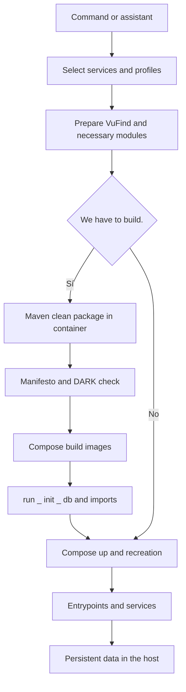
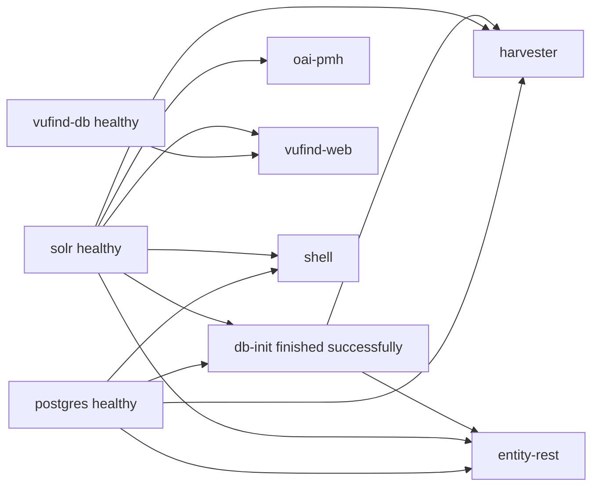

# Complete analysis of the platform Docker script
> Translation note: This machine-assisted English version preserves the source document's structure and technical examples. Commands, paths, identifiers, and hashes are retained literally; consult the Spanish source where translated wording is ambiguous.

This document explains how `Docker/docker.sh` works, which files it reads and modifies, how it prepares source code and builds images, how it starts services, and where each type of data persists. It is intended for operators and for anyone who needs to review or change the script with a clear understanding of its effects.

The analysis reconstructs behavior from the script and its local dependencies. It distinguishes what the code actually does from the intent expressed in its messages and from implementation limitations. The script coordinates operations that affect Git, the filesystem, Docker, databases, and optionally cron or systemd. A command that appears to inspect state may rewrite configuration; a rebuild may update repositories and run imports; changing the project name does not isolate data on disk.

## 1 Scope and version analysed

Date of analysis: **October 3, 2026**, local time of Europe / Madrid. Parent repository: `lareferencia-platform`; observed commit: `f5985297fc92d1b3d2e829e9526cda0fdbd8a9b3`; description Git: `5.0.0-rc3-dirty`. The suffix indicates local changes and not a reproducible release. The nested modules are independent repositories and may have different revisions to the parent repository.

Identity of the two main files when analyzing:

|File|Lines|SHA256|
| --- | ---: | --- |
| `Docker/docker.sh` |2309| `09f08a55de45593427b3046925a6726e0f29b3055d92a8b8caba483faa2103ee` |
| `docker-compose.yml` |412| `ef0846e50fa2d22dbcc853dae7a03811b06de889d94278a2de21d52eda9ed534` |

The subject is the **standard script**, with `docker-compose.yml`, `Docker/apps/Dockerfile` and `Docker/apps/entrypoint.sh`. `docker-dev.sh`, `docker-compose.dev.yml`, `Dockerfile.dev` and `entrypoint-dev.sh` are another implementation. Its changes, variables and paths should not be attributed to the standard script. The dev environment is mentioned only when a normal operation may also affect its files or containers.

The examples assume that they are executed from the root of the repository. The script resolves its own paths and can be invoked from another folder. Compose commands must include the correct Compose file and environment file.

No Full builds, migrations, resets, user changes or backups of the standard environment were run to produce the document. Readings, syntax verifications, Compose inspections and scoped tests were performed with simulated functions or ephemeral containers. The validation limitations are detailed at the end.

## 2 Reading index

1. [Scope and version](#1-scope-and-version-analysed).
2. [Operation model](#3-operation-model).
3. [Files and dependencies](#4-participating-files).
4. [Invocation and commands](#5-invocation-and-commands).
5. [Configuration and precedence](#6-script-configuration-and-precedence).
6. [Modules and services](#7-service-modules-and-profiles).
7. [Names, network and ports](#8-network-names-and-ports).
8. [Repositories and source code](#9-preparing-and-updating-the-code).
9. [Compilation and manifests of build](#10-maven-and-frontend-compilation).
10. [Images and boot Java](#11-building-java-images).
11. [Start and reconstruction](#13-complete-up-flow).
12. [Persistence](#16-full-map-of-persistence).
13. [Solr operation](#17-construction-and-initialization-of-solr).
14. [VuFind Operation](#18-construction-and-initialization-of-vufind).
15. [Interactive Assistant](#20-interactive-assistant).
16. [Reset and backups](#22-exact-scope-of-reset-data).
17. [Findings](#25-implementation-findings-and-limitations).
18. [Procedures, checks and references](#26-operator-procedures).

## 3 Operation model

There are five different layers to be followed separately:

|Layer|Entry|Outcome|Who manages it?|
| --- | --- | --- | --- |
|Workspace Git| `workspace.ini`, URLs, branches and local files|Repositories under the root| `githelper`, called by the script|
|Compilation|parent POM and POM of modules, sources and front|JAR, static and manifest in the host|Maven executed inside Docker|
|Image|Artifacts already compiled and Dockerfiles|Images on the daemon Docker|Compose build and Build|
|Container|Image, environment, configuration and mount|Java, PHP, Solr or database process|Compose and entrypoints|
|Persistent State|Service writes|Directories in `Docker/volume` and cache Maven|Bind mounts and named volume|

A JAR in `target/` it is not automatically the JAR that runs The standard environment service. The Dockerfile copies it in the image. A new image does not automatically replace an existing container. `restart` reboot the same container; `up` can recreate it if it detects changes; `up --build` explicitly requests recreation after compiling and build.

The main flow is:



The detection of the need for build, the units and the scope of `run_init_db` They have particularities. This diagram is not enough to predict the effects; the following sections explain the exact conditions.

## 4 Participating files

### 4.1 Control files

|Repository path|Effective use|
| --- | --- |
| [`Docker/docker.sh`](docker.sh) |CLI, assistant, selection of modules, build, initialization, users, backup and reset|
| [`docker-compose.yml`](../docker-compose.yml) |Services, images, build arguments, environment, dependencies, ports, network, limits and normal mount|
| [`Docker/.env.example`](.env.example) |Copy if missing `.env` |
| `Docker/.env` |Persistent configuration of the Compose script and interpolation; can be created and rewritten automatically|
| [`Docker/profiles/low.env`](profiles/low.env),[`medium.env`](profiles/medium.env),[`high.env`](profiles/high.env),[`custom.env`](profiles/custom.env) |CPU and memory values copied to `.env` when applying a profile|
| [`workspace.ini`](../workspace.ini) |Manifestation of repositories of the workspace; used by githelper and reset|
| [`githelper`](../githelper) |Initialization and updating of modules and parent repository Git|
| [`pom.xml`](../pom.xml) |Full Maven Reactor, Java 17, Spring Boot 3.5.0 and order of modules|
| [`Docker/maven-mirror-alternative.xml`](maven-mirror-alternative.xml) |Settings Maven; replaces Central with Google's mirror when the file exists|
| [`.dockerignore`](../.dockerignore) |Which host files enter the build context|
| [`.gitignore`](../.gitignore) |What local files are considered ignored; it influences cleaning with `git clean -fdx` |

`.env` not run with `source`. The script looks at certain keys by `awk`. Compose receives `.env` by `--env-file`. They are two different and non-equivalent reading mechanisms.

### 4.2 Image and boot files

|path|Function|
| --- | --- |
| [`Docker/apps/Dockerfile`](apps/Dockerfile) |Java image of each application from an already built JAR|
| [`Docker/apps/entrypoint.sh`](apps/entrypoint.sh) |Permission preparation and configuration, command dispatch and Java execution|
| [`Docker/solr/Dockerfile`](solr/Dockerfile) |Image Solr 9.8.0, cores, importers and auxiliary JAR|
| [`Docker/solr/entrypoint.sh`](solr/entrypoint.sh) |Initialization of persistent Solr cores and user boot `solr` |
| [`Docker/solr/cores`](solr/cores) |Cores `biblio` and `oai`including their configurations|
| `Docker/solr/import`, `Docker/solr/jars`, `Docker/solr/vendor` |Assets synchronized from VuFind and used in build|
| [`Docker/vufind/Dockerfile`](vufind/Dockerfile) |PHP and Apache, extensions, Composer and entry of VuFind|
| [`Docker/vufind/entrypoint.sh`](vufind/entrypoint.sh) |PHP units, installation, INI, database creation and Solr waiting|
| [`Docker/vufind/apache-vufind.conf`](vufind/apache-vufind.conf) |Access to `public`, theme resources, public cache and redirection of `/vufind` |
| [`Docker/config-overrides`](config-overrides) |Directories per application mounted as `/docker-overrides` reading only|

### 4.3 Application and generated files

The directories `lareferencia-*` contain independent repository code and configuration. Your `target/`, `config/` and static participate in the build. The script does not deduce its content from `docker-compose.yml`.

|Artefacto|Where it appears|When it is generated|
| --- | --- | --- |
|JAR Java versioned| `<módulo>/target/<módulo>-*.jar` |Maven `package` |
| `docker-build-info.properties` | `target/` of Harvester, Entity REST, Shell and OAI|After Maven|
|Admin Web compiled| `lareferencia-lrharvester-app/admin-static/` |POM of the front React|
|Dashboard compiled| `lareferencia-lrharvester-app/dashboard-static/` |POM of the Angular front|
|Specific profile configuration|Among others, `config/third-party-context.xml` of applications|Plugins Maven of the profiles|
|Runtime de Node and dependencies|Front module directories, including `node/`, `node_modules/` and exits `dist/` |Frontend Maven plugin and npm|
| `Docker/.bin/gum` |Local binary ignored by Git|First use of `gum` by the assistant|
| `Docker/.bin/venv` |Python environment with bcrypt|User creation if bcrypt missing in Python host|
| `/tmp/lareferencia-docker.log` |Log of an assistant operation| `execute_with_progress` |
| `/tmp/lr_users.properties` |Temporary copy of legacy users|User management|
| `.system_backup.sh`, `.cron_backup.log` |Repository root|Backup configuration or execution|
| `<destino>/<YYYYMMDD_HHMM>/` |Outside or within the repository, by choice|Backup generated|

## 5 Invocation and commands

The script uses Bash with `set -euo pipefail`. A failed command can abort; access to an undefined variable can abort; the failure of a part of a pipeline spreads. There are explicit exceptions with `|| true`, conditional catches and temporary deactivation of `errexit`.

When you load the script you calculate `SCRIPT_DIR`, `ROOT_DIR`, `COMPOSE_FILE`, `DATA_DIR`, `VOLUME_DIR`, `ENV_FILE` and `ENV_EXAMPLE`. Also create the root folder `vufind/` If missing, **before choosing the command**. Therefore, even `help` You can create that folder.

The invocation without arguments is equivalent to `help`. **Do not open the wizard automatically.**

|Command|Operation|Observations|
| --- | --- | --- |
| `help`, `-h`, `--help` |Show help|The aid does not list all branches or all options|
| `wizard` |Interactive Assistant|Valid presence of Docker and Composer, prepare `.env`, exports project name|
| `up` |Start services in background|Select modules or services; you can force an initial build|
| `build [servicio…]` |Collect the reactor and build selected images|Do not start services or run explicitly `run_init_db` |
| `start [servicio…]` |Start existing containers|Do not create new or recombinant|
| `stop [servicio…]` |Stops containers|Conserves them; module selection if no services are indicated|
| `restart [servicio…]` |Reboot existing containers|Do not automatically adopt new images or environment|
| `down [v] [opciones…]` |Eliminates containers and network from the project|Activates all optional profiles; `v` adds `--volumes` |
| `pull` |Download images of four services|VuFind DB, PostgreSQL, Elasticsearch and watcher; does not `git pull` |
| `ps` |State|Go through `dc`, who can rewrite `.env` |
| `logs [opciones y servicios…]` |Logs Compose|Allows log options, for example `-f --tail=100 harvester` |
| `health` |Compose State and HTTP requests|It is not a comprehensive check; it ignores HTTP failures to continue|
| `init-db [comando shell…]` |Express initiation|You can stop and remove containers from PostgreSQL, Solr, Shell and db-init|
| `lrshell-interactive [comando…]` |A Reference Shell or TTY command|Reuse Shell in execution or create a temporary container|
| `shell <servicio>` |Bash inside a service|Distance from Spring Shell; the CLI branch has no fallback to `sh` |
| `modules [status [módulo]]` |State set up and, for the whole, services in operation| `core` is always active|
| `modules on <módulo>` |State guard `on` |He doesn't start the service at the time.|
| `modules off <módulo>` |State guard `off` |It doesn't stop him at the time; `core` does not admit `off` |
| `resource-profile <perfil>`, `res <perfil>` |Copies resource values a `.env` |It does not prescribe existing containers|
| `reset-data [--yes]` |Wide data and repository cleaning|Destructive operation, analysed separately|

No CLI branches `dc`, `rebuild`, `frontend-dev`, `watch`, `instance`, `clean` or `vufind` as a first argument. Some of them exist in the dev script or appear in historical messages; they are not standard script commands.

### 5.1 Specific up options

|Option|Real interpretation|
| --- | --- |
| `--build` |Run Java preparation, compilation, global build, initialization and then up with recreation|
| `--no-cache` |Mark a flag; it is only used in the final up when there was build; it is not a correct interface for Compose up|
| `--pull-modules` |If built, request `githelper pull`; without build the flag does not run the pull|
| `--prefix=<texto>` |Write `SERVICE_PREFIX` before continuing; not valid as the assistant|
| `--offset=<texto>` |Write `SERVICES_PORT_OFFSET`; then it is normalized when calculating ports|
| `--module <nombre>` |Add a module to the specific selection of this execution|
| `--vufind`, `--elastic`, `--watch`, `--oai` |Short selection of these modules for implementation|
|Any other argument|It is treated as a service name, even if it starts with `--` |

The selections `--module` and abbreviated **do not write** `DEV_MODULE_*`. If modules are specified, these modules are used instead of the set activated, with the units added by the script. If there are also service names, the service branch has priority and the requested modules do not become services. Unrecognized options are not deliberately resent as up options; they enter the list of services and may produce subsequent errors.

`--module` no value and `modules on/off` without name do not have a complete case validation and can abort by undefined variable.

## 6 Script configuration and precedence

### 6.1 Creation and reading of Docker env

`ensure_env_file` copy `.env.example` a `.env` if it's missing. If the template does not exist, create `.env` empty. The snapshot template includes:

- `LR_BUILD_PROFILE=lareferencia`.
- `SHELL_IDLE=true`.
- States on for Solr, Harvester and VuFind; off for Entity REST, Shell, Elasticsearch and watcher.
- `VUFIND_REPO_URL=https://github.com/LA-Referencia-IOI/vufind` and `VUFIND_REF=v11.0.1`.
- Production and debugging values deactivated for VuFind.
- `BUILD_ON_START=smart`that this implementation does not consume.
- `LR_PORT_GATEWAY=8088`, related to dev and not used by Normal Compose.

The template does not declare `DEV_MODULE_OAI`; the default of the code activates it. `SERVICE_PREFIX` and `SERVICES_PORT_OFFSET` come empty, which is normalized to project `lareferencia` and offset 0.

`get_env_var` looks for the last line whose first field matches the key, supports spaces around the name, cuts spaces in the value and double quotes outside. Use a default if the value is empty. It is not a complete parser of dotenv: it uses `awk -F=`Here. `$2` and can truncate values with more signs `=`. It does not solve expansions, inline comments or complex semantics of quoting as Compose.

`set_env_var` replace lines that match `sed` and a temporary file `.env.tmp`or add a new line. It does not block concurrent scriptures and does not generally escape special characters of the value for a sed replacement. Running several commands at the same time can compete for the same time.

### 6.2 The dc function normalizes the environment

Each call to `dc` does the following in this order:

1. It guarantees that `.env` exist.
2. Calculates and exports all the `LR_PORT_*` from offset; it also keeps them in `.env`.
3. Calculates and exports `SERVICE_PREFIX` and `COMPOSE_PROJECT_NAME`He keeps them in `.env`.
4. Calculates and exports `COMPOSE_PROFILES` according to the modules; `.env`.
5. If there is `SOLR_EXTERNAL_URL`, exports `SOLR_HOST` in the script process.
6. Preference `docker compose`; if it is not available and exists `docker-compose`Use that executable.
7. Run Compose with `-f <raíz>/docker-compose.yml --env-file <raíz>/Docker/.env` and the arguments received.

This also affects `ps`, `logs`, assistant consultations and other apparently reading operations. A resource profile is not automatically applied for having `LR_RESOURCE_PROFILE=medium`: must copy your keys by `res` Or the assistant.

### 6.3 Two profile values may differ

The compilation selects `local profile="${LR_BUILD_PROFILE:-lareferencia}"` from the Bash process environment. No consultation `.env` nor exports its value before Maven. Compose if you use `.env` for interpolar tags and arguments.

So, save `LR_BUILD_PROFILE=ibict` in `.env` does not guarantee that Maven runs `-Pibict`. Without an exported variable, Maven compiles with `-Plareferencia`while Compose can label the images as `:ibict`. The isolated test of this analysis reproduced this divergence.

As long as this implementation exists, for a deliberate build with a profile it is appropriate to ensure that the value exported and `.env` They match. This is an operational recommendation, not an already applied correction:

```bash
LR_BUILD_PROFILE=ibict ./Docker/docker.sh build harvester
```

In addition to the Maven profile, there are Compose profiles, resource profile, `SPRING_PROFILES_ACTIVE` and `VUFIND_ENV`. They're different mechanisms. Changing one does not automatically change the other.

### 6.4 Declared and effective variables

|Variable|Consumer|Effect|
| --- | --- | --- |
| `SERVICE_PREFIX` |Script|Derives the project name; does not change persistent folders|
| `COMPOSE_PROJECT_NAME` |Script and Compose|The script redraws it from the prefix in each `dc` |
| `SERVICES_PORT_OFFSET` |Script|Recalculates and writes the nine ports|
| `LR_PORT_*` |Compose, after script normalization|Interpolation of published ports|
| `DEV_MODULE_*` |Script|Selection States, despite the name `DEV` |
| `COMPOSE_PROFILES` |Script and Compose|Global profile activation; rewritten by `dc` |
| `LR_BUILD_PROFILE` |Maven from the environment; Compose from interpolation|Compilation profile, tags and container variable; possible divergence|
| `LR_RESOURCE_PROFILE` |Assistant and application of presets|Preset label; not enough to change limits|
| `LR_MEM_*`, `LR_CPU_*` |Compose|Service limits that refer to each key|
| `DOCKER_BUILD_CACHE` |Assistant|Decides whether to add `--no-cache` to your rebuild command|
| `BUILD_ON_START` |No consumer found|Historical declaration without effect on current flow|
| `SHELL_IDLE` |Compose and entrypoints Java|Keep Shell on hold when there's no argument|
| `VUFIND_REPO_URL`, `VUFIND_REF` |VuFind preparation|Process environment first, `.env` then default of the code at the end|
| `VUFIND_THEME`, `VUFIND_ENV` and debug keys|Compose and entrypoints PHP|PHP / VuFind execution theme and configuration|
| `SOLR_EXTERNAL_URL` |Module selection and `dc` |Allows local service of collection and exports `SOLR_HOST`; incomplete integration|
| `JAVA_OPTS` |Entrypoint Java|JVM options received by the container; `.env` by itself does not inject any variable into services|
| `APP_RUN_CONFIG_DIR`, `DOCKER_OVERRIDES_DIR` |Entry|Alternative Paths if supplied to the container|
| `M2_DIR` |Entry|It is assigned, but does not participate in a compilation when starting|

The shell environment can participate in the Compose interpolation. The script explicitly forces the ports, project and profiles it exports. It should not be assumed that any key to `.env` comes as a variable to the container: the service must declare it in `environment`, use a `env_file` or receive it by another option.

## 7 Service modules and profiles

### 7.1 Module map

|Module|Status key|Code default|Services collected|Profile added by module _ profiles|
| --- | --- | --- | --- | --- |
| `core` | `DEV_MODULE_CORE` |Always on| `postgres` |None|
| `solr` | `DEV_MODULE_SOLR` |on| `solr`other than external URL|None|
| `harvester` | `DEV_MODULE_HARVESTER` |on| `harvester` |None|
| `entity-rest` | `DEV_MODULE_ENTITY_REST` |off| `entity-rest` |None|
| `shell` | `DEV_MODULE_SHELL` |off| `shell` | `tools` |
| `vufind` | `DEV_MODULE_VUFIND` |on| `vufind-db`, `vufind-web` |None|
| `elastic` | `DEV_MODULE_ELASTIC` |off| `elasticsearch` | `elastic` |
| `watch` | `DEV_MODULE_WATCH` |off| `vufind-scss-watch` | `watch` |
| `oai` | `DEV_MODULE_OAI` |on| `oai-pmh` | `oai` |

Values `1`, `true`, `on` or `yes`, without distinguishing capital letters, they are interpreted as on. Any other value becomes off. `core` Ignore an off configuration and cannot be deactivated by `set_module_state`.

`sync_compose_profiles` also writes names `core`, `harvester`, `entity-rest` and `vufind` in `COMPOSE_PROFILES`. These names **do not correspond to profiles declared for these services in The standard environment Compose**. Services without `profiles` are always available in the Compose model; the script limits its operation to the service lists that pass.

`collect_profiles_for_services` recognizes `shell`, `elasticsearch` and `vufind-scss-watch`; does not recognize `oai-pmh`. `up` rerun this function and replace the initial profile collection. The availability of OAI depends on the overall activation of `oai` and the behavior of Compose when it is explicitly directed to the service. The activation of OAI should not be attributed to this function.

### 7.2 Dependencies added by the script

In the selection of modules of `up`:

- If there is Harvester, Entity REST or Shell, add `core` if it's missing.
- If there is Harvester, Shell or VuFind, it is added `solr` if it's missing.
- The script does not add Solr for Entity REST, OAI or watcher in this resolution, although Compose declares Solr dependencies for some of them.
- Selecting services directly avoids this resolution of modules and lets Compose solve its `depends_on`.

The active module assistant Solr if VuFind or Harvester was chosen. This changes `.env`; automatic resolution of `up`in itself, it only changes the selection of such execution.

### 7.3 Services declared in Compose



The watcher has no declared dependency on VuFind Web or Solr. Elasticsearch is not a dependency either. `depends_on` of the applications that mention the host.

Disable a module means excluding it from certain script selections. It does not automatically remove the Compose dependencies or turn off an existing container. For example, `entity-rest` may cause Solr and db-init to start even if these modules have not been explicitly included.

## 8 Network names and ports

### 8.1 Project name and containers

`export_service_prefix` takes the prefix of `.env`, removes simple and double quotes, removes **a** `_` or `-` and replaces the `_` remaining per `-` to get `COMPOSE_PROJECT_NAME`. With empty prefix fixed project `lareferencia`.

Examples:

|SERVICE _ PREFIX|Result project|Harvester Container|Network|
| --- | --- | --- | --- |
|Empty| `lareferencia` | `lareferencia-harvester` | `lareferencia-network` |
| `laref_` | `laref` | `laref-harvester` | `laref-network` |
| `mi_instancia_` | `mi-instancia` | `mi-instancia-harvester` | `mi-instancia-network` |

Compose uses the project for container names, network name and volume declaration `maven-repo`. Do not concentrate directly `SERVICE_PREFIX` in the `container_name`.

Services have stable aliases (`postgres`, `solr`, `harvester`) within the project network. Applications use these aliases and internal ports, regardless of the host offset.

### 8.2 Calculation of ports

The script removes from the offset all characters other than digits. A text `-100` passes to `100`; `abc100` also passes to `100`. It does not value the final range of ports and a chain with initial zeros may have implications for the arithmetic Bash. It is recommended to introduce clear decimal integers without signs or zeros to the left.

In each `dc`, the manual values of `LR_PORT_*` are discarded and calculated as `base + offset`:

|Service|Key|Host base|Port of container|Published interface|
| --- | --- | ---: | ---: | --- |
|VuFind Web| `LR_PORT_VUFIND_WEB` |8080|80|All interfaces|
|VuFind MariaDB| `LR_PORT_VUFIND_DB` |3307|3306|All interfaces|
|Solr| `LR_PORT_SOLR` |8983|8983|All interfaces|
|PostgreSQL| `LR_PORT_POSTGRES` |5432|5432| `127.0.0.1` |
|Harvester| `LR_PORT_HARVESTER` |8090|8090| `127.0.0.1` |
|Entity REST| `LR_PORT_ENTITY_REST` |8094|8094|All interfaces|
|Elasticsearch HTTP| `LR_PORT_ELASTIC_9200` |9200|9200|All interfaces|
|Elasticsearch transport| `LR_PORT_ELASTIC_9300` |9300|9300|All interfaces|
|OAI PMH| `LR_PORT_OAI` |8096|8092|All interfaces|

OAI serves internally in 8092; 8096 is the published default. The standard environment Compose does not define gateway Nginx or Vite server. Harvester contains the static compiled for `/admin/` and `/dashboard/`.

### 8.3 What isolation the prefix provides

Container and network names are separated. The offset avoids port collisions. **The paths of `Docker/volume` are constant and do not contain the project.** Two projects from the same checkout mount the same data from PostgreSQL, MariaDB, Solr and applications. Even different images per project share tags if they use the same profile.

For two really independent instances you also have to separate the host directories and the configuration. A copy of the repository with its own `Docker/volume`, or a deliberate review of the Mounts, is different from changing only the prefix. The cache. `lr-maven-cache` It is also shared between projects and checkouts using the same daemon.

## 9 Preparing and updating the code

### 9.1 Java modules checked

`ensure_java_parent_modules_ready` a `pom.xml` in these ten directories:

```text
lareferencia-oclc-harvester
lareferencia-core-lib
lareferencia-entity-lib
lareferencia-indexing-filters-lib
lareferencia-shell-entity-plugin
lareferencia-shell
lareferencia-dark-lib
lareferencia-lrharvester-app
lareferencia-entity-rest
lareferencia-oai-pmh
```

If any calls are missing `githelper init`, directly running the file if you have permission or by `python3` otherwise. It does not pass a selection of modules: githelper can initialize **all** the manifest, including fronts, contributions and the cores repository.

If you asked to update, call `githelper pull`but adds `|| true`: a pull failure does not necessarily prevent the compilation. Then check the ten POM. This check does not value the integrity of the checkout, its local changes, or that the review is desired.

The POMs of Admin Web and Dashboard participate in the parent reactor, but **are not on the list of ten checks**. If only one front and the ten POM exist are missing, init is not invoked and Maven can fail to load the reactor.

### 9.2 Workspace and githelper

On the snapshot, `workspace.ini` contains 15 sections `module.*`, with branches `main`: Solr, OCLC Harvester, Core, Entity, RCAAP and IBICT contributions, filters, Shell Entity, Shell, Harvester, Admin Web, Entity REST, Repository Dashboard, OAI and DARK. Undeclared `path` The module name is used as a subdirectory.

`githelper init` clone missing repository. For branches use `git clone --branch`; for existing modules in Git normally keeps the checkout. An existing path that is not a repository is considered a mistake. Githelper has support for fixed tags and commits, but the observed manifest uses branches.

`githelper pull` first updates the parent repository with `git pull`, determines its branch and then gets references, selects branches of the modules and updates them. It doesn't amount to downloading only Maven dependencies. The command can change father and module code. If the parent repository is not on a branch or the pull fails, it may interrupt its own execution; the wrapper Docker ignores his failure code.

It's not a conventional Git submodule operation. Checkouts are nested repositories described by `workspace.ini` and generally ignored by the parent Git repository.

### 9.3 VuFind download

`ensure_vufind_checkout` gives the checkout in preparation if it exists `vufind/composer.json`. It does not verify version, hash, remote or Git status.

When missing, you get URL and ref from the process variable if it exists, from `.env` second and last default. The default of the code points to `https://github.com/vufind-org/vufind`; one `.env` just copied points to the fork `https://github.com/LA-Referencia-IOI/vufind`. In both cases the default ref is `v11.0.1`.

The standard environment order is:

```bash
git clone --quiet --branch "$repo_ref" --single-branch "$repo_url" "$ROOT_DIR/vufind"
```

It's not a shallow clone. The stdout and stderr are hidden. Yeah. `vufind/` contains files but does not `composer.json`Git can reject non-empty destiny. This normal implementation does not automatically preserve or integrate this content as the correction of the dev script.

After a successful clone synchronizes assets Solr. Yeah. `composer.json` already existed immediately and does not synchronize those assets in this function.

All `vufind-web`, `vufind-db` and `vufind-scss-watch` are considered services that require checkout. Even run `stop vufind-db` go through its preparation before delegating to Compose.

The filter that announces to omit VuFind if the folder does not exist is practically neutralized by the `mkdir vufind` initial. Its condition is the existence of a directory, not the existence of `composer.json`.

## 10 Maven and frontend compilation

### 10.1 Maven execution

The compilation does not use Maven or Java installed in the host. `compile_java_modules` creates or reuses the global volume `lr-maven-cache` and runs a temporary container:

```bash
docker run --rm \
  -v lr-maven-cache:/root/.m2 \
  -v "$ROOT_DIR:/workspace" \
  -w /workspace \
  maven:3.9.11-eclipse-temurin-17 \
  mvn clean package \
  -s /workspace/Docker/maven-mirror-alternative.xml \
  -DskipTests \
  -Dspring-boot.repackage.executable=false \
  -P<perfil-del-entorno-Bash>
```

The argument `-s` only is added if the setings file exists. The script forms the command as a chain and runs it by `eval`; profile paths and values should be carefully treated when changing this mechanism.

`clean` removes target outputs from the reactor and `package` reward and packaging. It's not `install`: This flow does not expressly install the reactor artifacts in the local Maven repository. The units and plugins downloaded are preserved in `.m2` of the designated volume.

Do not run tests with `-DskipTests`. No application check or endpoints battery is run after build. The success of Maven, packaging and Compose does not demonstrate a complete business operation.

The command requests `spring-boot.repackage.executable=false`but the four application POM are explicitly configured `<executable>true</executable>` in the Spring Boot plugin. It should not be assumed that this argument removes the launch script from the artifact. The JAR Shell available during the analysis had that prefix and `jarmode=tools` He rejected it; the Dockerfile has the fallback for that case. The device of each build should be checked if it is intended to change to the launch by layer.

The repository is designed for reading and writing. Maven can modify generated configuration sources, front folders and host artifacts. If the host user is not root, an additional Alpine container does `chown` and `chmod ugo+rwX` on `*/target`. It doesn't fix all the files created in the same way. `node_modules`, `node`, static or configuration.

### 10.2 Effective Reactor

The parent POM states, in this order of listing:

1. OCLC Harvester.
2. Core Library.
3. Entity Library.
4. Indexing Filters Library.
5. Shell Entity Plugin.
6. Shell.
7. DARK Library.
8. Admin Web React.
9. Repository Dashboard Angular.
10. Harvester App.
11. Entity REST.
12. OAI PMH.

Maven can adjust the order by unit. RCAAP and IBIT contributions are not active block modules `<modules>` of the parent repository; they appear there. Their possible inclusion or use depends on the POM and application profiles, not that the script adds those modules to the Maven command.

The effective POM declares Java 17 and Spring Boot 3.5.0. A historical comment mentions Java 21, but the compilation values and images use 17.

### 10.3 Admin Web

The POM of `lareferencia-lrharvester-admin-web` use `frontend-maven-plugin` 1.15.1, Node `v22.14.0` and npm `10.9.2`. Run Node / npm installation, `npm ci --no-audit --no-fund` and `npm run build`. An initialization step eliminates `node_modules`. In the empty and repopulated package phase `lareferencia-lrharvester-app/admin-static` from `dist`.

Vite does not run as a service in the standard environment. The Harvester image copies the result and the application serves it. Changing a React file from the host does not change The standard environment interface until you compile and rebuild / recreate your image.

### 10.4 Dashboard

The POM of `lareferencia-repository-dashboard` use the same plugin front with Node `v18.20.8` and npm `10.8.2`, working inside of `angular/`. Run `npm ci` and `npm run build`and in package replaces `lareferencia-lrharvester-app/dashboard-static` by the exit `angular/dist/frontend`.

The standard script does not define a separate dashboard container. It is part of the resources that Harvester serves from its image. The resource preset may contain historical references to Dashboard that do not limit a non-existent service in this Compose.

### 10.5 Settings altered by Maven profiles

Harvester and Shell's POM include profiles `lite`, `lareferencia`, `rcaap` e `ibict`. Among its operations are copies of specific XML contexts to `config/third-party-context.xml`in addition to copies of JAR to auxiliary names in the module. This means that build can modify `config/` Checkout.

The Dockerfile copies the configuration after these operations. But the defaults copied to a new image can still coexist with an older persistent configuration in `/config`, subject to the date update logic of the entry.

### 10.6 Identity of the build and DARK check

`write_java_build_manifests` look for the first versioned JAR you find, excluding `*-sources.jar` and `*-javadoc.jar`For Harvester, Entity REST, Shell and OAI. If one's missing, it's a mistake. Write:

```properties
git.commit=<HEAD-del-repositorio-padre>
application.sha256=<SHA256-del-JAR>
```

Do not record the individual SHAs of all nested repositories or if they contain local changes. Nor does it record the Maven cash profile, front versions or a timestamp of the build. The parent commit is not enough to reproduce the binary if its modules are in different reviews.

For Harvester seeks the JAR DARK compiled and the JAR DARK included within `BOOT-INF/lib` from Harvester. Extract the included content and compare your SHA256. If they differ, it returns an error by stale library. When it matches add `dark-lib.sha256` to Harvester's manifesto.

There are two permissive exits: if there is no `unzip`, warns and returns success; if the JAR DARK is missing or does not find the input included, print a message that starts with `Error` but **returns 0**. This verification is therefore not strict in all cases. It's strict when you get both hashes and they're different.

Maven `clean` reduces the possibility of several target-versioned JAR, but the selector does not guarantee uniqueness. The Dockerfile uses a different wildcard that may also include JAR from sources or documentation if present. It is a condition that should be reviewed when changing the packaging.

## 11 Building Java images

### 11.1 The image build does not compile source code

`Docker/apps/Dockerfile` uses two stages based on `eclipse-temurin:17-jre`. The first is called builder, but its function is to extract a pre-compiled JAR, not to run Maven.

Receive `ARG APP_MODULE`, copy `<módulo>/target/<módulo>-*.jar` how `/tmp/app.jar` and requires `<módulo>/target/docker-build-info.properties`. Then try:

```bash
java -Djarmode=tools -jar /tmp/app.jar \
  extract --layers --launcher --destination /build/extracted/
```

If it fails, believe `/build/extracted/application/app.jar` with the full JAR. Copy the build manifest inside `extracted/`.

The runtime stage installs Bash, sed, curl and gosu, creates user and group `lareferencia`, `/workspace`, copy **all** `extracted/` a `/workspace/<módulo>/`, copy configuration and external resources and change the property of `/workspace` to that user. Not declared `USER lareferencia`: begins with the initial privileges of the container and the entry is low to application user when running Java.

The `COPY` with patterns `confi[g]`, `admin-stati[c]`, `dashboard-stati[c]` and `static_e[n]` They look for configuration directories and static. There is no JAR mount of the host in The standard environment runtime. The wildcard does not constitute a check that these resources are complete; it is necessary to check what sources exist and how BuildKit responds when a pattern does not match.

Compose passes `LR_BUILD_PROFILE` as a build argument, but this Dockerfile does not declare or use that ARG. The profile should have already been materialized in the JAR and host resources. Using it in the image tag does not change the binary by itself.

### 11.2 Standard Java images

|Service|APP _ MODULE|Image tag|
| --- | --- | --- |
|Harvester| `lareferencia-lrharvester-app` | `lareferencia/harvester:<perfil>` |
|Entity REST| `lareferencia-entity-rest` | `lareferencia/entity-rest:<perfil>` |
|OAI| `lareferencia-oai-pmh` | `lareferencia/oai-pmh:<perfil>` |
|Shell| `lareferencia-shell` | `lareferencia/shell:<perfil>` |
|db-init| `lareferencia-shell` | `lareferencia/db-init:<perfil>` |

Shell and db-init pack the same module with separate tags. Compose also declares `APP_JAR` with names `5.0.0-rc.jar`but The standard environment entry does not read that variable to locate the binary. The launch is decided according to the file structure copied to the image.

### 11.3 Caches and build context

`.dockerignore` excludes `.git`, `Docker/data`, `Docker/volume`, `vufind` and several target subdirectories. It does not exclude the required JAR or the manifests. Some model patterns have historical names; it should not be assumed that they exclude all current target trees.

The VuFind code is excluded from the context because the PHP container receives it by bind mount. The execution data are excluded to avoid including bases and indexes in images. The assets `Docker/solr/*` do participate in the construction Solr.

A normal compilation can simultaneously consume host target space, daemon cache, context sent to BuildKit, image layers and build cache. `--no-cache` it does not mean deleting any of these places, nor does it amount to getting a new base with `--pull`.

## 12 Entry and configuration of Java applications

### 12.1 Command Dispatch

Before reading `APP_MODULE`, the entrypoint examines the first argument. If it exists as a system command and is not `script`, `help` or `version`, run it directly by `exec`.

For example, `bash`, `sh` or `/usr/local/bin/lr-app-entrypoint.sh` can be run as system commands. This prevents Java preparation on that first level. The arguments that are not system commands are saved as `APP_ARGS` for implementation. The three excluded names pass to Java even if there was a homonymous executable.

`run_init_db` use this mechanism by passing the entry as an explicit command to a Shell container: the first level makes exec of the same file; the second prepares the application with `script ...` or `database_migrate`.

### 12.2 Permission setup

The entrypoint creates `APP_RUN_CONFIG_DIR`, `DATA_DIR` or `/data`and `LOG_DIR` or `/var/log/harvester`. Run `chown -R lareferencia:lareferencia` on those paths. You can also change TTY property if stdin is a terminal.

When there are bind mounts these changes affect host files. The script does not set a numerical UID / GID of the application in the Dockerfile, nor does it match the host user. In Linux, persistent directories can appear with a different owner than the user who operates the checkout.

One `chown -R` over a large store can take time at each start. The cleaning attempts to open permissions via Alpine because PostgreSQL and other processes write with their own identities.

### 12.3 Four separate configuration locations

For Harvester, Entity REST and OAI:

1. **Config by default in the image:** `/workspace/<módulo>/config`, copied from the checkout during build.
2. **Config persistent:** `/config`, from `Docker/volume/lareferencia/<aplicación>/config`.
3. **Host overrides:** `/docker-overrides/<módulo>`, from `Docker/config-overrides`, read only for the container.
4. **Effective process config:** `/tmp/lr-config/<módulo>`, rebuilt in the filesystem of the container.

Shell and db-init don't have `/config` persistent declared. Use image defaults and overrides to create the runtime in `/tmp`.

### 12.4 Order of copies and priority

The effective order is:

1. If it exists `EXTERNAL_CONFIG_DIR`, create the directory and adjust permissions.
2. Copia defaults with `cp -ru` to that external configuration. **The condition is the date of modification**, not only absence. A newer default can replace an older persistent file.
3. Overroot copy of the module with `cp -a` to the persistent directory. Coincident files are replaced.
4. Use that external directory as `APP_CONFIG_DIR` and corrects property recursively.
5. If it's Shell idle without arguments, it stays in `tail -f /dev/null` And he doesn't follow Java.
6. For Java run erases and recreates the runtime `/tmp/lr-config/<módulo>`.
7. Copy the chosen base configuration there.
8. Add JVM properties from `SPRING_PROFILES_ACTIVE` and `ACTIONS_BEANS_FILENAME`if they exist.
9. Copy the overrides from the runtime module again.
10. If there is `99-docker.properties` on that run and there is the directory of overrides, also copy it to `application.properties.d/99-docker.properties`, interpret your keys as `-Dclave=valor` and replaces a dynamic, homonymous property already added.
11. Eliminates the `99-docker.properties` of the root of the runtime; `application.properties.d`.
12. Launch Java with `JAVA_OPTS`, properties calculated and `-Dapp.config.dir=<runtime>`.

There is no general semantic mix of XML, JSON or property files. `cp` It replaces entire files. If a file was removed from the override or a new image, it is not automatically deleted from the `/config` persistent. The standard environment entry point also does not perform the specific cleaning of legal authentication files that makes the entry dev revised.

`99-docker.properties` has explicit priority as system ownership over the two dynamic variables that transform the entry. Spring command line options and other application mechanisms should be evaluated separately; this claim cannot be extended to all possible properties and drivers.

### 12.5 Loading properties in Java code

In Core, `ConfigPathResolver` Read `app.config.dir` system and its default is `config`. `PropertiesDirectoryListener` the `*.properties` of `application.properties.d` sorted by name.

However, use `addLast` for each source. **Alphabetical loading order does not mean that the last overwrite file to the above**: the previous sources may have higher priority in Spring. The conversion of `99-docker.properties` to properties `-D` is the mechanism that avoids relying exclusively on that order.

OAI also has its own XOAI configuration, descriptive files and crosswalks in `config`. It is necessary to follow their relative paths and specific loaders if the directories are altered; have a `/config` mounted does not in itself demonstrate that any XOAI file is resolved from there.

### 12.6 Java launch

After `cd /workspace/<módulo>`:

- If it exists `application/app.jar`, run `gosu lareferencia java ... -jar application/app.jar <argumentos>`.
- In another case select the modern name `org.springframework.boot.loader.launch.JarLauncher`, test it with `java -cp . ... --help` And if it fails, choose `org.springframework.boot.loader.JarLauncher`.
- Run the launcher chosen as user `lareferencia`.

The launcher test uses `--help` about a class that can start the application, not a passive consultation guaranteed. In addition, the layout generated by `extract --layers` must be compatible with the directory and class of the launch. The isolated review and test of this branch are collected among the findings.

## 13 Complete `up` flow

### 13.1 Selection and setup

`up` It analyzes options, calculates modules or services, resolves some of the script's dependencies and converts modules into unduplicated lists. VuFind Filter, recalculates auxiliary profiles and prepares VuFind checkout when there is a service that requires it.

`ensure_m2_cache_dir` is called in several flows, but is a no-op: do not believe `Docker/data/m2` or mount that folder. The active cache is the named volume used by Maven.

### 13.2 Image detection

If not requested `--build`, `are_images_built` travel services from this list:

```text
harvester entity-rest shell solr vufind-web vufind-scss-watch oai-pmh
```

For each consultation `dc images -q <servicio>`. If one does not return ID, consider that images are missing. He also returns false if he failed to check any service.

This is not a universal check of tags with `docker image inspect`; uses the Compose view and can depend on already created containers. Excludes PostgreSQL, MariaDB, Elasticsearch and db-init. That's why. `up postgres` you can activate the global build even if PostgreSQL has an image available: there was no verifiable service.

When you decide first boot or missing image, force both `build_flag=true` how `pull_modules_flag=true`. This can run Git updates even if the operator only ordered `up`.

### 13.3 Build path

If there is build:

1. Check Java modules and, if appropriate, do init / pull using githelper.
2. If the selection contains Solr, prepare the context of Solr assets.
3. Run `run_global_build`, which compiles the entire reactor and builds images globally with `dc ... build --no-cache`.
4. Run `run_init_db`which prepares bases and imports and can remove previous infrastructure containers.
5. Prepare the final up with `-d --remove-orphans --force-recreate --build`.
6. If the flag was not-cache marked, add `--no-cache` the final up.
7. Invoke Compose with additional profiles and the chosen list of services.

`run_global_build` does not receive the list of services selected to restrict the build. Force profile tools and add elastic / watch if on; `dc` It also exports global profiles. The without profile services are available for the Compose build, including Entity REST even if the script module is off. The boot selection and the global build selection are not identical.

As the global build already built images and the final up includes `--build`, there's a second request for build. That second can take advantage of cache if there are no changes; the first global build always asked no-cache.

### 13.4 Path without a build

If image detection passes and no build was requested, do not run Maven, githelper or `run_init_db`. Run `up -d --remove-orphans <servicios>`.

Compose can create or recreate containers for configuration changes and can start dependencies. If Harvester or Entity REST require db-init, that dependence still has its `command: database_migrate`, even if the wrapper didn't call `run_init_db`.

Java and static are not rewarded for having changed sources. Containers use available images according to Compose policy.

### 13.5 Example of first startup with defaults

With the template and defaults are collected PostgreSQL, Solr, Harvester, VuFind DB, VuFind Web and OAI. Harvester adds db-init dependence by Compose. The operation may:

- Create `.env` and normalize keys.
- Download VuFind if missing.
- Initiate workspace modules if the tested POM is missing.
- To pull the parent repository and modules if initial detection forces build.
- Java, React and Angular.
- Download base images, Maven plugins, Java, Node and npm dependencies.
- Build images, download assets Solr and create / configure infrastructure.
- Run migrations and imports of Shell script.
- Create bind mount directories, change permissions and sow settings.
- Install Composer in the first start of VuFind and create your database.

You may require access to GitHub, Docker records, Maven repositories, Node / npm and Composer. There is no integral offline mode implemented by the wrapper.

## 14 Build reconstruction and stop

### 14.1 Operational differences

|Action|Maven compound|Build images|Update Git|Run run _ init _ db|Adopts new image|
| --- | --- | --- | --- | --- | --- |
| `build [servicios]` |The entire reactor|Services indicated or modules on|Only init if modules are missing; do not press requested|No.|Do not change existing containers|
| `up` with detected images|No.|Not explicitly|No.|No.|Compose can recreate according to your changes / policies|
| `up` with failed detection|The entire reactor|Global build without cache and possible final build|Request|Yes|Request recreation|
| `up --build` |The entire reactor|Global build without cache and possible final build|Only if `--pull-modules` or missing modules for init|Yes|Request recreation|
| `restart` |No.|No.|No.|No.|Store the container and its image|
| `start` |No.|No.|No.|No.|Start the existing container|
| `stop` |No.|No.|No.|No.|Store container and data|
| `down` |No.|No.|No.|No.|Eliminates containers and network from the project|

`build harvester` It's not just Harvester. It compiles the complete Maven reactor, generates the four manifests and builds the image indicated. He doesn't call `ensure_solr_build_context` in this branch, unlike the road `up --build` with selected Solr.

`build` without arguments calculates services from modules on without the resolution of units of `up`. db-init is not a module and does not appear in that collection. A suitable db-init image may be left to be built if this road is used in a new installation.

### 14.2 What keeps down

`down` collect all the profiles defined by modules to cover tools, elastic, watch and oai, and run `down --remove-orphans`. If the first argument is `v`, add `--volumes`; also reproduces subsequent arguments.

Bind mounts of the host are not deleted by doing down, with or without `--volumes`. The images are also not deleted by default. The volumes named Compose can be deleted with `--volumes`; the global cache `lr-maven-cache` was created outside that declaration and is not automatically deleted.

### 14.3 Orphan containers and disabled modules

`--remove-orphans` it eliminates containers of services that no longer exist in the effective Compose model. It does not necessarily mean that it removes all the containers corresponding to off modules, because several of these services are still defined in the file without profiles.

`stop` without arguments only consider modules currently on. You can leave services that you started before and are now off. `down`with its broad profiles, it is the path of the wrapper that tries to dismount the entire project.

Changing project name leaves the resources of the previous name outside the usual commands of the new project. The wizard tries to do down before changing prefix or offset if he detects running services.

## 15 Database and Shell initialization

### 15.1 Two initialization paths

Service `db-init` uses the Shell module, depends on PostgreSQL and Solr healthy, runs `database_migrate` and does not restart (`restart: "no"`). Harvester and Entity REST are waiting `service_completed_successfully`.

The function `run_init_db` It's another way. If it does not receive arguments and exists `Docker/config-overrides/lareferencia-shell/db_init_script.txt`, choose:

```text
script /tmp/lr-config/lareferencia-shell/db_init_script.txt
```

The observed file contains:

```text
database_migrate
import-validator --filename /tmp/lr-config/lareferencia-shell/validator.json
import-transformer --filename /tmp/lr-config/lareferencia-shell/transformer.json
```

If the file does not exist choose `database_migrate`. If arguments are passed to the command `init-db`, completely replace that default.

So, **init-db can migrate and import rules**, not just create tables. The idempotency and treatment of duplicates of these imports belong to Shell's commands; the wrapper does not implement a prior validation of that content.

### 15.2 Effects of `run_init_db`

1. Run `dc --profile tools rm -f -s -v postgres solr shell db-init`, ignoring mistakes.
2. This can stop and remove existing PostgreSQL and Solr containers; the bind-mounted data remains in the host.
3. PostgreSQL and Solr start with `up -d`.
4. Run temporary Shell with `run --rm -T --no-deps`, passing the chosen entry and command.
5. Evaluates the result and prints success or failure, within the limits of `set -e`.

There is no `--wait` explicit between the base up and the `run --no-deps`. The second does not use Shell's dependencies to expect readiness. Reattempts that may occur within JDBC or other libraries do not amount to a wait coordinated by the wrapper.

If applications are already running, remove your bases / Solr can interrupt connections. The wrapper does not stop Harvester or Entity REST before or implement a maintenance transactional window.

The CLI branch `init-db` calls before `ensure_shell_service_running`which begins the same bases; `run_init_db` then remove them and create them again. There is redundant work and interruption effects that the command name does not express.

After `run_init_db` in a rebuild, the final up can also run the `db-init` of Compose to satisfy Harvester / Entity REST. Migrations can be repeated as a check without new developments, while file imports only occur on the Shell script path.

### 15.3 Interactive Shell and Shell container

`SHELL_IDLE=true` maintains Shell service in `tail -f /dev/null` when there are no arguments. It doesn't run Spring Shell automatically. The interactive CLI:

1. Check POM modules; does not compile the JAR in this branch.
2. Start PostgreSQL and Solr.
3. If Shell service is in operation, it does `dc exec -e SHELL_IDLE=false shell /usr/local/bin/lr-app-entrypoint.sh ...`.
4. If it doesn't exist, it does `dc run --rm -e SHELL_IDLE=false shell ...`.

The non-interactive variant exists as an internal function and adds `-T`; has no CLI branch of its own in the observed parser. `shell <servicio>` Bash opens and it's another operation.

Shell and db-init do not mount the root of the repository. The override property `store.basepath=/workspace/Docker/data/shared/store` **does not `Docker/data/shared/store` from host**. If used, write in the internal filesystem of the container or you can fail by permissions. That path is not prepared or persisted by normal service volumes. Nor does it automatically share the store Harvester `/data`.

## 16 Full map of persistence

### 16.1 How to interpret paths

A bind mount associates a host path to a container path. The word `volume` in `Docker/volume` it's just a folder name: it doesn't convert it to Docker's named volume. By deleting a container, the bind mounts keep the data in those folders.

A named volume resides where the daemon Docker manages its storage. At Docker Desktop is usually inside your virtual machine; you don't have to invent a path of macOS for it. `docker volume inspect` allows you to see your metadata and, depending on the environment, mount point.

### 16.2 Standard bind mounts

All the following host paths are related to the root of the repository, resolved from The standard environment Compose file.

|Service|Path of the host|Path of container|Content and purpose|
| --- | --- | --- | --- |
|Harvester| `Docker/volume/lareferencia/lrharvester-app/config` | `/config` |Persistent config, sown defaults and copied overrides|
|Harvester| `Docker/volume/lareferencia/lrharvester-app/data` | `/data` |Metadata store, snapshots, catalogues, validation and time according to properties|
|Harvester| `Docker/volume/lareferencia/lrharvester-app/log` | `/var/log/harvester` |Logs to file if the effective login produces them|
|Entity REST| `Docker/volume/lareferencia/entity-rest/config` | `/config` |Config persistent|
|Entity REST| `Docker/volume/lareferencia/entity-rest/data` | `/data` |Data that the application resolves to that path|
|Entity REST| `Docker/volume/lareferencia/entity-rest/log` | `/var/log/entity-rest` |Logs heading for that path|
|OAI| `Docker/volume/lareferencia/oai-pmh/config` | `/config` |Persistent config and sown crosswalks|
|OAI| `Docker/volume/lareferencia/oai-pmh/data` | `/data` |Data that OAI writes there; its existence does not imply an additional Harvester store|
|OAI| `Docker/volume/lareferencia/oai-pmh/log` | `/var/log/oai-pmh` |Logs heading for that path|
|PostgreSQL| `Docker/volume/lareferencia/postgres/data` | `/var/lib/postgresql/data` |Physical cluster; PGDATA adds subdirectory `pgdata` |
|Solr| `Docker/volume/solr/data` | `/var/solr/data` |Effective cores, indexes, jars and initialization marker|
|Solr| `Docker/volume/solr/log` | `/var/solr/logs` |Log Solr|
|Solr| `Docker/volume/solr/cache` | `/var/solr/cache` |File Cache|
|Solr| `Docker/solr/cores` | `/opt/lr-solr-cores:ro` |Host templates; not persistent index|
|VuFind Web| `vufind` | `/usr/local/vufind` |Full editable code of the checkout and local files not hidden by subassemblies|
|VuFind Web| `Docker/volume/vufind/config` | `/usr/local/vufind/local/docker/config` |INI of VuFind and local installation|
|VuFind Web| `Docker/volume/vufind/cache` | `/usr/local/vufind/local/docker/cache` |cache CLI and public|
|VuFind Web| `Docker/volume/vufind/log` | `/usr/local/vufind/local/docker/logs` |VuFind Logs using that path|
|VuFind Web| `Docker/volume/vufind/data/harvest` | `/usr/local/vufind/local/docker/harvest` |Harvesting VuFind Departures|
|VuFind Web| `Docker/volume/vufind/data/import` | `/usr/local/vufind/local/docker/import` |Import settings and files|
|VuFind Web| `Docker/volume/vufind/data/vendor` | `/usr/local/vufind/vendor` |Composer dependencies; subassembly that hides the sell of the checkout|
|VuFind DB| `Docker/volume/vufind/data/db` | `/var/lib/mysql` |MariaDB physical base|
|Watcher| `vufind` | `/usr/local/vufind` |Code that observes and modifies the SCSS process|
|Watcher| `Docker/volume/vufind/data/node_modules` | `/usr/local/vufind/node_modules` |Watcher Npm Dependencies|
|Watcher| `Docker/volume/vufind/data/themes-node_modules` | `/usr/local/vufind/themes/bootstrap5/node_modules` |Dependencies of the topic|
|Elasticsearch| `Docker/volume/elasticsearch/data` | `/usr/share/elasticsearch/data` |Elasticsearch Indices|
|Elasticsearch| `Docker/volume/elasticsearch/log` | `/usr/share/elasticsearch/logs` |Logs Elasticsearch|
|All Java applications| `Docker/config-overrides` | `/docker-overrides:ro` |Overrides per module; container reading and host editing|

A file in the host under a subdirectory that is covered by a subassembly may not be the one that sees the application. For example, the VuFind container sees `Docker/volume/vufind/data/vendor`not necessarily `vufind/vendor` of the host.

### 16.3 Exact Harvester store

The Docker Harvester configuration states:

```properties
store.basepath=/data
metadata.store.fs.basepath=/data/metadata-store
downloaded.files.path=/data/tmp
```

The current class `MetadataStoreFSImpl` injection **`store.basepath`**, no `metadata.store.fs.basepath`. Your default effective path Docker is `/data`. Use `PathUtils` to separate networks, normalize the acronym in capital letters and place the XML gzip as follows:

```text
/data/
├── BR/
│   ├── metadata/
│   │   └── A/B/C/<hash>.xml.gz
│   └── snapshots/
│       └── snapshot_<id>/
│           ├── catalog/catalog.db
│           └── validation/validation.db
└── tmp/
```

`A/B/C` are the first three characters of the hash, passed to capital letters for directories. File name keeps hash and suffix `.xml.gz`. Current catalog and validation managers use SQLite with files `catalog.db` and `validation.db`. Auxiliary files may appear `-wal` and `-shm` when the bases are open at WAL. Copy only the `.db` while active scriptures do not guarantee to capture the entire pending state. These files are inside the same bind mount `/data`; are not PostgreSQL or Docker separate volumes.

In The standard environment host, `/data/BR/metadata/...` is equivalent to:

```text
Docker/volume/lareferencia/lrharvester-app/data/BR/metadata/...
```

`/data/tmp` equivalent to `Docker/volume/lareferencia/lrharvester-app/data/tmp`. Property `metadata.store.fs.basepath` present in the override should not be used to deduce that this implementation keeps XML in `/data/metadata-store`.

PostgreSQL retains relational entities, network configuration, snapshots and other application records. Solr retains OAI search and exposure rates. These data are not interchangeable with the store XML. Recover Alone `/data` does not necessarily restore a coherent platform; it must be related to bases, indices and configuration of the same operation.

### 16.4 Maven cache and declared unused volume

|Name|Creation|Effective mount|Scope|
| --- | --- | --- | --- |
| `lr-maven-cache` | `docker volume create` inside of compile| `/root/.m2` in the Maven container|Global to daemon; used|
| `<proyecto>-maven-repo` |Declared in Compose as `maven-repo` |No Compose service analysed the reference|Declaration without consumer in this snapshot|
| `Docker/data/m2` |Historical folder with `.gitkeep` |None in this flow|It's not the active Maven cache.|

### 16.5 What is transitory

The runtime config `/tmp/lr-config`, the Shell history without a dedicated mount, `/import` de Solr and part of the application filesystem live in the container. When it is recreated, they are lost or regenerated. What the entrypoint copied to `/config` It does persist when that path is mounted.

Docker's stdout / stderr logs are administered by the daemon with its logging driver. They are not automatically files from `Docker/volume`. The script does not declare general rotation of the log driver. Harvester includes an override log4j2 with console and RollingFile, but its effective load depends on the login configuration of the application; mounting the file alone does not prove that that logger is the one used.

## 17 Construction and initialization of Solr

### 17.1 Assets prepared before the build

`sync_solr_assets_from_vufind` completely erases `Docker/solr/import`, `Docker/solr/jars` and `Docker/solr/vendor`, recesses and copies:

- `vufind/import` a `Docker/solr/import`.
- `vufind/solr/vufind/jars` a `Docker/solr/jars`.
- `icu4j-*.jar` and `lucene-analysis-icu-*.jar` of `vufind/solr/vendor/modules/analysis-extras/lib` a `Docker/solr/vendor` if available.

It does not fuse manual changes to these destinations. Even placeholders `.gitkeep` They can be erased by that synchronization. Any customization other than VuFind should be kept elsewhere.

`ensure_solr_build_context` create import / jars and their `.gitkeep`; considers an empty directory without content other than `.gitkeep`. If content is missing and VuFind sources exist, synchronize. In another case, print a build warning with placeholders. This warning does not guarantee that all COPY or Dockerfile components will work.

### 17.2 Solr image

The image part of `solr:9.8.0`, it changes to root, copy of platiates of rods, jars and import and entry. Download with wget three JAR from the **master** branch of `vufind-org/vufind`:

```text
MarcImporter.jar
browse-handler.jar
sqlite-jdbc-3.39.3.0.jar
```

These downloads do not use `VUFIND_REF` not an SHA fixed and can overwrite files with the same name copied from the checkout. A cache-free build again depends on the remote content of the master. This behavior limits reproducibility even if the VuFind checkout is a fixed tag.

The ICU COPY are looking for `Docker/solr/vendor` by patterns. The routine it prepares placeholders does not by itself create all these libraries; if they are not present, it is necessary to check if the build fails per source not found.

### 17.3 Entrypoint and marker

The entrypoint creates data / log / cache, `/var/solr/vendor` and `/import`and establishes defaults:

```text
SOLR_MODULES=analysis-extras
SOLR_SECURITY_MANAGER_ENABLED=false
SOLR_OPTS=<valor-previo> -Ddisable.configEdit=true -Dsolr.config.lib.enabled=true
```

If it's missing `/var/solr/data/.lr_initialized`, copy cores with `cp -ru` from `/opt/lr-solr-cores` And create the marker. If the marker exists, **does not recopy the core template**. So, change `Docker/solr/cores/*/conf` and reboot or reconstruct the image does not automatically update the effective cores of an already initialized volume.

In all the starts copy jars of the image a `/var/solr/data/jars` and import to `/import` with `cp -ru`. Create a link `/var/solr/vendor/modules -> /opt/solr/modules` If missing, change permissions and run Solr as user `solr` with:

```text
/opt/solr/bin/solr start -f -s /var/solr/data -p 8983
```

The Compose mounts `Docker/solr/cores` above the paragraph copied in the image. In runtime the visible temple comes from the host, but remains subject to the marker. The jars / import do not have that same bind mount: they come from the built image.

### 17.4 Core configurations and applying changes

The core `biblio` declares `dataDir` and relative libraries for importers, analysis- extras and jars. The core `oai` has its own data configuration. The indexes are inside the persistent Solr tree; the host templates are not the index.

There is `refresh_solr_for_vufind_assets`, which ensures checkout, synchronizes assets and makes `up -d --force-recreate solr`. No active call from the CLI branches or the tested assistant. In addition, recreate without `--build` does not by itself introduce new assets that the Dockerfile copies to the image.

Updating a schema with existing indices requires an operational decision on compatibility and reindication. The script does not make this migration and does not allow us to conclude that it is enough to delete the marker. Indiscriminate elimination `Docker/volume/solr/data` destroys the indexes.

### 17.5 External solr

`module_services solr` omit service if `SOLR_EXTERNAL_URL` is not empty and `dc` export `SOLR_HOST`. However, The standard environment Compose maintains dependencies `solr` and internal hardcore URLs for Harvester, OAI and VuFind, and Java overrides include internal URLs.

`run_init_db` Solr also expressly starts. There is no overlay to remove these units or transform all URLs into external service. Therefore, the template message that promises that local Solr will not start will not fully describe the current behavior. Before using external Solr, you have to solve the consumer properties and dependencies of each application.

## 18 Construction and initialization of VuFind

### 18.1 What PHP image contains

`Docker/vufind/Dockerfile` part of `php:8.3-apache-bookworm`. Install utilities, MySQL client, Git, development bookstores and PHP extensions `gd`, `intl`, `ldap`, `mbstring`, `mysqli`, `opcache`, `pdo_mysql`, `soap` and `xsl`.

Copia Composer from `composer:2.8.5`, set Apache with rewrite and headers, change DocumentRoot to `/usr/local/vufind/public` and copy the entry. The application code **is not copied in the image**; it is received from `./vufind`.

That's why a PHP container may need the checkout even if its image already exists. Change PHP, extensions, Apache or entry requires rebuilding that image. Changing PHP from the mounted VuFind code can be visible without rebuilding, with the cache and opcache conditions of the runtime.

### 18.2 Defaults and PHP configuration

The entrypoint has development defaults, but Compose passes it production values: `VUFIND_ENV=production`, debug and display errors false / 0, theme bootstrap5 except override. Fixed Compose basepath `/`, site `http://localhost:<puerto>` and local directory `local/docker`.

`configure_php_debug` writes `/usr/local/etc/php/conf.d/zz-vufind-debug.ini` In the container. Includes display errors, startup errors, error _ reporting, html _ errors and `log_errors=On`. This configuration is regenerated when starting; no php.ini host is mounted in this Compose.

Apache allows access to public, `.htaccess`, theme resources and public cache. Redirect `/vufind` and `/vufind/*` to the root of the place. Publish behind a domain or proxy requires to review the URL that the entry resave; the wrapper does not have an integral TLS configuration or reverse normal proxy.

### 18.3 Entrypoint steps

1. Enter `VUFIND_HOME` and creates cache CLI / public, config, harvest and import.
2. It does `chmod -R 777` over cache, ignoring faults.
3. Write PHP debugging settings.
4. If there isn't `vendor/autoload.php`, run `composer install --no-interaction --prefer-dist --no-scripts`.
5. If it's missing `local/docker/.installed`, run `php install.php` non-interactive, with overrides, basepath, Solr port 8983, without backups and without help Apache; then create the marker.
6. If you lack local config.ini, copy it from the default of the checkout.
7. Modify config.ini sections by `set_ini_value`: autoConfigure false, debug, URL, theme, NoALS, Solr and DSN MySQL.
8. Adjust reading and copying permissions / updates NoILS.ini.
9. Ajust URLs Solr in `import.properties` e `import_auth.properties` if they exist.
10. Wait MariaDB with `mysqladmin ping` in a two-second loop.
11. Consultation `information_schema` to know if the basis exists `vufind`.
12. If it does not exist, run the VuFind database installer.
13. Wait Solr with curl on `admin/info/system?wt=json`, also every two seconds.
14. It does `exec apache2-foreground` or another command received.

The loops have no global timeout. A base or Solr that never responds can leave the service waiting indefinitely. Compose does not declare healthcheck for VuFind Web.

### 18.4 Status of installation and subsequent changes

`.installed` low `vufind/local/docker` the root bind mount, outside the config subassemblies. The database, INI and Seller live in their respective subassemblies `Docker/volume`.

The entry rewrites certain INI values in each boot. A manual edition of `Site.url`, `Database.database`, `Index.url`, theme or debug can be overwritten with the values of the environment.

The existence of `vendor/autoload.php` causes Composer install to be omitted. Change `composer.lock` do not automatically trigger installation if that file already exists. Changing VuFind check-out by preserving the seller / config and marker requires an explicit procedure for updating dependencies and, if appropriate, for basic scheme.

Database detection only checks the existence of the schema, not the version of tables. The wrapper does not organize a VuFind version update when the schema already exists.

### 18.5 MariaDB and watcher

MariaDB uses `mariadb:11.4.5`UTF8MB4 and collation `utf8mb4_unicode_ci`. The Fixed Compose root password `root`; the entry VuFind uses user and password `vufind` for application and root to install. The base is created from VuFind, not from a `MARIADB_DATABASE` DB service.

The watcher uses `node:20.18.3-alpine`, works in `/usr/local/vufind`, install npm if missing `node_modules/grunt` and runs `npm run watch:scss`. It does not build the Java application or the React / Angular fronts. Its dependencies and artifacts are distributed between the checkout and bind mounts npm.

## 19 Health resources and monitoring

### 19.1 Default resource limits

|Service|Default memory in Compose|CPU by default|Healthcheck|Re-start policy|
| --- | --- | --- | --- | --- |
|Harvester|2G|1.0|No.|unless-stopped|
|Solr|2G|1.0|curl and status 0|unless-stopped|
|PostgreSQL|512M|0.5|pg _ isready|unless-stopped|
|Entity REST|1G|0.5|No.|unless-stopped|
|OAI|1G|0.5|No.|unless-stopped|
|VuFind Web|512M|0.5|No.|unless-stopped|
|MariaDB|1G fixed|Not defined|healthcheck.sh connect and InnoDB|unless-stopped|
|Elasticsearch|2G|1.0|cluster green or yellow|unless-stopped|
|Shell|Not defined|Not defined|No.|Not declared|
|db-init|Not defined|Not defined|No; task result|No.|
|Watcher|Not defined|Not defined|No.|unless-stopped|

The effective implementation of `deploy.resources` must be checked in the Docker / Compose used by inspection. The script does not verify minimum versions or confirm that the limits are applied.

Fixed solr `-Xms1g -Xmx2g` and Elasticsearch `-Xms1g -Xmx1g`, regardless of the presets. The maximum container memory includes heap and other uses. A Solr limit of 1G with heap up to 2G, or Elasticsearch 1G with heap 1G plus overhead, can cause memory terminations. Presets don't fit those heaps.

Solr declares nofile 65,000. Elasticsearch declares nofile 65536, unlimited memlock, `IPC_LOCK`, discovery single- node and security xpack disabled. The wrapper does not adjust other kernel or host parameters that an installation may require.

### 19.2 Resource presets

Each cell represents memory and CPU:

|Component|low|medium|high|Versioned custom observed|
| --- | --- | --- | --- | --- |
|HARVESTER|1G / 0.5|2G / 1.0|4G / 2.0|1G / 0.5|
|SOLR|1G / 0.5|2G / 1.0|6G / 2.0|1G / 0.5|
|POSTGRES|256M / 0.2|512M / 0.5|1G / 1.0|256M / 0.2|
|ENTITY|512M / 0.2|1G / 0.5|2G / 1.0|512M / 0.2|
|VUFIND|256M / 0.2|512M / 0.5|1G / 1.0|256M / 0.2|
|ELASTIC|1G / 0.5|2G / 1.0|4G / 2.0|1G / 0.5|

`apply_resource_profile` copy all lines `clave=valor` other than empty or initial comments and then save the label `LR_RESOURCE_PROFILE`. It does not clean keys that do not exist in the next preset.

The assistant's custom mode rewrites `Docker/profiles/custom.env`, a versioned file, and `.env`. It includes DASHBOARD component although this service is not in the Compose. Does not include OAI, whose memory / CPU is left in defaults except for the editing of its keys `LR_MEM_OAI` and `LR_CPU_OAI`. MariaDB does not use the VuFind preset keys: its memory is 1G fixed.

Changing the preset does not restart or recede services. An ordinary restart retains the configuration of the created container; a flow that recreates it for new limits must be applied.

### 19.3 Health and Logs

`health` first does `dc ps` and then applications to the root of VuFind, Harvester, Entity REST and OAI. Use `curl -f`, print HTTP code and ignore failure with `|| true`. It does not follow redirections and does not check authentication, catalogue, internal connections, indexes or business results.

A 302, 401 or 404 needs to be interpreted according to the endpoint; it is not a conclusive proof of the state of service. Nor does the word running on the wizard's table mean that the application has completed its boot.

`logs` delegate to Compose. The assistant uses `logs -f`; CLI supports choosing service and limiting output. The log `/tmp/lareferencia-docker.log` contains **operations of the wizard**, not all historical logs of all containers, and is removed at the start of the next monitored operation.

## 20 Interactive Assistant

### 20.1 Requirements and gum

`wizard` It's worth Docker and some variant of Compose. The daemon check is shown in the header, but `ensure_docker_installed` it doesn't prove itself to be operational. Don't install Docker or Compose.

The assistant defines a function `gum` which downloads / reuses `Docker/.bin/gum` v0.15.0. You do not automatically prefer a global Gum of PATH. Support Darwin / Linux and x86 _ 64 / arm64, require curl / tar and download the tar.gz from official charmbracelet releases. The original wrapper does not check the binary's SHA256 or use `curl -f` to explicitly reject HTTP error responses.

The screen shows Git review, tools, project, prefix, offset, Maven profile read from `.env`, resource label and state of modules. It visually groups Core and Harvester, although they are different modules. Consultation services running several times by `dc`, with rewriting effects of `.env` already described.

### 20.2 Action mapping

|Visible action|Effective action|
| --- | --- |
|Start Platform|Invoke the script itself with `up` |
|Rebuild and Start| `up --build --pull-modules`; add `--no-cache` If cache is off|
|Stop fast| `stop` according to activated modules|
|Teardown| `down` with extended profiles|
|Manage Modules|Rewrite on / off states of optional modules and Solr force for Harvester / VuFind|
|Build Cache|Change `DOCKER_BUILD_CACHE` in `.env` |
|View Logs| `logs -f` |
|Enter Container Shell|List running services; bash or sh; allows Spring Shell|
|System Backup|Genera script and configure cron / systemd optionally|
|Manage Harvester Users|Editor legacy of users.properties, visible if Harvester is running|
|Change Prefix|You can do down the current project, validate text and write new prefix|
|Change Offset|You can do down the current project and write numerical offset|
|Change Build Profile|Save lareference / ibect / rcaap / lite in `.env`; does not export the profile for Maven|
|Resource Profile|Apply preset or generate custom; do not recede containers|
|External Solr|Write URL; do not transform all dependencies and properties|
|Run Init DB|Invoke `init-db` with its removal and start effects|
|Reset Data|Request confirmation gum and run `reset-data --yes` |
|Exit|Finish the script|

Before Start and Rebuild removes the line `admin=` of `lareferencia-lrharvester-app/config/users.properties` if that file exists. Change the module's checkout, not directly the current identities in PostgreSQL. The persistent configuration can keep an old file.

### 20.3 Progress and error propagation

`execute_with_progress` receives a command chain and runs it with `eval` in background, redirecting all output to log file. It shows last five lines, cyclic and general metric animation of CPU / host memory. The bar does not represent a real percentage of Maven or build.

Each 1.5 seconds approximately system metric consultation; update the display every 0.1 seconds. In macOS it uses ps / memory _ pressure and in Linux top / free. These metrics are not the exclusive consumption of platform containers.

When finished, it does wait, restores cursor and shows success or last twenty lines of error with Git review. Returns the state of command. Some callers do not capture that failure by `|| true`low `set -e` The assistant can finish instead of going back to the menu. The behaviour of `errexit` also changes in functions used in conditional contexts and subshells; there is no general rollback.

There is no lock per project for builds, `.env`, cleaning or backups. Several executions can interfere with temporary login, configuration files, containers and targets.

## 21 Legacy user management

The assistant still implements listing, creation and erasing by `users.properties`. Read the file of the Harvester container from `/config`, makes a copy on `/tmp/lr_users.properties` and use `config/add-user.py` Checkout to create user with bcrypt.

If bcrypt does not exist in Python of the host, create `Docker/.bin/venv` and install bcrypt with pipe. Then write back to the container and try to synchronize also `/tmp/lr-config/.../users.properties` and the config of `/workspace` inside the container. Synchronization copies ignore failures.

Delete user filters the file with awk and also writes it back. These operations affect files, not an API or SQL identity table. They pass the password as an argument to the Python program; the wrapper does not implement an additional secret transport for that argument.

The current Harvester code uses `LocalUserDetailsService` and authentication of local identities on a database. The menu therefore describes a historical mechanism and does not show that creating / deleting a line in the file changes v5 accesses. If it's missing `add-user.py`, the menu does not download an equivalent tool or adapt the operation to the current model.

This discrepancy is relevant to review the script: you can show a completed file operation message without having managed a real identity of the current system.

## 22 Exact scope of reset-data

This is the largest operation in the wrapper. With the CLI asks to write `RESET`; `--yes` avoid that reading. The assistant uses gum confirm and then passes `--yes`.

### 22.1 Prior selection of modules to remove

Before deleting, Python loads `workspace.ini` and collects skates from all sections `module.*`. Rejects absolute path, `.`/`..`, components `..`, line jumps and a manifest without modules. If you can't read it, abort before cleaning.

Select for existing directories that contain `.git`. It does not require that they are clean or that they are in the manifest branch. They are **full checkouts**, with local commits, unversioned changes and files; the script does not stash, patch export or snapshot.

Do not select VuFind by this routine unless included as a section in `workspace.ini`. In the Manifest observed VuFind is not listed; the checkout does not enter `modules_to_remove`.

### 22.2 Docker cleanup

1. Invoke recursively `docker.sh down v`, ignoring mistakes.
2. Enumber all containers with project label Compose on the daemon.
3. If the name contains `lareferencia`, start with `lr-` or `laref`, does `docker rm -f`.

The second cleaning **is not limited to the current project name or the path of this repository**. You can remove containers from other checkouts or projects with matching names, including development. It does not remove all the networks or volumes of these other projects, although the general message announces containers / networks / volumes.

### 22.3 Host cleanup

`clean_data_preserving_tracked` process **`Docker/data` and `Docker/volume`**, not only Docker / data as the aid summarizes.

Try to open permissions with an Alpine container. If the parent repository checkout is Git, run:

```bash
git -C "$ROOT_DIR" clean -fdx -e "m2/" -- Docker/data Docker/volume
```

Eliminates non-tracked content, including ignored, within those folders. Conserves tracked files, such as placeholders, and uses exclusion `m2/`. It does not restore tracked file modifications. Git can treat specially nested Git repositories and name exclusion does not amount to an exhaustive list of preserved cache.

If there is no valid Git repository, use find to delete empty files, links and directories, except for `.gitkeep` and the path m2 of each root. The two implementations are not identical.

The tree `Docker/volume/dev` is within Docker / volume and can be deleted by this cleaning, even if the stated objective is the standard environment.

Then fix permissions from the selected modules and make `rm -rf` over every checkout of the manifest. It doesn't eliminate the parent repository, `.env`, the Dockerfiles, the presets, and the parent repository's overrides. No other confirmation is requested for local module changes.

### 22.4 What may remain

There can be images, I cache BuildKit, `lr-maven-cache`, binary gum, local venv, check VuFind and files tracked. In particular, keeping the Maven cache does not keep source code, store, bases or deleted indices.

The operation does not amount to uninstalling all Docker or cleaning this project alone. To restore the deleted it requires copies of data and repositories; reclone from remotes does not recover local changes or base information.

## 23 Backup generated by the wizard

### 23.1 Files and scheduling

The assistant checks tar, Docker and Compose, and demands that there be crontab or systemctl even if then no programming is activated. He requests destination, whose default is `/var/backups/<nombre-de-la-carpeta-raíz>`, and check that you can create / write there.

Genera `.system_backup.sh` in the root. Each execution creates `<destino>/<YYYYMMDD_HHMM>/`, name the tar `lareferencia_snapshot_<fecha>.tar.gz`, `restore.sh` inside the backup directory and retains by `find -mtime +7` Old directories of destiny. This cleaning does not filter per prefix: any sufficiently old first-level directory can be removed. It's a seniority criterion, not a guarantee to keep exactly seven backups.

If programming is activated choose random minute 0-59 at 03 hours according to the cron / systemd environment of the host. It prefers cron if it exists; otherwise it creates user units:

```text
~/.config/systemd/user/lareferencia-backup.service
~/.config/systemd/user/lareferencia-backup.timer
```

It sets up a persistent timer, makes daemon-relaad, able / start and tries to activate linger. The log is added to `.cron_backup.log`. The unit names are fixed: several facilities can compete for them.

The cron filter tries to remove lines that contain `<ROOT_DIR>/.system_backup.sh`but the generated line does `cd <ROOT_DIR> && bash .system_backup.sh`. It doesn't necessarily match the filter. Reconfigure or disable may leave or duplicate tasks. The paths are inserted without a general space quoting.

### 23.2 Sequence written to the script

1. It detects Compose and changes to the root.
2. Try `exec -T postgres pg_dump --clean --if-exists -U lrharvester lrharvester`.
3. Try `exec -T mariadb mysqldump -u vufind -pvufind vufind`.
4. Try `stop solr elasticsearch vufind`.
5. Create tar of the entire repository, including Git, configuration and bind mounts, excluding `*/target`, the PostgreSQL cluster, the MariaDB physical directory and `.idea`.
6. Add when you have two SQL braindumps and remove your external time.
7. It does `Compose start` without restricting to which services they were running.
8. Write restore.sh.
9. It erases ancient directories of destiny.

CASE and STOP / start use `|| true`. The tar, on the other hand, participates in `set -e`. There is no rap that guarantees to restart services if tar fails after stopping them.

### 23.3 Differences with current services

The Compose defines `vufind-db`No. `mariadb`defines; `vufind-web`No. `vufind`. The MySQL export and part of the stop relate to non-existing services. Export errors are ignored and redirection can leave an empty dump.

The generated script uses **directly**, without the wrapper `dc`, no `-f` explicit and without `--env-file Docker/.env`. It does not automatically reproduce The standard environment project or all the profiles that the wrapper derives. You can operate on a different project depending on the environment and the Compose defaults.

The writers Harvester / Entity REST do not stop before tar. There is no transactional checkpoint or snapshot coordinated between PostgreSQL, store and Solr. Even if the names were corrected, a backup with active writers does not show cross-consistency of all systems.

The tar conserves `.git` and may include node / sell dependencies, local binaries, caches and other not excluded files. It does not export Docker images or the content of the designated volume `lr-maven-cache`. Remove target means that a restoration must rebuild artifacts before build Java images if you do not have adequate external images.

If a destination is chosen within the repository, the tar may include its own backups or data that are growing during the capture; the wizard does not value that location. The minute accuracy allows collision of two executions in the same minute. No lock for cron / manual.

## 24 Generated restore procedure

`restore.sh` choose the first `*.tar.gz` from the current directory, extract over the same directory and do not have `set -e`. Then try:

```text
./Docker/docker.sh dc up -d postgres mariadb
sleep 15
./Docker/docker.sh dc exec -T postgres psql ...
./Docker/docker.sh dc exec -T mariadb mysql ...
./Docker/docker.sh up
```

The standard environment parser **does not implement `dc` as CLI command**. The basic orders and the import of the braindumps do not do what the restore expects. In addition, `mariadb` is not the name of the service in force.

Import errors are ignored; the flow can get to print full Restore without restoring bases. The 15-second fixed wait does not check readiness. It does not install requirements, does not recover Maven cache or images and does not guarantee offline reconstruction. The final call `up` can activate the initial build and pull of modules, changing code from the snapshot.

The generated backup / restore should be considered a pending implementation for review and testing before using it as a recovery procedure. The document explains its current content; it does not certify existing copies or implement an alternative restoration here.

## 25 Implementation findings and limitations

This table brings together specific problems observed to facilitate further review. It does not imply that they have been corrected during the documentation.

|ID|Finding|Consequence|Evidence or condition|
| --- | --- | --- | --- |
|H01|Maven profile not read / exported from `.env` |Image tagged with different profile to the compiled| `compile_java_modules` and isolated test with `.env=ibict` |
|H02|Global build always without cache|The cache ON option does not control that phase.| `run_global_build`: `build --no-cache` unconditional|
|H03| `--no-cache` is added to the final up|Rebuild can fail at the end after compiling and initializing|Parser up and Compose help installed without that up option|
|H04|Dialcode / offset do not separate bind mounts|Different projects can share bases and indices|Constant paths of Compose|
|H05|init-db eliminates infrastructure containers|Interruption of already running applications| `rm -f -s -v postgres solr shell db-init` |
|H06|Init manual uses run no-deps without explicit wait|Possible career with readiness|Sequence up -d and run --no -deps|
|H07|External solr does not reconfigure the entire platform|You can start local solr and keep internal URLs|depend _ on and URLs Compose / overrides|
|H08|Backup uses non-existing mariadb / vufind|Dump MySQL empty or no effective stop|Script generated in front of Compose names|
|H09|Backup bypass of the configuration wrapper|Project / profiles / env may be different|Direct use of Compose without Docker / .env|
|H10|Restore uses non-existing subcommand|Basis and braindumps not restored by these orders|Parser CLI has no dc branch|
|H11|Backup without writer coordination or trap|Incoherent state or services held after judgement|Tar with active applications and set -e|
|H12|Cron may not remove your previous line|Duplicate or still active task|Absolute path filter against relative command generated|
|H13|Reset exceeds current project / checkouts|You can delete dev, containers from other instances and local changes|Name patterns, Docker / volume and manifest|
|H14|VuFind existing without composer.json|Normal clone failure in non-empty destination; hidden stderr|initial mkdir and direct clone|
|H15|Java Selector does not check front|Build fails if only one front is missing|List JAVA _ PARENT _ MODULES against POM modules|
|H16|Still file-based user management|Do not manage current PostgreSQL identities|wizard _ harvester _ users against WebSecurityConfig|
|H17|Store Shell without host mount|Temporary data or permit failure; does not share store Harvester|Override / workspace / Docker / data and volumes Shell|
|H18|Update config by timstamps|New Defaults can overwrite older persistent configuration| `cp -ru` of the entrypoint|
|H19|Overrides do not delete deleted files|Legacy configurations persist|Copies without external / config cleaning|
|H20|Solr does not update cores when there is a marker|Template changes do not reach effective conf| `.lr_initialized` and conditional copy|
|H21|JAR remote Solr from master|Builds not fully reproducible|fixed wget to the master of VuFind|
|H22|DARK verification with successful unchecked outputs|A build can continue without real validation|return 0 when unzip or artifact / input is missing|
|H23|Image status from dc images|You can force unnecessary build or not check db-init|List of services and checked _ any|
|H24|BUILD _ ON _ START and maven-repo without effective use|Operator can trust variables that do nothing|No active consumer|
|H25|Presets less than configured heap|Possible OOM and restart|Solr low 1G versus Xmx2g; Elastic 1G versus Xmx1g|
|H26|Non-blocking of concurrent operations|Conflicts of .env.tmp, targets, logos and backups|Shared Paths and no lock|
|H27|Manifesto only records parent commit|It does not allow to rebuild all exact reviews|Fields generated by write _ java _ build _ manifestations|
|H28|VuFind units not updated by existing autoload|Vendor may be overworked with respect to lock|Condition of the Composer install|
|H29|Layout by layers incompatible with launcher from the root in the isolated test|The successful extraction branch can end with ClassNotFoundation Exception|Compatible JAR extraction leaves separate spring-boot-loader; test -cp. fails|
|H30|Launcher test runs --help|You can start application during detection| `java -cp . <JarLauncher> --help` |
|H31|Consultation operations rewrite configuration|Disk status changes when you consult ps / logs / wizard|Standardization within|
|H32|Extensive permissions and static credentials|They require review when exposing services|chmod 777 / ugo + rwX and compose / overrides credentials|
|H33|POM of fixed exectable true applications|The command flag does not guarantee a JAR compatible with tools|explicit configuration of the four observed Shell plugins and artifact|

H29 and H30 require to distinguish which packaging branch is used in a specific image. A JAR with launch script can fail the extraction and activate the complete JAR fallback; that way does not show that the path by layers is correct. The isolated test on a current artifact showed the rejection of a JAR with launch script. The additional result of a compatible extraction is detailed in the validation section.

There are also units of non-centrally tested host tools: git, Python 3 for githelper / reset / users, unzip and sha256sum or shasum for verification, curl / tar for gum, and terminal / system utilities for progress. The fallback to docker- historical compose does not demonstrate integral compatibility with all the constructions of the current Compose.

The script does not implement deployment with TLS, external secret management, replication scaling, recording images, rollout with health check, rollback, index migration or verified full recovery. Your `container_name` fixed per project are also not a dynamic scaling interface.

## 26 Operator procedures

The following writing examples explain how to operate deliberately. They are not part of the checks carried out to draft the document.

### 26.1 Inspect an installation without building

```bash
./Docker/docker.sh modules status
./Docker/docker.sh ps
./Docker/docker.sh logs --tail=100 harvester
```

These commands do not compile or migrate, but `dc` can normalize `.env`. To inspect the Compose model without such standardization:

```bash
docker compose -f docker-compose.yml --env-file Docker/.env config --services
docker compose -f docker-compose.yml --env-file Docker/.env config --profiles
```

`config` complete can show credentials. You should not share your output without reviewing the values.

### 26.2 Build local code while preserving the selected revisions

Before running build, review parent Git states and modules and check both fronts. `build` does not apply for a pull, although it may init if the verified POM is missing. Ensure profile match `.env` and Bash environment.

```bash
LR_BUILD_PROFILE=lareferencia ./Docker/docker.sh build harvester
```

That compiles the entire reactor and builds Harvester. It doesn't change the running container. We have to decide how to apply that image and the configuration; a `restart` He doesn't adopt it. One `up --build` It also initializes infrastructure and builds globally, so it should not be interpreted as a light reboot.

### 26.3 Stop and resume

```bash
./Docker/docker.sh stop
./Docker/docker.sh start
```

It keeps containers and data, according to the modules currently on. To dismount the entire project with profiles:

```bash
./Docker/docker.sh down
```

When returning to `up`, image detection is reapplied and a build / pull can be forced. It should not be inferred that down followed by up is a path always fast or without Git changes.

### 26.4 Change Java configuration

Edit `Docker/config-overrides/<módulo>/` It's the parent repository's reproducible entrance. The entrypoint copy to the runtime when starting; with persistent config also copy there. Reboot the container rerun the entry and apply overrides, even if you do not change the image.

Edit `/tmp/lr-config` is an ephemeral modification that is lost when restart. Edit the `config/` Checkout requires image build to get as default to normal applications. Edit the persistent config of the host can be overwritten by a homonymous override or by a newer default.

Always check in the container which file and property were actually used, especially `store.basepath`, base connections and URLs Solr.

### 26.5 Inspect storage and its size

```bash
du -sh Docker/volume/lareferencia/lrharvester-app/data
du -sh Docker/volume/lareferencia/postgres/data
du -sh Docker/volume/solr/data
du -sh Docker/volume/vufind/data

docker volume inspect lr-maven-cache
docker system df
```

The user may need reading permits for certain directories. Folders may not exist before the first start. The Docker image / cache space and the bind mount space are different categories.

### 26.6 Check the actual container mounts

```bash
docker inspect <proyecto>-harvester --format '{{json .Mounts}}'
docker inspect <proyecto>-solr --format '{{json .Mounts}}'
docker inspect <proyecto>-harvester --format '{{.Image}}'
```

These commands allow to confirm absolute path and the exact image of the container. Do not assume the project name: read it from the standard configuration or from `docker compose ps`.

### 26.7 Before initialization or reset

Before `init-db`, anticipate the interruption of PostgreSQL / Solr and review the file `db_init_script.txt`including validator / transformer. Confirm that the necessary images exist and correspond to the desired build.

Before `reset-data`, review `workspace.ini`, local changes / commits of modules, normal data and dev within Docker / volume and other containers whose names may match. the backup currently generated should not be taken as a safeguard without correcting it and testing a restoration.

## 27 Troubleshooting by symptom

|Symptoms|What to check first|Relationship to the code|
| --- | --- | --- |
|Wizard order / download gum|Docker / .bin, OS / architecture and download|Function gum uses local wrapper|
|Up unexpectedly does pull / build|Selected services and image output|First start detection force both flags|
|Image tag ibect with behavior|Export profile and actual Maven command profile|Different readings between Bash and Compose|
|Rebuild ends with no-cache option unknown|Final order of up and compose version|The flag is sent to the wrong subcommand|
|VuFind does not find composer.json|Checkout vufind and non-empty destination|PHP image does not contain the code; clone may fail|
|VuFind waits indefinitely|MariaDB, Solr, Network and Credentials|Loops without timeout|
|VuFind uses old bandage|composer.lock and sell / autoload.php|Existing Autoload omite install|
|Change core does not change Solr|Effective Config in Docker / volume / solr / data and marker|Initialization only once|
|Store does not appear in Docker / data / harvester / store|/ data and mount Harvester|The standard environment active path is Docker / volume /... / data|
|Shell doesn't see the Harvester XML|store.basepath and Shell mounts|The historical path is not mounted as shared store|
|User created in non-authentic wizard|Identity model v5|Menu legacy does not use LocalUserDetailsService / DB|
|Old config after rebuild|Dates in / config and deleted files|cp -ru and no cleaning of obsolete|
|Container ends by memory|Real limit, heap and OOMKilled|Preset does not adjust fixed heap Solr / Elastic|
|Init-db interrupts services|Deleted containers and connections|Eliminates PostgreSQL and Solr before running|
|Restoration says complete but missing data|Empty dums, names and dc subcommand|Generated restore incompatible with current parser|
|There are two backups a night|Cron inputs and cleaning filters|Relative line does not match absolute filter|
|Stop does not stop an old service|Status of modules and service really running|Stop without arguments only collects modules on|

## 28 Limits of the conclusions and document maintenance

The text describes this code snapshot, not all historical versions or the state of remote facilities. The file versions are local evidence; they are not a recommendation on current market versions. The resources of a remote daemon or its login policy may differ from the host from which the script is run.

The effective configuration requires to relate `.env`, exported environment, concrete image, persistent config content, overrides and code of each application. No complete start of the standard environment was made and no backup / restore was certified. The findings based on reading are identified as such; the isolated tests are detailed below.

Update this document when changing to CLI, build, compose, mount, entrypoints, front POM, profiles, manifest Git or backup / reset functions. Recalculate hashes and index lines if the script is modified. The anchors per line can move; the function names remain the main semantic reference.

## 29 Implementation references

The central references are[docker.sh](docker.sh),[Normal Compose](../docker-compose.yml),[Dockerfile Java](apps/Dockerfile),[entrypoint Java](apps/entrypoint.sh),[Dockerfile Solr](solr/Dockerfile),[entrypoint Solr](solr/entrypoint.sh),[Dockerfile VuFind](vufind/Dockerfile)and[entrypoint VuFind](vufind/entrypoint.sh).

They were also contrasted[parent POM](../pom.xml),[workspace.ini](../workspace.ini),[githelper](../githelper), POM and the code of locally available modules, presets and overrides. For complementary context there is[README Docker](README.md),[architecture](../docs/ARCHITECTURE.md),[reference storage](../docs/ALMACENAMIENTO_REFERENCIA_RAPIDA.md),[configuration](../docs/CONFIG_DIRECTORY.md)and[backup and restore](../docs/BACKUP_RESTORE.md). If the supplementary documentation contradicts the code analysed, its validity should be reviewed rather than attributed to the script a behavior that it does not have.

The application points used to specify storage and configuration are[MetadatStoreFSImpl](../lareferencia-core-lib/src/main/java/org/lareferencia/core/metadata/MetadataStoreFSImpl.java),[PathUtils](../lareferencia-core-lib/src/main/java/org/lareferencia/core/util/PathUtils.java),[CatalogDatabaseManager](../lareferencia-core-lib/src/main/java/org/lareferencia/core/repository/catalog/CatalogDatabaseManager.java),[ValidationDatabaseManager](../lareferencia-core-lib/src/main/java/org/lareferencia/core/repository/validation/ValidationDatabaseManager.java),[ConfigPathResolver](../lareferencia-core-lib/src/main/java/org/lareferencia/core/util/ConfigPathResolver.java),[Properties](../lareferencia-core-lib/src/main/java/org/lareferencia/core/util/PropertiesDirectoryListener.java)and[WebSecurityConfig](../lareferencia-lrharvester-app/src/main/java/org/lareferencia/backend/app/WebSecurityConfig.java). These paths belong to nested repositories: they will be available when initializing the corresponding workspace.

## 30 Validation performed during analysis

### 30.1 Results and scope

|Verification|Result observed|What can be concluded|
| --- | --- | --- |
| `bash -n Docker/docker.sh Docker/apps/entrypoint.sh` |Code 0|Sintaxis Bash valid; does not demonstrate operational success|
| `sh -n` on entrypoints Solr and VuFind|Code 0|Sintaxis shell valid; does not show availability of services|
|Compose `config --services` with an empty template and profile|Solving model; normal services without optional profiles appear|The names and the distinction of profiles were contrasted with the installed model|
| `docker compose up --help` |Enumera build / force-recreate / remove -orphans, no no-cache|The installed version does not offer no-cache as an up option|
|Isolated test of compile with `.env` indicating ibect and environment without profile|The function issued Maven command `-Plareferencia` |Divergence of profile reproduced without running Maven or build|
|Current JAR Shell tool extraction with launch script|Tools rejected JAR for incompatibility|This device activates the fallback branch of the Dockerfile if used unchanged|
|ZIP copy removal compatible with the same content|He created directories per layer; the launcher was in `spring-boot-loader/org/.../JarLauncher.class` |Layout by layers contrasted with the Dockerfile copy strategy|
|Modern launch and legacy from the root of that layout with `-cp .` |They both ended up with ClassNotFound Exception|The launch strategy from the root does not locate those classes in the proven layout|
|Reading of storage paths and SQLite managers| `store.basepath`, network metadata, `catalog.db`, `validation.db` |Documented physical path based on code, not just override comments|
|Contrast backup / restore with Common and Parser CLI names|There are no mariadb / vufind services or CLI subcommand|Proven direct incompatibilities by reading|
|Verification of relative links to the document|Existing local destinations|The references to files and folders can be followed in this checkout|

The profile test was run in a temporary directory with a copy of the script definitions. The Docker function was replaced by a studio that printed arguments and the writing of manifests by a no-op. The way out of interest was:

```text
get_env_var LR_BUILD_PROFILE -> ibict
compile_java_modules -> mvn clean package ... -Plareferencia
```

No githelper init / pull was made or a `.env` normal on the checkout for that test. The stub also intercepted volume creation and permit correction.

For the extraction an existing JRE image was used in an ephemeral container, with JAR mounted reading only. The compatible copy was built on `/tmp` as ZIP without the launch script prefix, to test the successful path of `jarmode=tools`; the workspace device was not replaced. The results were:

```text
spring-boot-loader/org/springframework/boot/loader/launch/JarLauncher.class
application/app.jar no existe en la extracción por capas
java -cp . org.springframework.boot.loader.launch.JarLauncher --help
  -> ClassNotFoundException
java -cp . org.springframework.boot.loader.JarLauncher --help
  -> ClassNotFoundException
```

This test checks the structure and classpath problem. It does not certify a complete normal image or determine which of the extraction branches will use all future applications or build. They didn't get to start business processes with those launchers because the classes were not found.

### 30.2 Validation still needed to review the script

To close the findings with a later implementation it is necessary to test in a check out and separate data:

1. Build each profile with comparison of requested profile, manifest, XML contexts and real behavior.
2. First installation with both fronts present and absent.
3. Build Java images on complete JAR roads and layers, checking classes and boot.
4. `build`, `up`, `up --build` and makeover by maintaining and recreating containers.
5. Integration of external solr without local dependencies and with all properties adjusted.
6. Init with new bases, existing bases and active applications, including duplicate imports.
7. Persistent configuration with pre / post image timstamps and removed overrides.
8. VuFind update with existing lock, sell and installation changes.
9. Real application of memory / CPU and heap limits, including low presets.
10. Backup and restoration with verified amounts, SQLite / store / SQL / Solr consistency and absence of scriptures during capture.
11. Reset with projects of similar names and directories dev, preserving only the approved scope.
12. Bash macOS / Linux compatibility and supported Compose variant, including empty rams, Ctrl + C and wizard errors.

These are proposed evidence for a future operational review. This document does not ensure that they are completed.

## 31 Complete script function index

The line numbers correspond to the snapshot indicated at the start. The index allows to locate implementation and effects without confusing a defined function with a public command.

|Function|Line|Responsibility and main effect|
| --- | ---: | --- |
| [`ensure_gum_binary`](docker.sh#L56) |56|Reuse or download local gum; write Docker / .bin and extract tar.|
| [`gum`](docker.sh#L113) |113|Wrapper running the local binary; does not directly use a global installation.|
| [`ensure_env_file`](docker.sh#L121) |121|Create Docker / .env from template or as empty file.|
| [`get_env_var`](docker.sh#L131) |131|Read key with awk and fallback; it is not to be dotenv complete.|
| [`set_env_var`](docker.sh#L150) |150|Rewrite or add key through sed and shared time file.|
| [`export_service_prefix`](docker.sh#L166) |166|Deriva and exports project; still prefix and project in .env.|
| [`export_salted_ports`](docker.sh#L185) |185|Recalculates nine ports and exports / persists.|
| [`sync_compose_profiles`](docker.sh#L227) |227|Define module profiles and rewrite COMPOSE _ PROFILES.|
| [`apply_resource_profile`](docker.sh#L252) |252|Copia preset to .env and save LR _ RESOURCE _ PROFILE.|
| [`dc`](docker.sh#L279) |279|Normalize configuration and delegate to Compose with explicit file / env.|
| [`contains_item`](docker.sh#L306) |306|Check the membership of an element in a list.|
| [`reset_collections`](docker.sh#L318) |318|Empty service and profile arrays; no disk effect.|
| [`add_collected_service`](docker.sh#L323) |323|Add service without duplicates.|
| [`add_collected_profile`](docker.sh#L330) |330|Add profile without duplicates.|
| [`normalize_toggle`](docker.sh#L337) |337|Convert text values to on / off.|
| [`module_env_key`](docker.sh#L345) |345|Associate module with DEV _ MODULE _ * key.|
| [`module_default_state`](docker.sh#L361) |361|Define defaults on / off code.|
| [`validate_module_name`](docker.sh#L369) |369|It rejects names outside ALL _ MODULES.|
| [`get_module_state`](docker.sh#L381) |381|Resolves state from .env; core always on.|
| [`set_module_state`](docker.sh#L398) |398|It keeps state; it prevents turning off core.|
| [`module_services`](docker.sh#L412) |412|Convert module to services; you can omit Solr by external URL.|
| [`module_profiles`](docker.sh#L450) |450|It associates Shell / Elastic / Watch / OAI to auxiliary profiles.|
| [`service_requires_vufind`](docker.sh#L471) |471|Web brand, DB and watcher as they need to check VuFind.|
| [`collect_from_modules`](docker.sh#L483) |483|Valid modules and collect unique services / profiles.|
| [`collect_profiles_for_services`](docker.sh#L505) |505|Recalculates profiles for Shell, Elastic and watcher; not OAI.|
| [`enabled_modules`](docker.sh#L523) |523|It emulates modules considered on by the script.|
| [`are_images_built`](docker.sh#L532) |532|Compose images for partial list; fail if you do not check any.|
| [`sync_solr_assets_from_vufind`](docker.sh#L561) |561|Borra y repuesta import / jars / vendor de Docker / solr.|
| [`ensure_vufind_checkout`](docker.sh#L584) |584|If you lack composer.json direct clone and synchronize assets Solr.|
| [`ensure_vufind_for_services`](docker.sh#L611) |611|Shoot checkout preparation if any service requires it.|
| [`filter_vufind_services_if_checkout_missing`](docker.sh#L621) |621|Filter for the existence of directory and explicit request; initial mkdir limits its utility.|
| [`dir_has_non_gitkeep_content`](docker.sh#L650) |650|It detects content other than placeholder in directory.|
| [`ensure_solr_build_context`](docker.sh#L655) |655|Create placeholders, synchronize from VuFind if there are sources or notice.|
| [`refresh_solr_for_vufind_assets`](docker.sh#L672) |672|Synchronizes assets and recesses Solr; no active call in parser / assistant.|
| [`ensure_java_parent_modules_ready`](docker.sh#L679) |679|Check ten POM; init / pull Git and new check.|
| [`ensure_m2_cache_dir`](docker.sh#L726) |726|No-op historical; do not create cache on Docker / data.|
| [`compile_java_modules`](docker.sh#L731) |731|Docker run Maven clean package global, targets and manifests permissions.|
| [`sha256_file`](docker.sh#L764) |764|Hash using sha256sum or host shasum.|
| [`write_java_build_manifests`](docker.sh#L772) |772|He writes four build identities and verifies DARK with permissive outputs.|
| [`run_global_build`](docker.sh#L834) |834|Maven global and Compose build without cache, with tools and profiles enabled.|
| [`run_init_db`](docker.sh#L850) |850|Eliminates infrastructure, initiates and runs Shell script / temporary command.|
| [`ensure_shell_service_running`](docker.sh#L878) |878|Start PostgreSQL and Solr; do not start on its own Shell.|
| [`exec_shell_command_noninteractive`](docker.sh#L883) |883|Exec Shell or temporary run without TTY; helper without own CLI branch.|
| [`exec_shell_command_interactive`](docker.sh#L892) |892|Exec Shell or temporal run with interaction and SHELL _ IDLE = false.|
| [`clean_data_preserving_tracked`](docker.sh#L901) |901|Open permissions and do not track Docker / data and Docker / volume.|
| [`print_module_status`](docker.sh#L934) |934|Check running via dc and sample configuration and execution per module.|
| [`print_module_status_one`](docker.sh#L960) |960|Valid and display only configured state of a module.|
| [`is_any_service_running`](docker.sh#L967) |967|See if there are running services in the project.|
| [`clear_screen`](docker.sh#L975) |975|Reset terminal by ANSI sequence.|
| [`draw_header`](docker.sh#L979) |979|ANSI header used by module management.|
| [`show_current_config`](docker.sh#L985) |985|Auxiliary textual display; defined, without active call in wizard _ main.|
| [`execute_with_progress`](docker.sh#L1002) |1002|Eval in background, temporary log, animation and propagation of result.|
| [`ensure_docker_installed`](docker.sh#L1187) |1187|Valid presence of Docker / Composer; does not install or validate minimum version.|
| [`get_check_status`](docker.sh#L1207) |1207|Check tools and docker info for header.|
| [`get_service_port`](docker.sh#L1227) |1227|Visual port from offset, without container inspection.|
| [`print_module_status_columns`](docker.sh#L1247) |1247|Render modules with gum and running state; group Core / Harvester.|
| [`wizard_modules`](docker.sh#L1306) |1306|Rewrite optional and active selection Solr for VuFind / Harvester.|
| [`wizard_shell`](docker.sh#L1358) |1358|Service menu running and Shell platform; bash with fallback sh.|
| [`wizard_harvester_users`](docker.sh#L1404) |1404|Legacy management of users.properties, Python / bcrypt and runtime copies.|
| [`wizard_backup`](docker.sh#L1512) |1512|Genera backup / restore and program cron / systemd; contains incompatibilities.|
| [`wizard_main`](docker.sh#L1735) |1735|Main loop of actions and configuration; recursively invokes CLI.|
| [`usage`](docker.sh#L1978) |1978|Partial help of commands and variables.|

Within `execute_with_progress` is also defined `draw_mini_graph`, which turns a percentage into a glyph / display colors. It's not a CLI action or a resource controller.

### 31.1 Entry points and destructive operations

|Point|Baseline|What to review|
| --- | ---: | --- |
| [Main parser](docker.sh#L2009) |2009|Authorized commands; no subcommand.|
| [Up](docker.sh#L2021) |2021|Selection, flags, initial detection and build / init sequence.|
| [Down](docker.sh#L2117) |2117|Profile activation and preservation of bind mounts.|
| [Start stop restart build](docker.sh#L2141) |2141|Common selection and global compilation for build.|
| [Init DB](docker.sh#L2183) |2183|redundant preparation of bases and call for initialization.|
| [Reset](docker.sh#L2195) |2195|Manifest of skates, cleaning of other projects and erasing of checkouts.|
| [Resources](docker.sh#L2299) |2299|Application of preset without reproducing containers.|
