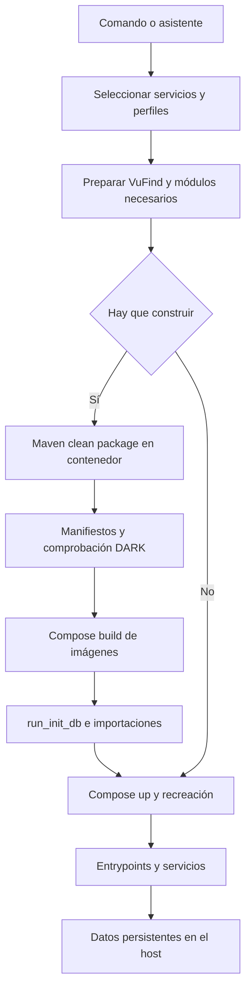
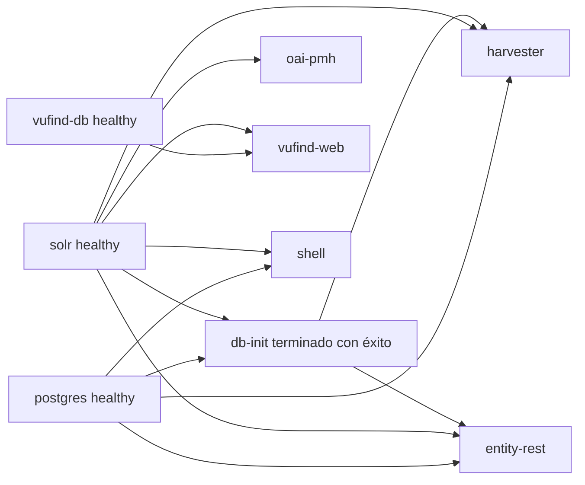

# Análisis completo del script Docker de la plataforma

Este documento describe cómo funciona `Docker/docker.sh`, qué archivos consulta y modifica, cómo prepara el código y construye las imágenes, cómo inicia los servicios y dónde persiste cada tipo de información. Está dirigido a quien debe operar la plataforma y a quien necesita revisar o modificar el script con conocimiento de sus efectos.

El comportamiento se reconstruyó leyendo el script y sus dependencias locales. Se distingue entre lo que ejecuta el código, la intención expresada en sus mensajes y las limitaciones encontradas. El script coordina operaciones con efectos sobre Git, el sistema de archivos, Docker, bases de datos y, opcionalmente, cron o systemd. Un comando que parece consultar estado puede reescribir configuración; un rebuild puede actualizar repositorios y ejecutar importaciones; cambiar el nombre del proyecto no separa los datos en disco.

## 1 Alcance y versión analizada

Fecha del análisis: **3 de octubre de 2026**, hora local de Europe/Madrid. Repositorio padre: `lareferencia-platform`; commit observado: `f5985297fc92d1b3d2e829e9526cda0fdbd8a9b3`; descripción Git: `5.0.0-rc3-dirty`. El sufijo indica cambios locales y no una release reproducible. Los módulos anidados son repositorios independientes y pueden tener revisiones distintas al padre.

Identidad de los dos archivos principales al analizar:

| Archivo | Líneas | SHA256 |
| --- | ---: | --- |
| `Docker/docker.sh` | 2309 | `09f08a55de45593427b3046925a6726e0f29b3055d92a8b8caba483faa2103ee` |
| `docker-compose.yml` | 412 | `ef0846e50fa2d22dbcc853dae7a03811b06de889d94278a2de21d52eda9ed534` |

El objeto es el **script normal**, con `docker-compose.yml`, `Docker/apps/Dockerfile` y `Docker/apps/entrypoint.sh`. `docker-dev.sh`, `docker-compose.dev.yml`, `Dockerfile.dev` y `entrypoint-dev.sh` son otra implementación. Sus correcciones, variables y rutas no se deben atribuir al script normal. Se menciona el entorno dev únicamente cuando una operación normal puede afectar también a sus archivos o contenedores.

Los ejemplos suponen que se ejecutan desde la raíz del repositorio. El script resuelve sus propias rutas y puede invocarse desde otra carpeta. Los comandos de Compose escritos directamente deben incluir el archivo Compose y el archivo de entorno correctos.

No se ejecutaron builds completos, migraciones, resets, cambios de usuarios ni backups del entorno normal para elaborar el documento. Se hicieron lecturas, verificaciones de sintaxis, consultas de Compose y pruebas acotadas con funciones simuladas o contenedores efímeros. Las limitaciones de validación se detallan al final.

## 2 Índice de lectura

1. [Alcance y versión](#1-alcance-y-versión-analizada).
2. [Modelo de operación](#3-modelo-de-operación).
3. [Archivos y dependencias](#4-archivos-que-participan).
4. [Invocación y comandos](#5-invocación-y-comandos).
5. [Configuración y precedencia](#6-configuración-del-script-y-precedencia).
6. [Módulos y servicios](#7-módulos-servicios-y-perfiles-compose).
7. [Nombres, red y puertos](#8-nombres-red-y-puertos).
8. [Repositorios y código fuente](#9-preparación-y-actualización-del-código).
9. [Compilación y manifiestos de build](#10-compilación-maven-y-frontends).
10. [Imágenes y arranque Java](#11-construcción-de-las-imágenes-java).
11. [Arranque y reconstrucción](#13-flujo-completo-de-up).
12. [Persistencia](#16-mapa-completo-de-persistencia).
13. [Operación de Solr](#17-construcción-e-inicialización-de-solr).
14. [Operación de VuFind](#18-construcción-e-inicialización-de-vufind).
15. [Asistente interactivo](#20-asistente-interactivo).
16. [Reset y backups](#22-alcance-exacto-de-reset-data).
17. [Hallazgos](#25-hallazgos-y-limitaciones-de-la-implementación).
18. [Procedimientos, comprobaciones y referencias](#26-procedimientos-para-un-operador).

## 3 Modelo de operación

Hay cinco capas distintas que deben seguirse por separado:

| Capa | Entrada | Resultado | Quién la gestiona |
| --- | --- | --- | --- |
| Workspace Git | `workspace.ini`, URLs, ramas y archivos locales | Repositorios bajo la raíz | `githelper`, llamado por el script |
| Compilación | POM padre y POM de los módulos, fuentes y frontend | JAR, estáticos y manifiestos en el host | Maven ejecutado dentro de Docker |
| Imagen | Artefactos ya compilados y Dockerfiles | Imágenes en el daemon Docker | Compose build y BuildKit |
| Contenedor | Imagen, entorno, configuración y montajes | Proceso Java, PHP, Solr o base de datos | Compose y entrypoints |
| Estado persistente | Escrituras de los servicios | Carpetas en `Docker/volume` y caché Maven | Bind mounts y volumen nombrado |

Un JAR en `target/` no es automáticamente el JAR que ejecuta el servicio normal. El Dockerfile lo copia a la imagen. Una imagen nueva no reemplaza automáticamente un contenedor existente. `restart` reinicia el mismo contenedor; `up` puede recrearlo si detecta cambios; `up --build` solicita explícitamente recreación después de compilar y construir.

El flujo principal es:



La detección de la necesidad de build, las dependencias y el alcance de `run_init_db` tienen particularidades. No basta con este diagrama para prever los efectos; las secciones siguientes explican las condiciones exactas.

## 4 Archivos que participan

### 4.1 Archivos de control

| Ruta relativa al repositorio | Uso efectivo |
| --- | --- |
| [`Docker/docker.sh`](docker.sh) | CLI, asistente, selección de módulos, build, inicialización, usuarios, backup y reset |
| [`docker-compose.yml`](../docker-compose.yml) | Servicios, imágenes, argumentos de build, entorno, dependencias, puertos, red, límites y montajes normales |
| [`Docker/.env.example`](.env.example) | Plantilla copiada si falta `.env` |
| `Docker/.env` | Configuración persistente del script e interpolación de Compose; puede crearse y reescribirse automáticamente |
| [`Docker/profiles/low.env`](profiles/low.env), [`medium.env`](profiles/medium.env), [`high.env`](profiles/high.env), [`custom.env`](profiles/custom.env) | Valores de CPU y memoria copiados a `.env` al aplicar un perfil |
| [`workspace.ini`](../workspace.ini) | Manifestación de repositorios del workspace; usada por githelper y por reset |
| [`githelper`](../githelper) | Inicialización y actualización Git de módulos y del repositorio padre |
| [`pom.xml`](../pom.xml) | Reactor Maven completo, Java 17, Spring Boot 3.5.0 y orden de módulos |
| [`Docker/maven-mirror-alternative.xml`](maven-mirror-alternative.xml) | Settings Maven; reemplaza Central por el espejo de Google cuando el archivo existe |
| [`.dockerignore`](../.dockerignore) | Qué archivos del host entran en el contexto de build |
| [`.gitignore`](../.gitignore) | Qué archivos locales se consideran ignorados; influye en la limpieza con `git clean -fdx` |

`.env` no se ejecuta con `source`. El script consulta determinadas claves mediante `awk`. Compose recibe `.env` mediante `--env-file`. Son dos mecanismos de lectura diferentes y no equivalentes.

### 4.2 Archivos de imágenes y arranque

| Ruta | Función |
| --- | --- |
| [`Docker/apps/Dockerfile`](apps/Dockerfile) | Imagen Java de cada aplicación desde un JAR ya construido |
| [`Docker/apps/entrypoint.sh`](apps/entrypoint.sh) | Preparación de permisos y configuración, dispatch de comandos y ejecución Java |
| [`Docker/solr/Dockerfile`](solr/Dockerfile) | Imagen Solr 9.8.0, cores, importadores y JAR auxiliares |
| [`Docker/solr/entrypoint.sh`](solr/entrypoint.sh) | Inicialización de cores persistentes y arranque con usuario `solr` |
| [`Docker/solr/cores`](solr/cores) | Plantillas de cores `biblio` y `oai`, incluidas sus configuraciones |
| `Docker/solr/import`, `Docker/solr/jars`, `Docker/solr/vendor` | Assets sincronizados desde VuFind y usados en el build |
| [`Docker/vufind/Dockerfile`](vufind/Dockerfile) | PHP y Apache, extensiones, Composer y entrypoint de VuFind |
| [`Docker/vufind/entrypoint.sh`](vufind/entrypoint.sh) | Dependencias PHP, instalación, INI, creación de base de datos y espera de Solr |
| [`Docker/vufind/apache-vufind.conf`](vufind/apache-vufind.conf) | Acceso a `public`, recursos de temas, caché pública y redirección de `/vufind` |
| [`Docker/config-overrides`](config-overrides) | Directorios por aplicación montados como `/docker-overrides` de solo lectura |

### 4.3 Archivos de aplicación y generados

Los directorios `lareferencia-*` contienen código y configuración de repositorios independientes. Sus `target/`, `config/` y estáticos participan en el build. El script no deduce su contenido a partir de `docker-compose.yml`.

| Artefacto | Dónde aparece | Cuándo se genera |
| --- | --- | --- |
| JAR Java versionados | `<módulo>/target/<módulo>-*.jar` | Maven `package` |
| `docker-build-info.properties` | `target/` de Harvester, Entity REST, Shell y OAI | Después de Maven |
| Admin Web compilado | `lareferencia-lrharvester-app/admin-static/` | POM del frontend React |
| Dashboard compilado | `lareferencia-lrharvester-app/dashboard-static/` | POM del frontend Angular |
| Configuración específica de perfil | Entre otros, `config/third-party-context.xml` de aplicaciones | Plugins Maven de los perfiles |
| Runtime de Node y dependencias | Directorios del módulo frontend, incluidos `node/`, `node_modules/` y salidas `dist/` | Frontend Maven plugin y npm |
| `Docker/.bin/gum` | Binario local ignorado por Git | Primer uso de `gum` por el asistente |
| `Docker/.bin/venv` | Entorno Python con bcrypt | Creación de usuarios si falta bcrypt en Python del host |
| `/tmp/lareferencia-docker.log` | Log de una operación del asistente | `execute_with_progress` |
| `/tmp/lr_users.properties` | Copia temporal de usuarios legacy | Gestión de usuarios |
| `.system_backup.sh`, `.cron_backup.log` | Raíz del repositorio | Configuración o ejecución del backup |
| `<destino>/<YYYYMMDD_HHMM>/` | Fuera o dentro del repositorio, según elección | Backup generado |

## 5 Invocación y comandos

El script usa Bash con `set -euo pipefail`. Un comando fallido puede abortar; acceder a una variable no definida puede abortar; el fallo de una parte de un pipeline se propaga. Hay excepciones explícitas con `|| true`, capturas condicionales y desactivación temporal de `errexit`.

Al cargar el script calcula `SCRIPT_DIR`, `ROOT_DIR`, `COMPOSE_FILE`, `DATA_DIR`, `VOLUME_DIR`, `ENV_FILE` y `ENV_EXAMPLE`. También crea la carpeta raíz `vufind/` si falta, **antes de elegir el comando**. Por tanto, incluso `help` puede crear esa carpeta.

La invocación sin argumentos equivale a `help`. **No abre el asistente automáticamente.**

| Comando | Operación | Observaciones |
| --- | --- | --- |
| `help`, `-h`, `--help` | Muestra ayuda | La ayuda no enumera todas las ramas ni todas las opciones |
| `wizard` | Asistente interactivo | Valida presencia de Docker y Compose, prepara `.env`, exporta nombre del proyecto |
| `up` | Arranca servicios en background | Selecciona módulos o servicios; puede forzar un build inicial |
| `build [servicio…]` | Compila el reactor y construye imágenes seleccionadas | No arranca servicios ni ejecuta explícitamente `run_init_db` |
| `start [servicio…]` | Arranca contenedores ya existentes | No crea nuevos ni recompila |
| `stop [servicio…]` | Detiene contenedores | Los conserva; selección por módulos si no se indican servicios |
| `restart [servicio…]` | Reinicia contenedores existentes | No adopta automáticamente imágenes ni entorno nuevos |
| `down [v] [opciones…]` | Elimina contenedores y red del proyecto | Activa todos los perfiles opcionales; `v` añade `--volumes` |
| `pull` | Descarga imágenes de cuatro servicios | VuFind DB, PostgreSQL, Elasticsearch y watcher; no hace `git pull` |
| `ps` | Estado Compose | Pasa por `dc`, que puede reescribir `.env` |
| `logs [opciones y servicios…]` | Logs Compose | Admite opciones de logs, por ejemplo `-f --tail=100 harvester` |
| `health` | Estado Compose y solicitudes HTTP | No es una comprobación integral; ignora los fallos HTTP para continuar |
| `init-db [comando shell…]` | Inicialización explícita | Puede parar y eliminar contenedores de PostgreSQL, Solr, Shell y db-init |
| `lrshell-interactive [comando…]` | Shell de LA Referencia o comando con TTY | Reutiliza Shell en ejecución o crea un contenedor temporal |
| `shell <servicio>` | Bash dentro de un servicio | Distinto de Spring Shell; la rama CLI no tiene fallback a `sh` |
| `modules [status [módulo]]` | Estado configurado y, para el conjunto, servicios en ejecución | `core` aparece siempre activo |
| `modules on <módulo>` | Guarda estado `on` | No inicia el servicio en ese momento |
| `modules off <módulo>` | Guarda estado `off` | No lo detiene en ese momento; `core` no admite `off` |
| `resource-profile <perfil>`, `res <perfil>` | Copia valores de recursos a `.env` | No recrea contenedores existentes |
| `reset-data [--yes]` | Limpieza amplia de datos y repositorios | Operación destructiva, analizada por separado |

No hay ramas CLI `dc`, `rebuild`, `frontend-dev`, `watch`, `instance`, `clean` ni `vufind` como primer argumento. Algunas de ellas existen en el script dev o aparecen en mensajes históricos; no son comandos del script normal.

### 5.1 Opciones propias de up

| Opción | Interpretación real |
| --- | --- |
| `--build` | Ejecuta preparación Java, compilación, build global, inicialización y después up con recreación |
| `--no-cache` | Marca una bandera; solo se usa en el up final cuando hubo build; no es una interfaz correcta para Compose up |
| `--pull-modules` | Si se hace build, solicita `githelper pull`; sin build la bandera no ejecuta el pull |
| `--prefix=<texto>` | Escribe `SERVICE_PREFIX` antes de continuar; no valida igual que el asistente |
| `--offset=<texto>` | Escribe `SERVICES_PORT_OFFSET`; después se normaliza al calcular puertos |
| `--module <nombre>` | Añade un módulo a la selección específica de esta ejecución |
| `--vufind`, `--elastic`, `--watch`, `--oai` | Selección abreviada de esos módulos para la ejecución |
| Cualquier otro argumento | Se trata como nombre de servicio, aunque empiece por `--` |

Las selecciones `--module` y abreviadas **no escriben** `DEV_MODULE_*`. Si se especifican módulos se usan esos módulos en lugar del conjunto activado, con las dependencias añadidas por el script. Si además hay nombres de servicios, la rama de servicios tiene prioridad y los módulos solicitados no se convierten en servicios. Las opciones no reconocidas no se reenvían como opciones de up de forma deliberada; entran en la lista de servicios y pueden producir errores posteriores.

`--module` sin valor y `modules on/off` sin nombre no tienen una validación de argumentos completa y pueden abortar por variable no definida.

## 6 Configuración del script y precedencia

### 6.1 Creación y lectura de Docker env

`ensure_env_file` copia `.env.example` a `.env` si falta. Si tampoco existe la plantilla, crea `.env` vacío. La plantilla del snapshot incluye:

- `LR_BUILD_PROFILE=lareferencia`.
- `SHELL_IDLE=true`.
- Estados on para Solr, Harvester y VuFind; off para Entity REST, Shell, Elasticsearch y watcher.
- `VUFIND_REPO_URL=https://github.com/LA-Referencia-IOI/vufind` y `VUFIND_REF=v11.0.1`.
- Valores de producción y depuración desactivada para VuFind.
- `BUILD_ON_START=smart`, que esta implementación no consume.
- `LR_PORT_GATEWAY=8088`, relacionado con dev y no usado por Compose normal.

La plantilla no declara `DEV_MODULE_OAI`; el default del código lo activa. `SERVICE_PREFIX` y `SERVICES_PORT_OFFSET` vienen vacíos, lo que se normaliza a proyecto `lareferencia` y offset 0.

`get_env_var` busca la última línea cuyo primer campo coincide con la clave, admite espacios alrededor del nombre, recorta espacios en el valor y comillas dobles exteriores. Usa un default si el valor es vacío. No es un parser completo de dotenv: utiliza `awk -F=`, toma `$2` y puede truncar valores con más signos `=`. No resuelve expansiones, comentarios inline ni semántica compleja de quoting como Compose.

`set_env_var` sustituye líneas coincidentes con `sed` y un archivo temporal `.env.tmp`, o añade una línea nueva. No bloquea escrituras concurrentes y no escapa de forma general caracteres especiales del valor para una sustitución sed. Ejecutar varios comandos al mismo tiempo puede competir por el mismo temporal.

### 6.2 La función dc normaliza el entorno

Cada llamada a `dc` hace lo siguiente, en este orden:

1. Garantiza que `.env` exista.
2. Calcula y exporta todos los `LR_PORT_*` normales a partir del offset; también los guarda en `.env`.
3. Calcula y exporta `SERVICE_PREFIX` y `COMPOSE_PROJECT_NAME`; los guarda en `.env`.
4. Calcula y exporta `COMPOSE_PROFILES` según los módulos; lo guarda en `.env`.
5. Si hay `SOLR_EXTERNAL_URL`, exporta `SOLR_HOST` en el proceso del script.
6. Prefiere `docker compose`; si no está disponible y existe `docker-compose`, usa ese ejecutable.
7. Ejecuta Compose con `-f <raíz>/docker-compose.yml --env-file <raíz>/Docker/.env` y los argumentos recibidos.

Esto afecta también a `ps`, `logs`, consultas del asistente y otras operaciones aparentemente de lectura. No se aplica automáticamente un perfil de recursos por tener `LR_RESOURCE_PROFILE=medium`: hay que copiar sus claves mediante `res` o el asistente.

### 6.3 Dos valores de perfil pueden divergir

La compilación selecciona `local profile="${LR_BUILD_PROFILE:-lareferencia}"` desde el entorno del proceso Bash. No consulta `.env` ni exporta su valor antes de Maven. Compose sí usa `.env` para interpolar tags y argumentos.

Por tanto, guardar `LR_BUILD_PROFILE=ibict` en `.env` no garantiza que Maven ejecute `-Pibict`. Sin una variable exportada, Maven compila con `-Plareferencia`, mientras Compose puede etiquetar las imágenes como `:ibict`. La prueba aislada de este análisis reprodujo esta divergencia.

Mientras exista esta implementación, para un build deliberado con un perfil conviene asegurar que el valor exportado y `.env` coincidan. Esto es una recomendación operativa, no una corrección ya aplicada:

```bash
LR_BUILD_PROFILE=ibict ./Docker/docker.sh build harvester
```

Además del perfil Maven, hay perfiles Compose, perfil de recursos, `SPRING_PROFILES_ACTIVE` y `VUFIND_ENV`. Son mecanismos diferentes. Cambiar uno no cambia automáticamente los otros.

### 6.4 Variables declaradas y variables efectivas

| Variable | Consumidor | Efecto |
| --- | --- | --- |
| `SERVICE_PREFIX` | Script | Deriva el nombre de proyecto; no cambia carpetas persistentes |
| `COMPOSE_PROJECT_NAME` | Script y Compose | El script lo vuelve a derivar del prefijo en cada `dc` |
| `SERVICES_PORT_OFFSET` | Script | Recalcula y escribe los nueve puertos |
| `LR_PORT_*` | Compose, después de normalización del script | Interpolación de los puertos publicados |
| `DEV_MODULE_*` | Script | Estados de selección, pese al nombre `DEV` |
| `COMPOSE_PROFILES` | Script y Compose | Activación global de perfiles; reescrito por `dc` |
| `LR_BUILD_PROFILE` | Maven desde entorno; Compose desde interpolación | Perfil de compilación, tags y variable del contenedor; posible divergencia |
| `LR_RESOURCE_PROFILE` | Asistente y aplicación de presets | Etiqueta del preset; no basta para cambiar límites |
| `LR_MEM_*`, `LR_CPU_*` | Compose | Límites de servicios que referencian cada clave |
| `DOCKER_BUILD_CACHE` | Asistente | Decide si añade `--no-cache` a su comando de rebuild |
| `BUILD_ON_START` | Ningún consumidor encontrado | Declaración histórica sin efecto en el flujo actual |
| `SHELL_IDLE` | Compose y entrypoint Java | Mantiene Shell en espera cuando no hay argumentos |
| `VUFIND_REPO_URL`, `VUFIND_REF` | Preparación VuFind | Entorno del proceso primero, `.env` después, default del código al final |
| `VUFIND_THEME`, `VUFIND_ENV` y claves de debug | Compose y entrypoint PHP | Tema y configuración de ejecución PHP/VuFind |
| `SOLR_EXTERNAL_URL` | Selección de módulo y `dc` | Omite el servicio local de la colección y exporta `SOLR_HOST`; integración incompleta |
| `JAVA_OPTS` | Entrypoint Java | Opciones JVM recibidas por el contenedor; `.env` por sí solo no inyecta cualquier variable en servicios |
| `APP_RUN_CONFIG_DIR`, `DOCKER_OVERRIDES_DIR` | Entrypoint | Paths alternativos si se suministran al contenedor |
| `M2_DIR` | Entrypoint | Se asigna, pero no participa en una compilación al arrancar |

El entorno de shell puede participar en la interpolación de Compose. El script fuerza explícitamente los puertos, proyecto y perfiles que exporta. No debe suponerse que toda clave de `.env` llega como variable al contenedor: el servicio debe declararla en `environment`, usar un `env_file` o recibirla mediante otra opción.

## 7 Módulos servicios y perfiles Compose

### 7.1 Mapa de módulos

| Módulo | Clave de estado | Default del código | Servicios recogidos | Perfil añadido por module_profiles |
| --- | --- | --- | --- | --- |
| `core` | `DEV_MODULE_CORE` | Siempre on | `postgres` | Ninguno |
| `solr` | `DEV_MODULE_SOLR` | on | `solr`, salvo URL externa | Ninguno |
| `harvester` | `DEV_MODULE_HARVESTER` | on | `harvester` | Ninguno |
| `entity-rest` | `DEV_MODULE_ENTITY_REST` | off | `entity-rest` | Ninguno |
| `shell` | `DEV_MODULE_SHELL` | off | `shell` | `tools` |
| `vufind` | `DEV_MODULE_VUFIND` | on | `vufind-db`, `vufind-web` | Ninguno |
| `elastic` | `DEV_MODULE_ELASTIC` | off | `elasticsearch` | `elastic` |
| `watch` | `DEV_MODULE_WATCH` | off | `vufind-scss-watch` | `watch` |
| `oai` | `DEV_MODULE_OAI` | on | `oai-pmh` | `oai` |

Valores `1`, `true`, `on` o `yes`, sin distinguir mayúsculas, se interpretan como on. Cualquier otro valor se convierte en off. `core` ignora una configuración off y no se puede desactivar mediante `set_module_state`.

`sync_compose_profiles` también escribe nombres `core`, `harvester`, `entity-rest` y `vufind` en `COMPOSE_PROFILES`. Esos nombres **no corresponden a perfiles declarados para esos servicios en el Compose normal**. Los servicios sin `profiles` están disponibles siempre en el modelo Compose; el script limita su operación por las listas de servicios que pasa.

`collect_profiles_for_services` reconoce `shell`, `elasticsearch` y `vufind-scss-watch`; no reconoce `oai-pmh`. `up` vuelve a ejecutar esta función y reemplaza la colección inicial de perfiles. La disponibilidad de OAI depende de la activación global de `oai` y del comportamiento de Compose cuando se dirige explícitamente al servicio. No debe atribuirse a esta función la activación de OAI.

### 7.2 Dependencias añadidas por el script

En la selección de módulos de `up`:

- Si hay Harvester, Entity REST o Shell, se añade `core` si falta.
- Si hay Harvester, Shell o VuFind, se añade `solr` si falta.
- El script no añade Solr para Entity REST, OAI o watcher en esta resolución, aunque Compose declara dependencias Solr para algunos de ellos.
- Seleccionar servicios directamente evita esta resolución de módulos y deja a Compose resolver sus `depends_on`.

El asistente de módulos activa Solr si se eligió VuFind o Harvester. Esto modifica `.env`; la resolución automática de `up`, por sí misma, solo modifica la selección de esa ejecución.

### 7.3 Dependencias declaradas en Compose



El watcher no tiene dependencia declarada de VuFind Web ni de Solr. Elasticsearch tampoco es dependencia `depends_on` de las aplicaciones que mencionan su host.

Desactivar un módulo significa excluirlo de determinadas selecciones del script. No elimina automáticamente las dependencias de Compose ni apaga un contenedor existente. Por ejemplo, `entity-rest` puede provocar el arranque de Solr y db-init aunque no se hayan incluido esos módulos explícitamente.

## 8 Nombres red y puertos

### 8.1 Nombre de proyecto y contenedores

`export_service_prefix` toma el prefijo de `.env`, elimina comillas simples y dobles, quita **un** `_` o `-` final y sustituye los `_` restantes por `-` para obtener `COMPOSE_PROJECT_NAME`. Con prefijo vacío fija proyecto `lareferencia`.

Ejemplos:

| SERVICE_PREFIX | Proyecto resultante | Contenedor Harvester | Red |
| --- | --- | --- | --- |
| Vacío | `lareferencia` | `lareferencia-harvester` | `lareferencia-network` |
| `laref_` | `laref` | `laref-harvester` | `laref-network` |
| `mi_instancia_` | `mi-instancia` | `mi-instancia-harvester` | `mi-instancia-network` |

Compose utiliza el proyecto para nombres de contenedor, nombre de red y declaración del volumen `maven-repo`. No concatena directamente `SERVICE_PREFIX` en los `container_name`.

Los servicios tienen alias estables (`postgres`, `solr`, `harvester`, etc.) dentro de la red del proyecto. Las aplicaciones usan esos alias y los puertos internos, independientemente del offset del host.

### 8.2 Cálculo de puertos

El script elimina del offset todos los caracteres que no sean dígitos. Un texto `-100` pasa a `100`; `abc100` también pasa a `100`. No valida el rango final de puertos y una cadena con ceros iniciales puede tener implicaciones en la aritmética Bash. Se recomienda introducir enteros decimales claros sin signos ni ceros a la izquierda.

En cada `dc`, los valores manuales de `LR_PORT_*` se descartan y se calculan como `base + offset`:

| Servicio | Clave | Base del host | Puerto del contenedor | Interfaz publicada |
| --- | --- | ---: | ---: | --- |
| VuFind Web | `LR_PORT_VUFIND_WEB` | 8080 | 80 | Todas las interfaces |
| VuFind MariaDB | `LR_PORT_VUFIND_DB` | 3307 | 3306 | Todas las interfaces |
| Solr | `LR_PORT_SOLR` | 8983 | 8983 | Todas las interfaces |
| PostgreSQL | `LR_PORT_POSTGRES` | 5432 | 5432 | `127.0.0.1` |
| Harvester | `LR_PORT_HARVESTER` | 8090 | 8090 | `127.0.0.1` |
| Entity REST | `LR_PORT_ENTITY_REST` | 8094 | 8094 | Todas las interfaces |
| Elasticsearch HTTP | `LR_PORT_ELASTIC_9200` | 9200 | 9200 | Todas las interfaces |
| Elasticsearch transporte | `LR_PORT_ELASTIC_9300` | 9300 | 9300 | Todas las interfaces |
| OAI PMH | `LR_PORT_OAI` | 8096 | 8092 | Todas las interfaces |

OAI sirve internamente en 8092; 8096 es el default publicado. El Compose normal no define gateway Nginx ni servidor Vite. Harvester contiene los estáticos compilados para `/admin/` y `/dashboard/`.

### 8.3 Qué aislamiento proporciona el prefijo

Se separan nombres de contenedores y redes. El offset evita colisiones de puertos. **Las rutas de `Docker/volume` son constantes y no contienen el proyecto.** Dos proyectos desde el mismo checkout montan los mismos datos de PostgreSQL, MariaDB, Solr y aplicaciones. Incluso imágenes distintas por proyecto comparten tags si usan el mismo perfil.

Para dos instancias realmente independientes hay que separar también los directorios de host y la configuración. Una copia del repositorio con su propio `Docker/volume`, o una revisión deliberada de los montajes, es diferente de cambiar solamente el prefijo. La caché `lr-maven-cache` también se comparte entre proyectos y checkouts que usen el mismo daemon.

## 9 Preparación y actualización del código

### 9.1 Módulos Java comprobados

`ensure_java_parent_modules_ready` comprueba que exista un `pom.xml` en estos diez directorios:

```text
lareferencia-oclc-harvester
lareferencia-core-lib
lareferencia-entity-lib
lareferencia-indexing-filters-lib
lareferencia-shell-entity-plugin
lareferencia-shell
lareferencia-dark-lib
lareferencia-lrharvester-app
lareferencia-entity-rest
lareferencia-oai-pmh
```

Si falta alguno llama `githelper init`, ejecutando directamente el archivo si tiene permiso o mediante `python3` en caso contrario. No le pasa una selección de módulos: githelper puede inicializar **todo** el manifest, incluidos frontends, contribuciones y repositorio de cores.

Si se pidió actualizar, llama `githelper pull`, pero añade `|| true`: un fallo de pull no impide necesariamente la compilación. Después vuelve a comprobar los diez POM. Esa comprobación no valida la integridad del checkout, sus cambios locales ni que la revisión sea la deseada.

Los POM de Admin Web y Dashboard participan en el reactor padre, pero **no están en la lista de diez comprobaciones**. Si únicamente falta un frontend y los diez POM existen, no se invoca init y Maven puede fallar al cargar el reactor.

### 9.2 Workspace y githelper

En el snapshot, `workspace.ini` contiene quince secciones `module.*`, con ramas `main`: cores Solr, OCLC Harvester, Core, Entity, contribuciones RCAAP e IBICT, filtros, plugin Shell Entity, Shell, Harvester, Admin Web, Entity REST, Repository Dashboard, OAI y DARK. Al no declarar `path` se usa el nombre del módulo como subdirectorio.

`githelper init` clona repositorios ausentes. Para ramas usa `git clone --branch`; para módulos ya existentes en Git normalmente conserva el checkout. Un path existente que no es repositorio se considera error. Githelper tiene soporte para tags y commits fijados, pero el manifest observado utiliza ramas.

`githelper pull` primero actualiza el repositorio padre con `git pull`, determina su rama y luego obtiene referencias, selecciona ramas de los módulos y los actualiza. No equivale a descargar solo bibliotecas Maven. El comando puede cambiar código del padre y de los módulos. Si el padre no está en una rama o el pull falla, puede interrumpir su propia ejecución; el wrapper Docker ignora su código de fallo.

No es una operación de submódulos Git convencionales. Los checkouts son repositorios anidados descritos por `workspace.ini` y generalmente ignorados por el Git padre.

### 9.3 Descarga de VuFind

`ensure_vufind_checkout` da el checkout por preparado si existe `vufind/composer.json`. No verifica versión, hash, remote ni estado de Git.

Cuando falta, obtiene URL y ref de la variable del proceso si existe, de `.env` en segundo lugar y del default en último lugar. El default del código apunta a `https://github.com/vufind-org/vufind`; una `.env` recién copiada apunta al fork `https://github.com/LA-Referencia-IOI/vufind`. En ambos casos el ref por defecto es `v11.0.1`.

La orden normal es:

```bash
git clone --quiet --branch "$repo_ref" --single-branch "$repo_url" "$ROOT_DIR/vufind"
```

No es un clon shallow. El stdout y stderr se ocultan. Si `vufind/` contiene archivos pero no `composer.json`, Git puede rechazar el destino no vacío. Esta implementación normal no conserva ni integra automáticamente ese contenido como la corrección del script dev.

Después de un clon exitoso sincroniza assets Solr. Si `composer.json` ya existía retorna inmediatamente y no sincroniza esos assets en esta función.

Todos `vufind-web`, `vufind-db` y `vufind-scss-watch` se consideran servicios que requieren checkout. Incluso ejecutar `stop vufind-db` pasa por su preparación antes de delegar en Compose.

El filtro que anuncia omitir VuFind si la carpeta no existe queda prácticamente neutralizado por el `mkdir vufind` inicial. Su condición es existencia de directorio, no existencia de `composer.json`.

## 10 Compilación Maven y frontends

### 10.1 Ejecución de Maven

La compilación no usa Maven o Java instalados en el host. `compile_java_modules` crea o reutiliza el volumen global `lr-maven-cache` y ejecuta un contenedor temporal:

```bash
docker run --rm \
  -v lr-maven-cache:/root/.m2 \
  -v "$ROOT_DIR:/workspace" \
  -w /workspace \
  maven:3.9.11-eclipse-temurin-17 \
  mvn clean package \
  -s /workspace/Docker/maven-mirror-alternative.xml \
  -DskipTests \
  -Dspring-boot.repackage.executable=false \
  -P<perfil-del-entorno-Bash>
```

El argumento `-s` solo se añade si existe el archivo de settings. El script forma el comando como cadena y lo ejecuta mediante `eval`; rutas y valores de perfil deben tratarse con cuidado al modificar este mecanismo.

`clean` elimina salidas de target del reactor y `package` recompila y empaqueta. No es `install`: este flujo no instala expresamente los artefactos del reactor en el repositorio Maven local. Las dependencias y plugins descargados sí se conservan en `.m2` del volumen nombrado.

Se omite ejecutar tests con `-DskipTests`. No se ejecuta una batería de comprobaciones de aplicación o de endpoints después de build. El éxito de Maven, del empaquetado y de Compose no demuestra un funcionamiento completo de negocio.

El comando solicita `spring-boot.repackage.executable=false`, pero los cuatro POM de aplicaciones configuran explícitamente `<executable>true</executable>` en el plugin Spring Boot. No hay que dar por hecho que ese argumento elimina el launch script del artefacto. El JAR Shell disponible durante el análisis tenía ese prefijo y `jarmode=tools` lo rechazó; el Dockerfile dispone del fallback para ese caso. Se debe verificar el artefacto de cada build si se pretende cambiar al launch por capas.

El montaje del repositorio es de lectura y escritura. Maven puede modificar fuentes de configuración generada, carpetas de frontend y artefactos del host. Si el usuario del host no es root, un contenedor Alpine adicional hace `chown` y `chmod ugo+rwX` sobre `*/target`. No corrige del mismo modo todos los archivos creados en `node_modules`, `node`, estáticos o configuración.

### 10.2 Reactor efectivo

El POM padre declara, en este orden de listado:

1. OCLC Harvester.
2. Core Library.
3. Entity Library.
4. Indexing Filters Library.
5. Shell Entity Plugin.
6. Shell.
7. DARK Library.
8. Admin Web React.
9. Repository Dashboard Angular.
10. Harvester App.
11. Entity REST.
12. OAI PMH.

Maven puede ajustar el orden por dependencias. Las contribuciones RCAAP e IBICT no son módulos activos del bloque `<modules>` del padre; aparecen comentadas allí. Su posible inclusión o uso depende de los POM y perfiles de las aplicaciones, no de que el script añada esos módulos al comando Maven.

El POM efectivo declara Java 17 y Spring Boot 3.5.0. Un comentario histórico menciona Java 21, pero los valores de compilación y las imágenes usan 17.

### 10.3 Admin Web

El POM de `lareferencia-lrharvester-admin-web` utiliza `frontend-maven-plugin` 1.15.1, Node `v22.14.0` y npm `10.9.2`. Ejecuta instalación de Node/npm, `npm ci --no-audit --no-fund` y `npm run build`. Un paso de inicialización elimina `node_modules`. En la fase package vacía y repuebla `lareferencia-lrharvester-app/admin-static` a partir de `dist`.

No se ejecuta Vite como servicio en el entorno normal. La imagen Harvester copia el resultado y la aplicación lo sirve. Cambiar un archivo React del host no cambia la interfaz normal hasta compilar y reconstruir/recrear su imagen.

### 10.4 Dashboard

El POM de `lareferencia-repository-dashboard` usa el mismo plugin frontend con Node `v18.20.8` y npm `10.8.2`, trabajando dentro de `angular/`. Ejecuta `npm ci` y `npm run build`, y en package reemplaza `lareferencia-lrharvester-app/dashboard-static` por la salida `angular/dist/frontend`.

El script normal no define un contenedor dashboard separado. Es parte de los recursos que Harvester sirve desde su imagen. El preset de recursos puede contener referencias históricas a Dashboard que no limitan un servicio inexistente en este Compose.

### 10.5 Configuración alterada por los perfiles Maven

Los POM de Harvester y Shell incluyen perfiles `lite`, `lareferencia`, `rcaap` e `ibict`. Entre sus operaciones hay copias de contextos XML específicos a `config/third-party-context.xml`, además de copias de JAR a nombres auxiliares en el módulo. Esto significa que build puede modificar `config/` del checkout.

El Dockerfile copia la configuración después de esas operaciones. Pero los defaults copiados a una imagen nueva todavía pueden coexistir con una configuración persistente más antigua en `/config`, sometida a la lógica de actualización por fechas del entrypoint.

### 10.6 Identidad del build y comprobación DARK

`write_java_build_manifests` busca el primer JAR versionado que encuentre, excluyendo `*-sources.jar` y `*-javadoc.jar`, para Harvester, Entity REST, Shell y OAI. Si falta uno retorna error. Escribe:

```properties
git.commit=<HEAD-del-repositorio-padre>
application.sha256=<SHA256-del-JAR>
```

No registra los SHA individuales de todos los repositorios anidados ni si contienen cambios locales. Tampoco registra el perfil Maven efectivo, las versiones de frontends o un timestamp del build. El commit padre no basta para reproducir el binario si sus módulos están en revisiones distintas.

Para Harvester busca el JAR DARK compilado y el JAR DARK incluido dentro de `BOOT-INF/lib` de Harvester. Extrae el contenido incluido y compara sus SHA256. Si difieren, retorna error por biblioteca obsoleta. Cuando coincide añade `dark-lib.sha256` al manifiesto de Harvester.

Hay dos salidas permisivas: si no existe `unzip`, avisa y retorna éxito; si falta el JAR DARK o no encuentra la entrada incluida, imprime un mensaje que empieza por `Error` pero **retorna 0**. Por tanto, esta verificación no es estricta en todos los casos. Sí es estricta cuando obtiene ambos hashes y son distintos.

Maven `clean` reduce la posibilidad de varios JAR versionados en target, pero el selector no garantiza unicidad. El Dockerfile usa un wildcard diferente que también puede incluir JAR de fuentes o documentación si estuvieran presentes. Es una condición que conviene revisar al cambiar el empaquetado.

## 11 Construcción de las imágenes Java

### 11.1 El build de imagen no compila fuentes

`Docker/apps/Dockerfile` utiliza dos etapas basadas en `eclipse-temurin:17-jre`. La primera se llama builder, pero su función es extraer un JAR precompilado, no ejecutar Maven.

Recibe `ARG APP_MODULE`, copia `<módulo>/target/<módulo>-*.jar` como `/tmp/app.jar` y requiere `<módulo>/target/docker-build-info.properties`. Después intenta:

```bash
java -Djarmode=tools -jar /tmp/app.jar \
  extract --layers --launcher --destination /build/extracted/
```

Si falla, crea `/build/extracted/application/app.jar` con el JAR completo. Copia el manifiesto de build dentro de `extracted/`.

La etapa runtime instala Bash, sed, curl y gosu, crea usuario y grupo `lareferencia`, establece `/workspace`, copia **todo** `extracted/` a `/workspace/<módulo>/`, copia configuración y recursos externos y cambia la propiedad de `/workspace` a ese usuario. No declara `USER lareferencia`: comienza con los privilegios iniciales del contenedor y el entrypoint baja a usuario de aplicación al ejecutar Java.

Los `COPY` con patrones `confi[g]`, `admin-stati[c]`, `dashboard-stati[c]` y `static_e[n]` buscan directorios de configuración y estáticos. No hay montaje del JAR del host en el runtime normal. El wildcard no constituye una comprobación de que esos recursos sean completos; hay que comprobar qué fuentes existen y cómo responde BuildKit cuando no coincide un patrón.

Compose pasa `LR_BUILD_PROFILE` como argumento de build, pero este Dockerfile no declara ni usa ese ARG. El perfil ya debería haber quedado materializado en el JAR y los recursos host. Usarlo en el tag de imagen no cambia el binario por sí mismo.

### 11.2 Imágenes Java normales

| Servicio | APP_MODULE | Tag de imagen |
| --- | --- | --- |
| Harvester | `lareferencia-lrharvester-app` | `lareferencia/harvester:<perfil>` |
| Entity REST | `lareferencia-entity-rest` | `lareferencia/entity-rest:<perfil>` |
| OAI | `lareferencia-oai-pmh` | `lareferencia/oai-pmh:<perfil>` |
| Shell | `lareferencia-shell` | `lareferencia/shell:<perfil>` |
| db-init | `lareferencia-shell` | `lareferencia/db-init:<perfil>` |

Shell y db-init empaquetan el mismo módulo con tags separados. Compose también declara `APP_JAR` con nombres `5.0.0-rc.jar`, pero el entrypoint normal no lee esa variable para localizar el binario. El launch se decide según la estructura de archivos copiada a la imagen.

### 11.3 Cachés y contenido del contexto

`.dockerignore` excluye `.git`, `Docker/data`, `Docker/volume`, `vufind` y varios subdirectorios de target. No excluye los JAR requeridos ni los manifiestos. Algunos patrones de módulos tienen nombres históricos; no se debe asumir que excluyen todos los árboles actuales de target.

El código de VuFind está excluido del contexto porque el contenedor PHP lo recibe por bind mount. Los datos de ejecución se excluyen para evitar incluir bases e índices en imágenes. Los assets `Docker/solr/*` sí participan en la construcción Solr.

Una compilación normal puede consumir espacio simultáneamente en target del host, caché Maven del daemon, contexto enviado a BuildKit, capas de imágenes y caché de build. `--no-cache` no implica borrar ninguno de esos lugares ni equivale a obtener una base nueva con `--pull`.

## 12 Entrypoint y configuración de las aplicaciones Java

### 12.1 Dispatch de comandos

Antes de leer `APP_MODULE`, el entrypoint examina el primer argumento. Si existe como comando del sistema y no es `script`, `help` o `version`, lo ejecuta directamente mediante `exec`.

Por ejemplo, `bash`, `sh` o `/usr/local/bin/lr-app-entrypoint.sh` se pueden ejecutar como comandos del sistema. Esto evita la preparación Java en ese primer nivel. Los argumentos que no son comandos del sistema se guardan como `APP_ARGS` para la aplicación. Los tres nombres excluidos pasan a Java aunque hubiera un ejecutable homónimo.

`run_init_db` aprovecha este mecanismo pasando el entrypoint como comando explícito a un contenedor Shell: el primer nivel hace exec del mismo archivo; el segundo prepara la aplicación con `script ...` o `database_migrate`.

### 12.2 Preparación de permisos

El entrypoint crea `APP_RUN_CONFIG_DIR`, `DATA_DIR` o `/data`, y `LOG_DIR` o `/var/log/harvester`. Ejecuta `chown -R lareferencia:lareferencia` sobre esas rutas. También puede cambiar propiedad del TTY si stdin es una terminal.

Cuando hay bind mounts estos cambios afectan a los archivos del host. El script no fija un UID/GID numérico de la aplicación en el Dockerfile ni lo hace coincidir con el usuario del host. En Linux, los directorios persistentes pueden aparecer con propietario distinto al usuario que opera el checkout.

Un `chown -R` sobre un store grande puede costar tiempo en cada arranque. La limpieza intenta abrir permisos mediante Alpine porque PostgreSQL y otros procesos escriben con identidades propias.

### 12.3 Cuatro lugares distintos de configuración

Para Harvester, Entity REST y OAI:

1. **Config por defecto en la imagen:** `/workspace/<módulo>/config`, copiada del checkout durante build.
2. **Config persistente:** `/config`, montada desde `Docker/volume/lareferencia/<aplicación>/config`.
3. **Overrides del host:** `/docker-overrides/<módulo>`, montados desde `Docker/config-overrides`, de solo lectura para el contenedor.
4. **Config efectiva del proceso:** `/tmp/lr-config/<módulo>`, reconstruida en el filesystem del contenedor.

Shell y db-init no tienen `/config` persistente declarado. Usan defaults de la imagen y overrides para crear su runtime en `/tmp`.

### 12.4 Orden de copias y prioridad

El orden efectivo es:

1. Si existe `EXTERNAL_CONFIG_DIR`, crea el directorio y ajusta permisos.
2. Copia defaults con `cp -ru` a esa configuración externa. **La condición es fecha de modificación**, no solamente ausencia. Un default más nuevo puede reemplazar un archivo persistente más viejo.
3. Copia overrides del módulo con `cp -a` al directorio persistente. Archivos coincidentes se sustituyen.
4. Usa ese directorio externo como `APP_CONFIG_DIR` y corrige propiedad recursivamente.
5. Si es Shell idle sin argumentos, se queda en `tail -f /dev/null` y no sigue a Java.
6. Para ejecución Java borra y recrea el runtime `/tmp/lr-config/<módulo>`.
7. Copia allí la configuración base elegida.
8. Añade propiedades JVM desde `SPRING_PROFILES_ACTIVE` y `ACTIONS_BEANS_FILENAME`, si existen.
9. Copia nuevamente los overrides del módulo al runtime.
10. Si hay `99-docker.properties` en ese runtime y existe el directorio de overrides, lo copia también a `application.properties.d/99-docker.properties`, interpreta sus claves como `-Dclave=valor` y reemplaza una propiedad dinámica homónima ya añadida.
11. Elimina el `99-docker.properties` de la raíz del runtime; conserva el de `application.properties.d`.
12. Lanza Java con `JAVA_OPTS`, propiedades calculadas y `-Dapp.config.dir=<runtime>`.

No hay un merge semántico general de XML, JSON o archivos properties. `cp` reemplaza archivos enteros. Si se retiró un archivo del override o de una imagen nueva, no se borra automáticamente del `/config` persistente. El entrypoint normal tampoco realiza la limpieza específica de archivos de autenticación legacy que hace el entrypoint dev revisado.

`99-docker.properties` tiene prioridad explícita como propiedad del sistema sobre las dos variables dinámicas que transforma el entrypoint. Las opciones de línea de comandos Spring y otros mecanismos de aplicación deben evaluarse aparte; no se puede extender esta afirmación a todas las propiedades y todos los loaders posibles.

### 12.5 Carga de propiedades en el código Java

En Core, `ConfigPathResolver` lee `app.config.dir` del sistema y su default es `config`. `PropertiesDirectoryListener` añade los `*.properties` de `application.properties.d` ordenados por nombre.

Sin embargo, usa `addLast` para cada fuente. **Orden alfabético de carga no significa que el último archivo sobrescriba a los anteriores**: las fuentes anteriores pueden tener mayor prioridad en Spring. La conversión de `99-docker.properties` a propiedades `-D` es el mecanismo que evita depender exclusivamente de ese orden.

OAI tiene además su configuración XOAI propia, archivos descriptivos y crosswalks en `config`. Es necesario seguir sus paths relativos y loaders específicos si se alteran los directorios; tener un `/config` montado no demuestra por sí solo que todo archivo de XOAI se resuelva desde allí.

### 12.6 Lanzamiento Java

Después de `cd /workspace/<módulo>`:

- Si existe `application/app.jar`, ejecuta `gosu lareferencia java ... -jar application/app.jar <argumentos>`.
- En otro caso selecciona el nombre moderno `org.springframework.boot.loader.launch.JarLauncher`, lo prueba con `java -cp . ... --help` y, si falla, elige `org.springframework.boot.loader.JarLauncher`.
- Ejecuta el launcher elegido como usuario `lareferencia`.

La prueba del launcher usa `--help` sobre una clase que puede iniciar la aplicación, no una consulta pasiva garantizada. Además, el layout generado por `extract --layers` debe ser compatible con el directorio y classpath del launch. La revisión y prueba aislada de esta rama se recogen entre los hallazgos.

## 13 Flujo completo de up

### 13.1 Selección y preparación

`up` analiza opciones, calcula módulos o servicios, resuelve algunas dependencias del script y convierte módulos en listas sin duplicados. Filtra VuFind, recalcula perfiles auxiliares y prepara checkout VuFind cuando hay un servicio que lo requiere.

`ensure_m2_cache_dir` se llama en varios flujos, pero es un no-op: no crea `Docker/data/m2` ni monta esa carpeta. La caché activa es el volumen nombrado usado por Maven.

### 13.2 Detección de imágenes

Si no se pidió `--build`, `are_images_built` recorre servicios de esta lista:

```text
harvester entity-rest shell solr vufind-web vufind-scss-watch oai-pmh
```

Para cada uno consulta `dc images -q <servicio>`. Si alguno no devuelve ID, considera que faltan imágenes. También retorna falso si no llegó a comprobar ningún servicio.

Esto no es una comprobación universal de tags con `docker image inspect`; usa la vista de Compose y puede depender de contenedores ya creados. Excluye PostgreSQL, MariaDB, Elasticsearch y db-init. Por eso `up postgres` puede activar el build global incluso aunque PostgreSQL tenga una imagen disponible: no hubo ningún servicio comprobable.

Cuando decide primer arranque o imagen faltante, fuerza tanto `build_flag=true` como `pull_modules_flag=true`. Esto puede ejecutar actualizaciones Git aunque el operador solo haya pedido `up`.

### 13.3 Camino con construcción

Si hay build:

1. Comprueba módulos Java y, si corresponde, hace init/pull mediante githelper.
2. Si la selección contiene Solr, prepara el contexto de assets Solr.
3. Ejecuta `run_global_build`, que compila todo el reactor y construye imágenes globalmente con `dc ... build --no-cache`.
4. Ejecuta `run_init_db`, que prepara bases e importaciones y puede eliminar contenedores previos de infraestructura.
5. Prepara el up final con `-d --remove-orphans --force-recreate --build`.
6. Si la bandera no-cache estaba marcada, añade `--no-cache` al up final.
7. Invoca Compose con perfiles adicionales y la lista de servicios elegida.

`run_global_build` no recibe la lista de servicios seleccionada para restringir el build. Fuerza perfil tools y añade elastic/watch si están on; `dc` también exporta perfiles globales. Los servicios sin perfil están disponibles para el build de Compose, incluyendo Entity REST aunque el módulo del script esté off. La selección de arranque y la selección de build global no son idénticas.

Como el build global ya construyó imágenes y el up final incluye `--build`, hay una segunda petición de build. Esa segunda puede aprovechar caché si no hay cambios; el primer build global siempre pidió no-cache.

### 13.4 Camino sin construcción

Si la detección de imágenes pasa y no se pidió build, no ejecuta Maven, githelper ni `run_init_db`. Ejecuta `up -d --remove-orphans <servicios>`.

Compose puede crear o recrear contenedores por cambios de configuración y puede arrancar dependencias. Si Harvester o Entity REST requieren db-init, esa dependencia sigue teniendo su `command: database_migrate`, aunque el wrapper no haya llamado `run_init_db`.

No se recompilan Java ni estáticos por haber cambiado fuentes. Los contenedores usan imágenes disponibles según la política de Compose.

### 13.5 Ejemplo de primer arranque con defaults

Con la plantilla y defaults se recogen PostgreSQL, Solr, Harvester, VuFind DB, VuFind Web y OAI. Harvester añade la dependencia db-init mediante Compose. La operación puede:

- Crear `.env` y normalizar claves.
- Descargar VuFind si falta.
- Inicializar módulos de workspace si faltan los POM comprobados.
- Hacer pull del padre y módulos si la detección inicial fuerza build.
- Compilar Java, React y Angular.
- Descargar imágenes base, plugins Maven, dependencias Java, Node y npm.
- Construir imágenes, descargar assets Solr y crear/configurar la infraestructura.
- Ejecutar migraciones e importaciones del script de Shell.
- Crear bind mount directories, cambiar permisos y sembrar configuración.
- Instalar Composer en el primer arranque de VuFind y crear su base de datos.

Puede requerir acceso a GitHub, registros Docker, repositorios Maven, Node/npm y Composer. No hay un modo offline integral implementado por el wrapper.

## 14 Build reconstrucción y parada

### 14.1 Diferencias operativas

| Acción | Compila Maven | Construye imágenes | Actualiza Git | Ejecuta run_init_db | Adopta imagen nueva |
| --- | --- | --- | --- | --- | --- |
| `build [servicios]` | Todo el reactor | Servicios indicados o módulos on | Solo init si faltan módulos; no pull solicitado | No | No cambia contenedores existentes |
| `up` con imágenes detectadas | No | No explícitamente | No | No | Compose puede recrear según sus cambios/políticas |
| `up` con detección fallida | Todo el reactor | Build global sin caché y posible build final | Solicita pull | Sí | Solicita recreación |
| `up --build` | Todo el reactor | Build global sin caché y posible build final | Solo si `--pull-modules` o faltan módulos para init | Sí | Solicita recreación |
| `restart` | No | No | No | No | Conserva el contenedor y su imagen |
| `start` | No | No | No | No | Arranca el contenedor existente |
| `stop` | No | No | No | No | Conserva contenedor y datos |
| `down` | No | No | No | No | Elimina contenedores y red del proyecto |

`build harvester` no compila solo Harvester. Compila el reactor completo, genera los cuatro manifiestos y construye la imagen indicada. No llama a `ensure_solr_build_context` en esta rama, a diferencia del camino `up --build` con Solr seleccionado.

`build` sin argumentos calcula servicios desde módulos on sin la resolución de dependencias de `up`. db-init no es un módulo y no aparece en esa colección. Puede quedar pendiente construir una imagen db-init adecuada si se usa este camino en una instalación nueva.

### 14.2 Qué conserva down

`down` recoge todos los perfiles definidos por módulos para abarcar tools, elastic, watch y oai, y ejecuta `down --remove-orphans`. Si el primer argumento es `v`, añade `--volumes`; también reenvía argumentos posteriores.

Los bind mounts del host no se borran al hacer down, con o sin `--volumes`. Las imágenes tampoco se eliminan por defecto. Los volúmenes nombrados Compose sí pueden eliminarse con `--volumes`; la caché global `lr-maven-cache` se creó fuera de esa declaración y no se elimina automáticamente.

### 14.3 Contenedores huérfanos y módulos desactivados

`--remove-orphans` elimina contenedores de servicios que ya no existen en el modelo Compose efectivo. No significa necesariamente que quite todos los contenedores correspondientes a módulos off, porque varios de esos servicios siguen definidos en el archivo sin perfiles.

`stop` sin argumentos solo considera módulos actualmente on. Puede dejar en ejecución servicios que arrancaron anteriormente y ahora están off. `down`, con sus perfiles amplios, es el camino del wrapper que intenta desmontar el proyecto entero.

Cambiar nombre de proyecto deja los recursos del nombre anterior fuera de los comandos habituales del nuevo proyecto. El asistente intenta hacer down antes de cambiar prefijo u offset si detecta servicios en ejecución.

## 15 Inicialización de base de datos y Shell

### 15.1 Dos caminos de inicialización

El servicio `db-init` usa el módulo Shell, depende de PostgreSQL y Solr healthy, ejecuta `database_migrate` y no reinicia (`restart: "no"`). Harvester y Entity REST esperan `service_completed_successfully`.

La función `run_init_db` es otro camino. Si no recibe argumentos y existe `Docker/config-overrides/lareferencia-shell/db_init_script.txt`, elige:

```text
script /tmp/lr-config/lareferencia-shell/db_init_script.txt
```

El archivo observado contiene:

```text
database_migrate
import-validator --filename /tmp/lr-config/lareferencia-shell/validator.json
import-transformer --filename /tmp/lr-config/lareferencia-shell/transformer.json
```

Si el archivo no existe elige `database_migrate`. Si se pasan argumentos al comando `init-db`, sustituyen por completo ese default.

Por tanto, **init-db puede migrar e importar reglas**, no solo crear tablas. La idempotencia y el tratamiento de duplicados de esas importaciones pertenecen a los comandos de Shell; el wrapper no implementa una validación previa de ese contenido.

### 15.2 Efectos de run_init_db

1. Ejecuta `dc --profile tools rm -f -s -v postgres solr shell db-init`, ignorando errores.
2. Con ello puede detener y eliminar contenedores PostgreSQL y Solr existentes; los datos bind-mounted quedan en el host.
3. Arranca PostgreSQL y Solr con `up -d`.
4. Ejecuta Shell temporal con `run --rm -T --no-deps`, pasando el entrypoint y comando elegido.
5. Evalúa el resultado e imprime éxito o fallo, dentro de los límites de `set -e`.

No existe un `--wait` explícito entre el up de bases y el `run --no-deps`. El segundo no utiliza las dependencias del Shell para esperar readiness. Los reintentos que puedan ocurrir dentro de JDBC u otras bibliotecas no equivalen a una espera coordinada por el wrapper.

Si aplicaciones ya están en ejecución, eliminar sus bases/Solr puede interrumpir conexiones. El wrapper no detiene antes Harvester ni Entity REST ni implementa una ventana transaccional de mantenimiento.

La rama CLI `init-db` llama antes a `ensure_shell_service_running`, que inicia las mismas bases; `run_init_db` después las elimina y vuelve a crearlas. Hay trabajo redundante y efectos de interrupción que el nombre del comando no expresa.

Después de `run_init_db` en un rebuild, el up final puede ejecutar también el `db-init` de Compose para satisfacer Harvester/Entity REST. Las migraciones pueden repetirse como comprobación sin novedades, mientras las importaciones del archivo solo ocurren en el camino de Shell script.

### 15.3 Shell interactivo y contenedor Shell

`SHELL_IDLE=true` mantiene el servicio Shell en `tail -f /dev/null` cuando no hay argumentos. No ejecuta Spring Shell automáticamente. La CLI interactiva:

1. Comprueba POM de módulos; no compila el JAR en esta rama.
2. Arranca PostgreSQL y Solr.
3. Si existe servicio Shell en ejecución, hace `dc exec -e SHELL_IDLE=false shell /usr/local/bin/lr-app-entrypoint.sh ...`.
4. Si no existe, hace `dc run --rm -e SHELL_IDLE=false shell ...`.

La variante no interactiva existe como función interna y añade `-T`; no tiene rama CLI propia en el parser observado. `shell <servicio>` abre Bash y es otra operación.

Shell y db-init no montan la raíz del repositorio. La propiedad override `store.basepath=/workspace/Docker/data/shared/store` **no corresponde al `Docker/data/shared/store` del host**. Si se utiliza, escribe en el filesystem interno del contenedor o puede fallar por permisos. Ese path no está preparado ni persistido por los volúmenes normales del servicio. Tampoco comparte automáticamente el store Harvester `/data`.

## 16 Mapa completo de persistencia

### 16.1 Cómo interpretar las rutas

Un bind mount asocia un path del host a un path del contenedor. La palabra `volume` en `Docker/volume` es solo un nombre de carpeta: no la convierte en volumen nombrado de Docker. Al borrar un contenedor los bind mounts conservan los datos en esas carpetas.

Un volumen nombrado reside donde el daemon Docker administra su almacenamiento. En Docker Desktop suele estar dentro de su máquina virtual; no hay que inventar una ruta de macOS para él. `docker volume inspect` permite ver su metadato y, según el entorno, mountpoint.

### 16.2 Bind mounts normales

Todos los paths de host siguientes son relativos a la raíz del repositorio, resueltos desde el archivo Compose normal.

| Servicio | Path del host | Path del contenedor | Contenido y propósito |
| --- | --- | --- | --- |
| Harvester | `Docker/volume/lareferencia/lrharvester-app/config` | `/config` | Config persistente, defaults sembrados y overrides copiados |
| Harvester | `Docker/volume/lareferencia/lrharvester-app/data` | `/data` | Store de metadata, snapshots, catálogos, validación y temporales según propiedades |
| Harvester | `Docker/volume/lareferencia/lrharvester-app/log` | `/var/log/harvester` | Logs a archivo si el logging efectivo los produce |
| Entity REST | `Docker/volume/lareferencia/entity-rest/config` | `/config` | Config persistente |
| Entity REST | `Docker/volume/lareferencia/entity-rest/data` | `/data` | Datos que la aplicación resuelva a esa ruta |
| Entity REST | `Docker/volume/lareferencia/entity-rest/log` | `/var/log/entity-rest` | Logs que se dirijan a esa ruta |
| OAI | `Docker/volume/lareferencia/oai-pmh/config` | `/config` | Config persistente y crosswalks sembrados |
| OAI | `Docker/volume/lareferencia/oai-pmh/data` | `/data` | Datos que OAI escriba allí; su existencia no implica un store Harvester adicional |
| OAI | `Docker/volume/lareferencia/oai-pmh/log` | `/var/log/oai-pmh` | Logs que se dirijan a esa ruta |
| PostgreSQL | `Docker/volume/lareferencia/postgres/data` | `/var/lib/postgresql/data` | Cluster físico; PGDATA añade subdirectorio `pgdata` |
| Solr | `Docker/volume/solr/data` | `/var/solr/data` | Cores efectivos, índices, jars y marcador de inicialización |
| Solr | `Docker/volume/solr/log` | `/var/solr/logs` | Logs Solr |
| Solr | `Docker/volume/solr/cache` | `/var/solr/cache` | Caché de archivos |
| Solr | `Docker/solr/cores` | `/opt/lr-solr-cores:ro` | Plantillas del host; no son el índice persistente |
| VuFind Web | `vufind` | `/usr/local/vufind` | Código completo editable del checkout y archivos locales no ocultos por submontajes |
| VuFind Web | `Docker/volume/vufind/config` | `/usr/local/vufind/local/docker/config` | INI de VuFind e instalación local |
| VuFind Web | `Docker/volume/vufind/cache` | `/usr/local/vufind/local/docker/cache` | Caché CLI y pública |
| VuFind Web | `Docker/volume/vufind/log` | `/usr/local/vufind/local/docker/logs` | Logs de VuFind que usen esa ruta |
| VuFind Web | `Docker/volume/vufind/data/harvest` | `/usr/local/vufind/local/docker/harvest` | Salidas de harvesting VuFind |
| VuFind Web | `Docker/volume/vufind/data/import` | `/usr/local/vufind/local/docker/import` | Configuraciones y archivos de importación |
| VuFind Web | `Docker/volume/vufind/data/vendor` | `/usr/local/vufind/vendor` | Dependencias Composer; submontaje que oculta vendor del checkout |
| VuFind DB | `Docker/volume/vufind/data/db` | `/var/lib/mysql` | Base MariaDB física |
| Watcher | `vufind` | `/usr/local/vufind` | Código que observa y modifica el proceso SCSS |
| Watcher | `Docker/volume/vufind/data/node_modules` | `/usr/local/vufind/node_modules` | Dependencias npm del watcher |
| Watcher | `Docker/volume/vufind/data/themes-node_modules` | `/usr/local/vufind/themes/bootstrap5/node_modules` | Dependencias del tema |
| Elasticsearch | `Docker/volume/elasticsearch/data` | `/usr/share/elasticsearch/data` | Índices Elasticsearch |
| Elasticsearch | `Docker/volume/elasticsearch/log` | `/usr/share/elasticsearch/logs` | Logs Elasticsearch |
| Todas las aplicaciones Java | `Docker/config-overrides` | `/docker-overrides:ro` | Overrides por módulo; lectura en contenedor y edición en host |

Un archivo en el host bajo un subdirectorio que está cubierto por un submontaje puede no ser el que ve la aplicación. Por ejemplo, el contenedor VuFind ve `Docker/volume/vufind/data/vendor`, no necesariamente `vufind/vendor` del host.

### 16.3 Store Harvester exacto

La configuración Docker Harvester declara:

```properties
store.basepath=/data
metadata.store.fs.basepath=/data/metadata-store
downloaded.files.path=/data/tmp
```

La clase actual `MetadataStoreFSImpl` inyecta **`store.basepath`**, no `metadata.store.fs.basepath`. Su ruta efectiva por defecto Docker es `/data`. Usa `PathUtils` para separar redes, normaliza el acrónimo en mayúsculas y coloca los XML gzip así:

```text
/data/
├── BR/
│   ├── metadata/
│   │   └── A/B/C/<hash>.xml.gz
│   └── snapshots/
│       └── snapshot_<id>/
│           ├── catalog/catalog.db
│           └── validation/validation.db
└── tmp/
```

`A/B/C` son los tres primeros caracteres del hash, pasados a mayúsculas para los directorios. El nombre del archivo mantiene el hash y sufijo `.xml.gz`. Los managers actuales de catálogo y validación usan SQLite con archivos `catalog.db` y `validation.db`. Pueden aparecer archivos auxiliares `-wal` y `-shm` cuando las bases están abiertas en WAL. Copiar solamente el `.db` mientras existen escrituras activas no garantiza capturar todo el estado pendiente. Estos archivos están dentro del mismo bind mount `/data`; no son PostgreSQL ni volúmenes Docker separados.

En el host normal, `/data/BR/metadata/...` equivale a:

```text
Docker/volume/lareferencia/lrharvester-app/data/BR/metadata/...
```

`/data/tmp` equivale a `Docker/volume/lareferencia/lrharvester-app/data/tmp`. La propiedad `metadata.store.fs.basepath` presente en el override no debe usarse para deducir que esta implementación guarda los XML en `/data/metadata-store`.

PostgreSQL conserva entidades relacionales, configuración de redes, snapshots y otros registros de aplicación. Solr conserva índices de búsqueda y exposición OAI. Estos datos no son intercambiables con los XML del store. Recuperar solo `/data` no restituye necesariamente una plataforma coherente; hay que relacionarlo con bases, índices y configuración de la misma operación.

### 16.4 Caché Maven y volumen declarado sin uso

| Nombre | Creación | Montaje efectivo | Alcance |
| --- | --- | --- | --- |
| `lr-maven-cache` | `docker volume create` dentro de compile | `/root/.m2` en el contenedor Maven | Global al daemon; utilizado |
| `<proyecto>-maven-repo` | Declarado en Compose como `maven-repo` | Ningún servicio del Compose analizado lo referencia | Declaración sin consumidor en este snapshot |
| `Docker/data/m2` | Carpeta histórica con `.gitkeep` | Ninguno en este flujo | No es la caché Maven activa |

### 16.5 Qué es transitorio

Los runtime config `/tmp/lr-config`, el historial Shell sin un montaje dedicado, `/import` de Solr y parte del filesystem de aplicación viven en el contenedor. Al recrearlo se pierden o se vuelven a generar. Lo que el entrypoint copió a `/config` sí persiste cuando ese path está montado.

Los logs stdout/stderr de Docker los administra el daemon con su logging driver. No son automáticamente archivos de `Docker/volume`. El script no declara rotación general del driver de logs. Harvester incluye un override log4j2 con console y RollingFile, pero su carga efectiva depende de la configuración de logging de la aplicación; montar el archivo no prueba por sí solo que ese logger sea el usado.

## 17 Construcción e inicialización de Solr

### 17.1 Assets antes del build

`sync_solr_assets_from_vufind` borra por completo `Docker/solr/import`, `Docker/solr/jars` y `Docker/solr/vendor`, los recrea y copia:

- `vufind/import` a `Docker/solr/import`.
- `vufind/solr/vufind/jars` a `Docker/solr/jars`.
- `icu4j-*.jar` y `lucene-analysis-icu-*.jar` de `vufind/solr/vendor/modules/analysis-extras/lib` a `Docker/solr/vendor` si están disponibles.

No fusiona modificaciones manuales de esos destinos. Incluso los placeholders `.gitkeep` pueden quedar borrados por esa sincronización. Se debe conservar en otra parte cualquier personalización que no proceda de VuFind.

`ensure_solr_build_context` crea import/jars y sus `.gitkeep`; considera vacío un directorio sin contenido distinto de `.gitkeep`. Si falta contenido y existen fuentes VuFind, sincroniza. En otro caso imprime una advertencia de build con placeholders. Esa advertencia no garantiza que todos los COPY o componentes del Dockerfile vayan a funcionar.

### 17.2 Imagen Solr

La imagen parte de `solr:9.8.0`, cambia a root, copia templates de cores, jars e import y el entrypoint. Descarga con wget tres JAR desde la rama **master** de `vufind-org/vufind`:

```text
MarcImporter.jar
browse-handler.jar
sqlite-jdbc-3.39.3.0.jar
```

Estas descargas no utilizan `VUFIND_REF` ni un SHA fijado y pueden sobrescribir archivos con el mismo nombre copiados del checkout. Un build sin caché vuelve a depender del contenido remoto de master. Este comportamiento limita la reproducibilidad aunque el checkout VuFind sea un tag fijo.

Los COPY de ICU buscan `Docker/solr/vendor` mediante patrones. La rutina que prepara placeholders no crea por sí sola todas esas bibliotecas; si no están presentes, hay que comprobar si el build falla por fuente no encontrada.

### 17.3 Entrypoint y marcador

El entrypoint crea data/log/cache, `/var/solr/vendor` y `/import`, y establece defaults:

```text
SOLR_MODULES=analysis-extras
SOLR_SECURITY_MANAGER_ENABLED=false
SOLR_OPTS=<valor-previo> -Ddisable.configEdit=true -Dsolr.config.lib.enabled=true
```

Si falta `/var/solr/data/.lr_initialized`, copia cores con `cp -ru` desde `/opt/lr-solr-cores` y crea el marcador. Si el marcador existe, **no vuelve a copiar la plantilla de cores**. Por tanto, cambiar `Docker/solr/cores/*/conf` y reiniciar o reconstruir la imagen no actualiza automáticamente los cores efectivos de un volumen ya inicializado.

En todos los arranques copia jars de la imagen a `/var/solr/data/jars` y templates de import a `/import` con `cp -ru`. Crea un enlace `/var/solr/vendor/modules -> /opt/solr/modules` si falta, cambia permisos y ejecuta Solr como usuario `solr` con:

```text
/opt/solr/bin/solr start -f -s /var/solr/data -p 8983
```

El Compose monta `Docker/solr/cores` encima del template copiado en la imagen. En runtime el template visible procede del host, pero sigue sujeto al marcador. Los jars/import no tienen ese mismo bind mount: proceden de la imagen construida.

### 17.4 Configuraciones de cores y aplicación de cambios

El core `biblio` declara `dataDir` y bibliotecas relativas para importadores, módulos analysis-extras y jars. El core `oai` tiene su propia configuración de datos. Los índices están dentro del árbol persistente de Solr; las plantillas host no son el índice.

Existe `refresh_solr_for_vufind_assets`, que asegura checkout, sincroniza assets y hace `up -d --force-recreate solr`. No tiene llamada activa desde las ramas CLI o el asistente analizados. Además, recrear sin `--build` no introduce por sí solo los assets nuevos que el Dockerfile copia a la imagen.

Actualizar un schema con índices existentes requiere una decisión operativa sobre compatibilidad y reindexación. El script no realiza esa migración ni permite concluir que basta borrar el marcador. Eliminar indiscriminadamente `Docker/volume/solr/data` destruye los índices.

### 17.5 Solr externo

`module_services solr` omite el servicio si `SOLR_EXTERNAL_URL` no está vacío y `dc` exporta `SOLR_HOST`. Sin embargo, el Compose normal mantiene dependencias `solr` y URLs internas hardcodeadas para Harvester, OAI y VuFind, y los overrides Java incluyen URLs internas.

`run_init_db` también inicia Solr expresamente. No hay un overlay que elimine esas dependencias o transforme todas las URLs al servicio externo. Por tanto, el mensaje de la plantilla que promete que Solr local no arrancará no describe completamente el comportamiento actual. Antes de usar Solr externo hay que resolver las dependencias y propiedades consumidoras de cada aplicación.

## 18 Construcción e inicialización de VuFind

### 18.1 Qué contiene la imagen PHP

`Docker/vufind/Dockerfile` parte de `php:8.3-apache-bookworm`. Instala utilidades, cliente MySQL, Git, librerías de desarrollo y extensiones PHP `gd`, `intl`, `ldap`, `mbstring`, `mysqli`, `opcache`, `pdo_mysql`, `soap` y `xsl`.

Copia Composer desde `composer:2.8.5`, configura Apache con rewrite y headers, cambia DocumentRoot a `/usr/local/vufind/public` y copia el entrypoint. El código de la aplicación **no se copia en la imagen**; lo recibe desde `./vufind`.

Por eso un contenedor PHP puede necesitar el checkout incluso si su imagen ya existe. Cambiar PHP, extensiones, Apache o entrypoint requiere reconstruir esa imagen. Cambiar PHP del código VuFind montado puede ser visible sin reconstruir, con las condiciones de caché y opcache del runtime.

### 18.2 Defaults y configuración PHP

El entrypoint tiene defaults de desarrollo, pero Compose le pasa valores de producción: `VUFIND_ENV=production`, debug y display errors false/0, tema bootstrap5 salvo override. Compose fija basepath `/`, sitio `http://localhost:<puerto>` y directorio local `local/docker`.

`configure_php_debug` escribe `/usr/local/etc/php/conf.d/zz-vufind-debug.ini` en el contenedor. Incluye display errors, startup errors, error_reporting, html_errors y `log_errors=On`. Esta configuración se regenera al arrancar; no se monta un php.ini host en este Compose.

Apache permite acceso a public, `.htaccess`, recursos de temas y caché pública. Redirige `/vufind` y `/vufind/*` hacia la raíz del sitio. Publicar detrás de un dominio o proxy exige revisar la URL que el entrypoint vuelve a guardar; el wrapper no tiene una configuración integral de TLS o reverse proxy normal.

### 18.3 Pasos del entrypoint

1. Entra a `VUFIND_HOME` y crea cache CLI/pública, config, harvest e import.
2. Hace `chmod -R 777` sobre caché, ignorando fallos.
3. Escribe configuración de depuración PHP.
4. Si no hay `vendor/autoload.php`, ejecuta `composer install --no-interaction --prefer-dist --no-scripts`.
5. Si falta `local/docker/.installed`, ejecuta `php install.php` no interactivo, con overrides, basepath, Solr port 8983, sin backups y sin ayuda Apache; después crea el marcador.
6. Si falta config.ini local, lo copia del default del checkout.
7. Modifica secciones de config.ini mediante `set_ini_value`: autoConfigure false, debug, URL, tema, NoILS, Solr y DSN MySQL.
8. Ajusta permisos de lectura y copia/actualiza NoILS.ini.
9. Ajusta URLs Solr en `import.properties` e `import_auth.properties` si existen.
10. Espera MariaDB con `mysqladmin ping` en un loop de dos segundos.
11. Consulta `information_schema` para saber si existe la base `vufind`.
12. Si no existe, ejecuta el instalador de base de datos de VuFind.
13. Espera Solr con curl sobre `admin/info/system?wt=json`, también cada dos segundos.
14. Hace `exec apache2-foreground` u otro comando recibido.

Los loops no tienen timeout global. Una base o Solr que nunca responde puede dejar el servicio esperando indefinidamente. Compose no declara healthcheck para VuFind Web.

### 18.4 Estado de instalación y cambios posteriores

`.installed` queda bajo `vufind/local/docker` del bind mount raíz, fuera de los submontajes de config. La base de datos, los INI y vendor viven en sus respectivos submontajes `Docker/volume`.

El entrypoint vuelve a escribir determinados valores INI en cada arranque. Una edición manual de `Site.url`, `Database.database`, `Index.url`, tema o debug puede ser sobrescrita con los valores del entorno.

La existencia de `vendor/autoload.php` hace que se omita Composer install. Cambiar `composer.lock` no desencadena automáticamente instalación si ese archivo ya existe. Cambiar checkout VuFind conservando vendor/config y marcador requiere un procedimiento explícito de actualización de dependencias y, si corresponde, de esquema de base.

La detección de base de datos solo comprueba existencia del schema, no versión de tablas. El wrapper no organiza una actualización de versión VuFind cuando el schema ya existe.

### 18.5 MariaDB y watcher

MariaDB usa `mariadb:11.4.5`, UTF8MB4 y collation `utf8mb4_unicode_ci`. El Compose fija root password `root`; el entrypoint VuFind usa usuario y password `vufind` para la aplicación y root para instalar. La base se crea desde VuFind, no desde un `MARIADB_DATABASE` del servicio DB.

El watcher usa `node:20.18.3-alpine`, trabaja en `/usr/local/vufind`, instala npm si falta `node_modules/grunt` y ejecuta `npm run watch:scss`. No construye la aplicación Java ni los frontends React/Angular. Sus dependencias y artefactos se reparten entre el checkout y bind mounts npm.

## 19 Recursos salud y supervisión

### 19.1 Límites por defecto

| Servicio | Memoria por defecto en Compose | CPU por defecto | Healthcheck | Política de reinicio |
| --- | --- | --- | --- | --- |
| Harvester | 2G | 1.0 | No | unless-stopped |
| Solr | 2G | 1.0 | curl y status 0 | unless-stopped |
| PostgreSQL | 512M | 0.5 | pg_isready | unless-stopped |
| Entity REST | 1G | 0.5 | No | unless-stopped |
| OAI | 1G | 0.5 | No | unless-stopped |
| VuFind Web | 512M | 0.5 | No | unless-stopped |
| MariaDB | 1G fijo | No definido | healthcheck.sh connect e InnoDB | unless-stopped |
| Elasticsearch | 2G | 1.0 | cluster green o yellow | unless-stopped |
| Shell | No definido | No definido | No | No se declara |
| db-init | No definido | No definido | No; resultado de tarea | no |
| Watcher | No definido | No definido | No | unless-stopped |

La aplicación efectiva de `deploy.resources` debe comprobarse en el Docker/Compose utilizado mediante inspect. El script no verifica versiones mínimas ni confirma que los límites estén aplicados.

Solr fija `-Xms1g -Xmx2g` y Elasticsearch `-Xms1g -Xmx1g`, independientemente de los presets. La memoria máxima de contenedor incluye heap y otros usos. Un límite Solr de 1G con heap hasta 2G, o Elasticsearch 1G con heap 1G más overhead, puede provocar terminaciones por memoria. Los presets no ajustan esos heaps.

Solr declara nofile 65000. Elasticsearch declara nofile 65536, memlock ilimitado, `IPC_LOCK`, discovery single-node y seguridad xpack desactivada. El wrapper no ajusta otros parámetros de kernel o host que una instalación pueda requerir.

### 19.2 Presets de recursos

Cada celda representa memoria y CPU:

| Componente | low | medium | high | custom versionado observado |
| --- | --- | --- | --- | --- |
| HARVESTER | 1G / 0.5 | 2G / 1.0 | 4G / 2.0 | 1G / 0.5 |
| SOLR | 1G / 0.5 | 2G / 1.0 | 6G / 2.0 | 1G / 0.5 |
| POSTGRES | 256M / 0.2 | 512M / 0.5 | 1G / 1.0 | 256M / 0.2 |
| ENTITY | 512M / 0.2 | 1G / 0.5 | 2G / 1.0 | 512M / 0.2 |
| VUFIND | 256M / 0.2 | 512M / 0.5 | 1G / 1.0 | 256M / 0.2 |
| ELASTIC | 1G / 0.5 | 2G / 1.0 | 4G / 2.0 | 1G / 0.5 |

`apply_resource_profile` copia todas las líneas `clave=valor` que no sean vacías o comentarios iniciales y después guarda la etiqueta `LR_RESOURCE_PROFILE`. No limpia claves que no existan en el preset siguiente.

El modo custom del asistente reescribe `Docker/profiles/custom.env`, un archivo versionado, y `.env`. Incluye componente DASHBOARD aunque ese servicio no está en el Compose. No incluye OAI, cuya memoria/CPU quedan en defaults salvo edición de sus claves `LR_MEM_OAI` y `LR_CPU_OAI`. MariaDB no usa las claves de preset VuFind: su memoria es 1G fija.

Cambiar el preset no reinicia ni recrea servicios. Un restart ordinario conserva la configuración del contenedor creado; hay que aplicar un flujo que lo recree para nuevos límites.

### 19.3 Health y logs

`health` primero hace `dc ps` y después solicitudes a la raíz de VuFind, Harvester, Entity REST y OAI. Usa `curl -f`, imprime código HTTP e ignora fallo con `|| true`. No sigue redirecciones y no comprueba autenticación, catálogo, conexiones internas, índices ni resultados de negocio.

Un 302, 401 o 404 necesita interpretarse según el endpoint; no es una prueba concluyente del estado del servicio. Tampoco la palabra running en la tabla del asistente significa que la aplicación haya completado su arranque.

`logs` delega en Compose. El asistente usa `logs -f`; la CLI admite escoger servicio y limitar salida. El log `/tmp/lareferencia-docker.log` contiene **operaciones del asistente**, no todos los logs históricos de todos los contenedores, y se elimina al comenzar la siguiente operación monitorizada.

## 20 Asistente interactivo

### 20.1 Requisitos y gum

`wizard` valida Docker y alguna variante de Compose. La comprobación del daemon se muestra en la cabecera, pero `ensure_docker_installed` no prueba por sí mismo que esté operativo. No instala Docker ni Compose.

El asistente define una función `gum` que descarga/reutiliza `Docker/.bin/gum` v0.15.0. No prefiere automáticamente un gum global del PATH. Soporta Darwin/Linux y x86_64/arm64, requiere curl/tar y descarga el tar.gz desde releases oficiales de charmbracelet. El wrapper original no verifica SHA256 del binario ni utiliza `curl -f` para rechazar explícitamente respuestas HTTP de error.

La pantalla muestra revisión Git, herramientas, proyecto, prefijo, offset, perfil Maven leído de `.env`, etiqueta de recursos y estado de módulos. Agrupa visualmente Core y Harvester, aunque son módulos distintos. Consulta servicios running varias veces mediante `dc`, con los efectos de reescritura de `.env` ya descritos.

### 20.2 Correspondencia de acciones

| Acción visible | Acción efectiva |
| --- | --- |
| Start Platform | Invoca el propio script con `up` |
| Rebuild and Start | `up --build --pull-modules`; añade `--no-cache` si cache está off |
| Stop fast | `stop` según módulos activados |
| Teardown | `down` con perfiles ampliados |
| Manage Modules | Reescribe estados on/off de módulos opcionales y fuerza Solr para Harvester/VuFind |
| Build Cache | Cambia `DOCKER_BUILD_CACHE` en `.env` |
| View Logs | `logs -f` |
| Enter Container Shell | Lista servicios running; bash o sh; permite Spring Shell |
| System Backup | Genera script y configura cron/systemd opcionalmente |
| Manage Harvester Users | Editor legacy de users.properties, visible si Harvester está running |
| Change Prefix | Puede hacer down del proyecto actual, valida texto y escribe nuevo prefijo |
| Change Offset | Puede hacer down del proyecto actual y escribe offset numérico |
| Change Build Profile | Guarda lareferencia/ibict/rcaap/lite en `.env`; no exporta el perfil para Maven |
| Resource Profile | Aplica preset o genera custom; no recrea contenedores |
| External Solr | Escribe URL; no transforma todas las dependencias y propiedades |
| Run Init DB | Invoca `init-db` con sus efectos de eliminación y arranque |
| Reset Data | Pide confirmación gum y ejecuta `reset-data --yes` |
| Exit | Termina el script |

Antes de Start y Rebuild elimina la línea `admin=` de `lareferencia-lrharvester-app/config/users.properties` si ese archivo existe. Cambia el checkout del módulo, no directamente las identidades actuales en PostgreSQL. La configuración persistente puede conservar un archivo antiguo.

### 20.3 Progreso y propagación de errores

`execute_with_progress` recibe una cadena de comando y la ejecuta con `eval` en background, redirigiendo toda la salida al archivo de log. Muestra últimas cinco líneas, animación cíclica y métricas generales de CPU/memoria del host. La barra no representa porcentaje real de Maven o de build.

Cada 1.5 segundos aproximadamente consulta métricas del sistema; actualiza el display cada 0.1 segundos. En macOS usa ps/memory_pressure y en Linux top/free. Esas métricas no son consumo exclusivo de los contenedores de plataforma.

Al terminar hace wait, restaura cursor y muestra éxito o últimas veinte líneas del error con revisión Git. Retorna el estado del comando. Algunos callers no capturan ese fallo mediante `|| true`; bajo `set -e` el asistente puede terminar en vez de volver al menú. El comportamiento de `errexit` también cambia en funciones utilizadas en contextos condicionales y subshells; no existe rollback general.

No hay bloqueo por proyecto para builds, escritura de `.env`, limpieza o backups. Varias ejecuciones pueden interferir en logs temporales, archivos de configuración, contenedores y targets.

## 21 Gestión legacy de usuarios

El asistente todavía implementa listado, creación y borrado mediante `users.properties`. Lee el archivo del contenedor Harvester desde `/config`, hace una copia en `/tmp/lr_users.properties` y usa `config/add-user.py` del checkout para crear usuario con bcrypt.

Si bcrypt no existe en Python del host, crea `Docker/.bin/venv` e instala bcrypt con pip. Después escribe de vuelta al contenedor y trata de sincronizar también `/tmp/lr-config/.../users.properties` y el config de `/workspace` dentro del contenedor. Las copias de sincronización ignoran fallos.

Borrar usuario filtra el fichero con awk y también lo escribe de vuelta. Estas operaciones afectan archivos, no una API o tabla SQL de identidades. Pasan la contraseña como argumento al programa Python; el wrapper no implementa un transporte secreto adicional para ese argumento.

El código Harvester actual usa `LocalUserDetailsService` y autenticación de identidades locales en base de datos. Por tanto, el menú describe un mecanismo histórico y no demuestra que crear/borrar una línea en el fichero cambie accesos v5. Si falta `add-user.py`, el menú no descarga una herramienta equivalente ni adapta la operación al modelo actual.

Esta discrepancia es relevante para revisar el script: se puede mostrar un mensaje de operación de archivos completada sin haber administrado una identidad real del sistema actual.

## 22 Alcance exacto de reset-data

Esta es la operación más amplia del wrapper. Con la CLI pide escribir `RESET`; `--yes` evita esa lectura. El asistente usa gum confirm y luego pasa `--yes`.

### 22.1 Selección previa de módulos a eliminar

Antes de borrar, Python carga `workspace.ini` y recoge paths de todas las secciones `module.*`. Rechaza paths absolutos, `.`/`..`, componentes `..`, saltos de línea y un manifest sin módulos. Si no puede leerlo, aborta antes de la limpieza.

Selecciona para eliminación directorios existentes que contienen `.git`. No exige que estén limpios ni que estén en la rama del manifest. Son **checkouts completos**, con commits locales, cambios y archivos no versionados; el script no hace stash, exportación de patch ni snapshot.

No selecciona VuFind por esta rutina salvo que se incluyera como sección en `workspace.ini`. En el manifest observado VuFind no está listado; su checkout no entra en `modules_to_remove`.

### 22.2 Limpieza de Docker

1. Invoca recursivamente `docker.sh down v`, ignorando errores.
2. Enumera todos los contenedores con label de proyecto Compose en el daemon.
3. Si el nombre contiene `lareferencia`, empieza por `lr-` o por `laref`, hace `docker rm -f`.

La segunda limpieza **no se limita al nombre de proyecto actual ni al path de este repositorio**. Puede eliminar contenedores de otros checkouts o proyectos con nombres coincidentes, incluido desarrollo. No elimina por ese loop todas las redes o volúmenes de esos otros proyectos, aunque el mensaje general anuncie containers/networks/volumes.

### 22.3 Limpieza del host

`clean_data_preserving_tracked` procesa **`Docker/data` y `Docker/volume`**, no solamente Docker/data como resume la ayuda.

Intenta abrir permisos recursivamente con un contenedor Alpine. Si el checkout padre es Git, ejecuta:

```bash
git -C "$ROOT_DIR" clean -fdx -e "m2/" -- Docker/data Docker/volume
```

Elimina contenido no tracked, incluido ignorado, dentro de esas carpetas. Conserva archivos tracked, como placeholders, y usa exclusión `m2/`. No restaura modificaciones de archivos tracked. Git puede tratar repositorios Git anidados de forma especial y la exclusión por nombre no equivale a una lista exhaustiva de cachés preservadas.

Si no hay repositorio Git válido, usa find para borrar archivos, enlaces y directorios vacíos, exceptuando `.gitkeep` y el path m2 de cada raíz. Las dos implementaciones no son idénticas.

El árbol `Docker/volume/dev` está dentro de Docker/volume y puede ser borrado por esta limpieza, aunque el objetivo declarado sea el entorno normal.

Después corrige permisos de los módulos seleccionados y hace `rm -rf` sobre cada checkout del manifest. No elimina el padre, `.env`, los Dockerfiles, los presets ni overrides tracked del padre. No pide otra confirmación por cambios locales de módulos.

### 22.4 Qué puede quedar

Pueden quedar imágenes, caché BuildKit, `lr-maven-cache`, binario gum, venv local, checkout VuFind y archivos tracked. En particular, conservar la caché Maven no conserva código fuente, store, bases ni índices borrados.

La operación no equivale a desinstalar todo Docker ni a limpiar solo este proyecto. Para restaurar lo eliminado hacen falta copias de datos y repositorios; reclonar desde remotes no recupera cambios locales ni información de bases.

## 23 Backup generado por el asistente

### 23.1 Archivos y programación

El asistente comprueba tar, Docker y Compose, y exige que exista crontab o systemctl incluso si luego no se activa programación. Solicita destino, cuyo default es `/var/backups/<nombre-de-la-carpeta-raíz>`, y verifica que pueda crear/escribir allí.

Genera `.system_backup.sh` en la raíz. Cada ejecución crea `<destino>/<YYYYMMDD_HHMM>/`, nombra el tar `lareferencia_snapshot_<fecha>.tar.gz`, genera `restore.sh` dentro del directorio de backup y retiene por `find -mtime +7` directorios antiguos del destino. Esa limpieza no filtra por prefijo: cualquier directorio de primer nivel suficientemente antiguo puede ser eliminado. Es un criterio por antigüedad, no garantía de conservar exactamente siete backups.

Si se activa programación elige minuto aleatorio 0–59 a las 03 horas según el entorno de cron/systemd del host. Prefiere cron si existe; en otro caso crea unidades de usuario:

```text
~/.config/systemd/user/lareferencia-backup.service
~/.config/systemd/user/lareferencia-backup.timer
```

Configura un timer persistente, hace daemon-reload, enable/start y trata de activar linger. El log se añade a `.cron_backup.log`. Los nombres de unidades son fijos: varias instalaciones pueden competir por ellos.

El filtro cron intenta eliminar líneas que contienen `<ROOT_DIR>/.system_backup.sh`, pero la línea generada hace `cd <ROOT_DIR> && bash .system_backup.sh`. No necesariamente coincide con el filtro. Reconfigurar o desactivar puede dejar o duplicar tareas. Las rutas se insertan sin un quoting general para espacios.

### 23.2 Secuencia escrita al script

1. Detecta Compose y cambia a la raíz.
2. Intenta `exec -T postgres pg_dump --clean --if-exists -U lrharvester lrharvester`.
3. Intenta `exec -T mariadb mysqldump -u vufind -pvufind vufind`.
4. Intenta `stop solr elasticsearch vufind`.
5. Crea tar del repositorio entero, incluidos Git, configuración y bind mounts, excluyendo `*/target`, el cluster PostgreSQL, el directorio físico MariaDB y `.idea`.
6. Añade al tar los dos dumps SQL y elimina sus temporales externos.
7. Hace `Compose start` sin restringir a qué servicios estaban running.
8. Escribe restore.sh.
9. Borra directorios antiguos del destino.

Los dumps y stop/start usan `|| true`. El tar, en cambio, participa en `set -e`. No hay trap que garantice reiniciar servicios si falla el tar después de detenerlos.

### 23.3 Diferencias con los servicios actuales

El Compose define `vufind-db`, no `mariadb`; define `vufind-web`, no `vufind`. La exportación MySQL y parte del stop se refieren a servicios inexistentes. Los errores de exportación se ignoran y la redirección puede dejar un dump vacío.

El script generado usa Compose **directamente**, sin el wrapper `dc`, sin `-f` explícito y sin `--env-file Docker/.env`. No reproduce automáticamente el proyecto normal ni todos los perfiles que el wrapper deriva. Puede operar sobre un proyecto distinto según el entorno y los defaults de Compose.

Los escritores Harvester/Entity REST no se detienen antes del tar. No hay checkpoint o snapshot transaccional coordinado entre PostgreSQL, store y Solr. Incluso si los nombres se corrigieran, un backup con escritores activos no demuestra consistencia cruzada de todos los sistemas.

El tar conserva `.git` y puede incluir dependencias node/vendor, binarios locales, caches y otros archivos no excluidos. No exporta imágenes Docker ni el contenido del volumen nombrado `lr-maven-cache`. Eliminar target implica que una restauración debe reconstruir artefactos antes de construir imágenes Java si no dispone de imágenes externas adecuadas.

Si se elige un destino dentro del repositorio, el tar puede incluir sus propios backups o datos que van creciendo durante la captura; el asistente no valida esa ubicación. La precisión de minuto permite colisión de dos ejecuciones en el mismo minuto. No hay lock para cron/manual.

## 24 Restauración generada

`restore.sh` elige el primer `*.tar.gz` del directorio actual, extrae sobre ese mismo directorio y no tiene `set -e`. Después intenta:

```text
./Docker/docker.sh dc up -d postgres mariadb
sleep 15
./Docker/docker.sh dc exec -T postgres psql ...
./Docker/docker.sh dc exec -T mariadb mysql ...
./Docker/docker.sh up
```

El parser normal **no implementa `dc` como comando CLI**. Las órdenes de bases e importación de dumps no realizan lo que el restore espera. Además, `mariadb` no es el nombre del servicio vigente.

Los errores de importación se ignoran; el flujo puede llegar a imprimir Restore complete sin restaurar bases. La espera fija de 15 segundos no comprueba readiness. No instala requisitos, no recupera caché Maven ni imágenes y no garantiza reconstrucción offline. La llamada final `up` puede activar el build inicial y pull de módulos, cambiando código respecto del snapshot.

El backup/restore generado debe considerarse una implementación pendiente de revisión y ensayo antes de utilizarla como procedimiento de recuperación. El documento explica su contenido actual; no certifica copias ya existentes ni implementa aquí una restauración alternativa.

## 25 Hallazgos y limitaciones de la implementación

Esta tabla reúne problemas concretos observados para facilitar una revisión posterior. No implica que se hayan corregido durante la documentación.

| ID | Hallazgo | Consecuencia | Evidencia o condición |
| --- | --- | --- | --- |
| H01 | Perfil Maven no leído/exportado desde `.env` | Imagen etiquetada con perfil diferente al compilado | `compile_java_modules` y prueba aislada con `.env=ibict` |
| H02 | Build global siempre sin caché | La opción cache ON no controla esa fase | `run_global_build`: `build --no-cache` incondicional |
| H03 | `--no-cache` se añade al up final | Rebuild puede fallar al final después de compilar e inicializar | Parser up y ayuda de Compose instalado sin esa opción para up |
| H04 | Prefijo/offset no separan bind mounts | Proyectos diferentes pueden compartir bases e índices | Rutas constantes de Compose |
| H05 | init-db elimina contenedores de infraestructura | Interrupción de aplicaciones ya running | `rm -f -s -v postgres solr shell db-init` |
| H06 | Init manual usa run no-deps sin wait explícito | Posible carrera con readiness | Secuencia up -d y run --no-deps |
| H07 | Solr externo no reconfigura toda la plataforma | Puede arrancar Solr local y conservar URLs internas | depends_on y URLs Compose/overrides |
| H08 | Backup usa mariadb/vufind inexistentes | Dump MySQL vacío o falta de parada efectiva | Script generado frente a nombres Compose |
| H09 | Backup bypass del wrapper de configuración | Proyecto/perfiles/env pueden ser distintos | Uso directo de Compose sin Docker/.env |
| H10 | Restore usa subcomando dc inexistente | Bases y dumps no restaurados por esas órdenes | Parser CLI no tiene rama dc |
| H11 | Backup sin coordinación de escritores ni trap | Estado incoherente o servicios detenidos tras fallo | Tar con aplicaciones activas y set -e |
| H12 | Cron puede no eliminar su línea anterior | Duplicados o tarea que sigue activa | Filtro path absoluto frente a comando relativo generado |
| H13 | Reset rebasa proyecto/checkouts actuales | Puede borrar dev, contenedores de otras instancias y cambios locales | Patrones de nombre, Docker/volume y manifest |
| H14 | VuFind existente sin composer.json | Clone normal falla en destino no vacío; stderr oculto | mkdir inicial y clone directo |
| H15 | Selector Java no comprueba frontends | Build falla si únicamente falta un frontend | Lista JAVA_PARENT_MODULES frente a módulos del POM |
| H16 | Gestión de usuarios aún basada en ficheros | No administra las identidades PostgreSQL actuales | wizard_harvester_users frente a WebSecurityConfig |
| H17 | Store Shell sin montaje host | Datos temporales o fallo de permisos; no comparte store Harvester | Override /workspace/Docker/data y volumes Shell |
| H18 | Actualización config por timestamps | Defaults nuevos pueden sobrescribir configuración persistente más antigua | `cp -ru` del entrypoint |
| H19 | Overrides no borran archivos retirados | Persisten configuraciones legacy | Copias sin limpieza del /config externo |
| H20 | Solr no actualiza cores cuando hay marcador | Cambios en template no llegan a conf efectiva | `.lr_initialized` y copia condicionada |
| H21 | JAR remotos Solr desde master | Builds no plenamente reproducibles | wget fijo al master de VuFind |
| H22 | Verificación DARK con salidas exitosas sin comprobar | Un build puede continuar sin validación real | return 0 cuando falta unzip o artefacto/entrada |
| H23 | Estado de imágenes desde dc images | Puede forzar builds innecesarios o no comprobar db-init | Lista de servicios y checked_any |
| H24 | BUILD_ON_START y maven-repo sin uso efectivo | Operador puede confiar en variables que no hacen nada | Ausencia de consumidor activo |
| H25 | Presets inferiores al heap configurado | Posibles OOM y reinicios | Solr low 1G frente a Xmx2g; Elastic 1G frente a Xmx1g |
| H26 | No bloqueo de operaciones concurrentes | Conflictos de .env.tmp, targets, logs y backups | Paths compartidos y ausencia de lock |
| H27 | Manifiesto solo registra commit padre | No permite reconstruir todas las revisiones exactas | Campos generados por write_java_build_manifests |
| H28 | Dependencias VuFind no actualizadas por autoload existente | Vendor puede quedar desfasado respecto de lock | Condición del Composer install |
| H29 | Layout por capas incompatible con launcher desde raíz en la prueba aislada | La rama de extracción exitosa puede terminar con ClassNotFoundException | Extracción de JAR compatible deja spring-boot-loader separado; prueba -cp . falla |
| H30 | Prueba launcher ejecuta --help | Puede iniciar aplicación durante la detección | `java -cp . <JarLauncher> --help` |
| H31 | Operaciones de consulta reescriben configuración | Estado de disco cambia al consultar ps/logs/wizard | Normalización dentro de dc |
| H32 | Permisos amplios y credenciales estáticas | Requieren revisión al exponer servicios | chmod 777/ugo+rwX y credenciales Compose/overrides |
| H33 | POM de aplicaciones fija executable true | La bandera del comando no garantiza un JAR compatible con tools | Configuración explícita de los cuatro plugins y artefacto Shell observado |

H29 y H30 requieren distinguir qué rama de empaquetado se utiliza en una imagen concreta. Un JAR con launch script puede fallar la extracción y activar el fallback de JAR completo; que ese camino funcione no demuestra que el camino por capas sea correcto. La prueba aislada sobre un artefacto actual mostró el rechazo de un JAR con launch script. El resultado adicional de una extracción compatible se detalla en la sección de validación.

También existen dependencias de herramientas del host no comprobadas de forma central: git, Python 3 para githelper/reset/usuarios, unzip y sha256sum o shasum para verificación, curl/tar para gum, y utilidades de terminal/sistema para progreso. El fallback a docker-compose histórico no demuestra compatibilidad integral con todas las construcciones del Compose actual.

El script no implementa despliegue con TLS, gestión externa de secretos, escalado de réplicas, publicación de imágenes en registro, rollout con comprobación de salud, rollback, migración de índice o recuperación completa verificada. Sus `container_name` fijos por proyecto tampoco son una interfaz de escalado dinámico.

## 26 Procedimientos para un operador

Los ejemplos de escritura siguientes explican cómo operar deliberadamente. No forman parte de las verificaciones ejecutadas para redactar el documento.

### 26.1 Examinar una instalación sin hacer build

```bash
./Docker/docker.sh modules status
./Docker/docker.sh ps
./Docker/docker.sh logs --tail=100 harvester
```

Estos comandos no compilan ni migran, pero `dc` puede normalizar `.env`. Para inspeccionar el modelo Compose sin esa normalización:

```bash
docker compose -f docker-compose.yml --env-file Docker/.env config --services
docker compose -f docker-compose.yml --env-file Docker/.env config --profiles
```

`config` completo puede mostrar credenciales. No se debe compartir su salida sin revisar los valores.

### 26.2 Construir código local conservando la elección de revisiones

Antes de ejecutar build, revisar estados Git de padre y módulos y comprobar ambos frontends. `build` no solicita pull, aunque puede init si faltan los POM verificados. Asegurar la coincidencia de perfil `.env` y entorno Bash.

```bash
LR_BUILD_PROFILE=lareferencia ./Docker/docker.sh build harvester
```

Eso compila todo el reactor y construye Harvester. No cambia el contenedor running. Hay que decidir cómo aplicar esa imagen y la configuración; un `restart` no la adopta. Un `up --build` también inicializa infraestructura y construye globalmente, por lo que no debe interpretarse como un reinicio ligero.

### 26.3 Detener y reanudar

```bash
./Docker/docker.sh stop
./Docker/docker.sh start
```

Conserva contenedores y datos, según los módulos actualmente on. Para desmontar todo el proyecto con perfiles:

```bash
./Docker/docker.sh down
```

Al volver a `up`, se vuelve a aplicar la detección de imágenes y puede forzarse un build/pull. No se debe deducir que down seguido de up es un camino siempre rápido o sin cambios Git.

### 26.4 Cambiar configuración Java

Editar `Docker/config-overrides/<módulo>/` es la entrada reproducible del padre. El entrypoint la copia al runtime al arrancar; con config persistente también copia allí. Reiniciar el contenedor vuelve a ejecutar el entrypoint y aplicar overrides, aunque no cambie la imagen.

Editar `/tmp/lr-config` es una modificación efímera que se pierde al reiniciar. Editar el `config/` del checkout exige build de imagen para que llegue como default a aplicaciones normales. Editar el config persistente del host puede ser sobrescrito por un override homónimo o por un default más nuevo.

Revisar siempre en el contenedor qué archivo y propiedad se usaron realmente, especialmente `store.basepath`, conexiones de base y URLs Solr.

### 26.5 Ver almacenamiento y tamaño

```bash
du -sh Docker/volume/lareferencia/lrharvester-app/data
du -sh Docker/volume/lareferencia/postgres/data
du -sh Docker/volume/solr/data
du -sh Docker/volume/vufind/data

docker volume inspect lr-maven-cache
docker system df
```

Es posible que el usuario necesite permisos de lectura de ciertos directorios. Las carpetas pueden no existir antes del primer arranque. El espacio de imágenes/cachés Docker y el espacio de bind mounts son categorías distintas.

### 26.6 Comprobar montajes del contenedor real

```bash
docker inspect <proyecto>-harvester --format '{{json .Mounts}}'
docker inspect <proyecto>-solr --format '{{json .Mounts}}'
docker inspect <proyecto>-harvester --format '{{.Image}}'
```

Estos comandos permiten confirmar paths absolutos y la imagen exacta del contenedor. No asumir el nombre de proyecto: leerlo de la configuración normalizada o de `docker compose ps`.

### 26.7 Antes de inicialización o reset

Antes de `init-db`, prever la interrupción de PostgreSQL/Solr y revisar el archivo `db_init_script.txt`, incluidos validator/transformer. Confirmar que las imágenes necesarias existen y corresponden al build deseado.

Antes de `reset-data`, revisar `workspace.ini`, cambios/commits locales de módulos, datos normales y dev dentro de Docker/volume y otros contenedores cuyos nombres puedan coincidir. El backup generado actual no debe asumirse válido como salvaguarda sin corregirlo y probar una restauración.

## 27 Diagnóstico por síntoma

| Síntoma | Qué comprobar primero | Relación con el código |
| --- | --- | --- |
| Wizard pide/descarga gum | Docker/.bin, OS/arquitectura y descarga | Función gum usa wrapper local |
| Up inesperadamente hace pull/build | Servicios seleccionados y salida dc images | Detección de primer arranque fuerza ambas banderas |
| Imagen tag ibict con comportamiento lareferencia | Perfil exportado y perfil real del comando Maven | Lecturas diferentes entre Bash y Compose |
| Rebuild termina con opción no-cache desconocida | Orden final de up y versión Compose | La bandera se reenvía al subcomando equivocado |
| VuFind no encuentra composer.json | Checkout vufind y destino no vacío | Imagen PHP no contiene el código; clone puede fallar |
| VuFind espera indefinidamente | MariaDB, Solr, red y credenciales | Loops sin timeout |
| VuFind usa vendor antiguo | composer.lock y vendor/autoload.php | Autoload existente omite install |
| Cambiar core no cambia Solr | Config efectiva en Docker/volume/solr/data y marcador | Inicialización una sola vez |
| Store no aparece en Docker/data/harvester/store | /data y montajes Harvester | La ruta normal activa es Docker/volume/.../data |
| Shell no ve XML del Harvester | store.basepath y montajes de Shell | El path histórico no está montado como shared store |
| Usuario creado en wizard no autentica | Modelo de identidades v5 | Menú legacy no usa LocalUserDetailsService/DB |
| Config antigua tras rebuild | Fechas en /config y archivos retirados | cp -ru y ausencia de limpieza de obsoletos |
| Contenedor termina por memoria | Límite real, heap y OOMKilled | Preset no ajusta heap fijo Solr/Elastic |
| Init-db interrumpe servicios | Contenedores eliminados y conexiones | Elimina PostgreSQL y Solr antes de ejecutar |
| Restauración dice completa pero faltan datos | Dumps vacíos, nombres y subcomando dc | Restore generado incompatible con parser actual |
| Hay dos backups por noche | Entradas cron y filtros de limpieza | Línea relativa no coincide con filtro absoluto |
| Stop no detiene un servicio antiguo | Estado de módulos y servicio realmente running | Stop sin argumentos solo recoge módulos on |

## 28 Límites de las conclusiones y mantenimiento del documento

El texto describe este snapshot de código, no todas las versiones históricas ni el estado de instalaciones remotas. Las versiones fijadas en archivos son evidencia local; no constituyen una recomendación sobre versiones actuales del mercado. Los recursos de un daemon remoto o su política de logging pueden diferir del host desde el que se ejecuta el script.

La configuración efectiva requiere relacionar `.env`, entorno exportado, imagen concreta, contenido persistente de config, overrides y código de cada aplicación. No se realizó un arranque integral del entorno normal ni se certificó backup/restore. Los hallazgos basados en lectura se identifican como tales; las pruebas aisladas se detallan a continuación.

Actualizar este documento cuando cambien parser CLI, funciones de build, Compose, montajes, entrypoints, POM de frontends, perfiles, manifest Git o backup/reset. Recalcular hashes y líneas del índice si se modifica el script. Los anchors por línea pueden moverse; los nombres de funciones siguen siendo la referencia semántica principal.

## 29 Referencias de implementación

Las referencias centrales son [docker.sh](docker.sh), [Compose normal](../docker-compose.yml), [Dockerfile Java](apps/Dockerfile), [entrypoint Java](apps/entrypoint.sh), [Dockerfile Solr](solr/Dockerfile), [entrypoint Solr](solr/entrypoint.sh), [Dockerfile VuFind](vufind/Dockerfile) y [entrypoint VuFind](vufind/entrypoint.sh).

También se contrastaron [POM padre](../pom.xml), [workspace.ini](../workspace.ini), [githelper](../githelper), los POM y el código de los módulos disponibles localmente, los presets y los overrides. Para contexto complementario existe [README Docker](README.md), [arquitectura](../docs/ARCHITECTURE.md), [almacenamiento de referencia](../docs/ALMACENAMIENTO_REFERENCIA_RAPIDA.md), [configuración](../docs/CONFIG_DIRECTORY.md) y [backup y restore](../docs/BACKUP_RESTORE.md). Si la documentación complementaria contradice el código analizado, se debe revisar su vigencia en vez de atribuir al script un comportamiento que no tiene.

Los puntos de implementación de aplicaciones usados para precisar almacenamiento y configuración son [MetadataStoreFSImpl](../lareferencia-core-lib/src/main/java/org/lareferencia/core/metadata/MetadataStoreFSImpl.java), [PathUtils](../lareferencia-core-lib/src/main/java/org/lareferencia/core/util/PathUtils.java), [CatalogDatabaseManager](../lareferencia-core-lib/src/main/java/org/lareferencia/core/repository/catalog/CatalogDatabaseManager.java), [ValidationDatabaseManager](../lareferencia-core-lib/src/main/java/org/lareferencia/core/repository/validation/ValidationDatabaseManager.java), [ConfigPathResolver](../lareferencia-core-lib/src/main/java/org/lareferencia/core/util/ConfigPathResolver.java), [PropertiesDirectoryListener](../lareferencia-core-lib/src/main/java/org/lareferencia/core/util/PropertiesDirectoryListener.java) y [WebSecurityConfig](../lareferencia-lrharvester-app/src/main/java/org/lareferencia/backend/app/WebSecurityConfig.java). Estos paths pertenecen a repositorios anidados: estarán disponibles al inicializar el workspace correspondiente.

## 30 Validación realizada durante el análisis

### 30.1 Resultados y alcance

| Comprobación | Resultado observado | Qué permite concluir |
| --- | --- | --- |
| `bash -n Docker/docker.sh Docker/apps/entrypoint.sh` | Código 0 | Sintaxis Bash válida; no demuestra éxito operativo |
| `sh -n` sobre entrypoints Solr y VuFind | Código 0 | Sintaxis shell válida; no demuestra disponibilidad de servicios |
| Compose `config --services` con la plantilla y perfil vacío | Modelo resoluble; aparecen servicios normales sin perfiles opcionales | Los nombres y la distinción de perfiles se contrastaron con el modelo instalado |
| `docker compose up --help` | Enumera build/force-recreate/remove-orphans, sin no-cache | La versión instalada no ofrece no-cache como opción de up |
| Prueba aislada de compile con `.env` indicando ibict y entorno sin perfil | La función emitió comando Maven `-Plareferencia` | Divergencia de perfil reproducida sin ejecutar Maven o builds |
| Extracción tools de JAR Shell actual con launch script | Tools rechazó el JAR por incompatibilidad | Ese artefacto activa la rama fallback del Dockerfile si se utiliza sin cambios |
| Extracción de copia ZIP compatible del mismo contenido | Creó directorios por capa; el launcher estaba en `spring-boot-loader/org/.../JarLauncher.class` | Layout por capas contrastado con la estrategia de copia del Dockerfile |
| Launch moderno y legacy desde raíz de ese layout con `-cp .` | Ambos terminaron con ClassNotFoundException | La estrategia de launch desde raíz no localiza esas clases en el layout probado |
| Lectura de rutas store y managers SQLite | `store.basepath`, metadata por red, `catalog.db`, `validation.db` | Path físico documentado basado en código, no solo comentarios del override |
| Contraste backup/restore con nombres Compose y parser CLI | No existen servicios mariadb/vufind ni subcomando CLI dc | Incompatibilidades directas demostrables por lectura |
| Verificación de enlaces relativos del documento | Destinos locales existentes | Las referencias a archivos y carpetas pueden seguirse en este checkout |

La prueba de perfil se ejecutó en un directorio temporal con una copia de las definiciones del script. La función Docker fue sustituida por un stub que imprimía argumentos y la escritura de manifiestos por un no-op. La salida de interés fue:

```text
get_env_var LR_BUILD_PROFILE -> ibict
compile_java_modules -> mvn clean package ... -Plareferencia
```

No se hizo githelper init/pull ni se creó una `.env` normal en el checkout para esa prueba. El stub también interceptó creación de volumen y corrección de permisos.

Para la extracción se usó una imagen JRE ya existente en un contenedor efímero, con JAR montado de solo lectura. La copia compatible se construyó en `/tmp` como ZIP sin el prefijo de launch script, para probar el camino exitoso de `jarmode=tools`; no se reemplazó el artefacto del workspace. Los resultados fueron:

```text
spring-boot-loader/org/springframework/boot/loader/launch/JarLauncher.class
application/app.jar no existe en la extracción por capas
java -cp . org.springframework.boot.loader.launch.JarLauncher --help
  -> ClassNotFoundException
java -cp . org.springframework.boot.loader.JarLauncher --help
  -> ClassNotFoundException
```

Este ensayo comprueba el problema de estructura y classpath. No certifica una imagen normal completa ni determina cuál de las ramas de extracción utilizarán todas las aplicaciones o builds futuros. No se llegaron a iniciar procesos de negocio con esos launchers porque las clases no se encontraron.

### 30.2 Validaciones pendientes para una revisión del script

Para cerrar los hallazgos con una implementación posterior conviene ensayar en un checkout y datos separados:

1. Build de cada perfil con comparación de perfil solicitado, manifest, contextos XML y comportamiento real.
2. Primera instalación con ambos frontends presentes y ausentes.
3. Build de imágenes Java en caminos de JAR completo y capas, verificando clases y arranque.
4. `build`, `up`, `up --build` y cambio de imagen manteniendo y recreando contenedores.
5. Integración de Solr externo sin dependencias locales y con todas las propiedades ajustadas.
6. Init con bases nuevas, bases existentes y aplicaciones activas, incluyendo importaciones duplicadas.
7. Configuración persistente con timestamps anteriores/posteriores a imagen y overrides retirados.
8. Actualización VuFind con cambios de lock, vendor e instalación existente.
9. Aplicación real de límites de memoria/CPU y heap, incluyendo presets low.
10. Backup y restauración con cantidades verificadas, consistencia SQLite/store/SQL/Solr y ausencia de escrituras durante la captura.
11. Reset con proyectos de nombres similares y directorios dev, preservando exclusivamente el alcance aprobado.
12. Compatibilidad Bash macOS/Linux y variante Compose soportada, incluidos arrays vacíos, Ctrl+C y errores del asistente.

Son pruebas propuestas para una revisión operativa futura. Este documento no asegura que estén completadas.

## 31 Índice completo de funciones del script

Los números de línea corresponden al snapshot indicado al inicio. El índice permite localizar implementación y efectos sin confundir una función definida con un comando público.

| Función | Línea | Responsabilidad y efecto principal |
| --- | ---: | --- |
| [`ensure_gum_binary`](docker.sh#L56) | 56 | Reutiliza o descarga gum local; escribe Docker/.bin y extrae tar. |
| [`gum`](docker.sh#L113) | 113 | Wrapper de ejecución del binario local; no usa directamente una instalación global. |
| [`ensure_env_file`](docker.sh#L121) | 121 | Crea Docker/.env a partir de plantilla o como archivo vacío. |
| [`get_env_var`](docker.sh#L131) | 131 | Lee clave con awk y fallback; no es parser dotenv completo. |
| [`set_env_var`](docker.sh#L150) | 150 | Reescribe o añade clave mediante sed y archivo temporal compartido. |
| [`export_service_prefix`](docker.sh#L166) | 166 | Deriva y exporta proyecto; persiste prefijo y proyecto en .env. |
| [`export_salted_ports`](docker.sh#L185) | 185 | Recalcula nueve puertos y los exporta/persiste. |
| [`sync_compose_profiles`](docker.sh#L227) | 227 | Deriva perfiles de módulos y reescribe COMPOSE_PROFILES. |
| [`apply_resource_profile`](docker.sh#L252) | 252 | Copia preset a .env y guarda LR_RESOURCE_PROFILE. |
| [`dc`](docker.sh#L279) | 279 | Normaliza configuración y delega en Compose con archivo/env explícitos. |
| [`contains_item`](docker.sh#L306) | 306 | Comprueba pertenencia de un elemento a una lista. |
| [`reset_collections`](docker.sh#L318) | 318 | Vacía arrays de servicios y perfiles; sin efecto en disco. |
| [`add_collected_service`](docker.sh#L323) | 323 | Añade servicio sin duplicados. |
| [`add_collected_profile`](docker.sh#L330) | 330 | Añade perfil sin duplicados. |
| [`normalize_toggle`](docker.sh#L337) | 337 | Convierte valores de texto a on/off. |
| [`module_env_key`](docker.sh#L345) | 345 | Asocia módulo con clave DEV_MODULE_*. |
| [`module_default_state`](docker.sh#L361) | 361 | Define defaults on/off del código. |
| [`validate_module_name`](docker.sh#L369) | 369 | Rechaza nombres fuera de ALL_MODULES. |
| [`get_module_state`](docker.sh#L381) | 381 | Resuelve estado desde .env; core siempre on. |
| [`set_module_state`](docker.sh#L398) | 398 | Guarda estado; impide apagar core. |
| [`module_services`](docker.sh#L412) | 412 | Convierte módulo a servicios; puede omitir Solr por URL externa. |
| [`module_profiles`](docker.sh#L450) | 450 | Asocia Shell/Elastic/Watch/OAI a perfiles auxiliares. |
| [`service_requires_vufind`](docker.sh#L471) | 471 | Marca Web, DB y watcher como necesitados de checkout VuFind. |
| [`collect_from_modules`](docker.sh#L483) | 483 | Valida módulos y recoge servicios/perfiles únicos. |
| [`collect_profiles_for_services`](docker.sh#L505) | 505 | Recalcula perfiles para Shell, Elastic y watcher; no OAI. |
| [`enabled_modules`](docker.sh#L523) | 523 | Enumera módulos considerados on por el script. |
| [`are_images_built`](docker.sh#L532) | 532 | Consulta Compose images para lista parcial; false si no comprueba ninguno. |
| [`sync_solr_assets_from_vufind`](docker.sh#L561) | 561 | Borra y repuebla import/jars/vendor de Docker/solr. |
| [`ensure_vufind_checkout`](docker.sh#L584) | 584 | Si falta composer.json clona directo y sincroniza assets Solr. |
| [`ensure_vufind_for_services`](docker.sh#L611) | 611 | Dispara preparación de checkout si algún servicio la requiere. |
| [`filter_vufind_services_if_checkout_missing`](docker.sh#L621) | 621 | Filtra por existencia de directorio y solicitud explícita; mkdir inicial limita su utilidad. |
| [`dir_has_non_gitkeep_content`](docker.sh#L650) | 650 | Detecta contenido distinto de placeholder en directorio. |
| [`ensure_solr_build_context`](docker.sh#L655) | 655 | Crea placeholders, sincroniza desde VuFind si hay fuentes o avisa. |
| [`refresh_solr_for_vufind_assets`](docker.sh#L672) | 672 | Sincroniza assets y recrea Solr; sin llamada activa en parser/asistente. |
| [`ensure_java_parent_modules_ready`](docker.sh#L679) | 679 | Comprueba diez POM; init/pull Git y nueva comprobación. |
| [`ensure_m2_cache_dir`](docker.sh#L726) | 726 | No-op histórico; no crea caché en Docker/data. |
| [`compile_java_modules`](docker.sh#L731) | 731 | Docker run Maven clean package global, permisos targets y manifiestos. |
| [`sha256_file`](docker.sh#L764) | 764 | Hash mediante sha256sum o shasum del host. |
| [`write_java_build_manifests`](docker.sh#L772) | 772 | Escribe cuatro identidades de build y verifica DARK con salidas permisivas. |
| [`run_global_build`](docker.sh#L834) | 834 | Maven global y Compose build sin caché, con tools y perfiles habilitados. |
| [`run_init_db`](docker.sh#L850) | 850 | Elimina infraestructura, la inicia y ejecuta Shell script/comando temporal. |
| [`ensure_shell_service_running`](docker.sh#L878) | 878 | Arranca PostgreSQL y Solr; no arranca por sí sola Shell. |
| [`exec_shell_command_noninteractive`](docker.sh#L883) | 883 | Exec Shell o run temporal sin TTY; helper sin rama CLI propia. |
| [`exec_shell_command_interactive`](docker.sh#L892) | 892 | Exec Shell o run temporal con interacción y SHELL_IDLE=false. |
| [`clean_data_preserving_tracked`](docker.sh#L901) | 901 | Abre permisos y borra no tracked de Docker/data y Docker/volume. |
| [`print_module_status`](docker.sh#L934) | 934 | Consulta running vía dc y muestra configuración y ejecución por módulo. |
| [`print_module_status_one`](docker.sh#L960) | 960 | Valida y muestra solo estado configurado de un módulo. |
| [`is_any_service_running`](docker.sh#L967) | 967 | Consulta si hay servicios running en el proyecto. |
| [`clear_screen`](docker.sh#L975) | 975 | Resetea terminal mediante secuencia ANSI. |
| [`draw_header`](docker.sh#L979) | 979 | Cabecera ANSI usada por gestión de módulos. |
| [`show_current_config`](docker.sh#L985) | 985 | Pantalla textual auxiliar; definida, sin llamada activa en wizard_main. |
| [`execute_with_progress`](docker.sh#L1002) | 1002 | Eval en background, log temporal, animación y propagación de resultado. |
| [`ensure_docker_installed`](docker.sh#L1187) | 1187 | Valida presencia de Docker/Compose; no instala ni valida versión mínima. |
| [`get_check_status`](docker.sh#L1207) | 1207 | Comprueba herramientas y docker info para cabecera. |
| [`get_service_port`](docker.sh#L1227) | 1227 | Puerto visual a partir del offset, sin inspección del contenedor. |
| [`print_module_status_columns`](docker.sh#L1247) | 1247 | Renderiza módulos con gum y estado running; agrupa Core/Harvester. |
| [`wizard_modules`](docker.sh#L1306) | 1306 | Reescribe selección opcional y activa Solr para VuFind/Harvester. |
| [`wizard_shell`](docker.sh#L1358) | 1358 | Menú de servicios running y Shell plataforma; bash con fallback sh. |
| [`wizard_harvester_users`](docker.sh#L1404) | 1404 | Gestión legacy de users.properties, Python/bcrypt y copias runtime. |
| [`wizard_backup`](docker.sh#L1512) | 1512 | Genera backup/restore y programa cron/systemd; contiene incompatibilidades. |
| [`wizard_main`](docker.sh#L1735) | 1735 | Bucle principal de acciones y configuración; invoca recursivamente CLI. |
| [`usage`](docker.sh#L1978) | 1978 | Ayuda parcial de comandos y variables. |

Dentro de `execute_with_progress` también se define `draw_mini_graph`, que convierte un porcentaje en un glifo/colores de visualización. No es una acción CLI ni un controlador de recursos.

### 31.1 Puntos de entrada y operaciones destructivas

| Punto | Línea de referencia | Qué revisar |
| --- | ---: | --- |
| [Parser principal](docker.sh#L2009) | 2009 | Comandos admitidos; no existe subcomando dc. |
| [Up](docker.sh#L2021) | 2021 | Selección, flags, detección inicial y secuencia build/init. |
| [Down](docker.sh#L2117) | 2117 | Activación de perfiles y conservación de bind mounts. |
| [Start stop restart build](docker.sh#L2141) | 2141 | Selección común y compilación global para build. |
| [Init DB](docker.sh#L2183) | 2183 | Preparación redundante de bases y llamada a inicialización. |
| [Reset](docker.sh#L2195) | 2195 | Manifest de paths, limpieza de otros proyectos y borrado de checkouts. |
| [Recursos](docker.sh#L2299) | 2299 | Aplicación de preset sin recrear contenedores. |
