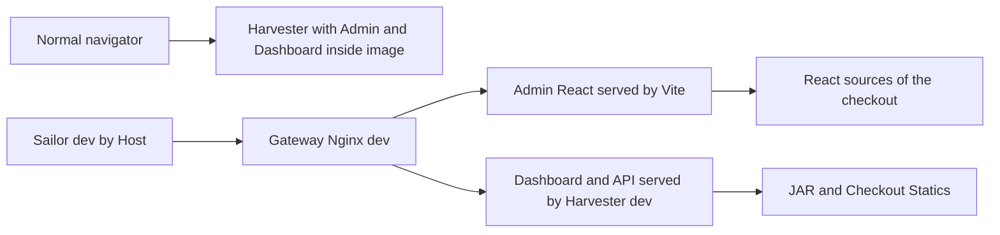
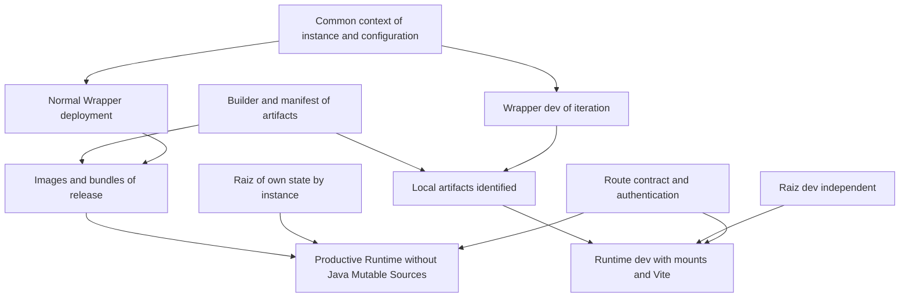

# Comparison of normal and development Docker environment
> Translation note: This machine-assisted English version preserves the source document's structure and technical examples. Commands, paths, identifiers, and hashes are retained literally; consult the Spanish source where translated wording is ambiguous.

This document compares the platform’s standard and development Docker environments and recommends separate fixes for each. It helps determine what to retain, what to change, and how to sequence the work without losing data or treating a development setup as a production procedure.

**The initial hypothesis is partially supported by the documents:** dev integrates a more complete flow to work with Admin React, Vite and the gateway, and better reflects some v5 authentication changes. The standard environment retains a more suitable base for deploying Java as images and more operational tools. The standard environment also includes compiled Admin and Dashboard frontends. Having backup, restore, resource presets, or a user menu does not guarantee that those operations are valid for the current platform.

The central recommendation is **to maintain two forms of implementation with common contracts**: development with local sources and artifacts, and production with versions of identified and deployable applications. Data protection, false success reports and recovery procedures must be corrected first. It is then appropriate to harmonize configuration, identity of artifacts, migration, authentication and storage. The improvements of the gateway dev must be adapted to production by serving compiled static and preserving their access controls, without introducing Vite as a production server.

## 1 Source scope and limits

Date: **3 October 2026**. This comparison uses **only** the following documents as technical evidence. The hashes identify the Spanish source analyses; they are not hashes of these English translations:

|Source|Abbreviated name|SHA256 of the document used|
| --- | --- | --- |
| [ANALISIS_OPERATIVO_DOCKER_SH.en.md](ANALISIS_OPERATIVO_DOCKER_SH.en.md) |N, normal analysis| `bd492caa66688be947e6988508f769f5510fd11cad1be9672c32b832091f701b` |
| [ANALISIS_OPERATIVO_DOCKER_DEV_SH.en.md](ANALISIS_OPERATIVO_DOCKER_DEV_SH.en.md) |D, dev analysis| `2bafb5448014845efdfb0add9191bbb5f50de41c6f3cdd4c065aea8dd3e1aa21` |

The scripts, Compose files, POMs, Java classes, and configurations were not re-inspected to determine behavior. No external sources were consulted and no new Docker tests were run. The hashes above identify the Spanish source analyses; they do not certify the current implementation.

Both sources describe local snapshots related to the same parent commit, with local changes and independent modules. N documents 33 findings H01-H33; D documents 42 findings DEV-01-DEV-42. They are **75 documentary entries**, with shared problems and overlaps; they do not represent 75 independent failures or a count of incidents.

Three types of affirmation are used:

- **documented fact:** behavior described in N or D, linked to its section.
- **Inference of comparison:** conclusion to relate these behaviors; is identified when their scope is relevant.
- **Proposal:** recommendation, fix, objective design or future test; it is not claimed that it already exists or is validated.

"Normal" identifies docker.sh and its base model. "Production" identifies the objective use of this environment in this plan; **does not mean that the tested installation is certified for production**. The documents do not test a full deployment, full recovery or a high-availability operating model.

Fixes are described at the level of expected behavior, scope, acceptance criterion and transitional caution. They are not implemented in this task. To implement them, you will have to return to the current code and check that it still coincides with the sources.

## 2 Reading index

1. [Conclusion and capacities](#3-conclusion-on-the-orientation-of-each-environment).
2. [Current components](#4-comparison-of-components-and-interface-flows).
3. [Command and operating cycle](#5-comparison-of-commands-and-life-cycle).
4. [Settings](#6-configuration-profiles-and-precedence).
5. [Build and run](#7-compilation-of-artifacts-and-java-execution).
6. [Data and isolation](#8-persistent-isolation-and-recovery).
7. [Security and oversight](#9-network-authentication-resources-and-supervision).
8. [Standardization of directories and migration](#10-directory-standardization-and-data-migration).
9. [Normal recommendations and production](#11-recommendations-and-fixes-for-the-standard-environment-and-production).
10. [Commission](#12-recommendations-and-fixes-for-the-dev-environment).
11. [Shared work](#13-shared-recommendations-and-objective-architecture).
12. [Enforcement order](#14-work-plan-and-dependencies).
13. [Verification and acceptance](#15-correction-verification-plan).
14. [Full traceability](#16-traceability-of-the-original-findings).
15. [Outstanding decisions and maintenance](#17-open-decisions-and-document-maintenance).

## 3 Conclusion on the orientation of each environment

### 3.1 Capabilities that distinguish the environments

|Dimension|Normal according to N|Dev according to D|Comparison assessment|
| --- | --- | --- | --- |
|Java execution|Artefacts within images per application|Local JAR mounted and shared runtime|Normal favors separate deployment and checkout; dev favors iteration|
|Admin React|Compilated and included in Harvester|Compile plus Vite server with HMR|Dev offers more advanced editing flow, not a normal missing application|
|Dashboard Angular|Compilated and included in Harvester|Compilated from host; no ng serve of the overlay|Similar integration, different file origin in runtime|
|Access by Host|No normal own gateway|Admin and Dashboard separated by Nginx|Transferred to production with adaptation|
|Authentication|Menu users.properties historical|Recognize SQL identities and remove legacy files|Dev is more aligned in this aspect; none offers complete v5 management in your CLI|
|Source preparation|Init / pull per githelper according to flow|Workspace Java prepared externally; helper VuFind own|Normal offers initial automation, but can change reviews when starting|
|Operational tools|start, stop, health, resources, backup / reset|Build selected, watch, front-dev, isolated|Complementary strengths, with defects in both|
|Persistent State|Constant normal roots|Configurable dev root with separate default|Dev separates data better initially; none guarantees all isolation|
|Build identity|Manifest and partial DARK check|No manifests; JAR by date|Normal has a base that should be completed and taken to dev|
|Java user|Low to lareference with gosu|Root image by default|Advantage of The standard environment that dev should incorporate with permit policy|
|Recovery|Genera backup / restore with documented incompatibilities|Does not include own backup / restore mechanism|The nominal capacity of The standard environment does not constitute reliable recovery|

Sources:[N § § 3, 10-12](ANALISIS_OPERATIVO_DOCKER_SH.en.md#3-operation-model),[N § § § 20-24](ANALISIS_OPERATIVO_DOCKER_SH.en.md#20-interactive-assistant),[D § § 3, 14-20](ANALISIS_OPERATIVO_DOCKER_DEV_SH.en.md#3-general-model-and-differences-with-the-standard-environment).

### 3.2 What to retain from the standard environment

The principle of running Java from an image should be retained, the application user, the packaging of compiled interfaces, the possibility of stopping and uprooting unrecombinable containers, the distinction between modules and services, and the intention to record the identity of the build. They are decisions compatible with controlled deployment, although their implementation needs adjustments.

The intention to manage resources and recovery should also be retained. These procedures require substantial corrections: they should not be promoted as guarantees until they are tested. The standard environment mixture construction, source update, initialization and installation; that mixture must be reduced so that "starting a version" has foreseeable effects.[N § § § 13-15](ANALISIS_OPERATIVO_DOCKER_SH.en.md#13-complete-up-flow),[N § § 19, 23-25](ANALISIS_OPERATIVO_DOCKER_SH.en.md#19-health-resources-and-monitoring).

### 3.3 What to retain from dev

The selected compilations with local units, the build as a service, Vite / HMR, access via gateway, the initial isolated root and the persistent Shell history should be maintained. They allow iterating without rebuilding an image for each Java change and without installing Maven / Node globally in the host.

Dev requires to repair your watcher, spread of faults and cleaning so that this speed does not produce misleading results or affect other data. Its standard mode allows you to adopt data / containers from The standard environment and therefore breaks a separation that the name dev might suggest.[D § § 12, 15-17](ANALISIS_OPERATIVO_DOCKER_DEV_SH.en.md#12-java-compilation),[D § § 23-27](ANALISIS_OPERATIVO_DOCKER_DEV_SH.en.md#23-code-watch-and-automatic-rebuild).

### 3.4 What cannot be inferred from comparison

It cannot be said that dev has newer versions of all services, that normal is more stable in any installation, that more functions mean more reliability, and that one script can replace the other by preserving all the effects.

The highest dev alignment is observed in specific interface and authentication flows. The best productive orientation of The standard environment is seen mainly in Java packaging and operational tools. In both cases, actual performance, build times, availability and recovery require evidence that the documents did not complete.

## 4 Comparison of components and interface flows

### 4.1 Functional inventory

|Component|Normal|Dev|Need for harmonization|
| --- | --- | --- | --- |
|PostgreSQL|SQL State shared by project apps|Same service inherited; change root dev|Credentials, isolation, readiness and migration|
|Solr|Image with assets and persistent cores|Hereda image / entry; changes mounts / ports|Assets, config implementation and reindexation policy|
|Harvester|Own image with Java, config and SPAs|Common runtime plus JAR / config / static host|Same app behavior, different device delivery|
|Entity REST|Own image; db-init dependence|Common runtime; inherited dependence|Availability of Shell / db-init and Elastic when needed|
|OAI|Own image and oai profile|Common runtime and inherited profile|OAI exposure tests, resources and effective config|
|Shell and db-init|Separate images of the same module|Same module / JAR host and runtime common|Right store, history, permissions and migration version|
|VuFind Web / DB|PHP + bind-mounted + MariaDB code|Same pattern with separate dev data|Installed status, lock / dependencies and release per version|
|Watch SCSS VuFind|Optional service inherited|Same service with root dev|Different from Java and Vite watch|
|Admin React|Static de Harvester|Static and Vite server|Publication by version and path contract|
|Dashboard Angular|Static de Harvester|Static host; gateway Dashboard|Same bundle / local with corresponding methods / API|
|Gateway|Absence In the standard environment Compose|web-gateway-dev|Add productive routing variant if adopted pattern|
|Maven builder|temporary dicker run of the wrapper|Maven-build service with profile|Solve profile and artifacts for both|

The standard environment model documents eleven basic services; dev reaches fourteen with all profiles for **three new services: builder, Vite and gateway**. The Java and both SPA applications are not three new applications introduced exclusively by dev.[N § § 7, 10, 18](ANALISIS_OPERATIVO_DOCKER_SH.en.md#7-service-modules-and-profiles),[D § § 8-9](ANALISIS_OPERATIVO_DOCKER_DEV_SH.en.md#8-compose-file-composition-and-inheritance).

### 4.2 Current interface architecture



In the standard environment, changing React / Angular involves rebuilding and updating the Harvester image. In dev, the Admin interface of the gateway comes from Vite even if a new admin-static has been published; Dashboard continues to be compiled and comes from the Harvester. The same term "rebuild front" does not mean updating all the delivery paths of that interface.[N § § § 10.3-10.4, 11](ANALISIS_OPERATIVO_DOCKER_SH.en.md#103-admin-web),[D § § 18-20](ANALISIS_OPERATIVO_DOCKER_DEV_SH.en.md#18-admin-web-and-vite).

### 4.3 Correct transfer of the gateway

**Proposal:** preserve the logical separation Admin / Dashboard and its allowlist of paths, but create a productive variant that delivers the compiled Admin - from Harvester or a defined static server. Dashboard should also correspond to the release bundle. Vite, HMR and source mounts belong to the development mode.

It is not enough to change the upstream of Vite: you need to review domains / hosts, TLS, cookies, Origin / cores, methods, readdresses, path of assets and authentication endpoints. D explains that the home gateway is clean and that Harvester dev disables secure cookies for local HTTP. These decisions do not automatically move to production.[D § 20](ANALISIS_OPERATIVO_DOCKER_DEV_SH.en.md#20-nginx-gateway-and-host-based-separation),[N § 25](ANALISIS_OPERATIVO_DOCKER_SH.en.md#25-implementation-findings-and-limitations).

## 5 Comparison of commands and life cycle

### 5.1 Operations under the same name

|Operation|Normal|Dev|Risk of interpreting both the same|
| --- | --- | --- | --- |
|No arguments|Help|Wizard|Automation invoked without command can be interactive in dev|
|up without arguments|You can choose initial build, pull, init and import|Collect selected and required Shell; up --build|Both alter more than running, by different mechanisms|
|up service|Image detection can trigger global flow|Explicit Java Compound; does not secure extra Shell for db-init|Limited selection does not imply equivalent limited effects|
|build harvester|complete Maven reactor, Proof and Image Indicated|React + Angular + Java with -am; no image or start|In dev does not produce the same drop-down unit|
|restart|Existing Container and Existing Image|existing restart or up no-deps if absent|Both keep image / env when restart; dev can create without infrastructure|
|init-db|You can remove / recreate PostgreSQL / Solr and migrate / import rules|One-off database _ migrate without compiling / starting dependencies|Normal interruptions; dev requires external preparation|
|down|Extensive and removable profiles - orphans; alias v|Delegation with options received|Profile / option scope should be explained|
|logs|Flexible Compose arguments|Always follow and tail 100 before the arguments|Attached behaviour / different output|
|shell|Compulsory service, Bash in CLI|Harvester default, Bash and fallback sh|Spring Shell Command Distinct|

Sources:[N § § 5, 13-15](ANALISIS_OPERATIVO_DOCKER_SH.en.md#5-invocation-and-commands),[D § § 5, 14-15, 26](ANALISIS_OPERATIVO_DOCKER_DEV_SH.en.md#5-invocation-and-parser-of-commands).

### 5.2 Specific operations

Normal has start / stop / pull / health / modules / res / reset-data and backup assistants / users. Dev has instance / clean / rebuild / watch / front-dev and build SPA. The most similar names - reset-data and clean - have a different destructive scope and should not become aliases during a unification.

Normal stop without arguments considers modules on and can leave other services active. Dev dismark modules also does not turn off the above. Both need to distinguish desired selection, definition Compose and real state. In production that separation allows to explain what will be deployed; in dev it avoids interpreting an icon as real availability.

### 5.3 Recommended future contract

**Shared proposal:** separate preparation of workspace, build, start, recreation, migration, import of rules and destruction. The contract for each operation should indicate whether to play Git, Targets, Images, Containers, SQL, Indexes or Persistent Configuration.

A normal deployment command must run a selected release without updating sources implicitly. An up dev can compile for convenience, but you must report that behavior and stop if any step fails. Restart must mean reboot existing container; create an absent and recreate with new env must be express operations, or at least clearly differentiated.

It is not recommended to change all names at once. First have the aid describe the actual behaviour and add explicit operations; then gradually remove alases or ambiguous flows with documented compatibility.

## 6 Configuration profiles and precedence

### 6.1 Two different profile errors

|Case|Normal|Dev|
| --- | --- | --- |
|File profile, without export|Maven reads the process and can compile the difference even if .env says ibict|Maven reads .env.dev and adopts the profile of that file|
|Contradutory export profile|Maven can follow the export; the result Compose needs to be reviewed|Compose can adopt export and Maven follow .env.dev|
|Profile shown|IU reads normal file|IU reads dev profile, but Project uses the process|
|Possible outcome|Different tag / profile / binary|Tag / profile / binary different for another divergence|

Both sources reproduce differences. Dev improves the case of reading the file for Maven, but does not solve a unique effective configuration. Copying simply env _ get from dev to normal does not eliminate all contradictions.[N § 6.3 and H01](ANALISIS_OPERATIVO_DOCKER_SH.en.md#63-two-profile-values-may-differ),[D § § 6.4, 32](ANALISIS_OPERATIVO_DOCKER_DEV_SH.en.md#64-effective-precedence).

### 6.2 Files and standardization

Normal creates .env from template, derives prefix project, recalculates nine ports and exports profiles within dc. Dev creates eight own initial keys, combines .env optional and .env.dev, synchronizes ten ports and adds profiles from DEV _ COMPOSE _ PROFILES.

Normal recalculates base + offset for ports; dev isolated does the same, but dev normal reads individual keys of the .env base. The IU dev calculates offset always. The standard environment project is derived from the prefix; SERVICE _ PREFIX dev is above all text shown. These different contracts explain why sharing values is not enough to share meaning.

In both, consult state can write env. Its awk parsers do not implement all dotenv; The standard environment cuts more spaces / quotes, while dev makes strict coincidence and can keep them. Both can truncate values with =.[N § § 6, 8](ANALISIS_OPERATIVO_DOCKER_SH.en.md#6-script-configuration-and-precedence),[D § § 6, 10, 24](ANALISIS_OPERATIVO_DOCKER_DEV_SH.en.md#6-configuration-and-precedence).

### 6.3 Proposed configuration contract

**Proposal:** solve a configuration once at the start of the operation, with explicit and validated precedence. One option to evaluate is defaults → environment configuration → local overrides → Lands CLI; the exported variables should only intervene according to a documented and visible rule. No syntax or implementation tool is fixed here.

The solved result should feed equally Maven, Compose, selection of services, clean / reset, IU and backups. It should include project, Java profile, Compose profiles, data root, ports, URLs and source references. A read-only "plan" should show those fields without revealing secrets or persisting changes.

Save mode / modules / ports changes is another operation. It should not happen when consulting ps / logs. The interpolation configuration should also not be confused with variables actually injected into each container.

## 7 Compilation of artifacts and Java execution

### 7.1 Build comparison

|Appearance|Normal|Dev|Recommendation|
| --- | --- | --- | --- |
|Maven|clean package of the reactor|-pl -am install, or Java global list|Keep both purposes; identify when clean is needed|
|Cache Maven|Ir-maz-cache global al daemon|Volume of project|Declares scope; do not confuse cache with backup|
|Frontens|Reactor contains React and Angular|Harvester builds them before; all after Java|Ensure consistent joint version / publication|
|Tests|skipTests|skipTests Java; no full suite front from wrapper|Separate the rapid dev cycle of mandatory release verification|
|Settings / Mirror|Use alternative file if it exists|Wrapper does not apply that settings|Declares common policy or intentional difference|
|Permits build|Partial target correction|No ownership repair|Common UID / GID policy and scribable paths|
|Provenance|Partial Manifest and DARK Permissive Check|No equivalent identity|Common identity, strict validation when releasing version|
|Runtime Java|Image by application|Common image + JAR host|The deliberate difference that should be maintained|

Sources:[N § § § 10-12](ANALISIS_OPERATIVO_DOCKER_SH.en.md#10-maven-and-frontend-compilation),[D § § 12-16](ANALISIS_OPERATIVO_DOCKER_DEV_SH.en.md#12-java-compilation).

### 7.2 Identity and publication

The standard script records parent commit and JAR hash; not all nested commits or effective profile. DARK check can return success if you do not check certain requirements. Dev chooses the most recent JAR by mtime and does not generate manifesto. None has a complete and mandatory identity of all components.

**Proposal:** a common manifesto must describe commits and dirty of each module, profile, device hash, Admin / Dashboard bundle versions and image references. In production, an unverified device should not be published as a release. In dev, a build with local changes can be allowed, identifying it as such; it should not be replaced by the "newer" JAR without selection check.

It is important to separate manifest from build - what was produced - and display log - what ID image, configuration and SQL scheme are being used. An image tagged with a profile does not in itself demonstrate the binary profile.

### 7.3 Packaging and layered startup

N documents a specific problem: layer extraction and root execution with -cp. did not locate launchers in the isolated test. It also documents that POM fixes exectable true and that the Maven argument did not guarantee compatibility tools in the observed JAR. D executes java -jar and avoids that extraction path, but that does not certify any combination of profiles / artifacts.

There is a nuance between the sources: D describes the purpose of exequtable = false; N shows that its effect should not be assumed against the explicit configuration of POM. **This comparison takes the most restrictive evidence:** actually verify the JAR format in both and The standard environment launch structure; not conclude that the flag only corrects the packaging.[N H29, H30, H33 and § 30](ANALISIS_OPERATIVO_DOCKER_SH.en.md#30-validation-performed-during-analysis),[D § § 12.2, 16.4](ANALISIS_OPERATIVO_DOCKER_DEV_SH.en.md#122-command-and-consequences).

### 7.4 Different runtime configuration

Normal override copy to / config persistent and to runtime, conserves application.properties. d / 99-docker.properties and goes down to application user. Dev applies overrides only to runtime, removes 99 root after conversion, removes four auth legacy artifacts from the external config and runs as root.

Therefore alternating the entrypoints can leave persistent config different even if Java uses the same module. Both use cp-ru by date to sow defaults. **Proposal:** define which files are from the operator, which from the product and which ones are generated; compose runtime without depending on timstamps or automatically write overrides on the operator's config. The transition must preserve existing configurations and remove only files identified with explicit migration.[N § 12](ANALISIS_OPERATIVO_DOCKER_SH.en.md#12-entry-and-configuration-of-java-applications),[D § 16](ANALISIS_OPERATIVO_DOCKER_DEV_SH.en.md#16-development-java-entrypoint).

## 8 Persistent isolation and recovery

### 8.1 Shared roots and resources

|State|Normal|Dev isolated|Normal dev|
| --- | --- | --- | --- |
|Harvester / SQL / index data|Docker / volume with constant path|DEV _ DATA _ ROOT, default Docker / volume / dev / lareferencia-dev|Docker / volume|
|Java code in runtime|Image copy|Checkout RO|Checkout RO|
|Targets and outputs SPA|Host during build; runtime Java from image|Shared host|Shared host|
|VuFind Code|RW mounted Checkout|Same checkout RW|Same checkout RW|
|Override Docker|Shared host|Shared host|Shared host|
|Maven cache|Global daemon|Appointed by project|It depends on the effective project of|
|Image Java|Tags by app / profile|Tag dev by profile|Tag dev by profile|
|Solr / VuFind tags|Shared by profile|They can match normal|They can match normal|
|VuFind .installed|Checkout out of submount data|Same state out of root dev|Same status|

Normal change prefix / offset does not change bind roots. Dev isolated better separates the initial data, but maintains shared outputs, source and tags. In addition Docker / volume / dev is contained in the wide root that reset-data normal can clean. **Inference:** isolated is a partially implemented configuration / mount separation, not a border that the destructive commands of both always respect.[N § § 8.3, 16, 22](ANALISIS_OPERATIVO_DOCKER_SH.en.md#83-what-isolation-the-prefix-provides),[D § § 17, 25-27](ANALISIS_OPERATIVO_DOCKER_DEV_SH.en.md#17-complete-storage-map).

### 8.2 Store Harvester and Shell

Both Harvester use store.basepath = / data in the snapshot. The metadata are net in `<NETWORK>/metadata/A/B/C/<hash>.xml.gz`; snapshots in `<NETWORK>/snapshots/snapshot_<id>/catalog/catalog.db` validation / validation.db. What changes is the mount host of / data. The property metadata.store.fs.basepath does not decide the basis of the implementation described.

Shell doesn't automatically share that store. In the standard environment your path / workspace / Docker / data / shared / store is not bind-mounted and may be ephemeral or unscribable. In dev it does correspond to the workspace of the host, but RO. **It's the same override with different operating failures according to runtime.** The dev history path is persistent and separate; The standard environment does not have that dedicated mount.[N § § 15.3, 16.3](ANALISIS_OPERATIVO_DOCKER_SH.en.md#153-interactive-shell-and-shell-container),[D § § 15.3, 17.3-17.4](ANALISIS_OPERATIVO_DOCKER_DEV_SH.en.md#173-harvester-store).

### 8.3 Destruction and recovery

|Operation|Documented scope|Main lack|
| --- | --- | --- |
|Normal reset|Containers for wide patterns, Docker / data and Docker / volume, Manifest repositories|It may affect dev / other projects and local changes|
|Clean dev|Down with volumes, cache Maven, tag Java and root accepted by prefix|Text Guard allows..; unguaranteed context / project; ignored errors|
|Normal Backup|Large Tar more attempts to prep and program|Incorrect names, different context and uncoordinated capture|
|Normal restore|Script generated over chosen file|Non-existent CLI and incorrect DB service, ignored errors|
|Backup dev|There is no documented own mechanism|It does not protect data by calling itself dev; it is necessary to define what deserves backup|

**Proposal:** separate data destruction, container disposal, cache cleaning and source code removal. They're different decisions. The two cleaners must use exact identity and canonical roots, show plan and reject other contexts. Normal recovery should be considered a complete working unit with restore test, not only a name arrangement in the generated script.[N § § § 22-25](ANALISIS_OPERATIVO_DOCKER_SH.en.md#22-exact-scope-of-reset-data),[D § 25](ANALISIS_OPERATIVO_DOCKER_DEV_SH.en.md#25-scope-and-limits-of-clean).

## 9 Network authentication resources and supervision

### 9.1 Port exposure

Normal publishes VuFind, MariaDB, Solr, Entity REST, Elastic and OAI on all interfaces; PostgreSQL and Harvester are in loopback. Dev publishes all its ports in loopback and adds the gateway; Vite has no own host publication. Internal ports remain stable aliases and do not change with offset.

**Productive proposal:** explicitly declare which services are public and maintain internal bases / indices or subject to a controlled administrative need. Adopt an HTTP input point with productive configuration and check that the direct backend does not circumvent expected external policy. The document does not deduct the firewall or the proxy of external installations; this observation refers to the model described.[N § 8.2](ANALISIS_OPERATIVO_DOCKER_SH.en.md#82-calculation-of-ports),[D § § 10, 20](ANALISIS_OPERATIVO_DOCKER_DEV_SH.en.md#10-network-ports-and-names).

### 9.2 Identity and authorization

Normal continues to edit users.properties from the wizard, while the v5 identities described are in PostgreSQL. Dev removes known legacy files and uses Shell bootstrap in documentation, but does not bring a v5 user CRUD.

**Proposal:** a single administration contract v5 must verify success in the real identity, preserve audit and avoid secrets in arguments / logs. The withdrawal of legacy files must be a reportable migration, with backup where appropriate, and not an indiscriminate deletion that presupposes that all facilities have already migrated. Do not simply copy the dev rm to The standard environment without analyzing the authentication status.[N § 21 and H16](ANALISIS_OPERATIVO_DOCKER_SH.en.md#21-legacy-user-management),[D § § 15.3, 16.2](ANALISIS_OPERATIVO_DOCKER_DEV_SH.en.md#153-history-and-local-accounts).

### 9.3 Resources and observability

Both inherit the fixed Solr / Elastic heaps and base limits. Normal offers presets that can lower the limit below what heap needs; dev has no own presets command and can inherit those values. Both lack enough Java readiness, and up / running success is not worth business.

Normal health consults roots and tolerates failures; dev has no equivalent health and the gateway only depends on the beginning of Harvester. Wizard logs are temporary / fixed and do not represent complete application logs. **Proposal:** measure availability by documented endpoints, result of migration, version of artifact and necessary internal conditions, with waiting times. Add rotation / log per operation and memory budget that looks heavy and overhead.[N § § § 19-20](ANALISIS_OPERATIVO_DOCKER_SH.en.md#19-health-resources-and-monitoring),[D § § § 22-24, DEV-26, DEV-41](ANALISIS_OPERATIVO_DOCKER_DEV_SH.en.md#22-solr-postgresql-elastic-and-resources).

## 10 Directory standardization and data migration

### 10.1 Agreed problem and precise diagnosis

**It is recommended to normalize the current organization.** There are operational reasons, not just of style: The standard environment separates project names but retains constant physical roots; the PostgreSQL mixture and applications under larcference with Solr, VuFind and Elastic in other branches; it retains historical references to Docker / data that do not amount to effective data; and its reset covers the dev branch. Shell solves a store that is not persisting as the operator could deduct from the path.[N § § § 8.3, 15.3, 16, 22](ANALISIS_OPERATIVO_DOCKER_SH.en.md#16-full-map-of-persistence).

Not all directories are wrong. Harvester / data corresponds to a real mount, its network / snapshot organization is documented and PGDATA adds pgdata within the mounted father. Solr, MariaDB and Elastic also have identified binds. Changing uncorrected names ownership, isolation and consumers could add failures to an installation that today finds these data.

The recommendation distinguishes four problems:

|Problem|Documentary evidence|Type of correction|
| --- | --- | --- |
|Inconsistent names and hierarchies|log / logs, applications under loft, other services outside|Convention and explicit transition map|
|Instances share status|Project / prefix is not part of normal roots|Independent root by instance identity|
|Paths that do not persist what is expected|Shell store and normal history without dedicated mounts|Correct properties and mounts, not only rename host|
|Divided state lifecycle|.installed VuFind is in code; normal reset includes dev|Owner State within the exact instance and disposal|

**Inference:** this standardisation should be a priority correction of normal data architecture and a controlled harmonisation of dev. It should not be resolved by a general cleaning or a global textual replacement of Docker / volume.

### 10.2 Proposed identity convention

It is proposed to separate these notions, which are currently partially confused:

- **instance identity:** stable state identifier and its owners. It does not change because a visible port or name is altered.
- **Project Compose:** technical name of containers / network / volumes of this execution, explicitly associated with the instance.
- **State root:** canonical absolute path of the storage of that instance.
- **Workspace:** editable code that can produce versions, without being the identity of the data.
- **Release:** concrete set of artifacts / product configuration that the instance runs.

The variable names `LR_STATE_ROOT` and `LR_INSTANCE_ID` of the following examples are **new proposals**, not key already supported by the scripts. The final name must be decided when implementing. The common solution must produce a single effective root and both wrappers must consume it.

Do not automatically result in a change in the root of a project rename: the operator must know whether it is renaming resources or creating a different empty instance. The project ratio ↔ instance ↔ root should be recorded and validated before start, clean, reset, backup or restore.

### 10.3 Proposed state tree

A common structure option is:

```text
<LR_STATE_ROOT>/instances/<LR_INSTANCE_ID>/
├── meta/
│   ├── ownership.json
│   └── deployment.json
├── postgres/
│   └── data/
│       └── pgdata/
├── vufind-db/
│   └── data/
├── solr/
│   ├── data/
│   ├── logs/
│   └── cache/
├── elasticsearch/
│   ├── data/
│   └── logs/
├── apps/
│   ├── harvester/
│   │   ├── config/
│   │   ├── data/
│   │   └── logs/
│   ├── entity-rest/
│   │   ├── config/
│   │   ├── data/
│   │   └── logs/
│   └── oai-pmh/
│       ├── config/
│       ├── data/
│       └── logs/
├── shell/
│   ├── history/
│   └── work/
└── vufind/
    ├── config/
    ├── cache/
    ├── logs/
    ├── harvest/
    ├── import/
    ├── vendor/
    ├── node_modules/
    ├── themes-node_modules/
    └── state/
        └── installation.json
```

All these names are of objective design. The target files would allow to identify owner / context and release effectively; they should not store passwords. The proposed installation marker would contain version / signature and expected resources; it would consciously replace the boolean semantics .installed, it would not just be the same file with another name.

`config/` application represents the necessary operator configuration during the transition. Defaults and product bundles must belong to the release. The Compose config runtime remains temporary and is not confused with the condition that the operator must edit.

Vendor and node _ modules are shown for a transition compatible with the current VuFind pattern. In a productive design with units included in release, they can no longer be part of a mutable state; it is necessary to declare which strategy is implemented. Do not classify them as irreplaceable data just because today they occupy persistent disk.

### 10.4 Separate production, development, cache, and backups

**Proposal:** choose roots with no parent / child relationship between productive and development data. For example:

```text
/srv/lareferencia-prod/instances/nodo-a/...
<directorio-local-dev>/instances/nodo-a-dev/...
<directorio-backups-externo>/nodo-a/...
```

These are examples of distribution, not requirements to use / srv or paths that already exist. For development you can use a workspace folder if your deletion is limited exactly to your instance. For production it is appropriate to evaluate an external root to the checkout, which does not disappear when replacing sources or entering git clean. It must be configurable according to the host.

Avoid a productive root of recursive erasing containing dev, backups or code. Keep backups out of the captured / destroyed root and with own identity / retention. The caches named Maven / npm are administered by Docker; they can keep an inventory per instance / project without forcing them to invented host path.

Physical separation is necessary but not sufficient: clean / reset must continue to validate exact property and the links of the mounts. That two roots have different names does not avoid a symlink or a configuration that links both to the same destination.

### 10.5 Standard environment migration map

Be T the new root of an instance. This map is a **proposal** of equivalence, which must become a verifiable plan before moving data:

|Normal documented origin|Proposed destination under T|Specific precautions|
| --- | --- | --- |
|Docker / volume / latitude / postgres / data|postgres / data|Keep pgdata and all the cluster; choose compatible physical recovery or logical dump|
|Docker / volume / vufind / data / db|vufind-db / data|Keep MariaDB data and check user / schema; do not confuse with sell|
|Docker / volume / lareference / lrharvester-app / config|apps / harvester / config|Preserve operator settings and record legacy files before removing them|
|Docker / volume / lareference / lrharvester-app / data|apps / harvester / data|Preserve network structure, SQLite and metadata without renaming them|
|Docker / volume / lareference / lrharvester-app / log|apps / harvester / logs|Uniform host name; check effective login|
|Docker / volume / lareference / entity-rest / config, data, log|apps / entity-rest / config, data, logs|Change each mount explicitly|
|Docker / volume / lareference / oai-pmh / config, data, log|apps / oai-pmh / config, data, logs|Preserve Crosswalks / config own of OAI|
|Docker / volume / solr / data, log, cache|solr / data, logos, cache|Preserve active indexes and config; template does not replace state|
|Docker / volume / elasticsearch / data, log|elasticsearch / data, logos|Check engine compatibility when recovering|
|Docker / volume / vufind / config, cache, log|vufind / config, cache, logos|INI rewrites to the boot must use URL / DSN target|
|Docker / volume / vufind / data / harvest, import|vufind / harvest, import|Preserve installer inputs and resources|
|Docker / volume / vufind / data / sell|vufind / sell during transition|Valid composer.lock; then decide on unchanging delivery|
|Docker / volume / vufind / data / node _ modules and themes-node _ modules|vufind / node _ modules and themes-node _ modules|Watcher cache; can be regenerated with identified tools / ref|
|vufind / local / docker / .installed|vufind / state / installation.json after validation|Do not move without adjusting entry; do not preserve success if resources are lacking|
|Undedicated Shell History|shell / history|Extract only existing content; do not invent lost history|
|Store Shell / workspace / Docker / data / shared / store|Express Mount to authorized store, or separate shell / work|Do not copy it on store Harvester without comparing content and purpose|

The content of Docker / data should not "be migrated whole" to T by the historical name. N distinguishes folders without active consumer and a store Shell that is not a regular bind. You have to invent what exists, what service you use and whether it requires conservation. A path written on properties is not sufficient as proof of existing host data.

### 10.6 Path contract inside containers

It is not necessary to rename all the internal path. It is reasonable to keep / data from the Harvester and its current log paths while the host is normalized. This reduces changes in applications and is expressed by an existing destination mount host → table.

Shell needs an explicit decision. If it operates on the same store, it is proposed to set it up in a specific stable destination - for example / store - and make its effective property resolve there. If some Shell actions only consult, the mount can be RO; the ones that modify require permission and concurrence control. Your history must have a self-written, source-independent / store mount.

Avoid mounting the entire RW instance root in Shell or in each app for convenience if concrete path is enough. D documents / dev-data in some services; a review of minimum mounts would help to express ownership and reduce coupling. This is a design proposal, not a new verified runtime failure.

### 10.7 Migration in stages with data preservation

**Proposal for a procedure to be tested first in a disposable copy:**

1. **Inventory the current state.** Related project, image IDs, absolute mounts, effective configuration, SQL scheme, store content and markers. The current evidence is documentary; this inventory must be made about the facility chosen when implementing.
2. **Define the exact plan** Register origin / destination by path, storage capabilities, permissions, proprietary services and what is copied, regained or left intact. Reject destinations that are subdirectories of an inappropriate capture / erasing root.
3. **Verify prior recovery.** Produce consistent backup and restore it in a separate environment. the backup currently generated of The standard environment does not in itself meet this requirement.
4. **To stop writing in a coordinated way.** To suspend relevant tasks and writers; to preserve which services were active. Do not copy a physical cluster or SQLite WAL under scriptures like an offline copy.
5. **Copy conserving structure and permissions.** Use system-appropriate method: compatible physical recovery or SQL; store / config / indices with consistent strategy. Keep origin intact and do not make automatic later erasing.
6. **Update configuration and mounts together.** Review Compose, wrapper, Shell store / history, VuFind state, backup / restore, maintenance scripts and instance registration. Changing only DEV _ DATA _ ROOT or a bind will not cover the hardcodeated path of The standard environment.
7. **Valid before opening service** Confirm real mounts, version, permissions, SQL schema, snapshot / identifiers and interface / OAI operation. Verify that the new instance does not see data from another.
8. **Make controlled cut.** Activate the target instance and keep the protected origin available for a period defined by the operator. Record each post-cut writing.
9. **Remove the origin deliberately.** Only after acceptance and recovery test; use exact scope, never reset-data wide as a shortcut of migration.

The return to origin requires analyzing subsequent scriptures and migrations: running an earlier image against a base whose scheme already changed is not automatically a valid rollback. The plan should distinguish container roll-back, configuration roll-back and data restoration / reconciliation.

### 10.8 Acceptance criteria for standardization

The standardisation would be considered complete when:

- Two instances with the same code and different ports maintain roots and different data, and the property is registered.
- Changing project / offset does not move or reassign data silently.
- The documented mounts match those of the created container and the properties of each consumer.
- Shell writes only where it is authorized and retains history after recreation; it does not depend on a workspace path that changes the meaning between standard and dev.
- VuFind can reconstruct / revalidate your state by instance without depending on .installed shared in code.
- Clean / reset of one instance does not delete another, code, backups or other bugs.
- Backup / restore operate over T and recover a coherent platform in independent root.
- The internal metadata / snapshot layout is preserved and there is evidence of comparison before / after.

These tests should be added to the P11, P10, D06, D07 corrections and the P01 / D01 protections described below.

## 11 Recommendations and fixes for the standard environment and production

This section refers to The standard environment. Priorities are order proposals: **P0** protects from data loss or from relying on invalid recovery / success; **P1** corrects essential boot, version or operating behavior; **P2** improves repeatability, ergonomy and maintenance. They are not a vulnerability scale or a diagnosis of actual incidents.

### 11.1 P01 Limit reset to the exact instance

**Priority P0. Base:** H13 and[N § 22](ANALISIS_OPERATIVO_DOCKER_SH.en.md#22-exact-scope-of-reset-data).

Replace broad name patterns with exact project / instance identity and resource ownership. Separate removal data from checkouts. No data reset should delete local module commits / changes. Show before a plan with canonical path and concrete resources; --yes must jump interaction, no validations of reach.

Reject shared roots, escape symbols and any inclusion of foreign dev / backups. In the transition, if Docker / volume's exclusive property cannot be demonstrated, do not implement a recursive deletion of that root.

**Acceptance:** with normal, dev and another instance with a similar name, the approved reset affects only the resources of the selected instance. Local files and commons remain; an aborted invalid destination before stopping containers.

### 11.2 P02 Remake backup and restore as a verifiable procedure

**P0 priority if used as a recovery guarantee. Base:** H08-H11 and[N § § § 23-24](ANALISIS_OPERATIVO_DOCKER_SH.en.md#23-backup-generated-by-the-wizard).

Correct service names and remove calls to non-existing CLI. Reuse the same solved context - files, project, profiles and root - of the instance. Make mandatory file approval and certification results, with inventory, hashes and component versions.

Define a coordinated capture of SQL, store / SQLite, indexes and configuration. Save pre-running status and recover it through failure management; do not run indiscriminate start. A dump or capture failure must leave the backup marked as incomplete and return error. Restore must validate manifest / destination / versions and recover first in a separate instance.

**Acceptance:** restore a copy with known networks / snapshots / VuFind data; compare quantities and relationships, test interfaces and OAI, and demonstrate that a failed dump does not end in complete Restore. Setting only two names does not meet this acceptance.

### 11.3 P03 Propagate errors and show the result of each phase

**Priority P1; P0 in backup / destruction. Base:**[N § § § 20.3, 23-24](ANALISIS_OPERATIVO_DOCKER_SH.en.md#203-progress-and-error-propagation)and contrast to[D § 24.3](ANALISIS_OPERATIVO_DOCKER_DEV_SH.en.md#243-errors-hidden-in-compound-functions).

Define explicit return controls in Git, Maven, manifests, image, migration, import and boot preparation. To prevent an ignored error or a last successful command from representing the complete operation. Replace oval command construction with structured arguments where appropriate, reviewing quoting of path and profiles.

The IU may keep the menu after a failure, but it should also keep the status and phase failed. There is no automatic general rollback: record what was completed and what was not, to allow a deliberate recovery.

**Acceptance:** inject failure in each phase and check that the dependent step does not run, that there is no global success and that CLI returns no zero. Test path with spaces and values admitted without accidental shell execution.

### 11.4 P04 Separate migrations and data imports from the infrastructure lifecycle

**Priority P1. Base:** H05 / H06 and[N § 15](ANALISIS_OPERATIVO_DOCKER_SH.en.md#15-database-and-shell-initialization).

Remove the need for PostgreSQL / Solr rm to run migrations. Validate Job Shell version, wait readiness with limit and identify target scheme. Table migration and validator / transformer import should be differentiated actions; review idempotency of imports before repeating them in each rebuild.

Define when a release update needs maintenance window and which writers are paused. The db-init dependency can check / apply compatible schema, but it must not compete with a second path of migration without coordination.

**Acceptance:** migration on new and existing basis, second idempotent execution and rejection of incompatibility. DB / index containers are not removed because they invoke init-db; readiness errors abort with diagnosis.

### 11.5 P05 Separate deployment from build and update Git

**Priority P1. Base:** H23 and[N § § 9, 13-14](ANALISIS_OPERATIVO_DOCKER_SH.en.md#13-complete-up-flow).

A productive start should refer to identified images and not make githelper pull by a failed image detection. Create explicit operations to prepare sources, build and deploy. The detection of artifacts should include db-init and check release images, not infer existence exclusively from the view of container images.

Maintain a comfortable initial installation flow only if you explain that you prepare sources and build; do not apply it silently to an ordinary deploy or to post-gres up.

**Acceptance:** * boot a release from present images does not modify any Git review or require Maven. If an image is missing, report the concrete; do not update main branches to solve it.

### 11.6 P06 Use the same resolved configuration for every consumer

**Priority P1. Base:** H01 / H31 and[N § 6](ANALISIS_OPERATIVO_DOCKER_SH.en.md#6-script-configuration-and-precedence).

Resolve Maven profile, project, ports, services and URLs once and reuse them in build, compound, manifests, IU and maintenance. Define export / file / CLI precedence and validate major conflicts. The consultations should not rewrite env or regenerate the identity of the project.

Introduce section 10 root change through that common configuration. Do not try to correct H01 by only exporting one variable on one branch and leaving the others with other readers.

**Acceptance:** ibect file without export and contradictory export with file produce a unique, explicit and verifiable result. binary profile / manifest / tag matches. ps / logs do not modify file or change contexts.

### 11.7 P07 Correct cache and build range

**Priority P1. Base:** H02 / H03 and[N § § § 13.3, 14](ANALISIS_OPERATIVO_DOCKER_SH.en.md#133-build-path).

Apply --no-cache only to build and according to chosen policy. Do not add it to up. Avoid build global without cache and reapply to build immediately without need. consciously include required artifacts / jobs in the selection of build.

Store clean package to release reproducible if that is the policy, but allow a different selection of images from the reactor when it makes sense. Do not equate "cache off" to delete data or download new base.

**Acceptance:** cache ON / OFF produces the right arguments, up uses only valid options, build harvester includes or verifies the compatible db-init necessary for release, and does not perform a duplicate build phase without justification.

### 11.8 P08 Fix the JAR format and standard launch path

**Priority P1. Base:** H29 / H30 / H33 and[N § 30](ANALISIS_OPERATIVO_DOCKER_SH.en.md#30-validation-performed-during-analysis).

Choose a supported packaging format: complete JAR or layers with proven layout / launcher. Correct the relationship between exectable POM, extraction and classpath. Detect structure by inspecting artifact / classes, without starting the app with --help to guess launcher.

The fallback can be maintained deliberately, but it must be recorded what way it was chosen and why. Don't assume that changing a Maven flag fixes all the POM.

**Acceptance:** build / start each app in both ways you decide to support. The detection test does not start business logic, and an incompatible device fails before it is deployed.

### 11.9 P09 Replace legacy users and migrate authentication settings

**Priority P1. Base:** H16 / H19 and[N § § 12.4, 21](ANALISIS_OPERATIVO_DOCKER_SH.en.md#21-legacy-user-management).

Remove or disable the menu that presents users.properties editing as v5 management. Incorporate a SQL procedure supported by the identity commands / API that really supports the application, with subsequent validation. Do not save or pass passwords on arguments / logs when the input method can avoid it.

Inventory legacy files and prepare config migration before removing them. D offers a v5 alignment signal, but its automatic deletion is not in itself a productive migration strategy.

**Acceptance:** create / disable an identity changes the actual login and authorized roles. The IU does not announce successful v5 management just because it modified a file. Unmigrated instances are detected and your information is not destroyed quietly.

### 11.10 P10 Persist the Harvester store and Shell history correctly

**Priority P1. Base:** H17 and[N § § 15.3, 16](ANALISIS_OPERATIVO_DOCKER_SH.en.md#153-interactive-shell-and-shell-container).

Define whether Shell shares store Harvester or has an independent one. Add explicit mounts / property with stable internal path and minimum permissions; remove false equivalence between / workspace / Docker / data and host. Continue history in a dedicated destination.

Before migrating any existing internal content, compare purpose / versions and prevent an overwrite copy catalog.db / validation.db from another snapshot. Shell history and store are two different resources.

**Acceptance:** approved reading / writing Shell commands act in the planned store, data and history survive recreation and the checkout is not required to have a historical folder to function.

### 11.11 P11 Normalize storage roots and make them configurable per instance

**P1 priority; P01 / P02 dependence. Base:** H04 and[N § § § 8.3, 16](ANALISIS_OPERATIVO_DOCKER_SH.en.md#83-what-isolation-the-prefix-provides).

Implement the convention and section 10 map. Use independent canon root by instance and property registration. Preserve internal apps destinations where possible; modify Compose, maintenance and consumers together.

Migration must have verified backup and preserve origin. Do not make Docker / volume a new root while there are services writing, or use symlinks as a permanent substitute for a clear mountain identity.

**Acceptance:** two projects / instances do not share SQL or index by accident; change name / offset does not reassign data; reset and restore respect exactly your root. Verifications before / after snapshots satisfy section 10.8.

### 11.12 P12 Adapt routing and production exposure

**Priority P1 before external exposure. Base:** H32,[N § § § 8.2, 25](ANALISIS_OPERATIVO_DOCKER_SH.en.md#82-calculation-of-ports)and[D § 20](ANALISIS_OPERATIVO_DOCKER_DEV_SH.en.md#20-nginx-gateway-and-host-based-separation).

Create productive input configuration that serves Admin / Dashboard compiled and conserves deliberate paths / API. Declares domains, TLS, forwarded headers and cookies / CSRF range. Limit the publication of DB / Solr / Elastic to what is necessary and replace static credentials in productive facilities with defined secret management.

Do not introduce Vite / HMR or transfer cookies -secure = false as a productive default. Nor do you trust Allowlist Nginx to replace backend authorization.

**Acceptance:** static resources and login run by the chosen hosts, cookies / security correspond to the deployment, restricted paths / methods are rejected and an unauthorized user does not access by direct backend. DB / indices are not publicly accessible by an unnoticed default.

### 11.13 P13 Complete build identity and make verification strict

**Priority P1. Base:** H22 / H27 and[N § 10.6](ANALISIS_OPERATIVO_DOCKER_SH.en.md#106-identity-of-the-build-and-dark-check).

Record all nested, dirty, effective profile and JAR / bundles; link these artifacts to image IDs / digests. If DARK check is a condition of release, the lack of tools or inputs must return failure or a non-publicable state, not a success with error message.

The policy can admit local build with dirty for development, identifying them, and requiring a stable inventory to release. Do not use parent commit as the only origin of the binary.

**Acceptance:** adulterating the included library or removing a required entry blocks publication; each displayed image can be unequivocally associated with its sources / profile / bundles.

### 11.14 P14 Prepare the workspace and VuFind predictably

**Priority P1. Base:** H14 / H15 and[N § 9](ANALISIS_OPERATIVO_DOCKER_SH.en.md#9-preparing-and-updating-the-code).

Validate all reactor modules, including front lines, before Maven. Allow explicit preparation with known references. For VuFind, manage pre-created directory with runtime files without stderr hiding or destroying them; validate that integrating code does not mix source files from incompatible versions.

Leave stop / ps / down free of cloning. Share the preparation mechanism with dev once your / ref / conservative copy is corrected, instead of copying cp-an without controls.

**Acceptance:** workspace where only one front is missing returns diagnosis and correct preparation; VuFind with pre-created local / sell can be prepared to keep them; an incomplete .git or source conflict is reported without automatic reset.

### 11.15 P15 Align resource limits and Java heap settings

**Priority P1. Base:** H25 and[N § 19](ANALISIS_OPERATIVO_DOCKER_SH.en.md#19-health-resources-and-monitoring).

Define heap and overhead budget compatible with each limit. Validate presets before applying them, include OAI and remove references to non-existing services. Distinguish VuFind web limit from MariaDB; do not imply that a key controls both.

Show if new limits are configured but not yet adopted by containers. The application requires explicit recreation or supported mechanism, not a restart that conserves env / config.

**Acceptance:** each supported preset starts the announced selection without less limits than its JVM configuration, and inspect / future test confirms what was applied. Do not promise a sufficient universal RAM value without measuring the host / load.

### 11.16 P16 Define local and external Solr behavior and core updates

**Priority P1. Base:** H07 / H20 and[N § 17](ANALISIS_OPERATIVO_DOCKER_SH.en.md#17-construction-and-initialization-of-solr).

For external purposes, remove local units and spread the URL to all relevant consumers, including migration / import. For local, separate core installation, configuration application and reindication. Register active config / versions of schema and warn when you need to reindexate.

Do not solve it by deleting .lr _ initialized or index. The set-up and the persistent core have different functions; publishing new assets needs effective image / config and adoption procedure.

**Acceptance:** a supported external mode does not start local Solr or preserve internal URLs; a compatible core modification reaches the active config by explicit operation, preserving data, and an incompatible is detected.

### 11.17 P17 Version VuFind and its dependencies together

**P1 priority for repetitive releases. Base:** H21 / H28 and[N § § § 17-18](ANALISIS_OPERATIVO_DOCKER_SH.en.md#18-construction-and-initialization-of-vufind).

Pour VuFind code together, composer.lock / sell, Solr assets and installation status / scheme. Compare lock signature, not only the existence of autoload.php. Take the installed marker to state by instance and verify full resources.

As a productive improvement, evaluate including code / dependencies in artefact or release image, reserving mutable binds for data / config. The productive runtime should not quietly install units other than the release by an incomplete directory.

**Acceptance:** change ref / lock requires controlled update, a new installation does not use the brand of another instance and the deployment records the remote entries set. The goal of immutable code is new; N documents that today VuFind remains a bind.

### 11.18 P18 Review permissions, logs, and service availability

**P1 priority for permissions / readiness; P2 for ergonomics. Base:** H26 / H32 and[N § § § 12.2, 16.5, 19-20](ANALISIS_OPERATIVO_DOCKER_SH.en.md#19-health-resources-and-monitoring).

Keep Java user not root, define UID / GID / ownership state and replace chmod generals with expressly scribable directories. Avoid recursive chown of all storage in each boot if it can be resolved with controlled property provision / migration.

Add useful readiness per service and log per operation / project with proper rotation. Protect concurrent mutations through specific locks, preserving independent consultations. The host metrics of the wizard should not be presented as the exclusive metrics of an app.

**Acceptance:** permissions after migration allow to write only the planned; API no ready returns different running status; two incompatible build / reset / backup do not compete; the failure keeps log identifiable.

### 11.19 P19 Isolate backup scheduling and define retention

**P1 priority if scheduled. Base:** H12 and[N § 23.1](ANALISIS_OPERATIVO_DOCKER_SH.en.md#231-files-and-scheduling).

Use instance identity for cron / systemd tasks and quoted paths. High / low must be idempowerful and locate exactly the created programming. Retention must act exclusively on recognized and complete backups of the chosen owner, not all old directories of the destination.

Separate immediate backup of a scheduler's availability. Avoid destination within captured tree, timstamps collision per minute and simultaneous cron / manual execution.

**Acceptance:** reconfigure does not duplicate tasks; disable removes its own; another instance maintains its own. An old foreign directory is preserved and simultaneous executions do not produce the same file / folder.

### 11.20 P20 Align the CLI, UI, and documentation with actual capabilities

**Priority P2. Base:** H24 and[N § § § 5-7, 20, 25](ANALISIS_OPERATIVO_DOCKER_SH.en.md#5-invocation-and-commands).

Validate arity / services / flags before mutating files. Remove or consciously implement BUILD _ ON _ START / maz-consumer-free repo, historical profiles and actions that announce more than they do. Separate desired state, running state, health and version.

The aid should describe build, init, reset and cache exactly. If you remove an unreliable capacity - for example old backup or users legacy - show the updated procedure available rather than keeping a misleading button.

**Acceptance:** each action announces its effects and uses supported arguments. Invalid inputs fail before preparing sources / destroying resources; it is not considered "configured option" a no-effect key.

## 12 Recommendations and fixes for the dev environment

Dev must preserve the speed of editing and the initial isolation, incorporating guarantees that the artefact, state and result announced match the real ones. The following proposals apply to dev, with the priorities defined in section 11.

### 12.1 D01 Protect clean before any disposal

**Priority P0. Base:** DEV-01, DEV-04, DEV-25 and[D § 25](ANALISIS_OPERATIVO_DOCKER_DEV_SH.en.md#25-scope-and-limits-of-clean).

Resolver path canonical and exact owner; reject.., symbols that come out of authorized root, normal roots and contradictory effective project. Compare the context you will use Compose with that used for volumes / images. Do those checks before down, not just before rm.

If the instance cannot be stopped correctly, do not then delete data that can continue in use. Report resources eliminated and pending. Do not remove a shared Java tag as a mandatory clean own resource; separate image / cache cleaning.

**Acceptance:** traversal, synlink, export of another project and down failure abort without deleting data or touching another context. The valid case eliminates only data / volumes expressly own and reflects partial failures.

### 12.2 D02 Stop operation in the first failed step

**P0 priority for confidence in the result; P1 for build. Base:** DEV-02 and[D § 24.3](ANALISIS_OPERATIVO_DOCKER_DEV_SH.en.md#243-errors-hidden-in-compound-functions).

Do not trust set-e within Compose / conditional functions as the only control. Each build and publication must have an explicit result. The progress wrapper must represent the entire operation, also evaluate log writing and preserve complete output.

Do not run restart / up after a Java or SPA failure. The menu may continue, but the operation is still failed. Inform if partial file changes remain even if the previous container remains.

**Acceptance:** play the Java trial fails + successful SPA and get no zero / without Completed; repeat for front, Docker and tee errors. No reboot of the app or present as the right new build.

### 12.3 D03 Unify up and db-init preparation

**Priority P1. Base:** DEV-03, DEV-20 and[D § § 12.5, 15](ANALISIS_OPERATIVO_DOCKER_DEV_SH.en.md#125-selected-build-and-db-init).

Derivating necessary devices from services / dependencies for both branches of up. Harvester / Entity REST must secure Shell of the same profile for db-init even if interactive Shell has not been selected. Manual init must check artifact and readiness, or explain / execute an explicit idempotent preparation.

Do not fix it by reconstructing the entire platform for any service. The selection must incorporate the required job and its dependencies, keeping the compilation cut.

**Acceptance:** workspace without Shell target allows up harvester / entity-rest with correct preparation; OAI does not add unnecessary SQL migration. An init-db without infrastructure or artifact returns useful diagnosis or prepares them according to defined contract.

### 12.4 D04 Fix change detection and queueing in the watcher

**Priority P1. Base:** DEV-05, DEV-19, DEV-40 and[D § 23](ANALISIS_OPERATIVO_DOCKER_DEV_SH.en.md#23-code-watch-and-automatic-rebuild).

Capture all outstanding groups - Java, React, Angular and Admitted configuration - on a temporary border or stable inventory. Treat them in an orderly manner without final touch discards changes that occurred before or during build. Incorporate detection of erasure and shared dependencies that really affect the service, with explicit pruning of outputs / caches.

One alternative to evaluate is inventory / content signature per group; another is events with tail / debounce. A bookstore is not prescribed. The requirement is to keep pending changes, avoid output loops and end up clean with signals. Valid interval.

**Acceptance:** two simultaneous SPA changes build both; a change during build is not lost; delete relevant file / config triggers declared action; Ctrl-C / TERM stops children when appropriate and takes off temporary without continuing with non-existing stamp.

### 12.5 D05 Solve configuration and show effective values

**Priority P1. Base:** DEV-06, DEV-27, DEV-28, DEV-34, DEV-35 and[D § § 6, 10, 24](ANALISIS_OPERATIVO_DOCKER_DEV_SH.en.md#6-configuration-and-precedence).

Use the common solution for Maven / Compose / clean / IU. Read effective ports / project for display, with declared precedence and parser compatible with accepted values. Valid decimals, final range and modes; do not convert invalid text to an unexpected configuration silently.

Do not rewrite ten ports when consulting ps. Save changes explicitly. VUFIND _ REPO _ URL / REF must be resolved in the same context as announced, or clearly declared as an intentional exception.

**Acceptance:** contradictory export profile does not produce separate tag / binary; IU shows real individual normal port; quotas / = admitted are not truncaran; consultations do not change file.

### 12.6 D06 Fix Shell store persistence and limit writable mounts

**Priority P1. Base:** DEV-07 and[D § § 17.3-17.4](ANALISIS_OPERATIVO_DOCKER_DEV_SH.en.md#174-shell-does-not-automatically-share-that-store).

Adopt section 10.6 contract: express shared or independent storage, correct property and mount RW only when required. Keep persistent history on dedicated path, separating it from a complete dev root mounted for convenience.

Keep workspace Java RO, but do not use it as an app data destination. Check Shell / Harvester's concurrence over SQLite before enabling indiscriminate shared writing.

**Acceptance:** the Shell session uses the decided store, authorized operations work, does not try to write under workspace and history survives recreation. The test must check effective data, not only that mkdir left a folder.

### 12.7 D07 Encapsulate VuFind installation state and checkout management

**Priority P1. Base:** DEV-08, DEV-23 and[D § 21](ANALISIS_OPERATIVO_DOCKER_DEV_SH.en.md#21-vufind-download-and-inherited-initialization).

Move property from .installed to state by instance with resource verification / ref / lock. A clean that removes config / import must invalidate corresponding installation status; keeping code does not mean keeping full installation.

Maintain the temporary preparation that preserves pre-existing runtime, but detect source file conflicts and validate Git / ref / composer.json. Do not use the existence of a single file to affirm the integrity of the checkout or quietly merge versions.

**Acceptance:** two instances with the same code have different installation status; clean + up regains necessary resources; partial checkout does not step in change or end up announced as correct if it mixes incompatible sources.

### 12.8 D08 Prepare Solr assets and distinguish restart from reload

**Priority P1. Base:** DEV-09, DEV-22 and[D § 22.1](ANALISIS_OPERATIVO_DOCKER_DEV_SH.en.md#221-solr-retains-marker-based-initialization).

Share validated asset preparation with normal, not dependent on previous executions. `reload solr` should be renamed / described as restart if it maintains this implementation, or become an action that checks / applies config actively.

Avoid index / marker erasing as a recharge method. Separate template change, JAR / importer image and schema / index. Versify the settings that apply.

**Acceptance:** new workspace dev builds Solr with planned inputs; editing existing core template produces effective change by declared procedure or a necessary action diagnosis, never a false "applied" by just reboot.

### 12.9 D09 Clarify restart, recreation, and `frontend-dev` behavior

**Priority P1. Base:** DEV-10, DEV-11, DEV-39 and[D § 14](ANALISIS_OPERATIVO_DOCKER_DEV_SH.en.md#14-startup-recreation-and-restart).

Restart must verify existing container and keep semantic. For one absent, an explicit start / up must prepare dependencies or report requirement; do not use no-deps as transparent fallback. Recreation adopts new image / env / mount; there must be a different documented path.

Frontend-dev can keep up the set, but your description should not promise to restart if you do not force it. Inform that you recombine static Admin and serve Admin Vite are different operations.

**Acceptance:** change of entry / port / env uses correct recreation path; restart of absent service does not start app with omitted dependencies without explanation; IU / CLI does not announce Vite reinitiated when it remained the same.

### 12.10 D10 Select JAR by identity and publish a coherent version

**Priority P1. Base:** DEV-12, DEV-42 and[D § § 12-16](ANALISIS_OPERATIVO_DOCKER_DEV_SH.en.md#164-jar-selection).

Record selected artifact, profile, sources and hash; make entry use of that verifiable selection rather than mtime as a unique criterion. Keep incremental cycles unclean required by change, but detect profile outputs / previous versions.

Separate production of artifact and adoption runtime so Java does not read a partially replaced file. Keep an earlier artifact identified for development recovery when a build fails, without calling it a successful new build.

**Acceptance:** two JAR of co-existing versions / profiles do not alter the selection by an incidental touch. The process shows and executes the announced identity; the compatible format java -jar is checked according to the size of section 7.3.

### 12.11 D11 Define compatible permissions and resources

**Priority P1. Base:** DEV-13, DEV-41 and[D § § 16.5, 22.4](ANALISIS_OPERATIVO_DOCKER_DEV_SH.en.md#165-user-logs-and-limits).

Evaluate Java user no root and UID / GID build / Vite with prepared directories. Do not correct ownership by applying chmod to all the repo. Caches Maven / npm need consistent permissions if the user is changed, including existing volumes.

Validate inherited limits and heaps as in production, adapting load expectations dev. Do not duplicate a complete preset manager if common configuration and a report of inconsistencies is enough.

**Acceptance:** Linux builds with normal host user leave the relevant outputs to be edited; Java writes in planned data / logs and not in sources; a lower limit than JVM budget is rejected or adjusted according to explicit policy.

### 12.12 D12 Isolate build outputs and image tags, or declare the workspace exclusive

**Priority P1. Base:** DEV-14, DEV-24 and[D § 27](ANALISIS_OPERATIVO_DOCKER_DEV_SH.en.md#27-reproducibility-and-mode-changes).

For the initial solution, declare and block incompatible concurrent builds on the same checkout. For multiple real instances, use independent workspaces / output roots and tags / image identities that are not considered exclusive ownership of a project when shared.

Do not allow them to clear an instance to remove a shared image as a hidden requirement. Data, targets, SPAs and tags must be shown by domain of ownership.

**Acceptance:** to start two instances does not allow to build / clean from one modified artifacts / data of another without an explicit shared relationship. If you share workspace, a second incompatible operation fails with diagnosis before you touch outputs.

### 12.13 D13 Invalidate npm dependencies by lock and environment

**Priority P1. Base:** DEV-15, DEV-16 and[D § 18](ANALISIS_OPERATIVO_DOCKER_DEV_SH.en.md#18-admin-web-and-vite).

Register package-lock / config Node / npm Vite volume signature. Run npm ci when changing that signature or an explicit refresh requests it, not only if .bin / vite is missing. Show that Maven npm host and Vite volume are independent.

Alinate or deliberately declare the versions of the front and runtime build alive. The comparison does not choose new external versions; it requires consistency with the determined policy.

**Acceptance:** change lock modifies the actual dependencies of the live server; reconstruct static Admin is not presented as an update of its npm volume; a failed update does not leave the volume announced as valid.

### 12.14 D14 Publish SPA without emptying the version served

**Priority P1. Base:** DEV-17 and[D § § 18-19](ANALISIS_OPERATIVO_DOCKER_DEV_SH.en.md#19-angular-dashboard).

Build bundles in destination of staging / versioned and activate a complete output compatible with how to serve resources. Evaluate directory / reference exchange supported by mounts / filesystem; do not assume that a rename is atomic for any topology.

Admin static and Dashboard should be associated with the corresponding device / deployment. Vite will still have her own cycle. Before publication failure keep version above and report the new as failed.

**Acceptance:** requests during build / publication do not see an intentionally empty folder; a copy error does not destroy the previous bundle; locale / basepath and version fingerprint match after adoption.

### 12.15 D15 Prevent concurrent runs and keep a log per operation

**P1 priority for mutations; P2 for presentation. Base:** DEV-18, DEV-38 and[D § § 24, 27](ANALISIS_OPERATIVO_DOCKER_DEV_SH.en.md#24-interactive-wizard-and-operations-log).

Use unique temporal and instance / workspace locks for incompatible scriptures. Log with operation, project and phase identity, instead of deleting the only fixed path from all sessions. Differing log failure operation and preserving status of both.

Do not block independent consultations or turn all actions into a daemon global tail. The actual shared resource determines the lock.

**Acceptance:** two operations do not step on .env.dev.tmp / log; a failure retains complete output; a watcher does not compete with a manual rebuild on the same target and publication.

### 12.16 D16 Make explicit the shared mode and its consequences

**Priority P1. Base:** DEV-21 and[D § 7](ANALISIS_OPERATIVO_DOCKER_DEV_SH.en.md#7-isolated-and-normal-modes).

Treat normal as a state-sharing adoption operation, with destination identity and visible change plan. Consider separating that case from the usual dev mode and require valid complete configuration, especially when .env is missing base.

Do not remove auth legacy from a shared facility without migration procedure. Do not interpret re-isolated as rollback of the applied changes. Keep a history of which instance / context was adopted.

**Acceptance:** select normal with absent base / incomplete keys fails before creating containers; context / data are identified correctly; do not overwrite isolated personalizations when alternating without describing it.

### 12.17 D17 Add readiness and minimum functional test of the dev set

**Priority P1. Base:** DEV-26 and[D § § 14.3, 20](ANALISIS_OPERATIVO_DOCKER_DEV_SH.en.md#143-readiness-and-partial-failures).

Check Java ready, result db-init and Vite / gateway availability after start. Distinguish upstream transitory permanent error failures, with time limit and useful login. A minimum HTTP test should use the correct host and endpoint / method.

The acceptance of login / CSRF / paths needs real backend; nginx -t only checks syntax. Do not submit a syntactic checker as an authorisation certificate or HMR.

**Acceptance:** start with fallen Java does not return ready platform; Vite absent produces diagnosis; a positive test verifies Admin and Dashboard served, and a negative confirms a restricted path.

### 12.18 D18 Improve the wizard, CLI, and prerequisite checks without duplicating logic

**Priority P2. Base:** DEV-29-DEV-33, DEV-36, DEV-37 and[D § § 5, 11, 24, 28](ANALISIS_OPERATIVO_DOCKER_DEV_SH.en.md#24-interactive-wizard-and-operations-log).

Show separate Harvester module of always on core, effective profiles and remaining services after off. Update profiles when changing selection and offer an explicit stop / reconciliation operation if decided, without quietly shutting down things by consulting state.

Make help purely informative; validate arguments before creating env. Manage Git exclusion in worktrees and pre-existing files. Verify gum / temporal download and preserve support Bash compatibility. The JAR error must propose a valid service name.

**Acceptance:** help does not write env / exclude; off module is not represented as on; the diagnosis of missing JAR offers usable command; empty and worktree profiles do not generate inadvertently versioned local env.

## 13 Shared recommendations and objective architecture

### 13.1 C01 Resolve configuration and execution context once

**Proposal:** a small common module must produce project / instance, Compose files, profiles, root, ports, Java profile and device references. The wrappers will maintain their CLI experience, but will not implement two incompatible interpretations of each variable.

The plan of an operation must be consultable without creating env or normalizing files. Using the same representation in maintenance / backup prevents a generated script from heading for another project. Before implementation, define which exported variables are allowed and how conflict with file is diagnosed.

Relationship: P06, D05, P02, P11, D01. Base:[N § 6](ANALISIS_OPERATIVO_DOCKER_SH.en.md#6-script-configuration-and-precedence),[D § 6](ANALISIS_OPERATIVO_DOCKER_DEV_SH.en.md#6-configuration-and-precedence).

### 13.2 C02 Define directory ownership and configuration contracts

**Proposal:** adopt the standardisation of Section 10 and a common config policy: product defaults, operator configuration, explicit overrides and generated runtime. Identify input version / hash and not decide on persistent replacements only by timstamps.

Do not write product overrides permanently on the operator's config by simply starting. To remove legacy files, use manifest / controlled migration; do not apply universal cleaning without knowing origin. Define system precedence properties, dynamic variables and properties with real consumer tests: N warns that alphabetical order / addLast does not mean the last file wins.

Relationship: P09-P11, D06 / D16 and H18 / H19. Base:[N § 12](ANALISIS_OPERATIVO_DOCKER_SH.en.md#12-entry-and-configuration-of-java-applications),[D § § 16-17](ANALISIS_OPERATIVO_DOCKER_DEV_SH.en.md#16-development-java-entrypoint).

### 13.3 C03 Prepare and apply Solr configuration explicitly

**Proposal:** share asset preparation code and input manifest, distinguishing it from the active core. A common contract should indicate which changes require recreating image, relieving compatible or reindexing.

A local / external variant needs a Compose model and consistent properties, not a selection filter that leaves hardcodeated dependencies. Do not mix sync from importers with index destruction.

Relationship: P16, D08. Base:[N § 17](ANALISIS_OPERATIVO_DOCKER_SH.en.md#17-construction-and-initialization-of-solr),[D § 22](ANALISIS_OPERATIVO_DOCKER_DEV_SH.en.md#22-solr-postgresql-elastic-and-resources).

### 13.4 C04 Share artifact identity and release-entry policies

**Proposal:** build / release must generate a common manifesto with nested commits, profile, hashes JAR / bundles and refs / digests of images. Set remote asset inputs and solve the VuFind ref ↔ Composer / sell ↔ Solr assets ratio; do not use unidentified master within a predetermined release.

Normal will consume packaged artifacts; dev will consume identified local artifacts. Such transport may remain different. The JAR format must be tested before running or extracting, and DARK check must express clearly verified / not verified / failed.

Relationship: P08 / P13 / P17, D07 / D10, H21, DEV-42. Base:[N § § § 10-11, 17](ANALISIS_OPERATIVO_DOCKER_SH.en.md#106-identity-of-the-build-and-dark-check),[D § § 12-13, 16](ANALISIS_OPERATIVO_DOCKER_DEV_SH.en.md#13-image-construction).

### 13.5 C05 Coordinate mutations and report errors by phase

**Proposal:** common functions for implementation with arguments, explicit return, log per operation and locks of the real resource. The workspace lock protects targets / SPAs; the instance lock protects migration, change of mounts, backup and destruction; a consultation does not require stopping other instances.

To provide for interruptions, temporary and which recovery action is taken after failure. Do not promise automatic rollback on migrated bases. The solution must be compatible with the hosts / Bash that it is decided to support, without assuming that a specific logging utility exists in both.

Relationship: P03 / P18 / P19, D02 / D04 / D15. Base:[N § § 20, 23](ANALISIS_OPERATIVO_DOCKER_SH.en.md#20-interactive-assistant),[D § § 23-24, 27](ANALISIS_OPERATIVO_DOCKER_DEV_SH.en.md#24-interactive-wizard-and-operations-log).

### 13.6 C06 Share resource definition and readiness

**Proposal:** common catalogue of services with aliases, jobs, endpoints of availability, limits / heap and resources required. Maintain different criteria for properly finished Job, running container, ready application and authenticated interface.

The resource budget is measured and adjusted; it is not limited to copying The standard environment preset to dev. The limit check should look at the created container, and the IU may indicate configuration to be applied.

Relationship: P04 / P15 / P18, D03 / D11 / D17. Base:[N § § 15, 19](ANALISIS_OPERATIVO_DOCKER_SH.en.md#19-health-resources-and-monitoring),[D § § 14-15, 22](ANALISIS_OPERATIVO_DOCKER_DEV_SH.en.md#14-startup-recreation-and-restart).

### 13.7 C07 Maintain a common contract of paths and identities v5

**Proposal:** specify Admin / Dashboard / API paths, methods, SQL identity, roles and CSRF only once, with evidence executed against both ways of serving interfaces. The dev variant retains proxy / HMR and local HTTP; the productive delivery of release bundles and defined TLS / cookies policy.

Separate backend authorization from allowlist proxy. Align the administration of users with SQL and remove help / menus that describe file editing as current administration.

Relationship: P09 / P12, D16 / D17. Base:[N § 21](ANALISIS_OPERATIVO_DOCKER_SH.en.md#21-legacy-user-management),[D § § 15.3, 20](ANALISIS_OPERATIVO_DOCKER_DEV_SH.en.md#20-nginx-gateway-and-host-based-separation).

### 13.8 C08 Test a common operational contract

**Proposal:** share selection tests, permitted effects, roots, profiles, migration contracts and failures, maintaining specific tests of normal launch and HMR / watch dev. A correction is not declared resolved only because the script has valid syntax.

Do not extend the scope to a new orchestration framework without need. The first objective is to eliminate duplications that already generate divergence, with small identifiable functions / models and separate wrappers. A declarative catalogue of modules / services can be assessed when both agree on their contracts.

Relationship: all fixes and section 15. Base:[N § 30.2](ANALISIS_OPERATIVO_DOCKER_SH.en.md#302-validation-still-needed-to-review-the-script),[D § 32.4](ANALISIS_OPERATIVO_DOCKER_DEV_SH.en.md#324-checks-that-remain-outstanding-for-real-runtime).

### 13.9 Proposed objective architecture



This diagram is a proposal, it does not represent an already implemented flow. The design retains the two delivery modes and links the contracts that must be equivalent. For VuFind, moving to packaged code would be part of P17, not a current property of The standard environment.

## 14 Work plan and dependencies

### 14.1 Recommended order

|Stage|Objective|Main Fixes|Evidence necessary to continue|
| --- | --- | --- | --- |
|0|Limit damage and false successes|P01, D01, D02; review use of old backup|Scope / failure tests do not touch another instance and do not announce false success|
|1|Solve context and recovery|P02 / P03 / P06 / P19, D05, C01 / C05|Single context; complete / restored backup; own idempotent tasks|
|2|Ensure consistent build and start|P04 / P05 / P07 / P08 / P13 / P14, D03 / D09 / D10|Release / unambiguous artifact, correct job, readiness and controlled failures|
|3|Standard storage|P10 / P11, D06 / D07 / D12 / D16, C02|Test copy, root per instance, correct permissions and defined rollback|
|4|Update security and service interfaces|P09 / P12 / P15 / P16 / P17 / P18, D08 / D11 / D13 / D14 / D17, C03 / C04 / C06 / C07|Coherent paths / auth / deps and preserved service data / config|
|5|Complete quality of development and operation|D04 / D15 / D18, P20, C08|No loss watch, useful login, CLI / IU contract / updated documentation|

The order does not require a monolithic implementation or prevent early correction of watcher, JAR error or cache. The units protect work that moves data or modifies productive paths. Small and independent fixes can be advanced when they do not change that contract.

### 14.2 Dependencies that must be respected

- **P11 standardisation depends on valid P02 recovery and P01 / D01 protections.** Changing root with the current broken backup does not offer a proven output if the cut fails.
- **P05 deploy for release depends on P08 / P13.** Identified image must contain removable artifact and proper provenance.
- **P12 productive gateway depends on P09 and C07.** Serving Admin for a new host does not by itself correct user legacy management or cookies / CSRF.
- **D04 watcher depends on D02 / D15.** Detecting more changes without spreading errors or coordinating build-ups can increase conflicts.
- **D06 store Shell depends on agreement on the property / concurrence of the store.** Making RW a shared path does not show that all your commands must move it simultaneously.
- **D07 / P17 VuFind state requires to adapt entry and path together.** Move .installed without your consumer would leave a different state than expected.

### 14.3 What to transfer between implementations

|Origin idea|Destination|Adaptation required|
| --- | --- | --- |
|Gateway / dev paths|Normal / production|Compilated bundles, hosts / TLS / cookies and defined publication|
|Temporary VuFind preparation|Normal|Validation of conflicts / ref and assets, no code mix|
|Persistent history Shell dev|Normal|dedicated instance mount and normal user permissions|
|Profile reading from dev file|Normal|Common solution with export / CLI, not isolated literal copy|
|Java user and normal manifests|Dev|UID / GID / compatible caches and local artifact identity|
|Resources and normal health|Dev|Correct heaps / endpoints / real state before reuse|
|Preparation of normal Solr assets|Dev|Avoid blind erasing of customization and fix inputs|
|Corrected productive backup contract|Relevant data|Reduced / configurable scope; do not include sources / caches as if they were DB|

Do not directly transfer reset-data wide, current backup / restore, users.properties management, --no-cache in up, JAR selection by mtime or the deleted legacy dev without migration. These behaviors are precisely among those that require correction.

### 14.4 Recommended delivery of subsequent implementation

Each change should produce a sharp diff, contract update / documentation and evidence of acceptance. For directories: final map, copy plan, result of recovery test and checks before / after. For release: manifest, image IDs and verified boot. For watcher: evidence of concurrent / deleted / signalling changes without loss.

No numerical time limit is proposed: sources do not measure effort or describe any operating infrastructure. The first dimension of recovery and migration of the real state is the tasks with the greatest external dependence on these texts.

## 15 Correction verification plan

### 15.1 Control-flow and side-effect tests

|Future case|Result to be demonstrated|Related Fixes|
| --- | --- | --- |
|Fail Java and subsequent success SPA|Operation failed without new app|D02, P03|
|Ibict profile in file and contradictory exports|Single effective profile in binary / tag / manifest / IU|P06, D05, C01|
|Up Harvester / Entity without Shell target|Db-init is prepared correct or aborted before up|D03, P07|
|Build requested with cache ON / OFF|Flats valid by phase and without undue duplicate phase|P07|
|Restart in front of recreate after change image / env|Just recreate adopts new context and is announced correctly|D09, P05|
|Help / ps / log in non-existing / pre-existing env|No unannounced mutation and no incidental cloning|P06 / P20, D18|
|Clean / root traversal / symbols / foreign project|Rejection before down / rm|D01, P01|
|Reset with another instance and local Git changes|Total maintenance of the alien and the code|P01|
|Two build / watch / manual on common outputs|Lock / serialization of the resource and separate log|D12 / D15, C05|

### 15.2 Data directories and recovery tests

In a disposable installation create at least two instance identities with distinguishable data. Register snapshots, metadata, SQLite catalogues, validations, SQL and indices needed to check consistency. Verify property by mounts, not just by container names.

|Future case|Evidence required|
| --- | --- |
|Migration from normal to new tree|Map origin / destination, full structure, identities / quantities before / after and preserved origin|
|Shared Store Shell|Right property, authorized readings / scriptures and defined concurrence|
|History Shell after recreation|Persistent file in dedicated destination without writing in sources|
|VuFind new instance and clean + start|Own brand, import / config present, correct lock dependencies|
|Backup with dump / tar failure|No false complete file; error return; services recover prior status when appropriate|
|Restore in separate root|SQL / store / index / config compatible and positive functional test|
|Retention with old foreign directory|Other directory intact; removal only of eligible own backups|
|Normal reset and clean dev consecutive|No operation goes through root or removes data from the other|

Copy SQLite .db open, tar of a tree with active writers or compare only sizes does not meet a recovery test. The chosen consistency method should show that SQL, snapshots and store correspond to the same capture; if it is decided to rebuild indices, document what is restored and how this reconstruction is verified.

### 15.3 Runtime, artifact, and interface tests

Test each profile / format you decide to support, identifying the actual combination of POM, JAR and runtime. For normal, cover complete JAR launch and layer path if preserved. To dev, cover local JAR identity and version / profile changes.

Verify Admin compiled, Admin Vite and Dashboard compiled separately: assets / basepaths / local, endpoints API, login / logout, CSRF, insufficient role and paths allowed / rejected by Host. The gateway test should not be checked auth backend.

For watcher: two simultaneous SPA, Java plus SPA, deleted, shared library, config admitted, edition during build, failed build and signals. For npm / Composer: change locks with existing executables / autoload, force failed installation and check that no false valid state is declared.

For Solr: initial installation, modified templates with present mark, changed assets and incompatible index; keep data and require correct procedure. For external mode supported: check the absence of local service and consistency of all consumer URLs.

### 15.4 Compatibility and scope of tests

Define hosts / Bash / Compose really supported and test the documented conditions: empty arrays, path with spaces, worktree Git, Linux permissions, different project, export environment and optional profiles. Do not deduct compatibility only from valid fallback docker-compose or syntax.

The evidence of the sources is historical evidence of the snapshot. Repeat them when implementing and adding those of acceptance: the corrections are not validated by this document. The state of each fix shall distinguish proposed, implemented, tested in isolation and verified in appropriate runtime.

## 16 Traceability of the original findings

The tables keep all N and D identifiers A finding can have several fixes; a fix can group several findings. Roots, productive gateway and release proposals include additional design decisions clearly described as such.

### 16.1 Standard environment findings

Source:[N § 25](ANALISIS_OPERATIVO_DOCKER_SH.en.md#25-implementation-findings-and-limitations).

|Finding|Summary theme|Proposed|
| --- | --- | --- |
|H01|Different effective profile|P06, C01|
|H02|Global cache ignored|P07|
|H03|No-cache on up|P07|
|H04|Constant Roots between Projects|P11, C02|
|H05|Init eliminates infrastructure|P04|
|H06|Init without wait de readiness|P04, C06|
|H07|Partial external solr|P16, C03|
|H08|Wrong backup services|P02|
|H09|Backup uses different context|P02, C01|
|H10|Restore non-existing CLI|P02|
|H11|Capture without coordination / trap|P02, C05|
|H12|Cron does not eliminate his own task|P19|
|H13|Out-of-scope reset|P01, P11|
|H14|Clone VuFind on non-empty folder|P14|
|H15|Unverified borders|P14|
|H16|Users legacy against SQL|P09, C07|
|H17|Store Shell did not persist|P10, C02|
|H18|Config for timstamps|P06, C02|
|H19|Config withdrawal persists|P09, C02|
|H20|Core Solr not updated|P16, C03|
|H21|Remote assets master|P17, C04|
|H22|DARK check not strict|P13, C04|
|H23|Detection of incomplete images|P05, P07|
|H24|Variables / volumes without consumer|P20|
|H25|Preset incompatible with heap|P15, C06|
|H26|Concurrent mutations|P18, C05|
|H27|Incomplete Manifest|P13, C04|
|H28|Vendor doesn't keep lock|P17, C04|
|H29|Layout / classpath by layers|P08|
|H30|Launcher detection initiates --help|P08|
|H31|Consultations write env|P06, C01|
|H32|Wide permissions and static secrets|P12, P18|
|H33|Equitable true and format tools|P08, C04|

### 16.2 Dev findings

Source:[D § 29](ANALISIS_OPERATIVO_DOCKER_DEV_SH.en.md#29-findings-and-limitations).

|Finding|Summary theme|Proposed|
| --- | --- | --- |
|DEV-01|Traversal in clean|D01|
|DEV-02|Success despite subpass failure|D02|
|DEV-03|explicit up omite Shell required|D03|
|DEV-04|Clean does not protect shared project|D01, C01|
|DEV-05|Watch loses simultaneous change|D04|
|DEV-06|Export / env _ get diverging|D05, C01|
|DEV-07|Store Shell in Workspace RO|D06, C02|
|DEV-08|VuFind brand out of root|D07, C02|
|DEV-09|Restart does not apply core Solr|D08, C03|
|DEV-10|Restart conserves image / env / mount|D09|
|DEV-11|Service absent uses no-deps|D09|
|DEV-12|JAR chosen by mtime|D10, C04|
|DEV-13|Java / build root and ownership|D11|
|DEV-14|Shared outputs / overrides|D12, C02|
|DEV-15|Vite doesn't keep lock|D13|
|DEV-16|Cache npm host and different volume|D13|
|DEV-17|SPA publication empty folder|D14|
|DEV-18|Concurrence env / build / log|D15, C05|
|DEV-19|Watch omite deleted / config / deps|D04|
|DEV-20|Init without preparation / readiness|D03, C06|
|DEV-21|standard mode adopts shared state|D16|
|DEV-22|Unprepared Solr assets|D08, C03|
|DEV-23|Checkout VuFind mix / lack integrity|D07|
|DEV-24|Shared Tags|D12, C04|
|DEV-25|Clean ignores partial failure|D01, C05|
|DEV-26|No readiness Java / set|D17, C06|
|DEV-27|UI wrong port|D05|
|DEV-28|IU wrong project|D05|
|DEV-29|Core Hidden Harvester State|D18|
|DEV-30|Off doesn't stop before|D18|
|DEV-31|Unupdated profiles when selecting|D18|
|DEV-32|Help creates env|D18, C01|
|DEV-33|Git exclusion incomplete in worktree|D18|
|DEV-34|Parser conserves / trunca values|D05|
|DEV-35|Unvalidated numerical inputs|D05|
|DEV-36|Download gum without checksum / trap|D18|
|DEV-37|Suggestion build uses invalid name|D18|
|DEV-38|Log fixed and tee not evaluated|D15, D02|
|DEV-39|Fronten-dev does not guarantee restart|D09|
|DEV-40|Watcher signs without explicit exit|D04|
|DEV-41|Heap / inconsistent limit|D11, C06|
|DEV-42|Unfixed image inputs / assets|D10, C04|

### 16.3 Proposal status

All proposals P01-P20, D01-D18 and C01-C08 are **documented and not implemented in this task**. Tracability facilitates further changes; it does not convert static findings into incidents or replace an existing code check.

Both sources were kept intact. The verification of this document includes organization, links to the sources / sections, tables, fix references and coverage of the 75 identifiers; it did not implement the proposed operating procedures.

## 17 Open decisions and document maintenance

### 17.1 Decisions required when implementing

|Decision|Recommendation of this document|Information missing from both sources|
| --- | --- | --- |
|Final production root|Out of checkout and root dev; configurable by instance|Operating host path, available storage and owners|
|Scope Shell store|Shared only if your operations require, with explicit mount|Real use of commands and desired concurrence|
|Operator's config source|Identified and separated from release defaults|Existing overrides and equipment change policy|
|Gateway Productive|Equivalent paths with static compiled|Current Domains, TLS and External Proxy|
|Release format|Images / artifacts identified with provenance|Image and pipeline registration available|
|VuFind Productive|Code / sell per version; state per instance|Local personalizations that are now published in the bind|
|External solr|Support it only with complete coherent model|What facilities need it and actual endpoints|
|Recovery|Coordinated and tested procedure at separate destination|Data volume, objective of recovery and permissible maintenance|
|Support hosts / Compose|explicit and tested matrix|Productive / development systems actually used|

These gaps do not prevent prioritizing the documents shown. They do prevent the proposal for migration / directories or gateway from being converted into a final configuration applied to a specific installation without inventing it.

### 17.2 Update of the documentary set

When correct implementation, first update The standard environment / dev analysis affected with hash, behavior and tests. Then update this comparison and mark the identifiers resolved with your evidence; do not delete historical traceability without recording the replacement.

If you change the root design, keep together directory map, mounts, properties, backup / restore, clean / reset and Shell / VuFind procedures. A documentation that updates only the proposed tree would leave consumers and maintenance pointing to historical paths.

The comparison should continue to distinguish what the snapshot describes, what is derived from the sources and what is a proposed decision. Its usefulness for future operators depends on this separation and that the acceptance criteria become evidence of real changes.
