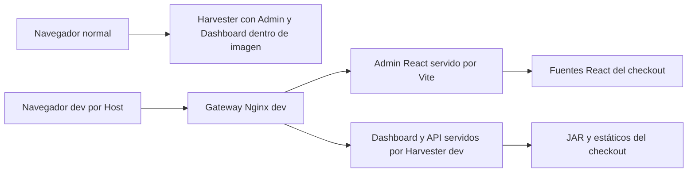
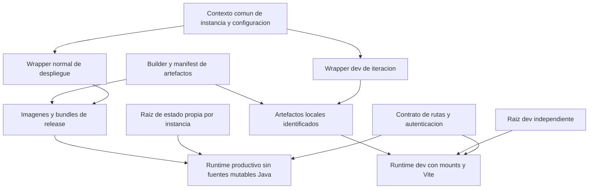

# Comparación del entorno Docker normal y de desarrollo

Este documento compara los dos entornos de la plataforma y propone correcciones para cada uno, con secciones independientes para el script normal y para dev. Su propósito es ayudar a decidir qué conservar, qué actualizar y cómo ordenar el trabajo sin perder datos ni confundir un entorno de desarrollo con un procedimiento de producción.

**La hipótesis inicial está respaldada parcialmente por los documentos:** dev integra un flujo más completo para trabajar con Admin React, Vite y el gateway, y refleja mejor algunos cambios de autenticación v5. El normal conserva una base más adecuada para desplegar Java como imágenes y más herramientas de operación. Sin embargo, el normal también incluye Admin y Dashboard compilados; estos componentes no están ausentes. Y disponer de backup, restore, presets o menú de usuarios no garantiza que esas operaciones sean válidas para la plataforma actual.

La recomendación central es **mantener dos formas de ejecución con contratos comunes**: desarrollo con fuentes y artefactos locales, y producción con versiones de aplicaciones identificadas y desplegables. Hay que corregir primero la protección de datos, los resultados falsos de éxito y los procedimientos de recuperación. Después conviene armonizar configuración, identidad de artefactos, migraciones, autenticación y almacenamiento. Las mejoras del gateway dev deben adaptarse a producción sirviendo estáticos compilados y preservando sus controles de acceso, sin introducir Vite como servidor de producción.

## 1 Alcance fuentes y límites

Fecha: **3 de octubre de 2026**. Esta comparación utiliza **exclusivamente** los documentos siguientes como evidencia técnica:

| Fuente | Nombre abreviado | SHA256 del documento utilizado |
| --- | --- | --- |
| [ANALISIS_OPERATIVO_DOCKER_SH.md](ANALISIS_OPERATIVO_DOCKER_SH.md) | N, análisis normal | `bd492caa66688be947e6988508f769f5510fd11cad1be9672c32b832091f701b` |
| [ANALISIS_OPERATIVO_DOCKER_DEV_SH.md](ANALISIS_OPERATIVO_DOCKER_DEV_SH.md) | D, análisis dev | `2bafb5448014845efdfb0add9191bbb5f50de41c6f3cdd4c065aea8dd3e1aa21` |

No se volvieron a inspeccionar scripts, Compose, POM, clases Java ni configuraciones para determinar su funcionamiento. No se consultaron fuentes externas ni se ejecutaron nuevas pruebas de Docker. Las identidades anteriores corresponden al texto fuente de esta comparación, no a una certificación nueva de implementación.

Ambas fuentes describen snapshots locales relacionados con el mismo commit padre, con cambios locales y módulos independientes. N documenta 33 hallazgos H01–H33; D documenta 42 hallazgos DEV-01–DEV-42. Son **75 entradas documentales**, con problemas compartidos y solapamientos; no representan 75 fallos independientes ni un recuento de incidentes ocurridos.

Se emplean tres tipos de afirmación:

- **Hecho documentado:** comportamiento descrito en N o D, enlazado a su sección.
- **Inferencia de comparación:** conclusión de relacionar esos comportamientos; se identifica cuando su alcance es relevante.
- **Propuesta:** recomendación, fix, diseño objetivo o prueba futura; no se afirma que ya exista o esté validada.

«Normal» identifica docker.sh y su modelo base. «Producción» identifica el uso objetivo de ese entorno en este plan; **no significa que la instalación analizada esté certificada para producción**. Los documentos no prueban un despliegue integral, una recuperación completa ni un modelo operativo de alta disponibilidad.

Los fixes se describen a nivel de comportamiento esperado, alcance, criterio de aceptación y precaución de transición. No se implementan en esta tarea. Para implementarlos habrá que volver al código vigente y comprobar que sigue coincidiendo con las fuentes.

## 2 Índice de lectura

1. [Conclusión y capacidades](#3-conclusión-sobre-la-orientación-de-cada-entorno).
2. [Componentes actuales](#4-comparación-de-componentes-y-flujos-de-interfaz).
3. [Comandos y ciclo operativo](#5-comparación-de-comandos-y-ciclo-de-vida).
4. [Configuración](#6-configuración-perfiles-y-precedencia).
5. [Build y runtime](#7-compilación-artefactos-y-ejecución-java).
6. [Datos y aislamiento](#8-persistencia-aislamiento-y-recuperación).
7. [Seguridad y supervisión](#9-red-autenticación-recursos-y-supervisión).
8. [Normalización de directorios y migración](#10-normalización-de-directorios-y-migración-de-datos).
9. [Recomendaciones normal y producción](#11-recomendaciones-y-fixes-para-el-entorno-normal-y-producción).
10. [Recomendaciones dev](#12-recomendaciones-y-fixes-para-el-entorno-dev).
11. [Trabajo compartido](#13-recomendaciones-compartidas-y-arquitectura-objetivo).
12. [Orden de ejecución](#14-plan-de-trabajo-y-dependencias).
13. [Verificación y aceptación](#15-plan-de-verificación-de-las-correcciones).
14. [Trazabilidad completa](#16-trazabilidad-de-los-hallazgos-originales).
15. [Decisiones pendientes y mantenimiento](#17-decisiones-pendientes-y-mantenimiento).

## 3 Conclusión sobre la orientación de cada entorno

### 3.1 Capacidades que realmente distinguen ambos

| Dimensión | Normal según N | Dev según D | Evaluación de comparación |
| --- | --- | --- | --- |
| Ejecución Java | Artefactos dentro de imágenes por aplicación | JAR local montado y runtime compartido | Normal favorece separar despliegue y checkout; dev favorece iteración |
| Admin React | Compilado e incluido en Harvester | Compilado más servidor Vite con HMR | Dev ofrece flujo de edición más avanzado, no una aplicación ausente en normal |
| Dashboard Angular | Compilado e incluido en Harvester | Compilado desde host; no ng serve del overlay | Integración similar, diferente origen de archivos en runtime |
| Acceso por Host | Sin gateway propio normal | Admin y Dashboard separados por Nginx | Patrón transferible a producción con adaptación |
| Autenticación | Menú users.properties histórico | Reconoce identidades SQL y retira archivos legacy | Dev está más alineado en este aspecto; ninguno ofrece gestión v5 completa en su CLI |
| Preparación de fuentes | Init/pull por githelper según flujo | Workspace Java preparado externamente; helper VuFind propio | Normal ofrece automatización inicial, pero puede cambiar revisiones al arrancar |
| Herramientas operativas | start, stop, health, recursos, backup/reset | Build seleccionado, watch, frontend-dev, isolated | Fortalezas complementarias, con defectos en ambos |
| Estado persistente | Raíces normales constantes | Raíz dev configurable con default separado | Dev separa datos mejor inicialmente; ninguno garantiza todo el aislamiento |
| Build identity | Manifiestos y comprobación DARK parcial | Sin manifiestos; JAR por fecha | Normal tiene una base que conviene completar y llevar a dev |
| Usuario Java | Baja a lareferencia con gosu | Root de imagen por defecto | Ventaja del normal que dev debería incorporar con política de permisos |
| Recuperación | Genera backup/restore con incompatibilidades documentadas | No incluye mecanismo propio de backup/restore | La capacidad nominal del normal no constituye recuperación fiable |

Fuentes: [N §§3, 10–12](ANALISIS_OPERATIVO_DOCKER_SH.md#3-modelo-de-operación), [N §§20–24](ANALISIS_OPERATIVO_DOCKER_SH.md#20-asistente-interactivo), [D §§3, 14–20](ANALISIS_OPERATIVO_DOCKER_DEV_SH.md#3-modelo-general-y-diferencias-con-el-entorno-normal).

### 3.2 Qué conservar del normal

Conviene conservar el principio de ejecutar Java desde una imagen, el usuario de aplicación, el empaquetado de interfaces compiladas, la posibilidad de detener y arrancar contenedores sin recompilar, la distinción entre módulos y servicios, y la intención de registrar identidad del build. Son decisiones compatibles con un despliegue controlado, aunque sus implementaciones necesiten ajustes.

También conviene conservar la intención de administrar recursos y recuperación. Esos procedimientos requieren correcciones sustanciales: no deberían promoverse como garantías hasta probarlos. El normal mezcla construcción, actualización de fuentes, inicialización e instalación; esa mezcla debe reducirse para que «arrancar una versión» tenga efectos previsibles. [N §§13–15](ANALISIS_OPERATIVO_DOCKER_SH.md#13-flujo-completo-de-up), [N §§19, 23–25](ANALISIS_OPERATIVO_DOCKER_SH.md#19-recursos-salud-y-supervisión).

### 3.3 Qué conservar de dev

Conviene conservar las compilaciones seleccionadas con dependencias locales, el builder como servicio, Vite/HMR, el acceso mediante gateway, la raíz isolated inicial y el historial Shell persistente. Permiten iterar sin reconstruir una imagen por cada cambio Java y sin instalar Maven/Node globalmente en el host.

Dev requiere reparar su watcher, propagación de fallos y limpieza para que esa velocidad no produzca resultados engañosos o afecte datos ajenos. Su modo normal permite adoptar datos/contenedores del normal y, por tanto, rompe una separación que el nombre dev podría sugerir. [D §§12, 15–17](ANALISIS_OPERATIVO_DOCKER_DEV_SH.md#12-compilación-java), [D §§23–27](ANALISIS_OPERATIVO_DOCKER_DEV_SH.md#23-watch-de-código-y-recompilación-automática).

### 3.4 Lo que no puede inferirse de la comparación

No puede afirmarse que dev tenga versiones más nuevas de todos los servicios, que normal sea más estable en cualquier instalación, que más funciones signifiquen más fiabilidad, ni que un script pueda sustituir al otro conservando todos los efectos.

La mayor alineación de dev se observa en flujos concretos de interfaces y autenticación. La mejor orientación productiva del normal se observa sobre todo en empaquetado Java y herramientas operativas. En ambos casos, el desempeño real, los tiempos de build, la disponibilidad y la recuperación requieren pruebas que los documentos no completaron.

## 4 Comparación de componentes y flujos de interfaz

### 4.1 Inventario funcional

| Componente | Normal | Dev | Necesidad de armonización |
| --- | --- | --- | --- |
| PostgreSQL | Estado SQL compartido por apps del proyecto | Mismo servicio heredado; cambia raíz dev | Credenciales, aislamiento, readiness y migración |
| Solr | Imagen con assets y cores persistentes | Hereda imagen/entrypoint; cambia mounts/puertos | Assets, aplicación de config y política de reindexación |
| Harvester | Imagen propia con Java, config y SPAs | Runtime común más JAR/config/estáticos host | Mismo comportamiento de app, diferente entrega de artefacto |
| Entity REST | Imagen propia; dependencia db-init | Runtime común; dependencia heredada | Disponibilidad de Shell/db-init y Elastic cuando haga falta |
| OAI | Imagen propia y perfil oai | Runtime común y perfil heredado | Pruebas de exposición OAI, recursos y config efectiva |
| Shell y db-init | Imágenes separadas del mismo módulo | Mismo módulo/JAR host y runtime común | Store correcto, historial, permisos y versión de migración |
| VuFind Web/DB | PHP + código bind-mounted + MariaDB | Igual patrón con datos dev separados | Estado instalado, lock/dependencias y entrega por versión |
| Watch SCSS VuFind | Servicio opcional heredado | Mismo servicio con roots dev | Diferenciarlo del watch Java y Vite |
| Admin React | Static de Harvester | Static y servidor Vite | Publicación por versión y contrato de rutas |
| Dashboard Angular | Static de Harvester | Static host; gateway Dashboard | Mismo bundle/locales con métodos/API correspondientes |
| Gateway | Ausente en Compose normal | web-gateway-dev | Añadir variante productiva del routing si se adopta el patrón |
| Maven builder | docker run temporal del wrapper | Servicio maven-builder con perfil | Resolver perfil y artefactos igual para ambos |

El modelo normal documenta once servicios base; dev llega a catorce con todos los perfiles por **tres servicios nuevos: builder, Vite y gateway**. Las aplicaciones Java y ambas SPA no son tres aplicaciones nuevas introducidas exclusivamente por dev. [N §§7, 10, 18](ANALISIS_OPERATIVO_DOCKER_SH.md#7-módulos-servicios-y-perfiles-compose), [D §§8–9](ANALISIS_OPERATIVO_DOCKER_DEV_SH.md#8-composición-y-herencia-del-modelo-compose).

### 4.2 Arquitectura de interfaces actual



En normal, cambiar React/Angular implica recompilar y actualizar la imagen Harvester. En dev, la interfaz Admin del gateway viene de Vite aunque se haya publicado un admin-static nuevo; Dashboard continúa compilado y viene del Harvester. Un mismo término «rebuild frontend» no significa actualizar todas las rutas de entrega de esa interfaz. [N §§10.3–10.4, 11](ANALISIS_OPERATIVO_DOCKER_SH.md#103-admin-web), [D §§18–20](ANALISIS_OPERATIVO_DOCKER_DEV_SH.md#18-admin-web-y-vite).

### 4.3 Transferencia correcta del gateway

**Propuesta:** conservar la separación lógica Admin/Dashboard y su allowlist de rutas, pero crear una variante productiva que entregue el Admin compilado —desde Harvester o un servidor estático definido—. Dashboard también debe corresponder al bundle de la release. Vite, HMR y los mounts de fuentes pertenecen al modo de desarrollo.

No basta cambiar el upstream de Vite: hay que revisar domains/hosts, TLS, cookies, Origin/CORS, métodos, redirecciones, paths de assets y endpoints de autenticación. D explica que el gateway limpia Origin y que Harvester dev desactiva secure cookies para HTTP local. Esas decisiones no se trasladan automáticamente a producción. [D §20](ANALISIS_OPERATIVO_DOCKER_DEV_SH.md#20-gateway-nginx-y-separación-por-host), [N §25](ANALISIS_OPERATIVO_DOCKER_SH.md#25-hallazgos-y-limitaciones-de-la-implementación).

## 5 Comparación de comandos y ciclo de vida

### 5.1 Operaciones con el mismo nombre

| Operación | Normal | Dev | Riesgo de interpretar ambos igual |
| --- | --- | --- | --- |
| Sin argumentos | Help | Wizard | Automatización invocada sin comando puede quedar interactiva en dev |
| up sin argumentos | Puede elegir build inicial, pull, init e importación | Compila seleccionados y Shell requerido; up --build | Ambos alteran más que running, por mecanismos distintos |
| up servicio | Detección de imágenes puede disparar flujo global | Compila Java explícito; no asegura Shell extra para db-init | Selección limitada no implica efectos limitados equivalentes |
| build harvester | Reactor completo, manifests e imagen indicada | React + Angular + Java con -am; sin imagen ni start | En dev no produce la misma unidad desplegable |
| restart | Contenedor existente e imagen existente | Restart existente o up no-deps si ausente | Ambos conservan imagen/env al reiniciar; dev puede crear sin infraestructura |
| init-db | Puede eliminar/recrear PostgreSQL/Solr y migrar/importar reglas | One-off database_migrate sin compilar/arrancar dependencias | Normal interrumpe; dev exige preparación externa |
| down | Perfiles amplios y remove-orphans; alias v | Delegación con opciones recibidas | Alcance de perfiles/opciones debe explicitarse |
| logs | Argumentos Compose flexibles | Siempre follow y tail 100 antes de los argumentos | Comportamiento attached/salida diferente |
| shell | Servicio obligatorio, Bash en CLI | Harvester default, Bash y fallback sh | Distinto de comandos de Spring Shell |

Fuentes: [N §§5, 13–15](ANALISIS_OPERATIVO_DOCKER_SH.md#5-invocación-y-comandos), [D §§5, 14–15, 26](ANALISIS_OPERATIVO_DOCKER_DEV_SH.md#5-invocación-y-parser-de-comandos).

### 5.2 Operaciones específicas

Normal tiene start/stop/pull/health/modules/res/reset-data y asistentes backup/usuarios. Dev tiene instance/clean/rebuild/watch/frontend-dev y build de SPA. Los nombres más parecidos —reset-data y clean— tienen un alcance destructivo diferente y no deben convertirse en aliases durante una unificación.

Normal stop sin argumentos considera módulos on y puede dejar otros servicios activos. Dev desmarcar módulos tampoco apaga lo anterior. Ambos necesitan distinguir selección deseada, definición Compose y estado real. En producción esa separación permite explicar qué se desplegará; en dev evita interpretar un icono como disponibilidad real.

### 5.3 Contrato futuro recomendado

**Propuesta compartida:** separar preparación de workspace, build, arranque, recreación, migración, importación de reglas y destrucción. El contrato de cada operación debe indicar si toca Git, targets, imágenes, contenedores, SQL, índices o configuración persistente.

Un comando de despliegue normal debe ejecutar una release seleccionada sin actualizar fuentes de forma implícita. Un up dev puede compilar por conveniencia, pero debe informar de ese comportamiento y detenerse si falla cualquier paso. Restart debe significar reiniciar contenedor existente; crear uno ausente y recrear con env nuevo deben ser operaciones expresas, o al menos claramente diferenciadas.

No se recomienda cambiar todos los nombres de golpe. Primero hacer que las ayudas describan el comportamiento real y añadir operaciones explícitas; después retirar gradualmente aliases o flujos ambiguos con compatibilidad documentada.

## 6 Configuración perfiles y precedencia

### 6.1 Dos errores de perfil distintos

| Caso | Normal | Dev |
| --- | --- | --- |
| Perfil del archivo, sin export | Maven lee el proceso y puede compilar lareferencia aunque .env diga ibict | Maven lee .env.dev y adopta el perfil de ese archivo |
| Perfil exportado contradictorio | Maven puede seguir el export; hay que revisar el resultado Compose | Compose puede adoptar export y Maven seguir .env.dev |
| Perfil mostrado | UI lee archivo normal | UI lee perfil dev, pero Project usa el proceso |
| Resultado posible | Tag/perfil/binario distintos | Tag/perfil/binario distintos por otra divergencia |

Ambas fuentes reproducen divergencias. Dev mejora el caso de leer el archivo para Maven, pero no resuelve una configuración efectiva única. Copiar simplemente env_get de dev al normal no elimina todas las contradicciones. [N §6.3 y H01](ANALISIS_OPERATIVO_DOCKER_SH.md#63-dos-valores-de-perfil-pueden-divergir), [D §§6.4, 32](ANALISIS_OPERATIVO_DOCKER_DEV_SH.md#64-precedencia-efectiva).

### 6.2 Archivos y normalización

Normal crea .env desde plantilla, deriva proyecto del prefix, recalcula nueve puertos y exporta perfiles dentro de dc. Dev crea ocho claves iniciales propias, combina .env opcional y .env.dev, sincroniza diez puertos y añade perfiles desde DEV_COMPOSE_PROFILES.

Normal recalcula base+offset para puertos; dev isolated hace lo mismo, pero dev normal lee claves individuales del .env base. El UI dev calcula offset siempre. El proyecto normal se deriva del prefix; SERVICE_PREFIX dev es sobre todo texto mostrado. Estos contratos diferentes explican por qué compartir valores no basta para compartir significado.

En ambos, consultar estado puede escribir env. Sus parsers awk no implementan todo dotenv; el normal recorta más espacios/comillas, mientras dev hace coincidencia estricta y puede conservarlas. Los dos pueden truncar valores con =. [N §§6, 8](ANALISIS_OPERATIVO_DOCKER_SH.md#6-configuración-del-script-y-precedencia), [D §§6, 10, 24](ANALISIS_OPERATIVO_DOCKER_DEV_SH.md#6-configuración-y-precedencia).

### 6.3 Contrato de configuración propuesto

**Propuesta:** resolver una configuración una vez al inicio de la operación, con precedencia explícita y validada. Una opción a evaluar es defaults → configuración de entorno → overrides locales → flags CLI; las variables exportadas solo deberían intervenir según una regla documentada y visible. No se fija aquí una sintaxis ni una herramienta de implementación.

El resultado resuelto debe alimentar por igual Maven, Compose, selección de servicios, clean/reset, UI y backups. Debe incluir proyecto, perfil Java, perfiles Compose, raíz de datos, puertos, URLs y referencias de fuentes. Un «plan» de solo lectura debería mostrar esos campos sin revelar secretos ni persistir cambios.

Guardar cambios de modo/módulos/puertos es otra operación. No debería ocurrir al consultar ps/logs. La configuración de interpolación tampoco debe confundirse con variables efectivamente inyectadas en cada contenedor.

## 7 Compilación artefactos y ejecución Java

### 7.1 Comparación de build

| Aspecto | Normal | Dev | Recomendación |
| --- | --- | --- | --- |
| Maven | clean package del reactor | -pl -am install, o lista global Java | Conservar ambos propósitos; identificar cuándo se necesita clean |
| Cache Maven | lr-maven-cache global al daemon | Volumen del proyecto dev | Declarar alcance; no confundir cache con backup |
| Frontends | Reactor contiene React y Angular | Harvester los construye antes; all después de Java | Garantizar versión conjunta/publicación coherente |
| Tests | skipTests | skipTests Java; no suite completa frontend desde wrapper | Separar ciclo rápido dev de verificación obligatoria de release |
| Settings/mirror | Usa archivo alternativo si existe | Wrapper no aplica ese settings | Declarar política común o diferencia intencional |
| Permisos build | Corrección de target parcial | Sin reparación de ownership | Política común de UID/GID y rutas escribibles |
| Provenance | Manifest parcial y DARK check permisivo | Sin identidad equivalente | Identidad común, validación estricta al liberar versión |
| Runtime Java | Imagen por aplicación | Imagen común + JAR host | Diferencia deliberada que conviene mantener |

Fuentes: [N §§10–12](ANALISIS_OPERATIVO_DOCKER_SH.md#10-compilación-maven-y-frontends), [D §§12–16](ANALISIS_OPERATIVO_DOCKER_DEV_SH.md#12-compilación-java).

### 7.2 Identidad y publicación

Normal registra commit padre y hash JAR; no todos los commits anidados ni perfil efectivo. DARK check puede retornar éxito si no verifica ciertos requisitos. Dev elige el JAR más reciente por mtime y no genera manifiesto. Ninguno dispone de una identidad completa y obligatoria de todos los componentes.

**Propuesta:** un manifiesto común debe describir commits y dirty de cada módulo, perfil, hash de artefactos, versiones de bundles Admin/Dashboard y referencias de imágenes. En producción, un artefacto no verificado no debe publicarse como release. En dev, se puede permitir un build con cambios locales, identificándolo como tal; no debe sustituirse por el JAR «más nuevo» sin comprobación de selección.

Es importante separar manifest de build —qué se produjo— y registro de despliegue —qué image ID, configuración y esquema SQL se están usando—. Una imagen etiquetada con un perfil no demuestra por sí misma el perfil del binario.

### 7.3 Empaquetado y launch por capas

N documenta un problema específico: extracción por capas y ejecución desde raíz con -cp . no localizaron launchers en la prueba aislada. También documenta que POM fija executable true y que el argumento Maven no garantizó compatibilidad tools en el JAR observado. D ejecuta java -jar y evita ese camino de extracción, pero eso no certifica toda combinación de perfiles/artefactos.

Existe un matiz entre las fuentes: D describe la finalidad de executable=false; N demuestra que su efecto no debe asumirse frente a la configuración explícita de POM. **Esta comparación toma la evidencia más restrictiva:** verificar realmente el formato de JAR en ambos y la estructura de launch normal; no concluir que la bandera sola corrige el empaquetado. [N H29, H30, H33 y §30](ANALISIS_OPERATIVO_DOCKER_SH.md#30-validación-realizada-durante-el-análisis), [D §§12.2, 16.4](ANALISIS_OPERATIVO_DOCKER_DEV_SH.md#122-comando-y-consecuencias).

### 7.4 Configuración runtime distinta

Normal copia overrides a /config persistente y a runtime, conserva application.properties.d/99-docker.properties y baja a usuario de aplicación. Dev aplica overrides solo a runtime, elimina 99 raíz tras convertirlo, retira cuatro artefactos auth legacy del config externo y ejecuta como root.

Por ello alternar los entrypoints puede dejar config persistente distinta aunque Java use el mismo módulo. Ambos emplean cp -ru por fecha para sembrar defaults. **Propuesta:** definir qué archivos son del operador, cuáles del producto y cuáles son generados; componer runtime sin depender de timestamps ni escribir overrides automáticamente en config del operador. La transición debe preservar configuraciones existentes y retirar solo archivos identificados con migración explícita. [N §12](ANALISIS_OPERATIVO_DOCKER_SH.md#12-entrypoint-y-configuración-de-las-aplicaciones-java), [D §16](ANALISIS_OPERATIVO_DOCKER_DEV_SH.md#16-entrypoint-java-de-desarrollo).

## 8 Persistencia aislamiento y recuperación

### 8.1 Raíces y recursos compartidos

| Estado | Normal | Dev isolated | Dev normal |
| --- | --- | --- | --- |
| Datos Harvester/SQL/índices | Docker/volume con paths constantes | DEV_DATA_ROOT, default Docker/volume/dev/lareferencia-dev | Docker/volume |
| Código Java en runtime | Copia en imagen | Checkout RO | Checkout RO |
| Targets y outputs SPA | Host durante build; runtime Java desde imagen | Host compartido | Host compartido |
| Código VuFind | Checkout RW montado | Mismo checkout RW | Mismo checkout RW |
| Override Docker | Host compartido | Host compartido | Host compartido |
| Maven cache | Global daemon | Nombrado por proyecto | Depende del proyecto efectivo dev |
| Imagen Java | Tags por app/perfil | Tag dev por perfil | Tag dev por perfil |
| Solr/VuFind tags | Compartidos por perfil | Pueden coincidir con normal | Pueden coincidir con normal |
| VuFind .installed | Checkout fuera de submount datos | Mismo estado fuera de raíz dev | Mismo estado |

Normal cambiar prefix/offset no cambia bind roots. Dev isolated separa mejor los datos iniciales, pero mantiene outputs, source y tags compartidos. Además Docker/volume/dev está contenido en la raíz amplia que reset-data normal puede limpiar. **Inferencia:** isolated es una separación de configuración/montajes parcialmente implementada, no una frontera que los comandos destructivos de ambos respeten siempre. [N §§8.3, 16, 22](ANALISIS_OPERATIVO_DOCKER_SH.md#83-qué-aislamiento-proporciona-el-prefijo), [D §§17, 25–27](ANALISIS_OPERATIVO_DOCKER_DEV_SH.md#17-mapa-completo-de-almacenamiento).

### 8.2 Store Harvester y Shell

Ambos Harvester utilizan store.basepath=/data en el snapshot. Los metadatos quedan por red en `<NETWORK>/metadata/A/B/C/<hash>.xml.gz`; snapshots en `<NETWORK>/snapshots/snapshot_<id>/catalog/catalog.db` y validation/validation.db. Lo que cambia es el mount host de /data. La property metadata.store.fs.basepath no decide la base de la implementación descrita.

Shell no comparte automáticamente ese store. En normal su path /workspace/Docker/data/shared/store no está bind-mounted y puede ser efímero o no escribible. En dev sí corresponde al workspace del host, pero RO. **Es el mismo override con fallos operativos distintos según runtime.** La ruta de historial dev es persistente y separada; el normal no tiene ese montaje dedicado. [N §§15.3, 16.3](ANALISIS_OPERATIVO_DOCKER_SH.md#153-shell-interactivo-y-contenedor-shell), [D §§15.3, 17.3–17.4](ANALISIS_OPERATIVO_DOCKER_DEV_SH.md#173-store-del-harvester).

### 8.3 Destrucción y recuperación

| Operación | Alcance documentado | Carencia principal |
| --- | --- | --- |
| Reset normal | Contenedores por patrones amplios, Docker/data y Docker/volume, repositorios del manifest | Puede afectar dev/otros proyectos y cambios locales |
| Clean dev | Down con volúmenes, cache Maven, tag Java y raíz aceptada por prefijo | Guard textual permite ..; contexto/proyecto no garantizado; errores ignorados |
| Backup normal | Tar amplio más intentos de dumps y programación | Nombres incorrectos, contexto distinto y captura no coordinada |
| Restore normal | Script generado sobre archivo elegido | CLI dc inexistente y servicio DB incorrecto, errores ignorados |
| Backup dev | No existe mecanismo propio documentado | No protege datos por llamarse dev; hay que definir qué merece backup |

**Propuesta:** separar destrucción de datos, eliminación de contenedores, limpieza de cache e eliminación de código fuente. Son decisiones diferentes. Las dos limpiezas deben usar identidad exacta y roots canónicas, mostrar plan y rechazar contextos ajenos. La recuperación normal debe considerarse una unidad de trabajo completa con ensayo de restore, no únicamente un arreglo de nombres en el script generado. [N §§22–25](ANALISIS_OPERATIVO_DOCKER_SH.md#22-alcance-exacto-de-reset-data), [D §25](ANALISIS_OPERATIVO_DOCKER_DEV_SH.md#25-alcance-y-límites-de-clean).

## 9 Red autenticación recursos y supervisión

### 9.1 Exposición de puertos

Normal publica VuFind, MariaDB, Solr, Entity REST, Elastic y OAI en todas las interfaces; PostgreSQL y Harvester están en loopback. Dev publica todos sus puertos en loopback y añade el gateway; Vite no tiene publicación host propia. Los puertos internos siguen siendo aliases estables y no cambian con offset.

**Propuesta productiva:** declarar explícitamente qué servicios son públicos y mantener bases/índices internos o sujetos a una necesidad administrativa controlada. Adoptar un punto de entrada HTTP con configuración productiva y revisar que el backend directo no eluda la política externa esperada. El documento no deduce el firewall ni el proxy de instalaciones externas; esta observación se refiere al modelo descrito. [N §8.2](ANALISIS_OPERATIVO_DOCKER_SH.md#82-cálculo-de-puertos), [D §§10, 20](ANALISIS_OPERATIVO_DOCKER_DEV_SH.md#10-red-puertos-y-nombres).

### 9.2 Identidades y autorización

Normal sigue editando users.properties desde el wizard, mientras las identidades v5 descritas están en PostgreSQL. Dev retira los archivos legacy conocidos y utiliza bootstrap por Shell en la documentación, pero no trae un CRUD de usuarios v5 propio.

**Propuesta:** un contrato único de administración v5 debe comprobar éxito en la identidad real, preservar auditoría y evitar secretos en argumentos/logs. La retirada de archivos legacy debe ser una migración revisable, con copia de seguridad cuando proceda, y no un borrado indiscriminado que presuponga que todas las instalaciones ya migraron. No copiar simplemente el rm de dev al normal sin analizar el estado de autenticación. [N §21 y H16](ANALISIS_OPERATIVO_DOCKER_SH.md#21-gestión-legacy-de-usuarios), [D §§15.3, 16.2](ANALISIS_OPERATIVO_DOCKER_DEV_SH.md#153-historial-y-cuentas-locales).

### 9.3 Recursos y observabilidad

Ambos heredan los heaps Solr/Elastic fijos y límites base. Normal ofrece presets que pueden bajar el límite por debajo de lo que necesita el heap; dev no tiene comando de presets propio y puede heredar esos valores. Ambos carecen de readiness Java suficiente, y éxito de up/running no valida negocio.

Normal health consulta raíces y tolera fallos; dev no tiene health equivalente y el gateway solo depende del inicio de Harvester. Los logs de asistente son temporales/fijos y no representan logs completos de aplicaciones. **Propuesta:** medir disponibilidad por endpoints documentados, resultado de migración, versión de artefacto y condiciones internas necesarias, con plazos de espera. Añadir rotación/logs por operación y presupuesto de memoria que contemple heap y overhead. [N §§19–20](ANALISIS_OPERATIVO_DOCKER_SH.md#19-recursos-salud-y-supervisión), [D §§22–24, DEV-26, DEV-41](ANALISIS_OPERATIVO_DOCKER_DEV_SH.md#22-solr-postgresql-elastic-y-recursos).

## 10 Normalización de directorios y migración de datos

### 10.1 Acuerdo sobre el problema y precisión del diagnóstico

**Sí se recomienda normalizar la organización actual.** Hay razones operativas, no solamente de estilo: el normal separa nombres de proyecto pero conserva raíces físicas constantes; mezcla PostgreSQL y aplicaciones bajo lareferencia con Solr, VuFind y Elastic en otras ramas; conserva referencias históricas a Docker/data que no equivalen a los datos efectivos; y su reset abarca la rama dev. Shell resuelve un store que no está persistido como el operador podría deducir del path. [N §§8.3, 15.3, 16, 22](ANALISIS_OPERATIVO_DOCKER_SH.md#16-mapa-completo-de-persistencia).

No todos los directorios están equivocados. Harvester /data corresponde a un mount real, su organización por red/snapshot está documentada y PGDATA añade pgdata dentro del padre montado. Solr, MariaDB y Elastic también tienen binds identificados. Cambiar nombres sin corregir ownership, aislamiento y consumidores podría añadir fallos a una instalación que hoy encuentra esos datos.

La recomendación distingue cuatro problemas:

| Problema | Evidencia documental | Tipo de corrección |
| --- | --- | --- |
| Nombres y jerarquías inconsistentes | log/logs, aplicaciones bajo lareferencia, otros servicios fuera | Convención y mapa explícito de transición |
| Instancias comparten estado | Proyecto/prefix no forma parte de las raíces normales | Raíz independiente por identidad de instancia |
| Paths que no persisten lo esperado | Shell store e historial normal sin mounts dedicados | Corregir propiedades y mounts, no solo renombrar host |
| Lifecycle de estado dividido | .installed VuFind queda en código; reset normal engloba dev | Estado propietario dentro de instancia y eliminación exacta |

**Inferencia:** esta normalización debe ser una corrección prioritaria de arquitectura de datos del normal y una armonización controlada de dev. No debería resolverse mediante una limpieza general ni una sustitución textual global de Docker/volume.

### 10.2 Convención de identidad propuesta

Se propone separar estas nociones, actualmente parcialmente confundidas:

- **Identidad de instancia:** identificador estable del estado y sus propietarios. No cambia porque se altere un puerto o nombre visible.
- **Proyecto Compose:** nombre técnico de contenedores/red/volúmenes de esa ejecución, asociado explícitamente a la instancia.
- **Raíz de estado:** path absoluto canónico del almacenamiento de esa instancia.
- **Workspace:** código editable que puede producir versiones, sin ser la identidad de los datos.
- **Release:** conjunto concreto de artefactos/configuración de producto que ejecuta la instancia.

Los nombres de variables `LR_STATE_ROOT` y `LR_INSTANCE_ID` de los ejemplos siguientes son **propuestas nuevas**, no claves ya soportadas por los scripts. El nombre final debe decidirse al implementar. El resolver común debe producir una única raíz efectiva y ambos wrappers deben consumirla.

No derivar automáticamente un cambio de raíz de un rename de proyecto: el operador debe saber si está renombrando recursos o creando una instancia vacía distinta. La relación proyecto ↔ instancia ↔ raíz debe quedar registrada y validarse antes de start, clean, reset, backup o restore.

### 10.3 Árbol de estado propuesto

Una opción de estructura común es:

```text
<LR_STATE_ROOT>/instances/<LR_INSTANCE_ID>/
├── meta/
│   ├── ownership.json
│   └── deployment.json
├── postgres/
│   └── data/
│       └── pgdata/
├── vufind-db/
│   └── data/
├── solr/
│   ├── data/
│   ├── logs/
│   └── cache/
├── elasticsearch/
│   ├── data/
│   └── logs/
├── apps/
│   ├── harvester/
│   │   ├── config/
│   │   ├── data/
│   │   └── logs/
│   ├── entity-rest/
│   │   ├── config/
│   │   ├── data/
│   │   └── logs/
│   └── oai-pmh/
│       ├── config/
│       ├── data/
│       └── logs/
├── shell/
│   ├── history/
│   └── work/
└── vufind/
    ├── config/
    ├── cache/
    ├── logs/
    ├── harvest/
    ├── import/
    ├── vendor/
    ├── node_modules/
    ├── themes-node_modules/
    └── state/
        └── installation.json
```

Todos estos nombres son de diseño objetivo. Los archivos meta permitirían identificar dueño/contexto y release efectiva; no deben almacenar contraseñas. El marcador de instalación propuesto contendría versión/firma y recursos esperados; reemplazaría conscientemente la semántica booleana .installed, no sería solo el mismo archivo con otro nombre.

`config/` de aplicación representa configuración del operador necesaria durante la transición. Defaults y bundles de producto deben pertenecer a la release. La config runtime compuesta sigue siendo temporal y no se confunde con estado que el operador deba editar.

Vendor y node_modules se muestran para una transición compatible con el patrón actual de VuFind. En un diseño productivo con dependencias incluidas en release, pueden dejar de formar parte de estado mutable; hay que declarar cuál estrategia se implementa. No clasificarlos como datos irremplazables solo porque hoy ocupen disco persistente.

### 10.4 Separación de producción desarrollo cache y backups

**Propuesta:** elegir roots sin relación padre/hijo entre datos productivos y datos de desarrollo. Por ejemplo:

```text
/srv/lareferencia-prod/instances/nodo-a/...
<directorio-local-dev>/instances/nodo-a-dev/...
<directorio-backups-externo>/nodo-a/...
```

Son ejemplos de distribución, no requisitos de usar /srv ni rutas que ya existan. Para desarrollo se puede usar una carpeta del workspace si su borrado queda limitado exactamente a su instancia. Para producción conviene evaluar una raíz externa al checkout, que no desaparezca al reemplazar fuentes ni entre en git clean. Debe ser configurable según el host.

Evitar que una raíz productiva de borrado recursivo contenga dev, backups o código. Mantener backups fuera de la raíz capturada/destruible y con identidad/retención propia. Las caches nombradas Maven/npm quedan administradas por Docker; pueden mantener un inventario por instancia/proyecto sin forzarlas a paths host inventados.

La separación física es necesaria pero no suficiente: clean/reset deben seguir validando propiedad exacta y los vínculos de los mounts. Que dos roots tengan nombres distintos no evita un symlink o una configuración que vincule ambas al mismo destino.

### 10.5 Mapa de transición del normal

Sea T la nueva raíz de una instancia. Este mapa es una **propuesta** de equivalencia, que debe convertirse en un plan verificable antes de mover datos:

| Origen normal documentado | Destino propuesto bajo T | Precaución específica |
| --- | --- | --- |
| Docker/volume/lareferencia/postgres/data | postgres/data | Conservar pgdata y todo el cluster; elegir recuperación física compatible o dump lógico |
| Docker/volume/vufind/data/db | vufind-db/data | Conservar datos MariaDB y comprobar usuario/schema; no confundir con vendor |
| Docker/volume/lareferencia/lrharvester-app/config | apps/harvester/config | Preservar ajustes del operador y registrar archivos legacy antes de retirarlos |
| Docker/volume/lareferencia/lrharvester-app/data | apps/harvester/data | Preservar estructura por red, SQLite y metadatos sin renombrarlos |
| Docker/volume/lareferencia/lrharvester-app/log | apps/harvester/logs | Uniformar nombre de host; revisar logging efectivo |
| Docker/volume/lareferencia/entity-rest/config, data, log | apps/entity-rest/config, data, logs | Cambiar cada mount explícitamente |
| Docker/volume/lareferencia/oai-pmh/config, data, log | apps/oai-pmh/config, data, logs | Preservar crosswalks/config propia de OAI |
| Docker/volume/solr/data, log, cache | solr/data, logs, cache | Preservar índices y config activa; template no sustituye estado |
| Docker/volume/elasticsearch/data, log | elasticsearch/data, logs | Comprobar compatibilidad del motor al recuperar |
| Docker/volume/vufind/config, cache, log | vufind/config, cache, logs | Reescrituras INI al boot deben usar URL/DSN objetivo |
| Docker/volume/vufind/data/harvest, import | vufind/harvest, import | Preservar entradas y recursos del instalador |
| Docker/volume/vufind/data/vendor | vufind/vendor durante transición | Validar composer.lock; decidir luego entrega inmutable |
| Docker/volume/vufind/data/node_modules y themes-node_modules | vufind/node_modules y themes-node_modules | Cache de watcher; puede regenerarse con herramientas/ref identificadas |
| vufind/local/docker/.installed | vufind/state/installation.json tras validación | No mover sin adaptar entrypoint; no conservar éxito si faltan recursos |
| Historial Shell no dedicado | shell/history | Extraer solo contenido que exista; no inventar historial perdido |
| Store Shell /workspace/Docker/data/shared/store | Mount explícito al store autorizado, o shell/work separado | No copiarlo sobre store Harvester sin comparar contenido y propósito |

El contenido de Docker/data no debe «migrarse entero» a T por el nombre histórico. N distingue carpetas sin consumidor activo y un store Shell que no es un bind en normal. Hay que inventariar qué existe, qué servicio lo usa y si requiere conservación. Una ruta escrita en properties no basta como prueba de datos host existentes.

### 10.6 Contrato de paths dentro de contenedores

No es necesario renombrar todos los paths internos. Es razonable conservar /data del Harvester y sus paths de logs actuales mientras se normaliza el host. Eso reduce cambios en aplicaciones y se expresa mediante una tabla mount host → destino existente.

Shell necesita una decisión explícita. Si opera sobre el mismo store, se propone montarlo en un destino estable específico —por ejemplo /store— y hacer que su property efectiva resuelva ahí. Si algunas acciones Shell solo consultan, el mount puede ser RO; las que modifican requieren permiso y control de concurrencia. Su historial debe tener un mount propio y escribible, independiente de fuentes/store.

Evitar montar toda la raíz de instancia RW en Shell o en cada app por conveniencia si bastan paths concretos. D documenta /dev-data en algunos servicios; una revisión de mínimos mounts ayudaría a expresar propiedad y reducir acoplamiento. Esta es una propuesta de diseño, no un fallo nuevo verificado del runtime.

### 10.7 Migración en etapas con preservación de datos

**Propuesta de procedimiento a ensayar primero en una copia desechable:**

1. **Inventariar el estado vigente.** Relacionar proyecto, image IDs, mounts absolutos, configuration efectiva, esquema SQL, contenido store y marcadores. La evidencia actual es documental; este inventario deberá realizarse sobre la instalación elegida al implementar.
2. **Definir el plan exacto.** Registrar origen/destino por path, capacidades de almacenamiento, permisos, servicios propietarios y qué se copia, regenera o deja intacto. Rechazar destinos que sean subdirectorios de una raíz de captura/borrado inapropiada.
3. **Verificar recuperación previa.** Producir backup consistente y restaurarlo en un entorno separado. El backup generado actual del normal no satisface por sí mismo este requisito.
4. **Detener escrituras de forma coordinada.** Suspender tareas y escritores pertinentes; preservar qué servicios estaban activos. No copiar un cluster físico o SQLite WAL bajo escrituras como si fuera una copia offline.
5. **Copiar conservando estructura y permisos.** Usar método adecuado por sistema: recuperación física compatible o dumps SQL; store/config/índices con estrategia consistente. Conservar origen intacto y no hacer borrado posterior automático.
6. **Actualizar configuración y mounts en conjunto.** Revisar Compose, wrapper, Shell store/history, VuFind state, backup/restore, scripts de mantenimiento y registro de instancia. Cambiar solo DEV_DATA_ROOT o un bind no cubrirá los paths hardcodeados del normal.
7. **Validar antes de abrir servicio.** Confirmar mounts reales, versión, permisos, schema SQL, cantidades/identificadores de snapshots y funcionamiento de interfaces/OAI. Verificar que la nueva instancia no ve datos de otra.
8. **Realizar corte controlado.** Activar la instancia objetivo y mantener disponible el origen protegido durante un período definido por el operador. Registrar cada escritura posterior al corte.
9. **Retirar el origen deliberadamente.** Solo tras aceptación y recovery test; usar alcance exacto, nunca reset-data amplio como atajo de migración.

El retorno al origen requiere analizar escrituras y migraciones posteriores: ejecutar una imagen anterior contra una base cuyo esquema ya cambió no es automáticamente un rollback válido. El plan debe distinguir rollback de contenedores, rollback de configuración y restauración/reconciliación de datos.

### 10.8 Criterios de aceptación de la normalización

La normalización se consideraría completa cuando:

- Dos instancias con el mismo código y puertos distintos mantienen roots y datos distintos, y la propiedad queda registrada.
- Cambiar proyecto/offset no mueve ni reasigna silenciosamente datos.
- Los mounts documentados coinciden con los del contenedor creado y con las propiedades de cada consumidor.
- Shell escribe solo donde está autorizado y conserva historial tras recreación; no depende de una ruta workspace que cambia de significado entre normal y dev.
- VuFind puede reconstruir/revalidar su estado por instancia sin depender de .installed compartido en código.
- Clean/reset de una instancia no borra otra, código, backups ni caches ajenas.
- Backup/restore operan sobre T y recuperan una plataforma coherente en root independiente.
- Se conserva el layout interno de metadatos/snapshots y existe evidencia de comparación antes/después.

Estas pruebas deben añadirse a las correcciones P11, P10, D06, D07 y a las protecciones P01/D01 descritas a continuación.

## 11 Recomendaciones y fixes para el entorno normal y producción

Esta sección se refiere al normal. Las prioridades son propuestas de orden: **P0** protege de pérdida de datos o de confiar en recuperación/success inválidos; **P1** corrige arranque, versión o comportamiento operativo esencial; **P2** mejora repetibilidad, ergonomía y mantenimiento. No son una escala de vulnerabilidades ni un diagnóstico de incidentes reales.

### 11.1 P01 Limitar reset a la instancia exacta

**Prioridad P0. Base:** H13 y [N §22](ANALISIS_OPERATIVO_DOCKER_SH.md#22-alcance-exacto-de-reset-data).

Sustituir patrones amplios de nombres por identidad exacta de proyecto/instancia y propiedad de recursos. Separar eliminación de datos de eliminación de checkouts. Ningún reset de datos debería borrar commits/cambios locales de módulos. Mostrar antes un plan con paths canónicos y recursos concretos; --yes debe saltar interacción, no validaciones de alcance.

Rechazar roots compartidas, symlinks que escapen y cualquier inclusión de dev/backups ajenos. En la transición, si no se puede demostrar propiedad exclusiva de Docker/volume, no implementar un borrado recursivo de esa raíz.

**Aceptación:** con normal, dev y otra instancia con nombre similar, el reset autorizado afecta solo a los recursos de la instancia seleccionada. Los archivos y commits locales permanecen; un destino inválido aborta antes de detener contenedores.

### 11.2 P02 Rehacer backup y restore como un procedimiento verificable

**Prioridad P0 si se usa como garantía de recuperación. Base:** H08–H11 y [N §§23–24](ANALISIS_OPERATIVO_DOCKER_SH.md#23-backup-generado-por-el-asistente).

Corregir nombres de servicios y eliminar las llamadas a CLI dc inexistente. Reutilizar el mismo contexto resuelto —archivos, proyecto, perfiles y roots— de la instancia. Hacer obligatorios resultados de dumps y validación del archivo, con inventario, hashes y versiones de componentes.

Definir una captura coordinada de SQL, store/SQLite, índices y configuración. Guardar estado previo running y recuperarlo mediante manejo de fallos; no ejecutar start indiscriminado. Un fallo de dump o captura debe dejar el backup marcado como incompleto y retornar error. Restore debe validar manifest/destino/versiones y recuperar primero en una instancia separada.

**Aceptación:** restaurar una copia con redes/snapshots/datos VuFind conocidos; comparar cantidades y relaciones, probar interfaces y OAI, y demostrar que un dump fallido no acaba en Restore complete. Arreglar solo dos nombres no cumple esta aceptación.

### 11.3 P03 Propagar errores y mostrar el resultado de cada fase

**Prioridad P1; P0 en backup/destrucción. Base:** [N §§20.3, 23–24](ANALISIS_OPERATIVO_DOCKER_SH.md#203-progreso-y-propagación-de-errores) y el contraste con [D §24.3](ANALISIS_OPERATIVO_DOCKER_DEV_SH.md#243-errores-ocultados-en-funciones-compuestas).

Definir controles explícitos de retorno en preparación Git, Maven, manifests, imagen, migración, importación y arranque. Evitar que un error ignorado o un último comando exitoso represente la operación completa. Sustituir construcción de comandos eval por argumentos estructurados donde corresponda, revisando quoting de paths y perfiles.

La UI puede conservar el menú tras un fallo, pero debe conservar también el status y la fase fallida. No hay rollback general automático: registrar qué se completó y qué no, para permitir una recuperación deliberada.

**Aceptación:** inyectar fallo en cada fase y comprobar que no se ejecuta el paso dependiente, que no hay éxito global y que CLI devuelve no cero. Probar paths con espacios y valores admitidos sin ejecución shell accidental.

### 11.4 P04 Separar migraciones e importación de reglas del ciclo de infraestructura

**Prioridad P1. Base:** H05/H06 y [N §15](ANALISIS_OPERATIVO_DOCKER_SH.md#15-inicialización-de-base-de-datos-y-shell).

Eliminar la necesidad de rm de PostgreSQL/Solr para ejecutar migraciones. Validar versión del job Shell, esperar readiness con límite e identificar esquema destino. Migración de tablas e importación validator/transformer deben ser acciones diferenciadas; revisar idempotencia de las importaciones antes de repetirlas en cada rebuild.

Definir cuándo una actualización de release necesita ventana de mantenimiento y cuáles escritores se pausan. La dependencia db-init puede comprobar/aplicar schema compatible, pero no debe competir con un segundo camino de migración sin coordinación.

**Aceptación:** migración en base nueva y existente, segunda ejecución idempotente y rechazo de incompatibilidad. No se eliminan contenedores de DB/índices por invocar init-db; errores de readiness abortan con diagnóstico.

### 11.5 P05 Separar deploy de build y actualización Git

**Prioridad P1. Base:** H23 y [N §§9, 13–14](ANALISIS_OPERATIVO_DOCKER_SH.md#13-flujo-completo-de-up).

Un arranque productivo debe referirse a imágenes identificadas y no hacer githelper pull por una detección fallida de imágenes. Crear operaciones explícitas para preparar fuentes, construir y desplegar. La detección de artefactos debe incluir db-init y comprobar imágenes de la release, no inferir existencia exclusivamente de la vista dc images de contenedores.

Conservar un flujo cómodo de instalación inicial solo si explicita que prepara fuentes y construye; no aplicarlo silenciosamente a un deploy ordinario ni a up postgres.

**Aceptación:** arrancar una release desde imágenes presentes no modifica ninguna revisión Git ni requiere Maven. Si falta una imagen, informar la concreta; no actualizar ramas main para resolverla.

### 11.6 P06 Usar la misma configuración resuelta para todos los consumidores

**Prioridad P1. Base:** H01/H31 y [N §6](ANALISIS_OPERATIVO_DOCKER_SH.md#6-configuración-del-script-y-precedencia).

Resolver perfil Maven, proyecto, puertos, servicios y URLs una vez y reutilizarlos en build, Compose, manifests, UI y mantenimiento. Definir precedencia de export/archivo/CLI y validar conflictos importantes. Las consultas no deben reescribir env ni regenerar identidad del proyecto.

Introducir el cambio de roots de sección 10 a través de esa configuración común. No intentar corregir H01 solamente exportando una variable en una rama y dejando las demás con otros readers.

**Aceptación:** archivo ibict sin export y export contradictorio con archivo producen un resultado único, explícito y verificable. Perfil binario/manifest/tag coincide. ps/logs no modifican archivo ni cambian contextos.

### 11.7 P07 Corregir cache y alcance de build

**Prioridad P1. Base:** H02/H03 y [N §§13.3, 14](ANALISIS_OPERATIVO_DOCKER_SH.md#133-camino-con-construcción).

Aplicar --no-cache solo a build y según la política elegida. No añadirlo a up. Evitar construir global sin cache y volver a solicitar build inmediatamente sin necesidad. Incluir conscientemente artefactos/jobs requeridos en la selección de build.

Conservar clean package para release reproducible si esa es la política, pero permitir una selección de imágenes distinta del reactor cuando tenga sentido. No equiparar «cache off» a borrar datos o a descargar base nueva.

**Aceptación:** cache ON/OFF produce los argumentos correctos, up usa solo opciones válidas, build harvester incluye o verifica el db-init compatible necesario para su release, y no realiza una fase de build duplicada sin justificación.

### 11.8 P08 Resolver formato de JAR y launch normal

**Prioridad P1. Base:** H29/H30/H33 y [N §30](ANALISIS_OPERATIVO_DOCKER_SH.md#30-validación-realizada-durante-el-análisis).

Elegir un formato de empaquetado soportado: JAR completo o capas con layout/launcher probado. Corregir la relación entre POM executable, extracción y classpath. Detectar estructura inspeccionando artefacto/clases, sin iniciar la app con --help para adivinar launcher.

El fallback puede mantenerse deliberadamente, pero debe registrarse qué modo se eligió y por qué. No asumir que cambiar una bandera Maven arregla todos los POM.

**Aceptación:** construir/arrancar cada app en ambos modos que se decida soportar. El ensayo de detección no inicia lógica de negocio, y un artefacto incompatible falla antes de desplegarse.

### 11.9 P09 Sustituir usuarios legacy y migrar configuración de autenticación

**Prioridad P1. Base:** H16/H19 y [N §§12.4, 21](ANALISIS_OPERATIVO_DOCKER_SH.md#21-gestión-legacy-de-usuarios).

Retirar o deshabilitar el menú que presenta edición de users.properties como gestión v5. Incorporar un procedimiento SQL respaldado por los comandos/API de identidad que realmente soporta la aplicación, con validación posterior. No guardar ni pasar contraseñas en argumentos/logs cuando el método de entrada pueda evitarlo.

Inventariar archivos legacy y preparar migración de config antes de retirarlos. D ofrece una señal de alineación v5, pero su borrado automático no es por sí solo una estrategia de migración productiva.

**Aceptación:** crear/deshabilitar una identidad cambia el login real y roles autorizados. El UI no anuncia una gestión v5 exitosa solo porque modificó un fichero. Instancias sin migrar se detectan y no se destruye su información silenciosamente.

### 11.10 P10 Persistir correctamente store e historial Shell

**Prioridad P1. Base:** H17 y [N §§15.3, 16](ANALISIS_OPERATIVO_DOCKER_SH.md#153-shell-interactivo-y-contenedor-shell).

Definir si Shell comparte store Harvester o tiene uno independiente. Añadir mounts/property explícitos con paths internos estables y permisos mínimos; eliminar la falsa equivalencia entre /workspace/Docker/data y el host. Persistir historial en un destino dedicado.

Antes de migrar cualquier contenido interno existente, comparar propósito/versiones y evitar que una copia sobreescriba catalog.db/validation.db de otro snapshot. Shell history y store son dos recursos diferentes.

**Aceptación:** comandos Shell de lectura/escritura autorizados actúan en el store previsto, datos e historial sobreviven a recreación y no se requiere que el checkout tenga una carpeta histórica para funcionar.

### 11.11 P11 Normalizar roots con propiedad por instancia

**Prioridad P1; dependencia de P01/P02. Base:** H04 y [N §§8.3, 16](ANALISIS_OPERATIVO_DOCKER_SH.md#83-qué-aislamiento-proporciona-el-prefijo).

Implementar la convención y el mapa de sección 10. Usar raíz canónica independiente por instancia y registro de propiedad. Preservar destinos internos de apps cuando sea posible; modificar Compose, mantenimiento y consumidores juntos.

La migración debe disponer de backup verificado y conservar origen. No convertir al vuelo Docker/volume en una raíz nueva mientras hay servicios escribiendo, ni usar symlinks como sustituto permanente de una identidad clara de mounts.

**Aceptación:** dos proyectos/instancias no comparten datadir SQL ni índice por accidente; cambiar nombre/offset no reasigna datos; reset y restore respetan exactamente su root. Verificaciones antes/después de snapshots satisfacen sección 10.8.

### 11.12 P12 Adaptar routing y exposición para producción

**Prioridad P1 antes de exponer externamente. Base:** H32, [N §§8.2, 25](ANALISIS_OPERATIVO_DOCKER_SH.md#82-cálculo-de-puertos) y [D §20](ANALISIS_OPERATIVO_DOCKER_DEV_SH.md#20-gateway-nginx-y-separación-por-host).

Crear configuración productiva de entrada que sirva Admin/Dashboard compilados y conserve rutas/API deliberadas. Declarar dominios, TLS, cabeceras forwarded y alcance de cookies/CSRF. Limitar publicación de DB/Solr/Elastic a lo necesario y sustituir credenciales estáticas en instalaciones productivas con una gestión definida de secretos.

No introducir Vite/HMR ni trasladar cookies-secure=false como default productivo. Tampoco confiar en allowlist Nginx para reemplazar autorización backend.

**Aceptación:** recursos estáticos y login funcionan por los hosts elegidos, cookies/security corresponden al despliegue, rutas/métodos restringidos se rechazan y un usuario no autorizado no accede por backend directo. DB/índices no quedan públicamente accesibles por un default inadvertido.

### 11.13 P13 Completar identidad del build y hacer estricta la comprobación

**Prioridad P1. Base:** H22/H27 y [N §10.6](ANALISIS_OPERATIVO_DOCKER_SH.md#106-identidad-del-build-y-comprobación-dark).

Registrar todos los commits anidados, dirty, perfil efectivo y hashes JAR/bundles; relacionar esos artefactos con image IDs/digests. Si DARK check es condición de release, la falta de herramientas o de entradas debe devolver fallo o un estado no publicable, no un éxito con mensaje Error.

La política puede admitir builds locales con dirty para desarrollo, identificándolos, y exigir un inventario estable para release. No utilizar commit padre como único origen del binario.

**Aceptación:** adulterar la biblioteca incluida o quitar una entrada requerida bloquea publicación; cada imagen desplegada puede asociarse inequívocamente a sus fuentes/perfil/bundles.

### 11.14 P14 Preparar workspace y VuFind sin efectos sorprendentes

**Prioridad P1. Base:** H14/H15 y [N §9](ANALISIS_OPERATIVO_DOCKER_SH.md#9-preparación-y-actualización-del-código).

Validar todos los módulos del reactor, incluidos frontends, antes de Maven. Permitir preparación explícita con referencias conocidas. Para VuFind, manejar directorio precreado con archivos runtime sin ocultar stderr ni destruirlos; validar que integrar código no mezcla archivos fuente de versiones incompatibles.

Dejar stop/ps/down libres de clonación. Compartir el mecanismo de preparación con dev una vez corregida su detección/ref/copia conservadora, en lugar de copiar cp -an sin controles.

**Aceptación:** workspace donde solo falta un frontend devuelve diagnóstico y preparación correcta; VuFind con local/vendor precreados puede prepararse conservándolos; un .git incompleto o conflicto de fuente se informa sin reset automático.

### 11.15 P15 Hacer coherentes recursos y heap

**Prioridad P1. Base:** H25 y [N §19](ANALISIS_OPERATIVO_DOCKER_SH.md#19-recursos-salud-y-supervisión).

Definir presupuesto de heap y overhead compatible con cada límite. Validar presets antes de aplicarlos, incluir OAI y quitar referencias a servicios inexistentes. Distinguir límite VuFind web del de MariaDB; no insinuar que una clave controla ambos.

Mostrar si límites nuevos están configurados pero aún no adoptados por contenedores. La aplicación requiere recreación o mecanismo soportado explícito, no un restart que conserve env/config.

**Aceptación:** cada preset soportado arranca la selección anunciada sin límites menores que su configuración JVM, y inspect/prueba futura confirma qué se aplicó. No prometer un valor universal de RAM suficiente sin medir el host/carga.

### 11.16 P16 Definir Solr local externo y actualización de cores

**Prioridad P1. Base:** H07/H20 y [N §17](ANALISIS_OPERATIVO_DOCKER_SH.md#17-construcción-e-inicialización-de-solr).

Para externo, eliminar dependencias locales y propagar la URL a todos los consumidores pertinentes, incluida migración/importación. Para local, separar instalación de core, aplicación de configuración y reindexación. Registrar config activa/versiones de schema y avisar cuando haga falta reindexar.

No resolverlo borrando .lr_initialized o índice. El template montado y el core persistente tienen funciones distintas; publicar assets nuevos necesita imagen/config efectiva y procedimiento de adopción.

**Aceptación:** un modo externo soportado no arranca Solr local ni conserva URLs internas; una modificación compatible de core llega a la config activa mediante operación explícita, preservando datos, y una incompatible se detecta.

### 11.17 P17 Entregar VuFind y dependencias por versión

**Prioridad P1 para releases repetibles. Base:** H21/H28 y [N §§17–18](ANALISIS_OPERATIVO_DOCKER_SH.md#18-construcción-e-inicialización-de-vufind).

Versionar juntos código VuFind, composer.lock/vendor, assets Solr y estado de instalación/esquema. Comparar firma de lock, no solo existencia de autoload.php. Llevar el marcador instalado a estado por instancia y verificar recursos completos.

Como mejora productiva, evaluar incluir código/dependencias en artefacto o imagen de release, reservando binds mutables para datos/config. El runtime productivo no debería instalar silenciosamente dependencias distintas de la release por un directorio incompleto.

**Aceptación:** cambiar ref/lock exige actualización controlada, una instalación nueva no usa la marca de otra instancia y el despliegue registra las entradas remotas fijadas. El objetivo de código inmutable es nuevo; N documenta que hoy VuFind sigue siendo un bind.

### 11.18 P18 Revisar permisos logs y disponibilidad de servicios

**Prioridad P1 para permisos/readiness; P2 para ergonomía. Base:** H26/H32 y [N §§12.2, 16.5, 19–20](ANALISIS_OPERATIVO_DOCKER_SH.md#19-recursos-salud-y-supervisión).

Conservar usuario Java no root, definir UID/GID/ownership del estado y reemplazar chmod generales por directorios expresamente escribibles. Evitar chown recursivo de todo store en cada arranque si puede resolverse con provisioning/migración de propiedad controlados.

Añadir readiness útil por servicio y logs por operación/proyecto con rotación adecuada. Proteger mutaciones concurrentes mediante locks específicos, preservando consultas independientes. Las métricas de host del wizard no deben presentarse como métricas exclusivas de una app.

**Aceptación:** permisos tras migración permiten escribir solo lo previsto; API no ready devuelve estado distinto de running; dos builds/reset/backup incompatibles no compiten; el fallo mantiene log identificable.

### 11.19 P19 Aislar programación y retención de backups

**Prioridad P1 si está programado. Base:** H12 y [N §23.1](ANALISIS_OPERATIVO_DOCKER_SH.md#231-archivos-y-programación).

Usar identidad por instancia para tareas cron/systemd y rutas quoted. Alta/baja debe ser idempotente y localizar exactamente la programación creada. Retención debe actuar exclusivamente sobre backups reconocidos y completos del propietario elegido, no todos los directorios viejos del destino.

Separar backup inmediato de disponibilidad de un scheduler. Evitar destino dentro de árbol capturado, colisión de timestamps por minuto y ejecución cron/manual simultánea.

**Aceptación:** reconfigurar no duplica tareas; desactivar elimina la propia; otra instancia mantiene la suya. Un directorio ajeno antiguo se conserva y ejecuciones simultáneas no producen el mismo archivo/carpeta.

### 11.20 P20 Alinear CLI UI y documentación con capacidades reales

**Prioridad P2. Base:** H24 y [N §§5–7, 20, 25](ANALISIS_OPERATIVO_DOCKER_SH.md#5-invocación-y-comandos).

Validar aridad/servicios/flags antes de mutar archivos. Retirar o implementar conscientemente BUILD_ON_START/maven-repo sin consumidor, perfiles históricos y acciones que anuncian más de lo que ejecutan. Separar estado deseado, estado running, health y versión.

La ayuda debe describir build, init, reset y cache de forma exacta. Si se retira una capacidad no fiable —por ejemplo backup antiguo o users legacy— mostrar el procedimiento actualizado disponible en lugar de mantener un botón engañoso.

**Aceptación:** cada acción anuncia sus efectos y usa argumentos soportados. Las entradas inválidas fallan antes de preparar fuentes/destruir recursos; no se considera «opción configurada» una clave sin efecto.

## 12 Recomendaciones y fixes para el entorno dev

Dev debe preservar la rapidez de edición y el aislamiento inicial, incorporando garantías de que el artefacto, estado y resultado anunciados coinciden con los reales. Las siguientes propuestas se aplican a dev, con las prioridades definidas en sección 11.

### 12.1 D01 Proteger clean antes de cualquier eliminación

**Prioridad P0. Base:** DEV-01, DEV-04, DEV-25 y [D §25](ANALISIS_OPERATIVO_DOCKER_DEV_SH.md#25-alcance-y-límites-de-clean).

Resolver path canónico y propietario exacto; rechazar .., symlinks que salgan de raíz autorizada, roots normales y proyecto efectivo contradictorio. Comparar el contexto que usará Compose con el que se usa para volumes/images. Hacer esas comprobaciones antes de down, no solo antes de rm.

Si no se puede detener correctamente la instancia, no borrar a continuación datos que puedan seguir en uso. Informar recursos eliminados y pendientes. No eliminar un tag Java compartido como si fuera un recurso propio obligatorio de clean; separar limpieza de imagen/cache.

**Aceptación:** traversal, symlink, export de otro proyecto y fallo de down abortan sin borrar datos ni tocar otro contexto. El caso válido elimina únicamente datos/volúmenes expresamente propios y refleja fallos parciales.

### 12.2 D02 Detener la operación en el primer subpaso fallido

**Prioridad P0 para confianza en el resultado; P1 para build. Base:** DEV-02 y [D §24.3](ANALISIS_OPERATIVO_DOCKER_DEV_SH.md#243-errores-ocultados-en-funciones-compuestas).

No confiar en set -e dentro de funciones compuestas/condicionales como único control. Cada build y publicación debe tener resultado explícito. El wrapper de progreso debe representar toda la operación, evaluar también escritura de log y preservar salida completa.

No ejecutar restart/up tras un fallo de Java o SPA. El menú puede continuar, pero la operación sigue fallida. Informar si quedaron cambios parciales de archivos aunque el contenedor anterior permanezca.

**Aceptación:** reproducir el ensayo Java falla + SPA exitosas y obtener no cero/sin Completed; repetir para fallos frontend, Docker y tee. No se reinicia la app ni se presenta como nuevo build correcto.

### 12.3 D03 Unificar preparación de up y db-init

**Prioridad P1. Base:** DEV-03, DEV-20 y [D §§12.5, 15](ANALISIS_OPERATIVO_DOCKER_DEV_SH.md#125-build-de-selección-y-db-init).

Derivar artefactos necesarios de servicios/dependencias para ambas ramas de up. Harvester/Entity REST deben asegurar Shell del mismo perfil para db-init aunque no se haya seleccionado Shell interactivo. Init manual debe comprobar artefacto y readiness, o explicar/ejecutar una preparación idempotente explícita.

No arreglarlo reconstruyendo toda la plataforma para cualquier servicio. La selección debe incorporar el job requerido y sus dependencias, conservando compilación acotada.

**Aceptación:** workspace sin Shell target permite up harvester/entity-rest con preparación correcta; OAI no añade migración SQL innecesaria. Un init-db sin infraestructura ni artefacto devuelve diagnóstico útil o los prepara según contrato definido.

### 12.4 D04 Rehacer detección y cola de cambios del watcher

**Prioridad P1. Base:** DEV-05, DEV-19, DEV-40 y [D §23](ANALISIS_OPERATIVO_DOCKER_DEV_SH.md#23-watch-de-código-y-recompilación-automática).

Capturar todos los grupos pendientes —Java, React, Angular y configuración admitida— en una frontera temporal o inventario estable. Atenderlos de forma ordenada sin que touch final descarte cambios ocurridos antes o durante build. Incorporar detección de borrados y dependencias compartidas que realmente afectan al servicio, con poda explícita de outputs/caches.

Una alternativa a evaluar es firma de inventario/contenido por grupo; otra es eventos con cola/debounce. No se prescribe una librería. El requisito es conservar cambios pendientes, evitar bucles de outputs y terminar limpiamente ante señales. Validar intervalo.

**Aceptación:** dos cambios SPA simultáneos construyen ambos; un cambio durante build no se pierde; borrar archivo/config relevante dispara acción declarada; Ctrl-C/TERM detiene hijos cuando corresponde y retira temporales sin continuar con stamp inexistente.

### 12.5 D05 Resolver configuración y mostrar valores efectivos

**Prioridad P1. Base:** DEV-06, DEV-27, DEV-28, DEV-34, DEV-35 y [D §§6, 10, 24](ANALISIS_OPERATIVO_DOCKER_DEV_SH.md#6-configuración-y-precedencia).

Usar el resolver común para Maven/Compose/clean/UI. Leer puertos/proyecto efectivos para display, con precedencia declarada y parser compatible con valores admitidos. Validar decimales, rango final y modos; no convertir texto inválido a una configuración inesperada silenciosamente.

No reescribir diez puertos al consultar ps. Guardar cambios de modo explícitamente. VUFIND_REPO_URL/REF deben resolverse en el mismo contexto dev anunciado, o declararse claramente como una excepción intencional.

**Aceptación:** perfil exportado contradictorio no produce tag/binario distintos; UI muestra puerto normal individual real; quotes/= admitidos no se truncarán; consultas no cambian archivo.

### 12.6 D06 Corregir store Shell y limitar mounts de escritura

**Prioridad P1. Base:** DEV-07 y [D §§17.3–17.4](ANALISIS_OPERATIVO_DOCKER_DEV_SH.md#174-shell-no-comparte-automáticamente-ese-store).

Adoptar contrato de sección 10.6: store compartido o independiente explícito, property correcta y mount RW solo cuando se requiere. Mantener history persistente en path dedicado, separándolo de una raíz dev completa montada por conveniencia.

Conservar workspace Java RO, pero no usarlo como destino de datos de app. Revisar concurrencia de Shell/Harvester sobre SQLite antes de habilitar escritura compartida indiscriminada.

**Aceptación:** la sesión Shell usa el store decidido, operaciones autorizadas funcionan, no intenta escribir bajo workspace y history sobrevive a recreación. El test debe comprobar datos efectivos, no solo que mkdir dejó una carpeta.

### 12.7 D07 Encapsular estado de instalación y checkout VuFind

**Prioridad P1. Base:** DEV-08, DEV-23 y [D §21](ANALISIS_OPERATIVO_DOCKER_DEV_SH.md#21-vufind-descarga-e-inicialización-heredada).

Mover propiedad de .installed a estado por instancia con verificación de recursos/ref/lock. Un clean que elimine config/import debe invalidar estado de instalación correspondiente; conservar código no significa conservar instalación completa.

Mantener la preparación temporal que preserva runtime preexistente, pero detectar conflictos de archivos fuente y validar Git/ref/composer.json. No usar existencia de un único archivo para afirmar integridad de checkout ni fusionar silenciosamente versiones.

**Aceptación:** dos instancias con mismo código tienen estado de instalación distinto; clean+up regenera recursos necesarios; checkout parcial no pisa cambios ni acaba anunciado como correcto si mezcla fuentes incompatibles.

### 12.8 D08 Preparar assets Solr y diferenciar restart de reload

**Prioridad P1. Base:** DEV-09, DEV-22 y [D §22.1](ANALISIS_OPERATIVO_DOCKER_DEV_SH.md#221-solr-conserva-inicialización-por-marca).

Compartir preparación validada de assets con el normal, sin depender de ejecuciones anteriores. `reload solr` debe renombrarse/describirse como restart si mantiene esa implementación, o convertirse en una acción que compruebe/aplique config activa conscientemente.

Evitar borrado de índices/marker como método de recarga. Separar change de template, imagen JAR/importador y schema/índice. Versionar la configuración que se aplica.

**Aceptación:** workspace dev nuevo construye Solr con entradas previstas; editar template de core existente produce cambio efectivo mediante procedimiento declarado o un diagnóstico de acción necesaria, nunca un falso «aplicado» por solo reiniciar.

### 12.9 D09 Aclarar restart recreate y frontend-dev

**Prioridad P1. Base:** DEV-10, DEV-11, DEV-39 y [D §14](ANALISIS_OPERATIVO_DOCKER_DEV_SH.md#14-arranque-reconstrucción-y-reinicio).

Restart debe verificar contenedor existente y conservar semántica. Para uno ausente, un start/up explícito debe preparar dependencies o informar requisito; no usar no-deps como fallback transparente. Recreación adopta imagen/env/mount nuevos; debe existir una vía documentada diferente.

Frontend-dev puede seguir haciendo up del conjunto, pero su descripción no debe prometer reinicio si no lo fuerza. Informar que recompilar static Admin y servir Admin Vite son operaciones distintas.

**Aceptación:** cambio de entrypoint/puerto/env usa vía de recreación correcta; restart de servicio ausente no inicia app con dependencias omitidas sin explicación; UI/CLI no anuncia Vite reiniciado cuando permaneció igual.

### 12.10 D10 Seleccionar JAR por identidad y publicar una versión coherente

**Prioridad P1. Base:** DEV-12, DEV-42 y [D §§12–16](ANALISIS_OPERATIVO_DOCKER_DEV_SH.md#164-selección-de-jar).

Registrar artefacto seleccionado, perfil, fuentes y hash; hacer que entrypoint use esa selección verificable en lugar de mtime como criterio único. Mantener ciclos incrementales sin clean obligatorio por cambio, pero detectar outputs de perfil/versiones anteriores.

Separar producción de artefacto y adopción runtime para que Java no lea un archivo sustituido parcialmente. Conservar un artefacto anterior identificado para recuperación de desarrollo cuando un build falle, sin llamarlo build nuevo exitoso.

**Aceptación:** dos JAR de versiones/perfiles coexistentes no alteran la selección por un touch incidental. El proceso muestra y ejecuta la identidad anunciada; el formato compatible java -jar se comprueba conforme al matiz de sección 7.3.

### 12.11 D11 Definir permisos y recursos compatibles en dev

**Prioridad P1. Base:** DEV-13, DEV-41 y [D §§16.5, 22.4](ANALISIS_OPERATIVO_DOCKER_DEV_SH.md#165-usuario-logs-y-límites).

Evaluar usuario Java no root y UID/GID de builder/Vite con directories preparados. No corregir ownership aplicando chmod a todo el repo. Caches Maven/npm necesitan permisos coherentes si se cambia el usuario, incluidos volúmenes ya existentes.

Validar limites heredados y heaps como en producción, adaptando expectativas de carga dev. No duplicar un gestor de presets completo si basta configuración común y un reporte de incoherencias.

**Aceptación:** builds Linux con usuario host normal dejan editables los outputs relevantes; Java escribe en datos/logs previstos y no en fuentes; un límite menor que presupuesto JVM se rechaza o ajusta según política explícita.

### 12.12 D12 Aislar outputs y tags o declarar exclusividad del workspace

**Prioridad P1. Base:** DEV-14, DEV-24 y [D §27](ANALISIS_OPERATIVO_DOCKER_DEV_SH.md#27-concurrencia-reproducibilidad-y-cambios-de-modo).

Para la solución inicial, declarar y bloquear builds concurrentes incompatibles sobre el mismo checkout. Para múltiples instancias reales, usar workspaces/output roots independientes y tags/identidades de imagen que no se consideren propiedad exclusiva de un proyecto cuando son compartidos.

No permitir que clean de una instancia elimine una imagen compartida como requisito oculto. Datos, targets, SPAs y tags deben mostrarse por dominio de propiedad.

**Aceptación:** iniciar dos instancias no permite que build/clean de una modifique artefactos/datos de otra sin una relación compartida explícita. Si comparten workspace, una segunda operación incompatible falla con diagnóstico antes de tocar outputs.

### 12.13 D13 Invalidar dependencies npm por lock y entorno

**Prioridad P1. Base:** DEV-15, DEV-16 y [D §18](ANALISIS_OPERATIVO_DOCKER_DEV_SH.md#18-admin-web-y-vite).

Registrar firma de package-lock/config Node/npm del volumen Vite. Ejecutar npm ci cuando cambia esa firma o una refresh explícita lo pide, no solo si falta .bin/vite. Mostrar que Maven npm host y Vite volumen son independientes.

Alinear o declarar deliberadamente las versiones del builder frontend y runtime vivo. La comparación no elige nuevas versiones externas; requiere consistencia con la política decidida.

**Aceptación:** cambiar lock modifica las dependencias efectivas del servidor vivo; reconstruir static Admin no se presenta como actualización de su volumen npm; una actualización fallida no deja el volumen anunciado como válido.

### 12.14 D14 Publicar SPA sin vaciar la versión servida

**Prioridad P1. Base:** DEV-17 y [D §§18–19](ANALISIS_OPERATIVO_DOCKER_DEV_SH.md#19-repository-dashboard-angular).

Construir bundles en destino de staging/versionado y activar una salida completa compatible con la forma de servir recursos. Evaluar intercambio de directorio/referencia soportado por mounts/filesystem; no asumir que un rename es atómico para cualquier topología.

Admin static y Dashboard deben asociarse al artefacto/deployment correspondiente. Vite seguirá teniendo su ciclo propio. Ante fallo de publicación conservar versión anterior y reportar la nueva como fallida.

**Aceptación:** solicitudes durante build/publicación no ven una carpeta intencionalmente vacía; un error de copia no destruye el bundle previo; locale/basepath y fingerprint de versión coinciden tras adopción.

### 12.15 D15 Proteger concurrencia y conservar logs por operación

**Prioridad P1 para mutaciones; P2 para presentación. Base:** DEV-18, DEV-38 y [D §§24, 27](ANALISIS_OPERATIVO_DOCKER_DEV_SH.md#24-asistente-interfaz-y-registro-de-operaciones).

Usar temporales únicos y locks de instancia/workspace para escrituras incompatibles. Log con identidad de operación, proyecto y fase, en lugar de borrar el único path fijo de todas las sesiones. Diferenciar fallo de operación de fallo de registro y preservar status de ambos.

No bloquear consultas independientes ni convertir todas las acciones en una cola global del daemon. El recurso compartido real determina el lock.

**Aceptación:** dos operaciones no pisotean .env.dev.tmp/log; un fallo conserva output completo; un watcher no compite con un rebuild manual sobre mismo target y publicación.

### 12.16 D16 Hacer explícito el modo compartido y sus consecuencias

**Prioridad P1. Base:** DEV-21 y [D §7](ANALISIS_OPERATIVO_DOCKER_DEV_SH.md#7-modos-isolated-y-normal).

Tratar normal como una operación de adopción de estado compartido, con identidad de destino y plan de cambios visible. Considerar separar ese caso del modo dev habitual y exigir configuración completa válida, especialmente cuando falta .env base.

No retirar auth legacy de una instalación compartida sin procedimiento de migración. No interpretar volver a isolated como rollback de los cambios aplicados. Conservar un historial de qué instancia/contexto se adoptó.

**Aceptación:** seleccionar normal con base ausente/claves incompletas falla antes de crear contenedores; contexto/datos se identifican correctamente; no se sobrescriben personalizaciones isolated al alternar sin describirlo.

### 12.17 D17 Añadir readiness y prueba funcional mínima del conjunto dev

**Prioridad P1. Base:** DEV-26 y [D §§14.3, 20](ANALISIS_OPERATIVO_DOCKER_DEV_SH.md#143-readiness-y-fallos-parciales).

Comprobar Java listo, resultado db-init y disponibilidad Vite/gateway tras start. Distinguir fallos transitorios upstream de error permanente, con tiempo límite y logs útiles. Una prueba HTTP mínima debe usar Host y endpoint/método correctos.

La aceptación de login/CSRF/rutas necesita backend real; nginx -t solo comprueba sintaxis. No presentar un checker sintáctico como certificación de autorización o HMR.

**Aceptación:** start con Java caído no devuelve plataforma lista; Vite ausente produce diagnóstico; una prueba positiva verifica Admin y Dashboard servidos, y una negativa confirma una ruta restringida.

### 12.18 D18 Mejorar CLI asistente y requisitos sin duplicar lógica

**Prioridad P2. Base:** DEV-29–DEV-33, DEV-36, DEV-37 y [D §§5, 11, 24, 28](ANALISIS_OPERATIVO_DOCKER_DEV_SH.md#24-asistente-interfaz-y-registro-de-operaciones).

Mostrar módulo Harvester separado de core siempre on, perfiles efectivos y servicios restantes tras off. Actualizar profiles al cambiar selección y ofrecer una operación explícita de stop/reconciliación si se decide, sin apagar silenciosamente cosas por consultar estado.

Hacer help puramente informativo; validar argumentos antes de crear env. Manejar exclusión Git en worktrees y archivos preexistentes. Verificar descarga gum/temporales y preservar compatibilidad de Bash soportado. El error de JAR debe proponer un nombre de servicio válido.

**Aceptación:** help no escribe env/exclude; módulo off no se representa como on; el diagnóstico de JAR faltante ofrece comando utilizable; profiles vacíos y worktree no generan fallos ni env local inadvertidamente versionado.

## 13 Recomendaciones compartidas y arquitectura objetivo

### 13.1 C01 Resolver configuración y contexto una sola vez

**Propuesta:** un módulo común pequeño debe producir proyecto/instancia, archivos Compose, perfiles, roots, puertos, perfil Java y referencias de artefactos. Los wrappers mantendrán su experiencia CLI, pero no implementarán dos interpretaciones incompatibles de cada variable.

El plan de una operación debe ser consultable sin crear env ni normalizar archivos. Usar la misma representación en mantenimiento/backup evita que un script generado se dirija a otro proyecto. Antes de implementación, definir qué variables exportadas se admiten y cómo se diagnostica conflicto con archivo.

Relación: P06, D05, P02, P11, D01. Base: [N §6](ANALISIS_OPERATIVO_DOCKER_SH.md#6-configuración-del-script-y-precedencia), [D §6](ANALISIS_OPERATIVO_DOCKER_DEV_SH.md#6-configuración-y-precedencia).

### 13.2 C02 Definir propiedad de directorios y configuración

**Propuesta:** adoptar la normalización de sección 10 y una política común de config: defaults de producto, configuración del operador, overrides explícitos y runtime generado. Identificar versión/hash de entradas y no decidir reemplazos persistentes solo por timestamps.

No escribir overrides de producto permanentemente sobre config del operador por el mero hecho de arrancar. Para retirar archivos legacy, usar manifest/migración controlada; no aplicar una limpieza universal sin saber origen. Definir precedence de system properties, variables dinámicas y properties.d con pruebas de consumidor real: N advierte que orden alfabético/addLast no significa que el último archivo gane.

Relación: P09–P11, D06/D16 y H18/H19. Base: [N §12](ANALISIS_OPERATIVO_DOCKER_SH.md#12-entrypoint-y-configuración-de-las-aplicaciones-java), [D §§16–17](ANALISIS_OPERATIVO_DOCKER_DEV_SH.md#16-entrypoint-java-de-desarrollo).

### 13.3 C03 Preparar y aplicar configuración Solr explícitamente

**Propuesta:** compartir código de preparación de assets y manifest de inputs, diferenciándolo de aplicación al core activo. Un contrato común debe indicar qué changes requieren recrear imagen, reload compatible o reindexar.

Una variante local/externa necesita un modelo Compose y propiedades coherentes, no un filtro de selección que deja dependencies hardcodeadas. No mezclar sync de importadores con destrucción de índice.

Relación: P16, D08. Base: [N §17](ANALISIS_OPERATIVO_DOCKER_SH.md#17-construcción-e-inicialización-de-solr), [D §22](ANALISIS_OPERATIVO_DOCKER_DEV_SH.md#22-solr-postgresql-elastic-y-recursos).

### 13.4 C04 Compartir identidad de artefactos y política de entradas

**Propuesta:** builder/release deben generar un manifiesto común con commits anidados, perfil, hashes JAR/bundles y refs/digests de imágenes. Fijar entradas remotas de assets y resolver la relación VuFind ref ↔ Composer/vendor ↔ Solr assets; no utilizar master sin identidad dentro de una release pretendidamente fija.

Normal consumirá artefactos empaquetados; dev consumirá artefactos locales identificados. Esos transportes pueden seguir distintos. El formato JAR debe probarse antes de ejecutar o extraer, y DARK check debe expresar claramente verificado/no verificado/fallido.

Relación: P08/P13/P17, D07/D10, H21, DEV-42. Base: [N §§10–11, 17](ANALISIS_OPERATIVO_DOCKER_SH.md#106-identidad-del-build-y-comprobación-dark), [D §§12–13, 16](ANALISIS_OPERATIVO_DOCKER_DEV_SH.md#13-construcción-de-imágenes).

### 13.5 C05 Coordinar mutaciones y reportar errores por fase

**Propuesta:** funciones comunes para ejecución con argumentos, retorno explícito, logs por operación y locks del recurso real. El lock de workspace protege targets/SPAs; el de instancia protege migraciones, cambio de mounts, backup y destrucción; una consulta no requiere detener otras instancias.

Prever interrupciones, temporales y qué acción de recuperación procede tras fallo. No prometer rollback automático sobre bases migradas. La solución debe ser compatible con los hosts/Bash que se decida soportar, sin suponer que una utilidad concreta de locking exista en ambos.

Relación: P03/P18/P19, D02/D04/D15. Base: [N §§20, 23](ANALISIS_OPERATIVO_DOCKER_SH.md#20-asistente-interactivo), [D §§23–24, 27](ANALISIS_OPERATIVO_DOCKER_DEV_SH.md#24-asistente-interfaz-y-registro-de-operaciones).

### 13.6 C06 Compartir definición de recursos y readiness

**Propuesta:** catálogo común de servicios con aliases, jobs, endpoints de disponibilidad, límites/heap y recursos requeridos. Mantener criterios diferentes para job terminado correctamente, contenedor running, aplicación ready e interfaz autenticada.

El presupuesto de recursos se mide y ajusta; no se limita a copiar el preset normal a dev. La verificación de límites debe mirar el contenedor creado, y la UI puede indicar configuración pendiente de aplicar.

Relación: P04/P15/P18, D03/D11/D17. Base: [N §§15, 19](ANALISIS_OPERATIVO_DOCKER_SH.md#19-recursos-salud-y-supervisión), [D §§14–15, 22](ANALISIS_OPERATIVO_DOCKER_DEV_SH.md#14-arranque-reconstrucción-y-reinicio).

### 13.7 C07 Mantener un contrato común de rutas e identidades v5

**Propuesta:** especificar rutas Admin/Dashboard/API, métodos, identidad SQL, roles y CSRF una sola vez, con pruebas ejecutadas contra ambas formas de servir interfaces. La variante dev conserva proxy/HMR y HTTP local; la productiva entrega bundles de release y política TLS/cookies definida.

Separar autorización backend de allowlist proxy. Alinear la administración de usuarios con SQL y retirar ayudas/menus que describen edición de ficheros como administración vigente.

Relación: P09/P12, D16/D17. Base: [N §21](ANALISIS_OPERATIVO_DOCKER_SH.md#21-gestión-legacy-de-usuarios), [D §§15.3, 20](ANALISIS_OPERATIVO_DOCKER_DEV_SH.md#20-gateway-nginx-y-separación-por-host).

### 13.8 C08 Probar un contrato operativo común

**Propuesta:** compartir pruebas de selección, efectos permitidos, raíces, perfiles, contratos de migración y fallos, manteniendo tests específicos de launch normal y HMR/watch dev. Una corrección no se declara resuelta solo porque el script tiene sintaxis válida.

No ampliar el scope a un framework de orquestación nuevo sin necesidad. El primer objetivo es eliminar duplicaciones que ya generan divergencia, con pequeñas funciones/modelos identificables y wrappers separados. Un catálogo declarativo de módulos/servicios puede evaluarse cuando ambos acuerden sus contratos.

Relación: todos los fixes y la sección 15. Base: [N §30.2](ANALISIS_OPERATIVO_DOCKER_SH.md#302-validaciones-pendientes-para-una-revisión-del-script), [D §32.4](ANALISIS_OPERATIVO_DOCKER_DEV_SH.md#324-comprobaciones-que-quedan-pendientes-de-runtime-real).

### 13.9 Arquitectura objetivo propuesta



Este diagrama es una propuesta, no representa un flujo ya implementado. El diseño conserva los dos modos de entrega y une los contratos que deben ser equivalentes. Para VuFind, pasar a código empaquetado sería parte de P17, no una propiedad actual del normal.

## 14 Plan de trabajo y dependencias

### 14.1 Orden recomendado

| Etapa | Objetivo | Fixes principales | Evidencia necesaria para continuar |
| --- | --- | --- | --- |
| 0 | Limitar daño y falsos éxitos | P01, D01, D02; revisar uso del backup antiguo | Ensayos de alcance/fallo no tocan otra instancia y no anuncian success falso |
| 1 | Resolver contexto y recuperación | P02/P03/P06/P19, D05, C01/C05 | Contexto único; backup completo/restaurado; tareas propias idempotentes |
| 2 | Asegurar build y arranque coherente | P04/P05/P07/P08/P13/P14, D03/D09/D10 | Release/artefacto inequívoco, job correcto, readiness y fallos controlados |
| 3 | Normalizar almacenamiento | P10/P11, D06/D07/D12/D16, C02 | Copia ensayada, root por instancia, permisos correctos y rollback definido |
| 4 | Actualizar interfaces seguridad y servicios | P09/P12/P15/P16/P17/P18, D08/D11/D13/D14/D17, C03/C04/C06/C07 | Rutas/auth/deps coherentes y datos/config de servicio preservados |
| 5 | Completar calidad de desarrollo y operación | D04/D15/D18, P20, C08 | Watch sin pérdida, logs útiles, contrato CLI/UI/documentación actualizado |

El orden no exige una implementación monolítica ni impide corregir pronto watcher, error de JAR o cache. Las dependencias protegen trabajo que mueve datos o modifica rutas productivas. Los fixes pequeños y independientes pueden adelantarse cuando no cambien ese contrato.

### 14.2 Dependencias que no conviene invertir

- **P11 normalización depende de recuperación válida P02 y protecciones P01/D01.** Cambiar roots con el backup actual roto no ofrece una salida probada si falla el corte.
- **P05 deploy por release depende de P08/P13.** Imagen identificada debe contener artefacto arrancable y provenance adecuada.
- **P12 gateway productivo depende de P09 y C07.** Servir Admin por un host nuevo no corrige por sí mismo gestión legacy de usuarios ni cookies/CSRF.
- **D04 watcher depende de D02/D15.** Detectar más cambios sin propagar errores ni coordinar builds puede aumentar los conflictos.
- **D06 store Shell depende de acuerdo sobre propiedad/concurrencia del store.** Hacer RW una ruta compartida no demuestra que todos sus comandos deban mutarla simultáneamente.
- **D07/P17 estado VuFind requiere adaptar entrypoint y paths juntos.** Mover .installed sin su consumidor dejaría un estado distinto del esperado.

### 14.3 Qué transferir entre implementaciones

| Idea de origen | Destino | Adaptación necesaria |
| --- | --- | --- |
| Gateway/rutas dev | Normal/producción | Bundles compilados, hosts/TLS/cookies y publicación definida |
| Preparación VuFind temporal dev | Normal | Validación de conflictos/ref y assets, sin mezcla de código |
| Historial persistente Shell dev | Normal | Mount dedicado de instancia y permisos de usuario normal |
| Lectura de perfil desde archivo dev | Normal | Resolver común con export/CLI, no copia literal aislada |
| Usuario Java y manifiestos normal | Dev | UID/GID/caches compatibles e identidad de artefacto local |
| Recursos y health normal | Dev | Corregir heaps/endpoints/estado real antes de reutilizar |
| Preparación de assets Solr normal | Dev | Evitar borrados ciegos de personalizaciones y fijar entradas |
| Contrato de backup productivo corregido | Datos dev relevantes | Alcance reducido/configurable; no incluir fuentes/caches como si fueran DB |

No transferir directamente reset-data amplio, backup/restore actuales, gestión users.properties, --no-cache en up, selección JAR por mtime ni el borrado legacy dev sin migración. Esas conductas están precisamente entre las que requieren corrección.

### 14.4 Entregables recomendados de una implementación posterior

Cada cambio debería producir un diff acotado, actualización del contrato/documentación y evidencia de aceptación. Para directorios: mapa final, plan de copia, resultado de recovery test y checks antes/después. Para release: manifiesto, image IDs y arranque verificado. Para watcher: evidencia de cambios concurrentes/borrados/signales sin pérdida.

No se propone un plazo numérico: las fuentes no miden esfuerzo ni describen toda infraestructura de operación. Dimensionar primero recuperación y migración del estado real, pues son las tareas con mayor dependencia externa a estos textos.

## 15 Plan de verificación de las correcciones

### 15.1 Pruebas de control de flujo y efectos

| Caso futuro | Resultado que debe demostrar | Fixes relacionados |
| --- | --- | --- |
| Fail Java y success posterior SPA | Operación fallida sin adoptar nueva app | D02, P03 |
| Perfil ibict en archivo y exports contradictorios | Perfil efectivo único en binario/tag/manifest/UI | P06, D05, C01 |
| Up Harvester/Entity sin target Shell | Se prepara db-init correcto o aborta antes de up | D03, P07 |
| Build solicitado con cache ON/OFF | Flags válidos por fase y sin fase duplicada indebida | P07 |
| Restart frente a recreate tras cambio image/env | Solo recreate adopta nuevo contexto y se anuncia correctamente | D09, P05 |
| Help/ps/logs en env inexistente/preexistente | Sin mutación no anunciada y sin clonación incidental | P06/P20, D18 |
| Clean/root traversal/symlinks/proyecto ajeno | Rechazo antes de down/rm | D01, P01 |
| Reset con otra instancia y cambios Git locales | Conservación total de lo ajeno y del código | P01 |
| Dos builds/watch/manual sobre outputs comunes | Lock/serialización del recurso y logs separados | D12/D15, C05 |

### 15.2 Pruebas de directorios datos y recuperación

En una instalación desechable crear al menos dos identidades de instancia con datos distinguibles. Registrar snapshots, metadata, catálogos SQLite, validaciones, SQL e índices necesarios para comprobar coherencia. Verificar propiedad por mounts, no solamente por nombres de contenedores.

| Caso futuro | Evidencia necesaria |
| --- | --- |
| Migración del normal al árbol nuevo | Mapa origen/destino, estructura íntegra, identidades/cantidades antes/después y origen preservado |
| Store Shell compartido | Propiedad correcta, lecturas/escrituras autorizadas y concurrencia definida |
| History Shell tras recreación | Archivo persistente en destino dedicado sin escritura en fuentes |
| VuFind new instance y clean+start | Marca propia, import/config presentes, dependencias del lock correcto |
| Backup con fallo de dump/tar | No archivo completo falso; retorno error; servicios recuperan estado previo cuando procede |
| Restore en root separado | SQL/store/índices/config compatibles y prueba funcional positiva |
| Retención con directorio ajeno viejo | Directorio ajeno intacto; eliminación solo de backups propios elegibles |
| Reset normal y clean dev consecutivos | Ninguna operación atraviesa roots ni elimina datos de la otra |

Copiar SQLite .db abierto, tar de un árbol con escritores activos o comparar solo tamaños no cumple una prueba de recuperación. El método de consistencia elegido debe demostrar que SQL, snapshots y store corresponden a la misma captura; si se decide reconstruir índices, documentar qué se restaura y cómo se verifica esa reconstrucción.

### 15.3 Pruebas de artefactos runtime e interfaces

Ensayar cada perfil/formato que se decida soportar, identificando la combinación real de POM, JAR y runtime. Para normal, cubrir launch JAR completo y el camino de capas si se conserva. Para dev, cubrir identidad local de JAR y cambios de versión/perfil.

Verificar Admin compilado, Admin Vite y Dashboard compilado por separado: assets/basepaths/locales, endpoints API, login/logout, CSRF, rol insuficiente y rutas permitidas/rechazadas por Host. El test de gateway no debe dar por comprobada auth backend.

Para watcher: dos SPA simultáneas, Java más SPA, borrado, biblioteca compartida, config admitida, edición durante build, build fallido y señales. Para npm/Composer: cambiar locks con ejecutables/autoload ya existentes, forzar instalación fallida y comprobar que no se declara un estado válido falso.

Para Solr: instalación inicial, templates modificados con marca presente, assets cambiados e índice incompatible; conservar datos y exigir procedimiento correcto. Para modo externo soportado: comprobar ausencia de servicio local y coherencia de todas las URLs consumidoras.

### 15.4 Compatibilidad y alcance de las pruebas

Definir hosts/Bash/Compose realmente soportados y probar las condiciones documentadas: arrays vacíos, paths con espacios, worktree Git, permisos Linux, proyecto distinto, entorno exportado y perfiles opcionales. No deducir compatibilidad solo de fallback docker-compose o sintaxis válida.

Las pruebas de las fuentes son evidencia histórica del snapshot. Repetirlas al implementar y añadir las de aceptación: las correcciones no quedan validadas por este documento. El estado de cada fix deberá distinguir propuesto, implementado, probado aisladamente y verificado en runtime adecuado.

## 16 Trazabilidad de los hallazgos originales

Las tablas conservan todos los identificadores de N y D. Un hallazgo puede tener varios fixes; un fix puede agrupar varios hallazgos. Las propuestas de roots, gateway productivo y release incluyen decisiones adicionales de diseño claramente descritas como tales.

### 16.1 Hallazgos del normal

Fuente: [N §25](ANALISIS_OPERATIVO_DOCKER_SH.md#25-hallazgos-y-limitaciones-de-la-implementación).

| Hallazgo | Tema resumido | Fixes propuestos |
| --- | --- | --- |
| H01 | Perfil efectivo divergente | P06, C01 |
| H02 | Cache global ignorada | P07 |
| H03 | No-cache en up | P07 |
| H04 | Roots constantes entre proyectos | P11, C02 |
| H05 | Init elimina infraestructura | P04 |
| H06 | Init sin wait de readiness | P04, C06 |
| H07 | Solr externo parcial | P16, C03 |
| H08 | Servicios backup incorrectos | P02 |
| H09 | Backup usa contexto distinto | P02, C01 |
| H10 | Restore CLI dc inexistente | P02 |
| H11 | Captura sin coordinación/trap | P02, C05 |
| H12 | Cron no elimina tarea propia | P19 |
| H13 | Reset fuera de ámbito | P01, P11 |
| H14 | Clone VuFind sobre carpeta no vacía | P14 |
| H15 | Frontends no comprobados | P14 |
| H16 | Users legacy frente a SQL | P09, C07 |
| H17 | Store Shell no persistido | P10, C02 |
| H18 | Config por timestamps | P06, C02 |
| H19 | Config retirada persiste | P09, C02 |
| H20 | Core Solr no se actualiza | P16, C03 |
| H21 | Assets remotos master | P17, C04 |
| H22 | DARK check no estricto | P13, C04 |
| H23 | Detección imágenes incompleta | P05, P07 |
| H24 | Variables/volúmenes sin consumidor | P20 |
| H25 | Preset incompatible con heap | P15, C06 |
| H26 | Mutaciones concurrentes | P18, C05 |
| H27 | Manifest incompleto | P13, C04 |
| H28 | Vendor no sigue lock | P17, C04 |
| H29 | Layout/classpath por capas | P08 |
| H30 | Detección launcher inicia --help | P08 |
| H31 | Consultas escriben env | P06, C01 |
| H32 | Permisos amplios y secretos estáticos | P12, P18 |
| H33 | Executable true y formato tools | P08, C04 |

### 16.2 Hallazgos de dev

Fuente: [D §29](ANALISIS_OPERATIVO_DOCKER_DEV_SH.md#29-hallazgos-y-limitaciones).

| Hallazgo | Tema resumido | Fixes propuestos |
| --- | --- | --- |
| DEV-01 | Traversal en clean | D01 |
| DEV-02 | Éxito pese a fallo de subpaso | D02 |
| DEV-03 | Up explícito omite Shell requerido | D03 |
| DEV-04 | Clean no protege proyecto compartido | D01, C01 |
| DEV-05 | Watch pierde cambio simultáneo | D04 |
| DEV-06 | Export/env_get divergentes | D05, C01 |
| DEV-07 | Store Shell en workspace RO | D06, C02 |
| DEV-08 | Marca VuFind fuera de root | D07, C02 |
| DEV-09 | Restart no aplica core Solr | D08, C03 |
| DEV-10 | Restart conserva image/env/mount | D09 |
| DEV-11 | Servicio ausente usa no-deps | D09 |
| DEV-12 | JAR elegido por mtime | D10, C04 |
| DEV-13 | Java/builder root y ownership | D11 |
| DEV-14 | Outputs/overrides compartidos | D12, C02 |
| DEV-15 | Vite no sigue lock | D13 |
| DEV-16 | Cache npm host y volumen distintas | D13 |
| DEV-17 | Publicación SPA vacía carpeta | D14 |
| DEV-18 | Concurrencia env/build/log | D15, C05 |
| DEV-19 | Watch omite borrados/config/deps | D04 |
| DEV-20 | Init sin preparación/readiness | D03, C06 |
| DEV-21 | Modo normal adopta estado compartido | D16 |
| DEV-22 | Assets Solr no preparados | D08, C03 |
| DEV-23 | Checkout VuFind mezcla/falta integridad | D07 |
| DEV-24 | Tags compartidos | D12, C04 |
| DEV-25 | Clean ignora fallo parcial | D01, C05 |
| DEV-26 | Sin readiness Java/conjunto | D17, C06 |
| DEV-27 | UI puerto incorrecto | D05 |
| DEV-28 | UI proyecto incorrecto | D05 |
| DEV-29 | Core oculta estado Harvester | D18 |
| DEV-30 | Off no detiene anterior | D18 |
| DEV-31 | Perfiles no actualizados al seleccionar | D18 |
| DEV-32 | Help crea env | D18, C01 |
| DEV-33 | Exclusión Git incompleta en worktree | D18 |
| DEV-34 | Parser conserva/trunca valores | D05 |
| DEV-35 | Entradas numéricas no validadas | D05 |
| DEV-36 | Descarga gum sin checksum/trap | D18 |
| DEV-37 | Sugerencia build usa nombre inválido | D18 |
| DEV-38 | Log fijo y tee no evaluado | D15, D02 |
| DEV-39 | Frontend-dev no garantiza restart | D09 |
| DEV-40 | Señales watcher sin exit explícito | D04 |
| DEV-41 | Heap/límite incoherentes | D11, C06 |
| DEV-42 | Entradas de imagen/assets no fijadas | D10, C04 |

### 16.3 Estado de las propuestas

Todas las propuestas P01–P20, D01–D18 y C01–C08 están **documentadas y no implementadas en esta tarea**. La trazabilidad facilita elaborar cambios posteriores; no convierte hallazgos estáticos en incidentes ni sustituye una comprobación de código vigente.

Se conservaron ambas fuentes intactas. La verificación de este documento comprende organización, enlaces a las fuentes/secciones, tablas, referencias de fixes y cobertura de los 75 identificadores; no ejecutó los procedimientos operativos propuestos.

## 17 Decisiones pendientes y mantenimiento

### 17.1 Decisiones necesarias al implementar

| Decisión | Recomendación de este documento | Información que falta en las dos fuentes |
| --- | --- | --- |
| Raíz productiva definitiva | Fuera de checkout y de raíz dev; configurable por instancia | Paths del host operativo, almacenamiento disponible y owners |
| Scope Shell store | Compartido solo si sus operaciones lo requieren, con mount explícito | Uso real de comandos y concurrencia deseada |
| Fuente de config del operador | Identificada y separada de defaults de release | Overrides existentes y política de cambios del equipo |
| Gateway productivo | Rutas equivalentes con static compilado | Dominios, TLS y proxy externo actuales |
| Formato de release | Imágenes/artefactos identificados con provenance | Registro de imágenes y pipeline disponible |
| VuFind productivo | Código/vendor por versión; estado por instancia | Personalizaciones locales que hoy se editan en el bind |
| Solr externo | Soportarlo solo con modelo coherente completo | Qué instalaciones lo necesitan y endpoints reales |
| Recovery | Procedimiento coordinado y probado en destino separado | Volumen de datos, objetivo de recuperación y mantenimiento admisible |
| Soporte hosts/Compose | Matriz explícita y ensayada | Sistemas productivos/de desarrollo realmente utilizados |

Estas lagunas no impiden priorizar los fixes demostrados por documentación. Sí impiden convertir la propuesta de migración/directorios o gateway en una configuración final aplicada a una instalación concreta sin inventariarla.

### 17.2 Actualización del conjunto documental

Al corregir implementación, actualizar primero el análisis normal/dev afectado con hash, comportamiento y pruebas. Después actualizar esta comparación y marcar los identificadores resueltos con su evidencia; no borrar trazabilidad histórica sin registrar la sustitución.

Si cambia el diseño de roots, mantener juntos mapa de directorios, mounts, propiedades, backup/restore, clean/reset y procedimientos Shell/VuFind. Una documentación que actualiza solo el árbol propuesto dejaría consumidores y mantenimiento apuntando a rutas históricas.

La comparación debe seguir distinguiendo qué describe el snapshot, qué se deduce de las fuentes y qué es una decisión propuesta. Su utilidad para futuros operadores depende de esa separación y de que los criterios de aceptación se conviertan en evidencia de cambios reales.
