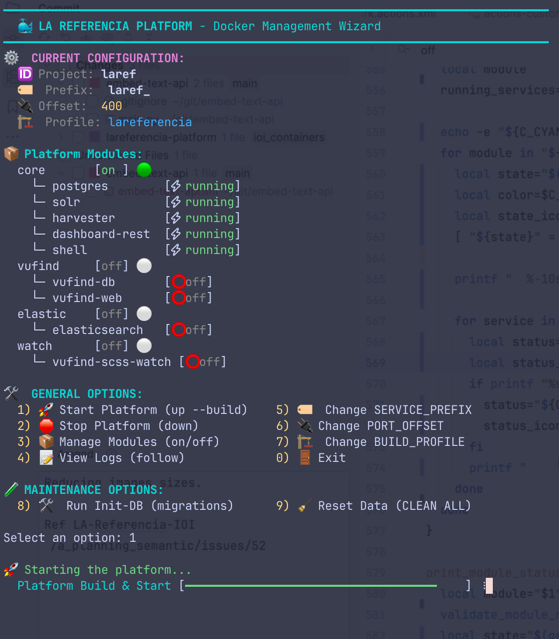

# Docker Development Environment / Entorno Docker / Ambiente Docker

Choose your language: [English](#english) | [Español](#español) | [Português](#português)

---

## English

This environment sets up the platform from the repository root using `docker-compose.yml` and `Docker/docker.sh`.

### 🧙‍♂️ Docker Management Wizard (Recommended)

The easiest way to manage your environment is using the interactive Wizard. It provides real-time status, configuration management, and one-click actions with progress bars.

```bash
./Docker/docker.sh wizard
```



### 🚀 Key Features (v5.0)

**1. Maven Build Profiles**
Choose business logic by editing `Docker/.env` or via Wizard:
- `LR_BUILD_PROFILE=lareferencia` (Default)
- `LR_BUILD_PROFILE=ibict` (Includes DARK/PID worker)
- `LR_BUILD_PROFILE=rcaap` (Includes RCAAP specific logic)

**2. Flexible Config Overrides**
Use `Docker/config-overrides/` to inject beans/properties without modifying source code.

**3. Running Multiple Instances**
Run multiple isolated instances on the same server by configuring `SERVICE_PREFIX` and `SERVICES_PORT_OFFSET`.

---

## Español

Este entorno levanta la plataforma desde la raíz del repositorio usando `docker-compose.yml` y `Docker/docker.sh`.

### 🧙‍♂️ Asistente de Gestión Docker (Recomendado)

La forma más sencilla de gestionar su entorno es utilizando el Asistente interactivo. Proporciona estado en tiempo real, gestión de configuración y acciones con barras de progreso.

```bash
./Docker/docker.sh wizard
```

### 🚀 Características Clave (v5.0)

**1. Perfiles de Build Maven**
Seleccione la lógica de negocio editando `Docker/.env` o mediante el Asistente:
- `LR_BUILD_PROFILE=lareferencia` (Por defecto)
- `LR_BUILD_PROFILE=ibict` (Incluye worker DARK/PID)
- `LR_BUILD_PROFILE=rcaap` (Incluye lógica específica de RCAAP)

**2. Sobrescritura Flexible de Configuración**
Use `Docker/config-overrides/` para inyectar beans o propiedades sin modificar el código fuente.

**3. Ejecución de Múltiples Instancias**
Ejecute múltiples instancias aisladas configurando `SERVICE_PREFIX` y `SERVICES_PORT_OFFSET`.

---

## Português

Este ambiente levanta a plataforma a partir da raiz do repositório usando `docker-compose.yml` e `Docker/docker.sh`.

### 🧙‍♂️ Assistente de Gerenciamento Docker (Recomendado)

A maneira mais fácil de gerenciar seu ambiente é usando o Assistente (Wizard) interativo. Ele oferece status em tempo real, gerenciamento de configuração e ações com barras de progresso.

```bash
./Docker/docker.sh wizard
```

### 🚀 Novidades e Recursos (v5.0)

**1. Perfis de Build Maven**
Escolha a lógica de negócio editando o arquivo `Docker/.env` ou via Assistente:
- `LR_BUILD_PROFILE=lareferencia` (Padrão)
- `LR_BUILD_PROFILE=ibict` (Inclui o worker DARK/PID)
- `LR_BUILD_PROFILE=rcaap` (Inclui lógica específica da RCAAP)

**2. Sobrescritas de Configuração Flexíveis**
Use o diretório `Docker/config-overrides/` para injetar beans ou propriedades sem modificar o código-fonte.

**3. Execução de Múltiples Instâncias**
Rode múltiplas instâncias isoladas configurando as variáveis `SERVICE_PREFIX` e `SERVICES_PORT_OFFSET`.

---

## 🛠️ Main Commands / Comandos

```bash
./Docker/docker.sh wizard              # Start the interactive UI
./Docker/docker.sh up                  # Start services (CLI mode)
./Docker/docker.sh down                # Stop and remove containers
./Docker/docker.sh reset-data          # Clean Docker/data (preserving .gitkeep)
./Docker/docker.sh init-db             # Run database migrations
```

## 🌐 Endpoints

- VuFind: `http://localhost:8080`
- Harvester: `http://localhost:8090`
- Dashboard REST: `http://localhost:8092`
- Solr Admin: `http://localhost:8983/solr`
