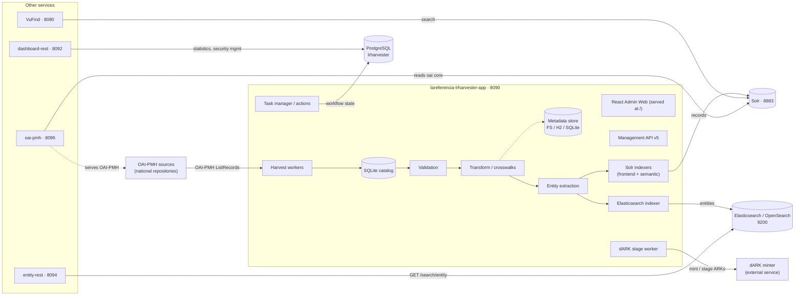

# Architecture Overview

**Status:** current · **Last verified:** 2026-09-23

High-level map of the LA Referencia platform: modules, ports and the main data flows.
Verified against the code and build files on 2026-09-23. Configuration details live in
[`CONFIGURATION_PROPERTIES.md`](CONFIGURATION_PROPERTIES.md); terminology in
[`GLOSSARY.md`](GLOSSARY.md); the full document index in
[`DOCUMENTATION_INDEX.md`](DOCUMENTATION_INDEX.md).

## Component diagram

The `lareferencia-shell` (CLI) administers the same PostgreSQL/Solr/Elasticsearch
backends outside the web app. VuFind is an external fork (PHP) with its own database;
the Admin Web is built from `lareferencia-lrharvester-admin-web` and served statically
by the harvester.

## Data flows

1. **Harvesting.** The harvester's workers (built on `lareferencia-oclc-harvester`, the
   adapted OCLC Harvester2 client) issue OAI-PMH requests per network/format and insert
   records into the **SQLite catalog**, tracking per-record `change_type` `N`/`U`/`D`
   since 2026-09-04 — the basis of incremental processing
   ([ISSUE_INCREMENTAL_RECORD_PROCESSING.md](ISSUE_INCREMENTAL_RECORD_PROCESSING.md)).
2. **Validation.** Rules are defined as JSON (dynamic schemas + i18n,
   [DYNAMIC_SCHEMA_REFACTORING.md](DYNAMIC_SCHEMA_REFACTORING.md)); results go to the
   validation SQLite store with fingerprint + manifest reuse; the multithread pipeline
   was replaced by the incremental model.
3. **Transformation.** Crosswalk/mapping beans (`config/beans/*.xml`) transform source
   metadata into the target schema; results go to the **metadata store** (filesystem by
   default; H2/SQLite per-network variants —
   [ALMACENAMIENTO_REFERENCIA_RAPIDA.md](ALMACENAMIENTO_REFERENCIA_RAPIDA.md)).
4. **Entities & indexing.** Entity extraction derives entities and relations; dirty
   entities are merged (`merge_dirty_entities_and_relations`) and indexed to
   Elasticsearch by the threaded indexer
   ([ENTITY_INDEXING_ARCHITECTURE.md](ENTITY_INDEXING_ARCHITECTURE.md)); frontend and
   semantic (embeddings) Solr indexes are fed in parallel
   ([SEMANTIC_INDEXING_CHUNKING.md](SEMANTIC_INDEXING_CHUNKING.md)).
5. **Persistent identifiers.** The dARK stage worker reserves and stages ARKs through
   `lareferencia-dark-lib` against the external minter; the NAAN is configured per
   network (`network.attributes.ark_naan`) and the API routes are
   `POST /api/v5/dark/naans/{arkNaan}/preview|stage|reconcile`
   ([HARVESTER_MANAGEMENT_API_V5.md](HARVESTER_MANAGEMENT_API_V5.md)).
6. **Publication.** `lareferencia-oai-pmh` is a standalone Spring Boot app (no
   lareferencia library dependencies): it reads the Solr `oai` core and serves the
   OAI-PMH protocol on port 8096, so external harvesters can harvest LA Referencia.
7. **Consumption.** VuFind searches Solr; `dashboard-rest` serves `/api/v2` statistics
   and security management (Keycloak optional, disabled in this deployment); `entity-rest`
   keeps the legacy `GET /search/entity/{type}` over Elasticsearch; the React Admin Web
   talks to the harvester's API v5 on 8090.

## Modules

| Repository | Kind | Role |
|---|---|---|
| `lareferencia-core-lib` | Java library | Domain, metadata, catalog + validation repositories, service, task, worker, embedding, flowable, util (`ConfigPathResolver`, `PropertiesDirectoryListener`), oabroker |
| `lareferencia-entity-lib` | Java library | Entity model + Elasticsearch/OpenSearch indexer (`JSONElasticEntityIndexerThreadedImpl`) |
| `lareferencia-lrharvester-app` | Spring Boot app | The harvester: workers, API v5, Admin Web at `/`, legacy AngularJS at `/legacy/` (8090) |
| `lareferencia-lrharvester-admin-web` | React / Node 22 | Source of the Admin Web; built into the harvester's `static/` |
| `lareferencia-shell` | Spring Shell CLI | Administration commands (DB migrate, indexing, Excel network loads, …) |
| `lareferencia-shell-entity-plugin` | plugin | Entity-specific shell commands |
| `lareferencia-entity-rest` | Spring Boot app | Legacy REST surface: `GET /search/entity/{type}` (8094, Springfox `/swagger`) |
| `lareferencia-dashboard-rest` | Spring Boot app | `/api/v2` statistics + security management (Keycloak optional) (8092) |
| `lareferencia-oai-pmh` | Spring Boot app | OAI-PMH provider over Solr (8096) |
| `lareferencia-dark-lib` | Java library | dARK client: `DarkProperties`, minter/stage/reconcile |
| `lareferencia-oclc-harvester` | Java library | Adapted OCLC Harvester2 (OAI-PMH client) |
| `lareferencia-indexing-filters-lib` | Java library | `FieldOccurrenceFilter` strategies for indexing |
| `lareferencia-solr-cores` | config | Solr core definitions (canonical `oai` core still `LUCENE_42`; services run Solr 9.8 copies) |
| `lareferencia-contrib-ibict` / `rcaap` | Java library | Country variants (not compiled in the v5 reactor; enabled by Maven profile) |

Dependency sketch (from the poms): `lrharvester-app` → core-lib + dark-lib (+ entity-lib
per profile); `entity-rest` → core-lib + entity-lib; `dashboard-rest` → core-lib;
`oai-pmh` → standalone. Libraries come transitively through core-lib (e.g. oclc-harvester,
indexing-filters-lib).

## Ports

| Port | Service | Notes |
|---|---|---|
| 8080 | VuFind | PHP UI, its own MySQL (`3307`) |
| 8090 | Harvester | Admin Web at `/`, API v5 at `/api/v5`, legacy UI at `/legacy/`, Data REST at `/rest` |
| 8092 | dashboard-rest | springdoc at `/swagger-ui.html` |
| 8094 | entity-rest | Springfox at `/swagger`, context `/api/v2` |
| 8096 | oai-pmh | host port; the container serves 8092; starts only with the `oai` compose profile |
| 8983 | Solr | Admin UI at `/solr` |
| 9200 | Elasticsearch / OpenSearch | entity index |
| 5432 | PostgreSQL | `lrharvester` (+ separate `lrharvester_flowable` when Flowable is enabled) |
| 81xx | dev wizard variants | `Docker/docker-dev.sh` offsets every port by +100 |

## Cross-cutting concerns

- **Workflow engine**: `legacy` by default; Flowable opt-in via `workflow.engine=flowable`
  ([WORKFLOW_ACTIONS.md](WORKFLOW_ACTIONS.md),
  [FLOWABLE_REFACTORING_STRATEGY.md](FLOWABLE_REFACTORING_STRATEGY.md)).
- **Configuration**: split `application.properties.d` fragments loaded at startup
  ([CONFIGURATION_PROPERTIES.md](CONFIGURATION_PROPERTIES.md)), relocated with
  `app.config.dir` ([CONFIG_DIRECTORY.md](CONFIG_DIRECTORY.md)).
- **Authentication**: file-based users + optional OIDC/hybrid
  ([AUTHENTICATION.md](AUTHENTICATION.md)).
- **Operations**: Docker wizard and backup/restore
  ([../Docker/README.md](../Docker/README.md), [BACKUP_RESTORE.md](BACKUP_RESTORE.md),
  [DOCKER_DEV.md](DOCKER_DEV.md)).

Related: [`ONBOARDING.md`](ONBOARDING.md) · [`GLOSSARY.md`](GLOSSARY.md) ·
[`DOCUMENTATION_INDEX.md`](DOCUMENTATION_INDEX.md)