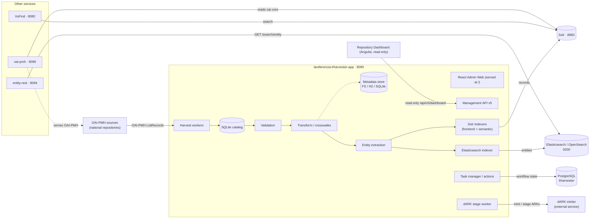

# Architecture Overview

**Status:** current · **Last verified:** 2026-09-29

High-level map of the LA Referencia platform: modules, ports and the main data flows.
Verified against the code and build files on 2026-09-29. Configuration details live in
[`CONFIGURATION_PROPERTIES.md`](CONFIGURATION_PROPERTIES.md); terminology in
[`GLOSSARY.md`](GLOSSARY.md); the full document index in
[`DOCUMENTATION_INDEX.md`](DOCUMENTATION_INDEX.md).

## Component diagram

```mermaid
flowchart LR
    SRC["OAI-PMH sources<br/>(national repositories)"]

    subgraph HARV["lareferencia-lrharvester-app · 8090"]
        direction TB
        AW["React Admin Web (served at /)"]
        V5["Management API v5"]
        TM["Task manager / actions"]
        HW["Harvest workers"] --> CAT[("SQLite catalog")]
        CAT --> VAL["Validation"] --> CW["Transform / crosswalks"]
        CW -.-> MST[("Metadata store<br/>FS / H2 / SQLite")]
        CW --> EE["Entity extraction"]
        EE --> ESI["Elasticsearch indexer"]
        EE --> SOI["Solr indexers<br/>(frontend + semantic)"]
        STG["dARK stage worker"]
    end

    PG[("PostgreSQL<br/>lrharvester")]
    ES[("Elasticsearch / OpenSearch<br/>9200")]
    SOLR[("Solr · 8983")]
    DARK["dARK minter<br/>(external service)"]

    subgraph CONS["Other services"]
        VUF["VuFind · 8080"]
        ENT["entity-rest · 8094"]
        OAIP["oai-pmh · 8096"]
    end

    RDB["Repository Dashboard (Angular, read-only)"]

    SRC -->|"OAI-PMH ListRecords"| HW
    ESI -->|"entities"| ES
    SOI -->|"records"| SOLR
    TM -->|"workflow state"| PG
    STG -->|"mint / stage ARKs"| DARK
    VUF -->|"search"| SOLR
    ENT -->|"GET /search/entity"| ES
    RDB -->|"read-only /api/v5/dashboard"| V5
    OAIP -->|"reads oai core"| SOLR
    OAIP -.->|"serves OAI-PMH"| SRC
```

The `lareferencia-shell` (CLI) administers the same PostgreSQL/Solr/Elasticsearch
backends outside the web app. VuFind is an external fork (PHP) with its own database.
The Admin Web and Repository Dashboard are built independently into `admin-static/` and
`dashboard-static/`; the Harvester serves them only below `/admin/` and `/dashboard/`.

## Data flows

1. **Harvesting.** The harvester's workers (built on `lareferencia-oclc-harvester`, the
   adapted OCLC Harvester2 client) issue OAI-PMH requests per network/format and insert
   records into the **SQLite catalog**, tracking per-record `change_type` `N`/`U`/`D`
   since 2026-09-04 — the basis of incremental processing
   ([ISSUE_INCREMENTAL_RECORD_PROCESSING.md](ISSUE_INCREMENTAL_RECORD_PROCESSING.md)).
2. **Validation.** Rules are defined as JSON (dynamic schemas + i18n,
   [DYNAMIC_SCHEMA_REFACTORING.md](DYNAMIC_SCHEMA_REFACTORING.md)); results go to the
   validation SQLite store with fingerprint + manifest reuse; the multithread pipeline
   was replaced by the incremental model.
3. **Transformation.** Crosswalk/mapping beans (`config/beans/*.xml`) transform source
   metadata into the target schema; results go to the **metadata store** (filesystem by
   default; H2/SQLite per-network variants —
   [ALMACENAMIENTO_REFERENCIA_RAPIDA.md](ALMACENAMIENTO_REFERENCIA_RAPIDA.md)).
4. **Entities & indexing.** Entity extraction derives entities and relations; dirty
   entities are merged (`merge_dirty_entities_and_relations`) and indexed to
   Elasticsearch by the threaded indexer
   ([ENTITY_INDEXING_ARCHITECTURE.md](ENTITY_INDEXING_ARCHITECTURE.md)); frontend and
   semantic (embeddings) Solr indexes are fed in parallel
   ([SEMANTIC_INDEXING_CHUNKING.md](SEMANTIC_INDEXING_CHUNKING.md)).
5. **Persistent identifiers.** The dARK stage worker reserves and stages ARKs through
   `lareferencia-dark-lib` against the external minter; the NAAN is configured per
   network (`network.attributes.ark_naan`) and the API routes are
   `POST /api/v5/dark/naans/{arkNaan}/preview|stage|reconcile`
   ([HARVESTER_MANAGEMENT_API_V5.md](HARVESTER_MANAGEMENT_API_V5.md)).
6. **Publication.** `lareferencia-oai-pmh` is a standalone Spring Boot app (no
   lareferencia library dependencies): it reads the Solr `oai` core and serves the
   OAI-PMH protocol on port 8096, so external harvesters can harvest LA Referencia.
7. **Consumption.** VuFind searches Solr. The Angular Repository Dashboard uses local v5
   sessions and read-only `/api/v5/dashboard` routes. Its public proxy host is allowlisted
   to auth/session endpoints and GET dashboard requests; it cannot reach admin APIs.
   See [DASHBOARD_V5_MIGRATION.md](DASHBOARD_V5_MIGRATION.md). `entity-rest` keeps the
   legacy `GET /search/entity/{type}` over Elasticsearch; React Admin Web uses v5 admin
   routes on its separate host.

## Modules

| Repository | Kind | Role |
|---|---|---|
| `lareferencia-core-lib` | Java library | Domain, metadata, catalog + validation repositories, service, task, worker, embedding, flowable, util (`ConfigPathResolver`, `PropertiesDirectoryListener`), oabroker |
| `lareferencia-entity-lib` | Java library | Entity model + Elasticsearch/OpenSearch indexer (`JSONElasticEntityIndexerThreadedImpl`) |
| `lareferencia-lrharvester-app` | Spring Boot app | Harvester workers and v5 API; serves Admin at `/admin/` and Dashboard at `/dashboard/` |
| `lareferencia-lrharvester-admin-web` | React / Node 22 | Admin Web source; built into the harvester's `admin-static/` |
| `lareferencia-repository-dashboard` | Angular / Node 18 | Read-only Dashboard source; built into the harvester's `dashboard-static/` |
| `lareferencia-shell` | Spring Shell CLI | Administration commands (DB migrate, indexing, Excel network loads, …) |
| `lareferencia-shell-entity-plugin` | plugin | Entity-specific shell commands |
| `lareferencia-entity-rest` | Spring Boot app | Legacy REST surface: `GET /search/entity/{type}` (8094, Springfox `/swagger`) |
| `lareferencia-oai-pmh` | Spring Boot app | OAI-PMH provider over Solr (8096) |
| `lareferencia-dark-lib` | Java library | dARK client: `DarkProperties`, minter/stage/reconcile |
| `lareferencia-oclc-harvester` | Java library | Adapted OCLC Harvester2 (OAI-PMH client) |
| `lareferencia-indexing-filters-lib` | Java library | `FieldOccurrenceFilter` strategies for indexing |
| `lareferencia-solr-cores` | config | Solr core definitions (canonical `oai` core still `LUCENE_42`; services run Solr 9.8 copies) |
| `lareferencia-contrib-ibict` / `rcaap` | Java library | Country variants (not compiled in the v5 reactor; enabled by Maven profile) |

Dependency sketch (from the poms): `lrharvester-app` → core-lib + dark-lib (+ entity-lib
per profile); `entity-rest` → core-lib + entity-lib; `oai-pmh` → standalone. The
Angular Repository Dashboard is a separate frontend planned to call Harvester's API after its v5 migration. Libraries come transitively through core-lib (e.g. oclc-harvester,
indexing-filters-lib).

## Ports

| Port | Service | Notes |
|---|---|---|
| 8080 | VuFind | PHP UI, its own MySQL (`3307`) |
| 8090 | Harvester | Standard Compose loopback port; Docker Dev publishes `8190` on loopback in isolated mode |
| 8088 | developer web gateway | Admin/Dashboard host routing; isolated developer mode uses 8188; alternate to direct loopback access |
| 8094 | entity-rest | Springfox at `/swagger`, context `/api/v2` |
| 8096 | oai-pmh | host port; the container serves 8092; starts only with the `oai` compose profile |
| 8983 | Solr | Admin UI at `/solr` |
| 9200 | Elasticsearch / OpenSearch | entity index |
| 5432 | PostgreSQL | `lrharvester` (+ separate `lrharvester_flowable` when Flowable is enabled) |
| 81xx | developer services | `Docker/docker-dev.sh` offsets service ports by +100; Vite remains internal |

## Cross-cutting concerns

- **Workflow engine**: `legacy` by default; Flowable opt-in via `workflow.engine=flowable`
  ([WORKFLOW_ACTIONS.md](WORKFLOW_ACTIONS.md),
  [FLOWABLE_REFACTORING_STRATEGY.md](FLOWABLE_REFACTORING_STRATEGY.md)).
- **Configuration**: split `application.properties.d` fragments loaded at startup
  ([CONFIGURATION_PROPERTIES.md](CONFIGURATION_PROPERTIES.md)), relocated with
  `app.config.dir` ([CONFIG_DIRECTORY.md](CONFIG_DIRECTORY.md)).
- **Harvester authentication**: local PostgreSQL identities, JDBC sessions/CSRF, and
  scoped revocable service tokens ([AUTHENTICATION.md](AUTHENTICATION.md)). The Dashboard
  uses the same local session, with its proxy host restricted to read-only dashboard
  endpoints. Production TLS and hostnames remain deployment configuration.
- **Operations**: Docker wizard and backup/restore
  ([../Docker/README.md](../Docker/README.md), [BACKUP_RESTORE.md](BACKUP_RESTORE.md),
  [DOCKER_DEV.md](DOCKER_DEV.md)).

Related: [`ONBOARDING.md`](ONBOARDING.md) · [`GLOSSARY.md`](GLOSSARY.md) ·
[`DOCUMENTATION_INDEX.md`](DOCUMENTATION_INDEX.md)
