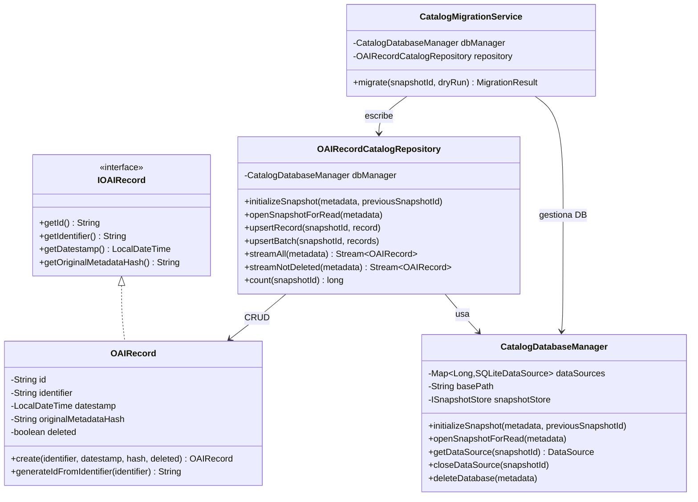
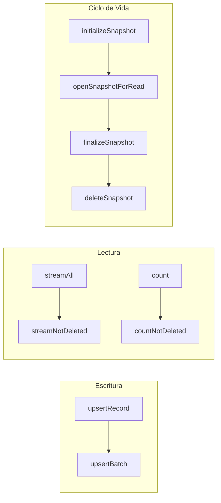
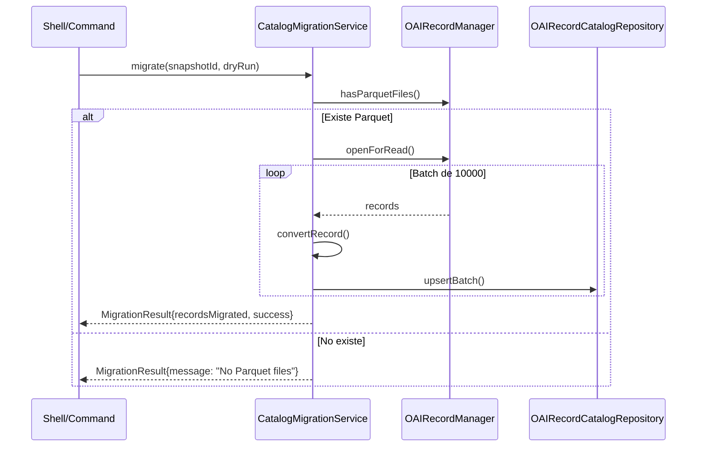
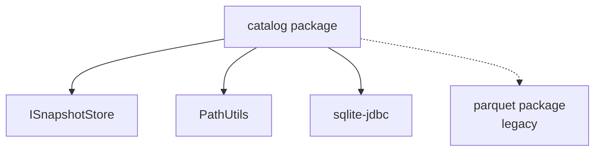

# Análisis Arquitectónico: Paquete `catalog`

> **Módulo:** `lareferencia-core-lib`  
> **Paquete:** `org.lareferencia.core.repository.catalog`  
> **Fecha de análisis:** 2025-01-19

---

## 🎯 Resumen Ejecutivo

El paquete `catalog` implementa el **almacenamiento persistente de metadatos OAI-PMH** utilizando SQLite como backend. Esta es la **arquitectura v5.0** que reemplaza el sistema anterior basado en Parquet, optimizada para:

- **Harvesting incremental eficiente** (copia de catálogo anterior)
- **Queries ACID** sobre registros individuales (vs. scans batch de Parquet)
- **Aislamiento por snapshot** (un `catalog.db` por cada snapshot)

---

## 📊 Diagrama de Componentes



---

## 📁 Estructura de Archivos

| Clase | Responsabilidad | LoC |
|-------|-----------------|-----|
| [OAIRecord.java](file:///Users/lmatas/source/lareferencia-platform/lareferencia-core-lib/src/main/java/org/lareferencia/core/repository/catalog/OAIRecord.java) | Entidad POJO para registros OAI | 223 |
| [CatalogDatabaseManager.java](file:///Users/lmatas/source/lareferencia-platform/lareferencia-core-lib/src/main/java/org/lareferencia/core/repository/catalog/CatalogDatabaseManager.java) | Gestión de conexiones SQLite por snapshot | 330 |
| [OAIRecordCatalogRepository.java](file:///Users/lmatas/source/lareferencia-platform/lareferencia-core-lib/src/main/java/org/lareferencia/core/repository/catalog/OAIRecordCatalogRepository.java) | Operaciones CRUD sobre el catálogo | 444 |
| [CatalogMigrationService.java](file:///Users/lmatas/source/lareferencia-platform/lareferencia-core-lib/src/main/java/org/lareferencia/core/repository/catalog/CatalogMigrationService.java) | Migración Parquet → SQLite | 288 |

---

## 🔍 Análisis Detallado por Clase

### 1. `OAIRecord` - Entidad de Dominio

**Propósito:** Representa un registro OAI-PMH en el catálogo SQLite.

**Campos:**
| Campo | Tipo | Descripción |
|-------|------|-------------|
| `id` | `String` | Hash MD5 del identifier (PK) |
| `identifier` | `String` | Identificador OAI-PMH original |
| `datestamp` | `LocalDateTime` | Fecha de última modificación |
| `originalMetadataHash` | `String` | Hash MD5 del XML cosechado |
| `deleted` | `boolean` | Flag de registro eliminado en origen |

**Decisiones de Diseño:**

> [!IMPORTANT]
> El ID se genera como **MD5 del identifier**, NO es un autoincrement. Esto garantiza:
> - **Idempotencia:** El mismo registro siempre tiene el mismo ID
> - **Harvesting incremental:** Se puede hacer `INSERT OR REPLACE` sin buscar primero
> - **Portabilidad:** IDs consistentes entre snapshots

**Factory Method Pattern:**
```java
// Preferido sobre new OAIRecord(...)
OAIRecord record = OAIRecord.create(identifier, datestamp, hash, deleted);
```

**Contrato `IOAIRecord`:**
- La clase implementa la interfaz `IOAIRecord` de `org.lareferencia.core.domain`
- Permite polimorfismo con otras implementaciones (Parquet legacy, JPA)

---

### 2. `CatalogDatabaseManager` - Infraestructura

**Propósito:** Gestiona el ciclo de vida de bases de datos SQLite por snapshot.

**Patrón:** `Component` de Spring con pool de `DataSource` por snapshot.

**Estructura de Almacenamiento:**
```
{basePath}/{NETWORK}/snapshots/snapshot_{id}/catalog/catalog.db
                                                      catalog.db-wal  (modo WAL)
                                                      catalog.db-shm  (modo WAL)
```

**Operaciones Clave:**

| Método | Uso | Thread-Safety |
|--------|-----|---------------|
| `initializeSnapshot()` | Crear nuevo catálogo (opcionalmente desde anterior) | ✅ ConcurrentHashMap |
| `openSnapshotForRead()` | Abrir catálogo existente para lectura | ✅ |
| `getDataSource()` | Obtener conexión para operaciones | ✅ |
| `closeDataSource()` | Liberar recursos | ✅ |

**Configuración SQLite:**
```java
// PRAGMAs para rendimiento
PRAGMA journal_mode=WAL;     // Write-Ahead Logging
PRAGMA synchronous=NORMAL;   // Balance durabilidad/velocidad
PRAGMA cache_size=10000;     // ~10MB cache
PRAGMA temp_store=MEMORY;    // Temporales en RAM
```

**Esquema SQL:**
```sql
CREATE TABLE IF NOT EXISTS oai_record (
    id TEXT PRIMARY KEY,
    identifier TEXT NOT NULL UNIQUE,
    datestamp TEXT NOT NULL,
    original_metadata_hash TEXT,
    deleted INTEGER NOT NULL DEFAULT 0
);

CREATE INDEX IF NOT EXISTS idx_deleted ON oai_record(deleted);
```

---

### 3. `OAIRecordCatalogRepository` - Capa de Acceso

**Propósito:** API JDBC para operaciones CRUD sobre el catálogo.

**Operaciones Principales:**



**Características Técnicas:**

| Aspecto | Implementación |
|---------|----------------|
| **Upsert** | `INSERT OR REPLACE` (O(1) sin SELECT previo) |
| **Batch** | Transacción única con `setAutoCommit(false)` |
| **Streaming** | `Stream<OAIRecord>` lazy con cursor JDBC |
| **Conteo** | Queries optimizadas `COUNT(*)` |

**Ejemplo de uso (en HarvestingWorker):**
```java
// Inicializar para harvesting incremental
catalogRepository.initializeSnapshot(metadata, previousSnapshotId);

// Insertar registros en batch
catalogRepository.upsertBatch(snapshotId, recordBatch);

// Finalizar
catalogRepository.finalizeSnapshot(snapshotId);
```

---

### 4. `CatalogMigrationService` - Migración Legacy

**Propósito:** Migrar catálogos de formato Parquet (legacy) a SQLite (v5.0).

**Flujo de Migración:**



> [!WARNING]
> La migración **NO elimina** los archivos Parquet originales. Esto es intencional para permitir rollback.

---

## 🔗 Integraciones con el Sistema

### Workers que consumen el catálogo:

| Worker | Uso del Catálogo |
|--------|------------------|
| [HarvestingWorker](file:///Users/lmatas/source/lareferencia-platform/lareferencia-core-lib/src/main/java/org/lareferencia/core/worker/harvesting/HarvestingWorker.java) | **Escritura:** `initializeSnapshot()`, `upsertBatch()`, `finalizeSnapshot()` |
| [ValidationWorker](file:///Users/lmatas/source/lareferencia-platform/lareferencia-core-lib/src/main/java/org/lareferencia/core/worker/validation/ValidationWorker.java) | **Lectura:** `openSnapshotForRead()`, `streamNotDeleted()` |
| [NetworkCleanWorker](file:///Users/lmatas/source/lareferencia-platform/lareferencia-core-lib/src/main/java/org/lareferencia/core/worker/management/NetworkCleanWorker.java) | **Eliminación:** `deleteSnapshot()` |

### Dependencias Externas:



---

## ⚡ Consideraciones de Rendimiento

### Harvesting Incremental

El diseño optimiza el caso de harvesting incremental copiando el `catalog.db` completo:

```java
// En CatalogDatabaseManager.copyCatalogFromPrevious()
Files.copy(previousDbPath, targetDbPath, StandardCopyOption.REPLACE_EXISTING);
```

**Trade-off:**
- ✅ Reutiliza registros existentes sin re-procesamiento
- ⚠️ Copia de archivos grandes (~100MB+ en redes grandes)

### WAL Mode

El modo WAL (Write-Ahead Logging) permite:
- Lecturas concurrentes durante escritura
- Mejor rendimiento en inserciones masivas
- Recuperación automática ante crashes

---

## 🏗️ Patrones de Diseño Identificados

| Patrón | Uso |
|--------|-----|
| **Repository** | `OAIRecordCatalogRepository` encapsula acceso a datos |
| **Factory Method** | `OAIRecord.create()` para construcción controlada |
| **Unit of Work** | Transacciones en `upsertBatch()` |
| **Lazy Loading** | `Stream<OAIRecord>` con cursor JDBC |
| **Dependency Injection** | `@Autowired` en todos los componentes |

---

## ⚠️ Observaciones y Recomendaciones

### Fortalezas

1. **Aislamiento de snapshots:** Cada snapshot tiene su propia DB, evitando conflictos
2. **Thread safety:** Uso correcto de `ConcurrentHashMap` y `ThreadLocal`
3. **Migración no destructiva:** Preserva datos legacy de Parquet
4. **API limpia:** Separación clara entre Manager (infraestructura) y Repository (negocio)

### Áreas de Mejora Potencial

> [!TIP]
> **Connection Pooling:** Actualmente se usa `SQLiteDataSource` directo. Para alto volumen, considerar HikariCP con pool pequeño (1-2 conexiones por DB, dado que SQLite es single-writer).

> [!NOTE]
> **Índice adicional:** Para queries frecuentes por `datestamp` (ej: buscar registros modificados desde fecha X), considerar:
> ```sql
> CREATE INDEX IF NOT EXISTS idx_datestamp ON oai_record(datestamp);
> ```

> [!CAUTION]
> **Cleanup de WAL files:** Los archivos `-wal` y `-shm` pueden crecer. Considerar `PRAGMA wal_checkpoint(TRUNCATE)` después de operaciones masivas.

---

## 📚 Relación con Arquitectura Global

Según la documentación del skill `La Referencia Architect`:

```
Storage Architecture (v5.0):
- PostgreSQL: Relational Data (Networks, Users, Entities)
- Filesystem: XML Records (Gzipped), Matomo Logs
- SQLite: Harvest Statistics (validation.db, catalog.db) stored in FS per snapshot ← ESTE PAQUETE
```

El paquete `catalog` es parte de la capa de **almacenamiento por snapshot** que complementa a PostgreSQL (datos relacionales globales) y el filesystem (XML raw).

---

*Análisis generado con la habilidad La Referencia Architect*
