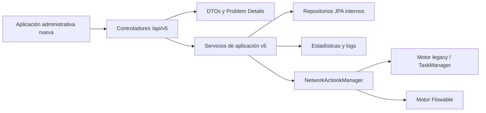

# API administrativa y operativa del Harvester v5

## Propósito

La API v5 crea una superficie HTTP nueva para una futura aplicación administrativa. Su prefijo es `/api/v5` y no depende de los controladores legacy ni de Spring Data REST. El código está en `lareferencia-lrharvester-app` bajo el paquete `org.lareferencia.backend.api.v5`.

La API usa los repositorios JPA, el sistema de diagnóstico y `NetworkActionkManager` internamente, pero nunca expone entidades JPA, enlaces HAL, proxies Hibernate ni el campo interno `jsonserialization`.

La superficie anterior permanece disponible durante la transición:

- Controladores legacy: `/public/**`, `/private/**` y `/rest/log/**`.
- Spring Data REST: `/rest/**`.
- Nueva API: `/api/v5/**`.

## Diseño



Los motores de workflow no fueron modificados. Esto implica que una respuesta de comando confirma que la API remitió una solicitud al motor, no que el pipeline haya finalizado. El motor legacy no dispone de una identidad por envío individual; sus estados se reportan por contexto de red.

## Recursos y contrato

Todas las respuestas son JSON normal. Las colecciones paginadas usan el mismo envoltorio:

```json
{
  "items": [],
  "page": 0,
  "size": 25,
  "totalElements": 0,
  "totalPages": 0
}
```

`page` empieza en cero. El tamaño permitido es de 1 a 200.

### Redes

| Método | Ruta | Descripción |
|---|---|---|
| GET | `/api/v5/networks` | Lista paginada. |
| POST | `/api/v5/networks` | Crea una red y sus vínculos. |
| GET | `/api/v5/networks/{id}` | Obtiene una red. |
| PUT | `/api/v5/networks/{id}` | Reemplaza toda la configuración. |
| PATCH | `/api/v5/networks/{id}` | Aplica JSON Merge Patch. |
| DELETE | `/api/v5/networks/{id}` | Envía la eliminación al worker existente. |
| GET | `/api/v5/networks/{id}/snapshots` | Lista snapshots de la red. |
| GET | `/api/v5/networks/{id}/snapshots/latest?status=valid` | Obtiene el último snapshot válido. |
| GET | `/api/v5/networks/{id}/runtime` | Estado de procesos de la red. |
| POST | `/api/v5/networks/{id}/commands` | Ejecuta una acción operativa. |

Ejemplo de creación o reemplazo:

```json
{
  "acronym": "NETWORK",
  "name": "Repository",
  "institutionName": "Institution",
  "institutionAcronym": "INST",
  "published": true,
  "originUrl": "https://example.org/oai",
  "metadataPrefix": "oai_dc",
  "metadataStoreSchema": "xoai",
  "sets": [],
  "attributes": {},
  "properties": {},
  "scheduleCronExpression": "0 0 2 * * *",
  "prevalidatorId": 1,
  "validatorId": 2,
  "transformerId": 3,
  "secondaryTransformerId": null
}
```

La API valida que la URL sea absoluta, que el cron sea válido, que el acrónimo no esté repetido y que cada relación exista. Si cambia el cron, reprograma la red a través del mecanismo existente.

La eliminación requiere `ROLE_ADMIN`, que no haya tareas en ejecución o cola y el encabezado:

```text
X-Confirm-Network-Deletion: NETWORK
```

La eliminación devuelve `202 Accepted`, invoca `NETWORK_DELETE_ACTION` y queda sujeta a la ejecución asíncrona del worker ya configurado.

### Validadores, transformadores y reglas

| Recurso | Operaciones |
|---|---|
| `/api/v5/validators` | Lista, crea, consulta, reemplaza y elimina validadores. |
| `/api/v5/validators/{id}/clone` | Crea una copia con sus reglas. |
| `/api/v5/validators/{id}/rules` | Crea reglas de validación. |
| `/api/v5/validators/{id}/rules/{ruleId}` | Actualiza o elimina una regla. |
| `/api/v5/validators/{id}/rules/order` | Reordena las reglas del validador. |
| `/api/v5/transformers` | Operaciones equivalentes para transformadores. |
| `/api/v5/transformers/{id}/rules` | Crea reglas de transformación. |
| `/api/v5/transformers/{id}/rules/{ruleId}` | Actualiza o elimina una regla. |
| `/api/v5/transformers/{id}/rules/order` | Recalcula `runOrder` de reglas de transformación. |

No se puede eliminar un validador o transformador que esté vinculado a alguna red; la API responde `409 Conflict`.

Las reglas usan un contrato explícito:

```json
{
  "typeId": "validator--regex-field-content-validator-rule",
  "className": "org.lareferencia.core.worker.validation.validator.RegexFieldContentValidatorRule",
  "name": "Título obligatorio",
  "description": "Comprueba la existencia del campo título",
  "mandatory": true,
  "quantifier": "ONE_OR_MORE",
  "runOrder": 0,
  "configuration": {
    "fieldName": "title"
  }
}
```

Se acepta `typeId` o `className`; si llegan ambos deben resolver al mismo tipo. `typeId` es la opción recomendada. La API genera y valida internamente la serialización que el motor actual requiere.

El catálogo se obtiene desde:

- `GET /api/v5/rule-types?kind=validator|transformer&locale=es`
- `GET /api/v5/rule-types/{typeId}`

Cada entrada contiene nombre, clase, identificador y JSON Schema generado a partir de las implementaciones de regla instaladas.

### Snapshots, logs y diagnóstico

Los snapshots son solo de lectura: los crea el workflow de cosecha.

| Método | Ruta |
|---|---|
| GET | `/api/v5/snapshots/{id}` |
| GET | `/api/v5/snapshots/{snapshotId}/logs` |
| GET/POST | `/api/v5/snapshots/{snapshotId}/diagnostics/summary` y `/summary/query` |
| GET/POST | `/api/v5/snapshots/{snapshotId}/diagnostics/records` y `/records/query` |
| GET/POST | `/api/v5/snapshots/{snapshotId}/diagnostics/rules/{ruleId}/occurrences` y `/occurrences/query` |
| GET | `/api/v5/snapshots/{snapshotId}/diagnostics/records/metadata?identifier=...` |

Las variantes `POST .../query` aceptan filtros como arreglo y los traducen al formato que utiliza internamente `IValidationStatisticsService`. La variante de metadata devuelve `application/xml` y obtiene el XML publicado del registro diagnosticado.

### Operación y runtime

| Método | Ruta | Descripción |
|---|---|---|
| GET | `/api/v5/capabilities` | Motor activo, acciones, propiedades, formatos y comandos disponibles. |
| GET | `/api/v5/runtime/summary` | Procesos en curso y contadores globales. |
| POST | `/api/v5/networks/{id}/commands` | Ejecuta un comando sobre una red. |
| POST | `/api/v5/network-command-batches` | Ejecuta un comando sobre varias redes. |

El cuerpo de un comando es:

```json
{
  "type": "RUN_ACTION",
  "actionName": "HARVESTING_ACTION",
  "incremental": false
}
```

Los tipos disponibles son:

- `RUN_ACTION`: requiere `actionName` configurado.
- `RUN_ENABLED_ACTIONS`: ejecuta las acciones habilitadas de la red.
- `CANCEL_ALL`: detiene y limpia la cola de la red.
- `RESCHEDULE`: vuelve a programar la red según su cron.

Los comandos devuelven `202 Accepted` y un recibo con `requestId`, red, hora, resultado, mensaje y ruta de runtime. Los lotes devuelven un recibo padre y un resultado hijo por red, por lo que pueden reflejar aceptación parcial.

El runtime declara `engineType` y `cancellationScope`. En legacy el alcance de cancelación es la red; en Flowable puede ser un proceso.

## Seguridad

La configuración de v5 está en `lareferencia-lrharvester-app/config/application.properties.d/10-api-v5.properties`.

El modo predeterminado es:

```properties
security.api-v5.auth-mode=file
```

Reutiliza el archivo BCrypt y HTTP Basic existentes. Las autorizaciones son:

| Rol | Permisos |
|---|---|
| `ROLE_VIEWER` | Todas las consultas GET. |
| `ROLE_ADMIN` | Consultas, configuración, comandos y eliminación. |

También existe modo opcional `oidc` o `hybrid`. En esos modos Spring Security valida JWT usando la configuración estándar de Resource Server (`issuer-uri` o `jwk-set-uri`) y toma los roles del claim configurado en `security.api-v5.oidc.roles-claim`. No hay dependencia funcional de Keycloak ni emisión propia de tokens.

La cadena de seguridad v5 es stateless y responde errores JSON `401` y `403`; no redirige a `login.html`. CORS está denegado por defecto y solo se habilita al configurar una lista explícita en `security.api-v5.allowed-origins`.

## Errores

Los fallos de negocio y validación usan `application/problem+json` y RFC 9457:

```json
{
  "type": "urn:lareferencia:api:v5:network_not_found",
  "title": "NETWORK_NOT_FOUND",
  "status": 404,
  "detail": "Network 123 was not found",
  "code": "NETWORK_NOT_FOUND",
  "traceId": "..."
}
```

Los errores de validación incluyen además `violations` con los campos afectados.

## OpenAPI y pruebas

- Especificación OpenAPI: `/api/v5/openapi`.
- Interfaz Swagger: `/api/v5/docs`.
- Dependencias añadidas: Springdoc y Spring Security OAuth2 Resource Server.
- Prueba inicial de contrato: `ApiV5ManagementControllerTest` verifica paginación basada en cero y Problem Details.
- Comando validado:

```bash
cd lareferencia-lrharvester-app
mvn -f pom.xml -Dtest=ApiV5ManagementControllerTest clean test
```

La propuesta de arquitectura se documentó y validó con OpenSpec bajo `lareferencia-core-lib/openspec/changes/add-harvester-management-api-v5/`. Ese directorio está ignorado por la política actual de Git de `lareferencia-core-lib`, pero queda disponible localmente como referencia de diseño.

## Límites actuales y siguientes pasos

- No hay tabla ni historial persistente de comandos: los recibos representan aceptación HTTP, no una ejecución durable.
- No se modificaron `INetworkActionExecutor`, TaskManager, Flowable ni los workers.
- No se añadió CRUD masivo de registros, bitstreams o metadata; la API ofrece diagnóstico y lectura XML puntual.
- Spring Data REST y la aplicación AngularJS permanecen operativos y no consumen v5.
- Antes de retirar las superficies legacy, una fase posterior debe migrar la nueva aplicación, ampliar pruebas de integración con PostgreSQL y ambos motores, y definir una política de deprecación.
