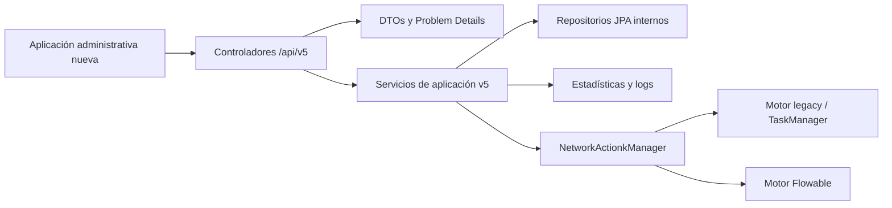

# API administrativa y operativa del Harvester v5

**Status:** current · **Last verified:** 2026-09-29

> **Actualización 2026-09-29:** Harvester sirve únicamente la SPA React y API v5. Las rutas anteriores no son una superficie pública soportada. La autenticación y autorización local se documentan en [`AUTHENTICATION.md`](AUTHENTICATION.md).
## Propósito

La API v5 es la superficie HTTP de la aplicación administrativa React. Su prefijo es `/api/v5` y no depende de controladores legacy ni de Spring Data REST. El código está en `lareferencia-lrharvester-app` bajo `org.lareferencia.backend.api.v5`.

La API usa los repositorios JPA, el sistema de diagnóstico y `NetworkActionkManager` internamente, pero nunca expone entidades JPA, enlaces HAL, proxies Hibernate ni el campo interno `jsonserialization`.

La superficie soportada es `/api/v5/**`. Las rutas fuera de v5 no forman parte del
contrato público de Harvester y la cadena de seguridad deniega rutas desconocidas.

### Compatibilidad de lectura para el dashboard anterior

La ruta separada `/api/v5/dashboard` ofrece las consultas de cosecha y validación del
dashboard v2 sin alterar los endpoints nativos de v5. Conserva los parámetros y
la estructura paginada de Spring Data (`content`, `totalElements`, `number`,
`size`); no utiliza el envoltorio `items` de la API v5 nativa. Requiere usuario humano
`ADMIN` o `DASHBOARD`; `READER` y tokens técnicos no acceden a esta superficie.

| Método | Ruta relativa a `/api/v5/dashboard` | Resultado |
|---|---|---|
| GET | `/harvesting/source/list` | Redes visibles, filtradas antes de paginar. |
| GET | `/harvesting/source/{acronym}` | Datos de una red. |
| GET | `/harvesting/source/{acronym}/history` | Snapshots válidos. |
| GET | `/harvesting/source/{acronym}/history/{startDate}/{endDate}` | Historial válido entre fechas. |
| GET | `/harvesting/source/{acronym}/lkg` | Último snapshot válido. |
| GET | `/validation/source/{acronym}/{snapshotId}` | Resumen de validación. |
| GET | `/validation/source/stats/{acronym}/{snapshotId}/query` | Observaciones con `filters`, `pageNumber`, `pageSize`. |
| GET | `/validation/source/{acronym}/{snapshotId}/records` | Registros con filtros v2 (`is_valid`, `is_transformed`, `valid_rules`, `invalid_rules`, `oai_identifier`). |
| GET | `/validation/source/{acronym}/{snapshotId}/valid_occrs/{ruleId}` | Ocurrencias válidas por regla. |
| GET | `/validation/source/{acronym}/{snapshotId}/invalid_occrs/{ruleId}` | Ocurrencias inválidas por regla. |

Se exige la autenticación local de v5 (sesión o token técnico) y el permiso de
lectura sobre la red; para una consulta por snapshot también se comprueba su
propietario antes de leer estadísticas. Una red o snapshot ajeno devuelve `403`.
No se reproducen los endpoints de broker, usuarios/Keycloak ni la autenticación
de v2. Tampoco se habilita la ruta antigua `/api/v2`.

## Diseño


```mermaid
flowchart LR
    Client[Aplicación administrativa nueva] --> V5[Controladores /api/v5]
    V5 --> DTO[DTOs y Problem Details]
    V5 --> Services[Servicios de aplicación v5]
    Services --> JPA[Repositorios JPA internos]
    Services --> Stats[Estadísticas y logs]
    Services --> Actions[NetworkActionkManager]
    Actions --> Legacy[Motor legacy / TaskManager]
    Actions --> Flowable[Motor Flowable]
```

Los motores de workflow no fueron modificados. Esto implica que una respuesta de comando confirma que la API remitió una solicitud al motor, no que el pipeline haya finalizado. El motor legacy no dispone de una identidad por envío individual; sus estados se reportan por contexto de red.

## Recursos y contrato

Todas las respuestas son JSON normal. Las colecciones paginadas usan el mismo envoltorio:

```json
{
  "items": [],
  "page": 0,
  "size": 25,
  "totalElements": 0,
  "totalPages": 0
}
```

`page` empieza en cero. El tamaño permitido es de 1 a 200.

### Redes

| Método | Ruta | Descripción |
|---|---|---|
| GET | `/api/v5/networks` | Lista paginada. |
| GET | `/api/v5/network-tags` | Etiquetas distintas de las redes autorizadas, ordenadas. |
| POST | `/api/v5/networks` | Crea una red y sus vínculos. |
| GET | `/api/v5/networks/{id}` | Obtiene una red. |
| PUT | `/api/v5/networks/{id}` | Reemplaza toda la configuración. |
| PATCH | `/api/v5/networks/{id}` | Aplica JSON Merge Patch. |
| DELETE | `/api/v5/networks/{id}` | Envía la eliminación al worker existente. |
| GET | `/api/v5/networks/{id}/snapshots` | Lista snapshots de la red. |
| GET | `/api/v5/networks/{id}/snapshots/latest?status=valid` | Obtiene el último snapshot válido. |
| GET | `/api/v5/networks/{id}/runtime` | Estado de procesos de la red. |
| POST | `/api/v5/networks/{id}/commands` | Ejecuta una acción operativa. |

Para el dashboard de la nueva aplicación se incorporó una proyección agregada que evita que el cliente consulte por separado configuración, snapshots y runtime para cada fila:

```text
GET /api/v5/network-summaries?page=0&size=25&sort=name,asc
```

Admite `q`, `acronym`, `name`, `institutionName`, `published`, `snapshotStatus` e `indexStatus`. Cada elemento contiene el último snapshot, el identificador y fecha del último snapshot válido y los conteos/listas de procesos en ejecución, cola y agenda.

### Filtros y orden operativo de fuentes

`GET /api/v5/network-summaries` aplica todos los filtros y el orden en PostgreSQL
antes de paginar, conservando la restricción de redes autorizadas. Los conteos
usan los mismos filtros. No necesita columnas ni tablas nuevas.

| Parámetro | Valores y significado |
|---|---|
| `harvestState` (repetible) | `valid`, `error`, `running`, `stopped`, `finished`, `none`; también estados exactos de `SnapshotStatus`. Valores de esta categoría se combinan con OR. |
| `indexState` (repetible) | `INDEXED`, `FAILED`, `UNKNOWN`; OR dentro de la categoría. `UNKNOWN` incluye fuentes sin snapshot o sin resultado del indexador seleccionado. |
| `validHarvest` | `latest` (la última es válida), `previous` (hay una válida anterior), `none` (ninguna válida), `any` (hay alguna válida). |
| `indexer` | Nombre del bean. El filtro y el orden por indexación consultan esa entrada en el JSON del último snapshot; si falta, es `UNKNOWN`. Sin este parámetro se usa el resumen legacy. |
| `failuresOnly` | `true`: fallo de cosecha OR fallo global de indexación, incluyendo el estado legacy de error de indexación. Se combina con los demás filtros mediante AND. |
| `sort` | `campo,asc` o `campo,desc`. Campos: `acronym`, `tags`, `latestSnapshot`, `lastValidSnapshot`, `snapshotStatus`, `indexStatus`, `attention`, `id`, `name`, `institutionName`, `published`. |

Las categorías distintas se combinan mediante AND. `snapshotStatus` e `indexStatus`
siguen disponibles como filtros exactos por compatibilidad.

El último snapshot y el último válido se seleccionan entre los no eliminados,
por `startTime` descendente y luego ID descendente. Las fechas de ordenación usan
la finalización, o el inicio cuando no hay finalización. Los desempates de fuentes
usan acrónimo e ID; las fechas y etiquetas ausentes quedan al final en ambas direcciones.
Las etiquetas se comparan como una lista ordenada alfabéticamente.

`indexStatus,asc` ordena fallos, sin resultado y OK. `attention,asc` prioriza:
error de cosecha sin válida, error con válida anterior, fallo global de indexación,
cosecha detenida, sin válida y resto. `snapshotStatus,asc` agrupa estados con orden
explícito: errores de cosecha e indexación legacy, detenida, reintentando, cosechando,
indexando, esperando, desconocido, finalizado sin validar, sin cambios, validado,
indexación finalizada legacy y sin snapshots. `desc` invierte cada prioridad.

`GET /api/v5/network-indexers` devuelve los beans indexadores registrados y las claves
persistidas en snapshots de las redes autorizadas, ordenados y sin duplicados.

```text
GET /api/v5/network-summaries?harvestState=error&validHarvest=previous&sort=attention,asc
GET /api/v5/network-summaries?indexer=xoaiIndexerWorker&indexState=FAILED&sort=indexStatus,asc
GET /api/v5/network-summaries?failuresOnly=true&sort=attention,asc
GET /api/v5/network-indexers
```

La interfaz agrupa los controles en «Filtrar y ordenar», con criterios avanzados
plegables, etiquetas removibles y accesos «Con fallos» y «Atención requerida».
La URL conserva todos los criterios; cambiarlos restablece la página y la selección
operativa. La columna de indexación sigue mostrando el resumen global del último
snapshot, aunque el filtro consulte un indexador concreto.

Las redes y los resúmenes incluyen `tags`, un array de strings (vacío para redes sin etiquetas).
`GET /networks` y `GET /network-summaries` aceptan el parámetro repetible `tag` y
`tagMode=all|any` (predeterminado `all`). La pertenencia es exacta, se normalizan espacios,
Unicode NFC y mayúsculas/minúsculas, y el filtro se aplica en base de datos antes de paginar.
Los conteos usan los mismos filtros y permisos que los resultados. En los resúmenes los tags
se combinan mediante AND con búsqueda, publicación y estado de snapshots.

```text
GET /api/v5/network-summaries?tag=proyecto:piloto&tag=pais:ar&tagMode=all
GET /api/v5/networks?tag=proyecto:piloto&tag=tipo:universidad&tagMode=any
GET /api/v5/network-tags
```

Los tags son clasificación de networks, independiente de los sets OAI-PMH y los perfiles de
atributos. No conceden permisos ni modifican cosecha, snapshots o índices. Se permiten hasta
50 valores por solicitud, de 1 a 100 caracteres, sin caracteres de control; los duplicados se
eliminan. Un tag inválido o `tagMode` desconocido devuelve `400 NETWORK_TAGS_INVALID`.
Solo ADMIN puede modificar la configuración. Por compatibilidad, `PUT` o `PATCH` con `tags`
omitido o `null` conserva las etiquetas existentes; `tags: []` las elimina explícitamente.
En creación, la omisión produce una colección vacía. Se conserva la restricción existente
que impide reemplazar configuración mientras la network tiene tareas activas o en cola.

El intercambio XLSX incorpora la columna opcional `tagsJson`, con un array JSON de strings.
Las planillas anteriores sin esa columna conservan los tags al actualizar. Una celda vacía
o `[]` en una columna presente los elimina. La exportación incluye los tags y mantiene su
alcance actual: todas las fuentes, independientemente del filtro visible en la UI.

La persistencia usa `network_tag(network_id, tag)`, clave primaria compuesta, índice
`(tag, network_id)` y borrado en cascada. Antes de ejecutar este código debe aplicarse la
migración Flyway `V5.0.0.16__Network_tags.sql` mediante el mecanismo del módulo shell;
el harvester mantiene `ddl-auto=none`. Las instalaciones existentes parten sin tags.
La carga de colecciones usa batches para evitar una consulta adicional por cada fila.

La UI permite edición con autocompletado, coincidencia Todas/Cualquiera y filtros persistidos
en la URL. Las etiquetas no se muestran en las filas del inventario para conservar espacio. Cambiar los filtros reinicia la página y limpia la selección.
Las acciones por lote siguen limitadas a las filas visibles seleccionadas.

Ejemplo de creación o reemplazo:

```json
{
  "acronym": "NETWORK",
  "name": "Repository",
  "institutionName": "Institution",
  "institutionAcronym": "INST",
  "published": true,
  "originUrl": "https://example.org/oai",
  "metadataPrefix": "oai_dc",
  "metadataStoreSchema": "xoai",
  "sets": [],
  "attributes": {},
  "properties": {},
  "scheduleCronExpression": "0 0 2 * * *",
  "prevalidatorId": 1,
  "validatorId": 2,
  "transformerId": 3,
  "secondaryTransformerId": null
}
```

La API valida que la URL sea absoluta, que el cron sea válido, que el acrónimo no esté repetido y que cada relación exista. Si cambia el cron, reprograma la red a través del mecanismo existente.

La eliminación requiere `ROLE_ADMIN`, que no haya tareas en ejecución o cola y el encabezado:

```text
X-Confirm-Network-Deletion: NETWORK
```

La eliminación devuelve `202 Accepted`, invoca `NETWORK_DELETE_ACTION` y queda sujeta a la ejecución asíncrona del worker ya configurado.

### Validadores, transformadores y reglas

| Recurso | Operaciones |
|---|---|
| `/api/v5/validators` | Lista y crea validadores; `GET`, `PUT` y `PATCH` sobre `/{id}` consultan o modifican el agregado completo. |
| `/api/v5/validators/{id}/clone` | Crea una copia con sus reglas. |
| `/api/v5/validators/{id}/usage` | Expone las redes y relaciones que impiden borrarlo. |
| `/api/v5/validators/{id}/rules` | Lista o crea reglas de validación. |
| `/api/v5/validators/{id}/rules/{ruleId}` | Actualiza o elimina una regla. |
| `/api/v5/validators/{id}/rules/order` | Reordena las reglas del validador. |
| `/api/v5/transformers` | Operaciones equivalentes para transformadores, incluido `PATCH /{id}`. |
| `/api/v5/transformers/{id}/usage` | Expone las redes y relaciones que impiden borrarlo. |
| `/api/v5/transformers/{id}/rules` | Lista o crea reglas de transformación. |
| `/api/v5/transformers/{id}/rules/{ruleId}` | Actualiza o elimina una regla. |
| `/api/v5/transformers/{id}/rules/order` | Recalcula `runOrder` de reglas de transformación. |

No se puede eliminar un validador o transformador que esté vinculado a alguna red; la API responde `409 Conflict`.

Las reglas usan un contrato explícito:

```json
{
  "typeId": "validator--regex-field-content-validator-rule",
  "className": "org.lareferencia.core.worker.validation.validator.RegexFieldContentValidatorRule",
  "name": "Título obligatorio",
  "description": "Comprueba la existencia del campo título",
  "mandatory": true,
  "quantifier": "ONE_OR_MORE",
  "runOrder": 0,
  "configuration": {
    "fieldName": "title"
  }
}
```

Se acepta `typeId` o `className`; si llegan ambos deben resolver al mismo tipo. `typeId` es la opción recomendada. En un reemplazo de agregado, las reglas existentes incluyen su `id`: la API conserva esas identidades y elimina únicamente las que ya no se envían. En altas individuales no se acepta `id`, y en una actualización individual, si se envía, debe coincidir con el identificador de la ruta. La API genera y valida internamente la serialización que el motor actual requiere.

El catálogo se obtiene desde:

- `GET /api/v5/rule-types?kind=validator|transformer&locale=es`
- `GET /api/v5/rule-types/{typeId}`
- `POST /api/v5/rule-types/{typeId}/validate`

El último endpoint comprueba una `configuration` sin persistir cambios. Cada entrada contiene nombre, clase, identificador y JSON Schema generado a partir de las implementaciones de regla instaladas. También publica `help` y `uiSchema`: una representación neutral de la ayuda, orden y widgets del formulario legacy, apta para renderizadores JSON Schema modernos como RJSF. No expone la definición específica de Angular Schema Form.

### Snapshots, logs y diagnóstico

Los snapshots son solo de lectura: los crea el workflow de cosecha.

| Método | Ruta |
|---|---|
| GET | `/api/v5/snapshots/{id}` |
| GET | `/api/v5/snapshots/{snapshotId}/logs` |
| GET/POST | `/api/v5/snapshots/{snapshotId}/diagnostics/summary` y `/summary/query` |
| GET/POST | `/api/v5/snapshots/{snapshotId}/diagnostics/records` y `/records/query` |
| GET/POST | `/api/v5/snapshots/{snapshotId}/diagnostics/rules/{ruleId}/occurrences` y `/occurrences/query` |
| GET | `/api/v5/snapshots/{snapshotId}/diagnostics/records/metadata?identifier=...` |

Las variantes `POST .../query` aceptan filtros tipados y los traducen al formato que utiliza internamente `IValidationStatisticsService`. El formato interno no se expone:

```json
{
  "filters": [
    { "field": "IDENTIFIER", "operator": "CONTAINS", "value": "oai:test" },
    { "field": "VALID", "operator": "EQ", "value": true },
    { "field": "RULE_INVALID", "operator": "EQ", "value": 42 }
  ],
  "page": 0,
  "size": 25
}
```

Los campos disponibles en esta iteración son `IDENTIFIER`, `VALID`, `TRANSFORMED`, `RULE_VALID` y `RULE_INVALID`. Summary, records y occurrences poseen DTOs explícitos en OpenAPI; ya no se publican como un `JsonNode` opaco. La variante de metadata devuelve `application/xml`.

### Identidad y perfiles de atributos

- `GET /api/v5/me` devuelve usuario, roles normalizados, IDs de redes legibles y si la identidad es una cuenta técnica.
- Login web: `GET /api/v5/auth/csrf`, `POST /api/v5/auth/login`, `POST /api/v5/auth/logout`.
- Administración de usuarios, cuentas técnicas y tokens: ver [Autenticación y autorización](AUTHENTICATION.md).
- `GET /api/v5/attribute-profiles` lista los perfiles instalados.
- `GET /api/v5/attribute-profiles/{typeId}` devuelve JSON Schema y UI Schema.

Los perfiles se cargan individualmente desde `config/attribute-profiles/*.json`, configurable mediante `api-v5.attribute-profiles-location` (la carpeta es ahora la única fuente canónica; no se mantiene un archivo agregado duplicado). Si una instalación actualiza el JAR sin copiar esa carpeta, v5 utiliza perfiles internos mínimos de compatibilidad y el proceso continúa arrancando. Al escribir una red, si `attributes` no está vacío, `attributes.@class` debe identificar uno de los perfiles instalados. La validación exhaustiva contra JSON Schema queda como endurecimiento posterior.

### Operación y runtime

| Método | Ruta | Descripción |
|---|---|---|
| GET | `/api/v5/capabilities` | Motor activo, acciones, propiedades, formatos y comandos disponibles. |
| GET | `/api/v5/runtime/summary` | Procesos en curso y contadores globales. |
| POST | `/api/v5/networks/{id}/commands` | Ejecuta un comando sobre una red. |
| POST | `/api/v5/network-command-batches` | Ejecuta un comando sobre varias redes. |

El cuerpo de un comando es:

```json
{
  "type": "RUN_ACTION",
  "actionName": "HARVESTING_ACTION",
  "incremental": false
}
```

Los tipos disponibles son:

- `RUN_ACTION`: requiere `actionName` configurado.
- `RUN_ENABLED_ACTIONS`: ejecuta las acciones habilitadas de la red.
- `CANCEL_ALL`: detiene y limpia la cola de la red.
- `RESCHEDULE`: vuelve a programar la red según su cron.

Los comandos devuelven `202 Accepted` y un recibo con `requestId`, red, hora, resultado, mensaje y ruta de runtime. Los lotes devuelven un recibo padre y un resultado hijo por red, por lo que pueden reflejar aceptación parcial.

El runtime declara `engineType` y `cancellationScope`. En legacy el alcance de cancelación es la red; en Flowable puede ser un proceso.

### Recursos añadidos tras la iteración inicial (septiembre 2026)

Verificados en `ApiV5ManagementController`, `ApiV5ApplicationActionController`, `ApiV5WorkerConfigurationController`, `ApiV5DarkController` y `ApiV5NetworkTransferController`:

| Método | Ruta | Descripción |
|---|---|---|
| GET/POST/PUT/DELETE | `/api/v5/application-actions` (más `/{actionKey}`, `/{actionKey}/usage`, `/{actionKey}/move`, `/refresh`) | Catálogo global de acciones y su uso. |
| GET/PUT | `/api/v5/worker-configurations` (más `/{workerKey}`, `/configuration`) | Configuración de workers por instalación. |
| POST | `/api/v5/dark/naans/{arkNaan}/preview`, `.../stage`, `.../reconcile` | Operaciones dARK por NAAN (las rutas reales son por NAAN, no `networks/{networkId}`). |
| GET/POST | `/api/v5/network-transfers` | Transferencias entre redes. |
| GET/POST/PUT/DELETE | `/api/v5/users` y `/api/v5/users/{username}` | Administración de usuarios locales (ADMIN). |
| GET/POST/PUT/DELETE | `/api/v5/service-accounts` y `/api/v5/service-accounts/{id}` | Administración de identidades técnicas (ADMIN). |
| GET/POST/DELETE | `/api/v5/service-accounts/{id}/tokens` y `.../tokens/{tokenId}` | Listado, emisión y revocación de tokens (ADMIN). |
| POST | `/api/v5/networks/{id}/metadata-cleanup/preview` | Vista previa de limpieza de metadata. |
| GET/POST | `/api/v5/validators` y `/api/v5/transformers` (con `/{id}`, `/{id}/rules`, `/{id}/rules/{ruleId}`, `/{id}/clone`, `/{id}/export`, `/{id}/usage`) | CRUD, clonado, uso y exportación de reglas y transformaciones. |

## Seguridad

La configuración de v5 está en `lareferencia-lrharvester-app/config/application.properties.d/10-api-v5.properties`.

La autenticación de v5 usa usuarios locales de PostgreSQL y sesiones web JDBC;
las integraciones usan tokens Bearer de cuentas técnicas. No se acepta HTTP Basic
ni se delega la identidad en OIDC/Keycloak. El rol global `ADMIN` puede administrar
el sistema; usuarios `READER`, `DASHBOARD` y cuentas técnicas solo leen redes asignadas en sus respectivas superficies. La
autorización filtra las listas antes de paginar y verifica los IDs directos de
red/snapshot contra su red propietaria. Consultas diagnósticas `POST` son de
lectura desde la autorización, aunque siguen sujetas a protección CSRF por su
método HTTP. CORS queda cerrado por defecto; más detalles y bootstrap en
[`AUTHENTICATION.md`](AUTHENTICATION.md).

## Errores

Los fallos de negocio y validación usan `application/problem+json` y RFC 9457:

```json
{
  "type": "urn:lareferencia:api:v5:network_not_found",
  "title": "NETWORK_NOT_FOUND",
  "status": 404,
  "detail": "Network 123 was not found",
  "code": "NETWORK_NOT_FOUND",
  "traceId": "..."
}
```

Los errores de validación incluyen además `violations` con los campos afectados.

## OpenAPI y pruebas

- Especificación OpenAPI: `/api/v5/openapi`.
- Interfaz Swagger: `/api/v5/docs`.
- OpenAPI: `/api/v5/openapi`; Swagger UI: `/api/v5/docs`.
- Prueba inicial de contrato: `ApiV5ManagementControllerTest` verifica paginación basada en cero y Problem Details.
- Comando validado:

```bash
cd lareferencia-lrharvester-app
mvn -f pom.xml -Dtest=ApiV5ManagementControllerTest clean test
```

OpenAPI queda limitado al paquete y rutas v5. Para probar autenticación local,
sesiones, CSRF, grants y tokens, consultar la matriz de verificación de
[`AUTHENTICATION.md`](AUTHENTICATION.md).

## Límites actuales y siguientes pasos

- No hay tabla ni historial persistente de comandos: los recibos representan aceptación HTTP, no una ejecución durable.
- No se modificaron `INetworkActionExecutor`, TaskManager, Flowable ni los workers.
- No se añadió CRUD masivo de registros, bitstreams o metadata; la API ofrece diagnóstico y lectura XML puntual.
- Admin React se sirve desde `admin-static/` bajo `/admin/`; Dashboard Angular desde `dashboard-static/` bajo `/dashboard/`. No existe fallback AngularJS `/legacy`.
- Las superficies `/rest`, `/public` y `/private` no son interfaces soportadas ni deben utilizarse como alternativa a v5.
