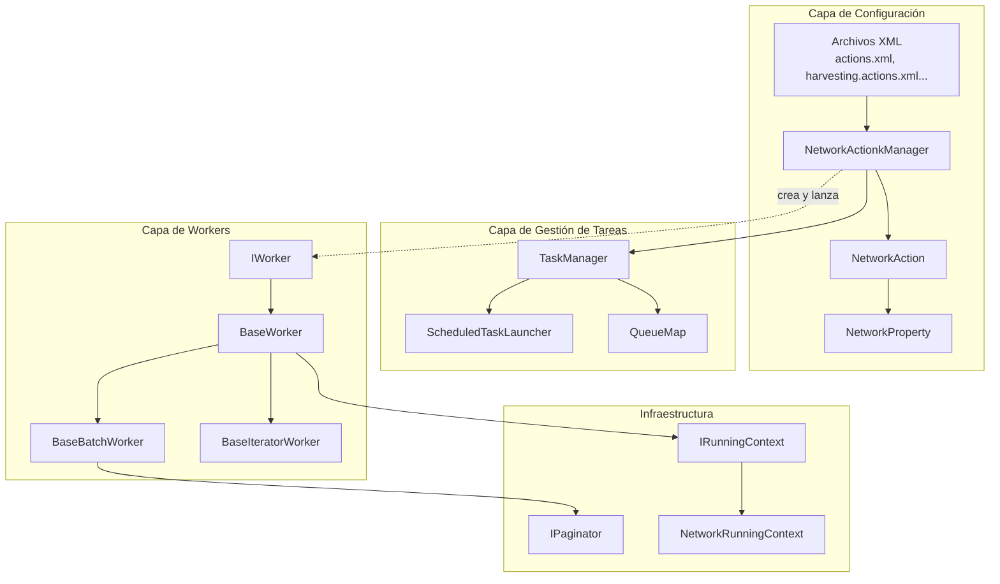
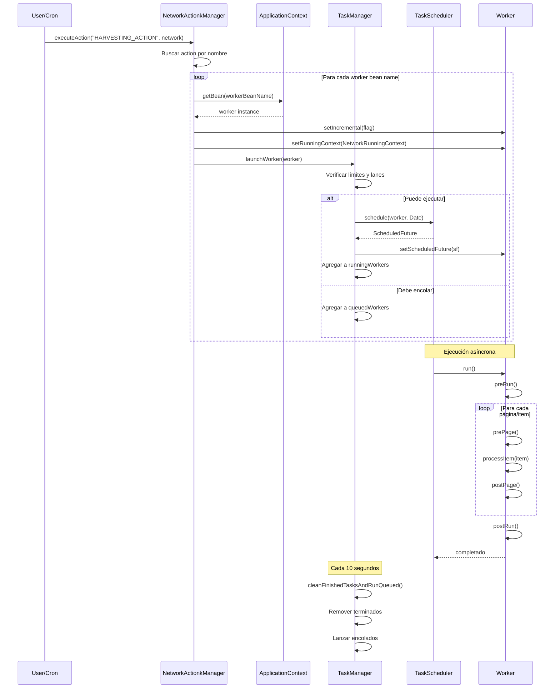
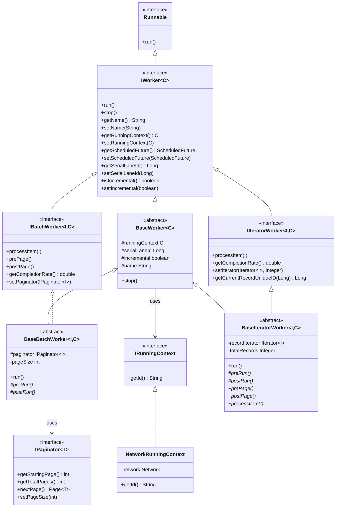

# Análisis Detallado del Sistema de Workers, Tasks y Actions

## 1. Resumen Ejecutivo

El sistema implementa un **framework de procesamiento de tareas asíncronas** diseñado para manejar pipelines de harvesting, validación e indexación de registros OAI-PMH. El diseño utiliza:

- **Workers**: Unidades atómicas de procesamiento (harvesting, validation, indexing)
- **Tasks**: Sistema de scheduling y gestión de ejecución via `TaskManager`
- **Actions**: Abstracciones de alto nivel que agrupan workers y se configuran via XML

> **Nota**: Este documento está diseñado como base para planificar refactorings futuros. Se enfoca en las interacciones y las interfaces, no en detalles de implementación.

---

## 2. Arquitectura de Alto Nivel



---

## 3. Interfaces Core del Sistema de Workers

### 3.1 `IWorker<C extends IRunningContext>` - Interface Base

La interface raíz para todos los workers. Define el contrato mínimo que debe cumplir cualquier worker en el sistema.

**Responsabilidades:**
- Ejecución (`run()` - implementa `Runnable`)
- Control de ciclo de vida (`stop()`)
- Scheduling (`getScheduledFuture()`, `setScheduledFuture()`)
- Identificación (`getName()`, `setName()`)  
- Contexto de ejecución (`getRunningContext()`, `setRunningContext()`)
- Serialización de lanes (`getSerialLaneId()`, `setSerialLaneId()`)
- Modo incremental (`isIncremental()`, `setIncremental()`)

**Definición conceptual:**
```
IWorker<C>
├── run(): void           # Ejecuta el procesamiento principal
├── stop(): void          # Detiene la ejecución
├── getName(): String     # Nombre identificador
├── getRunningContext(): C
├── getScheduledFuture(): ScheduledFuture<?>
├── getSerialLaneId(): Long
└── isIncremental(): boolean
```

### 3.2 `IBatchWorker<I, C>` - Workers de Procesamiento por Lotes

Extiende `IWorker` para workers que procesan **páginas de items** usando un `IPaginator`.

**Características:**
- Procesamiento paginado (páginas de datos)
- Hooks `prePage()` / `postPage()` para lógica antes/después de cada página
- Tracking de progreso via `getCompletionRate()`

**Definición conceptual:**
```
IBatchWorker<I, C> extends IWorker<C>
├── processItem(I item): void    # Procesa un item individual
├── prePage(): void              # Hook pre-página
├── postPage(): void             # Hook post-página
├── getCompletionRate(): double  # Porcentaje completado (0.0-1.0)
└── setPaginator(IPaginator<I>)  # Configura el paginador
```

### 3.3 `IIteratorWorker<I, C>` - Workers de Iteración Simple

Variante de batch worker que usa `Iterator` en lugar de `IPaginator`. Diseñado para procesamiento secuencial sin paginación explícita.

**Definición conceptual:**
```
IIteratorWorker<I, C> extends IWorker<C>
├── processItem(I item): void
├── getCompletionRate(): double
├── setIterator(Iterator<I>, Integer totalRecords)
└── getCurrentRecordUniqueID(Long snapshotId): Long
```

### 3.4 `IPaginator<T>` - Abstracción de Paginación

Provee navegación paginada sobre datasets grandes.

**Definición conceptual:**
```
IPaginator<T>
├── getStartingPage(): int       # Página inicial (típicamente 0 o 1)
├── getTotalPages(): int         # Total de páginas
├── nextPage(): Page<T>          # Obtiene siguiente página
└── setPageSize(int size): void  # Configura tamaño de página
```

### 3.5 `IRunningContext` - Contexto de Ejecución

Interface marker/mínima que identifica el contexto de ejecución de un worker.

```
IRunningContext
└── getId(): String    # Identificador único del contexto
```

---

## 4. Clases Base de Workers

### 4.1 `BaseWorker<C>` - Implementación Base Abstracta

Implementación base que provee funcionalidad común a todos los workers.

**Características:**
- Gestión de `ScheduledFuture` para scheduling
- Almacenamiento del `RunningContext`
- Gestión de `serialLaneId` para serialización de ejecución
- Flag `incremental` para modo incremental
- Logging básico

**Flujo de `stop()`:**
```
stop()
├── Cancela scheduledFuture si existe
└── Loguea "WORKER: {name} :: stopped"
```

### 4.2 `BaseBatchWorker<I, C>` - Workers de Lotes con Transacciones

Extiende `BaseWorker` para procesamiento paginado con **gestión manual de transacciones**.

**Características clave:**
- Gestión transaccional por página (commit/rollback)
- Tamaño de página configurable (default: 100)
- Detención graceful (rollback de página incompleta)
- Hooks abstractos: `preRun()`, `postRun()`

**Flujo de ejecución `run()`:**
```
run() [synchronized]
├── preRun()                           # Hook de inicialización
├── Obtener totalPages del paginator
├── FOR each page (startingPage to totalPages):
│   ├── Iniciar transacción
│   ├── prePage()                      # Hook pre-página
│   ├── Obtener página de items
│   ├── FOR each item in page:
│   │   ├── IF wasStopped: break
│   │   └── processItem(item)          # Procesa item [ABSTRACTO]
│   ├── IF not wasStopped:
│   │   ├── postPage()                 # Hook post-página
│   │   └── COMMIT transacción
│   └── ELSE: ROLLBACK transacción
├── IF not wasStopped:
│   └── postRun()                      # Hook de finalización
└── Log "WORKER: {name} :: END processing"
```

> **IMPORTANTE:** Las transacciones son manejadas **manualmente** usando `PlatformTransactionManager`, no con anotaciones `@Transactional`.

### 4.3 `BaseIteratorWorker<I, C>` - Workers de Iteración Parquet

Diseñado específicamente para procesamiento de registros desde almacenamiento Parquet. **No hay gestión transaccional** porque Parquet es almacenamiento de archivos.

**Características:**
- Usa `Iterator<I>` en lugar de `IPaginator`
- Progreso basado en contador de registros (no páginas)
- Hooks: `preRun()`, `prePage()`, `postPage()`, `postRun()`
- `processItem()` abstracto

**Flujo de ejecución:**
```
run()
├── preRun()                           # Debe configurar iterator
├── Validar que recordIterator != null
├── prePage()
├── WHILE recordIterator.hasNext():
│   ├── processItem(record)
│   ├── currentRecordIndex++
│   ├── IF currentRecordIndex % pageSize == 0:
│   │   ├── Log progreso
│   │   ├── postPage()
│   │   ├── IF wasStopped: break
│   │   └── prePage()
└── postRun()
```

---

## 5. Sistema de Gestión de Tareas

### 5.1 `TaskManager` - Orquestador Central

Singleton que gestiona scheduling, queueing y ejecución de workers. Expuesto via **JMX** para monitoreo.

**Estructuras de datos internas:**
```
QueueMap<ScheduledTaskLauncher, String> scheduledTasks  # Por runningContextID
QueueMap<IWorker<?>, String>            queuedWorkers   # Cola de espera
QueueMap<IWorker<?>, String>            runningWorkers  # En ejecución
QueueMap<IWorker<?>, Long>              serialLane      # Serialización por lane
```

**Configuración:**
- `taskmanager.concurrent.tasks`: Máximo workers concurrentes (default: 4)
- `taskmanager.max_queued.tasks`: Máximo workers en cola (default: 32)

**Operaciones principales:**

#### `launchWorker(IWorker<?> worker)` - Lanzamiento de Workers
```
launchWorker(worker) [synchronized]
├── Extraer runningContextID y serialLaneID
├── IF puede ejecutar (no max reached, no procesando mismo context, lane libre):
│   ├── Programar worker con scheduler.schedule()
│   ├── Setear ScheduledFuture en worker
│   ├── Agregar a runningWorkers
│   └── IF serialLaneID >= 0: agregar a serialLane
└── ELSE: 
    └── Encolar en queuedWorkers (si no está llena)
```

#### `cleanFinishedTasksAndRunQueued()` - Limpieza Periódica
```
@Scheduled(fixedRate=10000ms)
cleanFinishedTasksAndRunQueued() [synchronized]
├── Remover workers terminados/cancelados de serialLane
├── Remover workers terminados/cancelados de runningWorkers  
└── Para cada runningContextID en queuedWorkers:
    └── runQueuedByRunningContextID()
```

#### `scheduleWorker(IWorker, String cronExpression)` - Scheduling Cron
```
scheduleWorker(worker, cronExpression)
├── Crear ScheduledTaskLauncher con worker y cron
└── Agregar a scheduledTasks por contextID
```

### 5.2 `ScheduledTaskLauncher` - Wrapper de Scheduling

Clase interna que wrappea un worker para scheduling cron. Implementa `Runnable` y delega a `launchWorker()`.

```
ScheduledTaskLauncher(IWorker, String cronExpression)
├── Almacenar worker
└── Programar this con CronTrigger

run()
└── taskManager.launchWorker(this.worker)
```

---

## 6. Sistema de Actions

### 6.1 `NetworkAction` - Definición de Acción

Representa una acción ejecutable sobre una Network. Agrupa:
- Lista de beans de workers a ejecutar
- Propiedades de configuración (`NetworkProperty`)
- Flags de comportamiento

**Atributos:**
- `name`: Identificador único de la acción
- `description`: Descripción human-readable
- `workers`: Lista de nombres de beans Spring de workers
- `properties`: Lista de `NetworkProperty`
- `incremental`: Si corre en modo incremental
- `runOnSchedule`: Si se ejecuta en scheduling automático
- `alwaysRunOnSchedule`: Ejecuta siempre, ignorando propiedades

### 6.2 `NetworkProperty` - Propiedad de Configuración

Simple DTO con nombre y descripción. Usado para toggle de features por network.

### 6.3 `NetworkActionkManager` - Gestor de Actions

> **Nota:** Notar el typo en el nombre: `NetworkAction**k**Manager`

**Responsabilidades:**
- Registrar actions definidas en XML
- Ejecutar actions sobre networks
- Programar scheduling automático de todas las networks
- Gestionar ciclo de vida (kill, unqueue)

**Flujo de `executeActions(Network)`:**
```
executeActions(network)
├── FOR each action in actions:
│   ├── Verificar si alguna property de la action es true en la network
│   ├── OR si allwaysRunOnSchedule está activado
│   ├── IF runOnSchedule AND (propertyTrue OR allwaysRun):
│   │   └── FOR each workerBeanName in action.workers:
│   │       ├── Obtener bean worker del ApplicationContext
│   │       ├── Setear incremental según la action
│   │       ├── Setear NetworkRunningContext
│   │       └── taskManager.launchWorker(worker)
```

**Flujo de `executeAction(String actionName, boolean isIncremental, Network)`:**
```
executeAction(actionName, isIncremental, network) [synchronized]
├── Buscar action por nombre
├── FOR each workerBeanName in action.workers:
│   ├── Obtener bean worker del ApplicationContext
│   ├── Setear isIncremental
│   ├── Setear NetworkRunningContext
│   └── taskManager.launchWorker(worker)
```

**Clase interna `AllActionsWorker`:**
Worker especial que al ejecutar `run()` llama a `executeActions(network)`. Usado para scheduling cron de todas las actions.

---

## 7. Configuración XML

### 7.1 Estructura de Archivos

```
config/beans/
├── actions.xml                 # Principal - importa otros e inicializa NetworkActionkManager
├── harvesting.actions.xml      # Actions de harvesting
├── validation.actions.xml      # Actions de validación
├── cleaning.actions.xml        # Actions de limpieza
├── index.frontend.actions.xml  # Indexación frontend Solr
├── xoai.actions.xml           # Indexación OAI-PMH provider
├── network.actions.xml        # Gestión de networks (opcional)
└── ...
```

### 7.2 Patrón de Configuración de Actions

```xml
<!-- Definición de NetworkAction -->
<bean id="harvestingNetworkAction" class="org.lareferencia.core.task.NetworkAction">
    <property name="name" value="HARVESTING_ACTION" />
    <property name="description" value="Harvesting" />
    <property name="incremental" value="true" />
    <property name="runOnSchedule" value="true" />
    <property name="allwaysRunOnSchedule" value="true" />
    <property name="workers">
        <list>
            <value>harvestingWorker</value>  <!-- Bean name del worker -->
        </list>
    </property>
    <property name="properties">
        <list>
            <bean class="org.lareferencia.core.task.NetworkProperty">
                <property name="name" value="FORCE_FULL_HARVESTING" />
                <property name="description" value="Forzar cosecha full?" />
            </bean>
        </list>
    </property>
</bean>

<!-- Definición del Worker bean -->
<bean id="harvestingWorker" 
      class="org.lareferencia.core.worker.harvesting.HarvestingWorker" 
      scope="prototype">
    <property name="fetchIdentifyParameters" value="false" />
</bean>
```

### 7.3 Inicialización de `NetworkActionkManager`

```xml
<bean id="networkActionManager" 
      class="org.lareferencia.core.task.NetworkActionkManager"
      scope="singleton">
    <property name="actions">
        <list>
            <ref bean="harvestingNetworkAction" />
            <ref bean="validationNetworkAction" />
            <ref bean="frontendIndexingNetworkAction" />
            <ref bean="frontendDeleteAction" />
            <ref bean="xoaiIndexingNetworkAction" />
            <ref bean="xoaiDeleteAction" />
            <ref bean="networkCleanNetworkAction" />
            <ref bean="networkDeleteNetworkAction" />
        </list>
    </property>
</bean>
```

---

## 8. Implementaciones Concretas de Workers

### 8.1 Workers Principales

| Worker | Base Class | Tipo Item | Descripción |
|--------|-----------|-----------|-------------|
| `HarvestingWorker` | `BaseWorker` | - | Harvesting OAI-PMH, escribe Parquet |
| `ValidationWorker` | `BaseIteratorWorker` | `OAIRecord` | Validación/Transformación de registros |
| `IndexerWorker` | `BaseIteratorWorker` | `RecordValidation` | Indexación a Solr |
| `NetworkCleanWorker` | `BaseWorker` | - | Limpieza de snapshots |
| `DownloaderWorker` | `BaseBatchWorker` | `OAIBitstream` | Descarga de bitstreams |
| `FulltextWorker` | `BaseBatchWorker` | `OAIBitstream` | Procesamiento fulltext |

### 8.2 Patrón de Implementación

```
Concreto extends Base
├── Inyecta servicios vía @Autowired
├── Implementa preRun():
│   └── Inicializa recursos, obtiene datos de context
├── Implementa processItem(item):
│   └── Lógica de procesamiento específica
├── Implementa postRun():
│   └── Limpieza, commit final, logging
└── Implementa toString():
    └── Para logging/debug
```

---

## 9. Flujo Completo de Ejecución



---

## 10. Contextos de Ejecución

### 10.1 `NetworkRunningContext`

Contexto especializado que encapsula una `Network`.

**Características:**
- ID en formato `"NETWORK::{networkId}"`
- Provee acceso a la entidad `Network`
- Usado para aislamiento de ejecución (un worker por network a la vez)

### 10.2 Serialización via Serial Lanes

El sistema provee **serialización opcional** de workers:

- `serialLaneId < 0`: Sin restricción de serialización
- `serialLaneId >= 0`: Solo un worker con ese lane puede ejecutar simultáneamente

**Uso típico:**
- Lane 1: Indexación Frontend Solr
- Lane 2: Indexación XOAI Solr
- Lane 100: Extracción de entidades

Esto evita conflictos en recursos compartidos (mismo índice Solr).

---

## 11. Puntos de Extensión

### 11.1 Crear un Nuevo Worker

1. **Elegir base class** según el tipo de procesamiento:
   - `BaseWorker`: Control total, sin paginación
   - `BaseBatchWorker`: Procesamiento paginado con transacciones
   - `BaseIteratorWorker`: Iteración simple (ej: Parquet)

2. **Implementar métodos abstractos**:
   - `preRun()`: Inicialización
   - `processItem(item)`: Lógica de procesamiento
   - `postRun()`: Finalización

3. **Registrar en XML** con scope `prototype`

### 11.2 Crear una Nueva Action

1. Definir bean `NetworkAction` en XML
2. Configurar workers, properties, flags
3. Agregar referencia en `networkActionManager`

---

## 12. Observaciones para Refactoring

### 12.1 Acoplamiento Alto

- `NetworkActionkManager` tiene responsabilidades mezcladas (scheduling, ejecución, gestión de ciclo de vida)
- La configuración XML hardcodea nombres de beans

### 12.2 Posibles Mejoras

1. **Separar concerns** en `NetworkActionkManager`:
   - `ActionRegistry`: Registro de actions
   - `ActionExecutor`: Ejecución
   - `NetworkScheduler`: Scheduling

2. **Reemplazar XML por anotaciones**:
   - `@WorkerAction` para auto-registro
   - Configuración via application.properties

3. **Unificar interfaces de workers**:
   - Considerar si `IBatchWorker` e `IIteratorWorker` pueden unificarse

4. **Mejorar gestión de errores**:
   - Actualmente exceptions en `processItem()` detienen el worker
   - Considerar retry policies, dead letter queues

5. **Observabilidad**:
   - Métricas de progreso más granulares
   - Eventos de lifecycle para monitoring

---

## 13. Diagrama de Herencia Completo



---

## 14. Archivos Clave

| Archivo | Descripción |
|---------|-------------|
| `lareferencia-core-lib/.../worker/IWorker.java` | Interface base de workers |
| `lareferencia-core-lib/.../worker/IBatchWorker.java` | Interface para batch workers |
| `lareferencia-core-lib/.../worker/IIteratorWorker.java` | Interface para iterator workers |
| `lareferencia-core-lib/.../worker/BaseWorker.java` | Implementación base abstracta |
| `lareferencia-core-lib/.../worker/BaseBatchWorker.java` | Base para batch workers |
| `lareferencia-core-lib/.../worker/BaseIteratorWorker.java` | Base para iterator workers |
| `lareferencia-core-lib/.../task/TaskManager.java` | Orquestador de tareas |
| `lareferencia-core-lib/.../task/NetworkActionkManager.java` | Gestor de actions |
| `lareferencia-core-lib/.../task/NetworkAction.java` | Definición de action |
| `lareferencia-lrharvester-app/config/beans/actions.xml` | Configuración principal |
